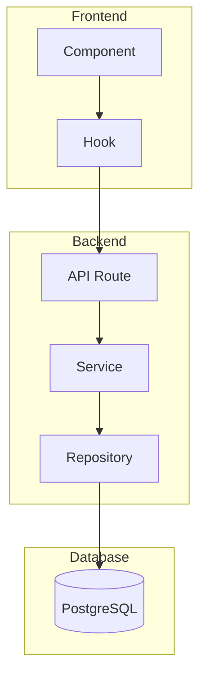
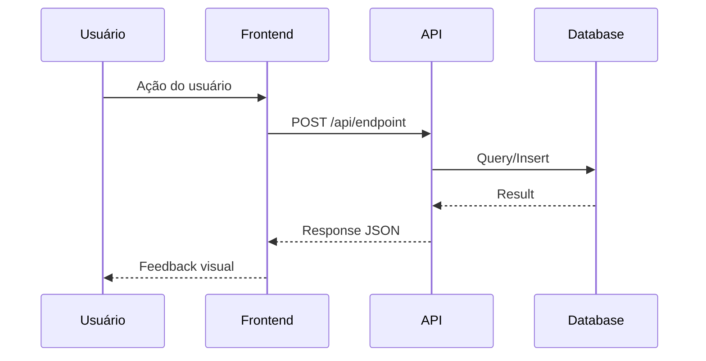
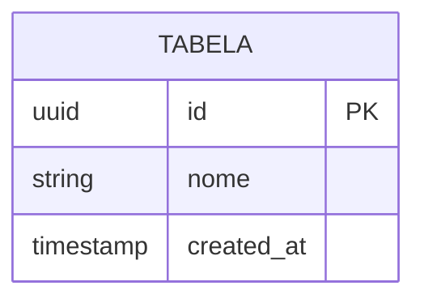

# Design: {Feature Name}

> Feature Slug: `{feature-slug}`
> Criado: {data}
> Status: Draft | Review | Approved

## Rastreabilidade

| Design | Requisito |
|--------|-----------|
| DES-1 | REQ-1 |
| DES-2 | REQ-2 |
| DES-3 | REQ-3 |

---

## DES-1: Arquitetura Geral

> Traces: REQ-1

### Diagrama de Componentes

### Descrição
{explicação do diagrama}

---

## DES-2: Fluxo de Dados

> Traces: REQ-1, REQ-2

### Diagrama de Sequência

### Descrição
{explicação do fluxo}

---

## DES-3: Modelo de Dados

> Traces: REQ-1

### Schema

### Migrations Necessárias
- [ ] Criar tabela X
- [ ] Adicionar índice Y

---

## Análise de Impacto

### Arquivos a Criar
| Arquivo | Propósito |
|---------|-----------|
| `src/components/X.tsx` | Componente principal |
| `src/lib/api/x.ts` | Client API |

### Arquivos a Modificar
| Arquivo | Modificação |
|---------|-------------|
| `src/app/page.tsx` | Importar novo componente |

### Dependências Externas
- {pacote npm se necessário}
- {API externa se necessário}

---

## Decisões Técnicas

### Decisão 1: {Título}
- **Contexto:** {situação}
- **Decisão:** {o que foi decidido}
- **Consequência:** {impacto da decisão}

---

## Riscos e Mitigações

| Risco | Probabilidade | Impacto | Mitigação |
|-------|---------------|---------|-----------|
| {risco} | Alta/Média/Baixa | Alto/Médio/Baixo | {como mitigar} |
