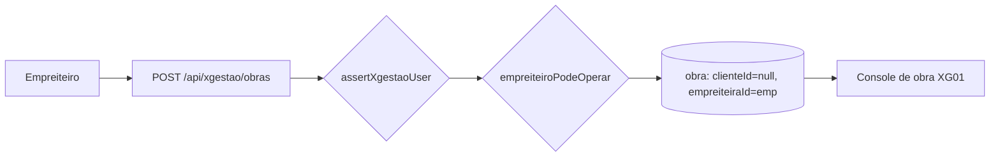

# Jornada — XG02: Obra criada e editada pelo empreiteiro

> Status: implementada | Prioridade: alta | Wave: xgestão-2
> Última atualização: 2026-08-20

## 1. Contexto & Objetivo

Hoje só o contratante cria obra — é o fluxo do marketplace. No xgestão não há contratante: o empreiteiro cadastra a própria obra e a gerencia. Esta jornada abre esse caminho **sem afrouxar nenhuma garantia do marketplace**.

A boa notícia é que o modelo de dados já permite. Em [shared/db/schema.ts:219-220](../../shared/db/schema.ts), `clienteId` e `empreiteiraId` são nullable e só `nome` e `endereco` são obrigatórios. Toda a trava está no código da rota, não no banco.

## 2. Personas

- **Empreiteiro (xgestão)**: cria, edita e gerencia as próprias obras, sem contraparte.
- **Contratante (marketplace)**: **não afetado** — seu fluxo de criação continua idêntico.

## 3. Fluxo ponta-a-ponta



1. Empreiteiro preenche nome e endereço (o mínimo).
2. A rota valida a role aditiva e o perfil operacional mínimo.
3. A obra nasce com `clienteId: null`, `empreiteiraId` do usuário e `visibilidade: "rascunho"`.
4. Aparece na listagem e abre no console, com todas as abas já funcionando.

## 4. Telas envolvidas

- [app/xgestao/obras/page.tsx](../../app/xgestao/obras/page.tsx) — ganha o botão "Nova obra".
- `features/xgestao/components/NovaObraModal.tsx` — **a criar**. Formulário mínimo.
- `features/xgestao/components/EditarObraModal.tsx` — **a criar**.

## 5. Componentes-chave

- [features/obras/api/access.ts](../../features/obras/api/access.ts) — **reaproveitado sem alteração.** Concede leitura+escrita ao empreiteiro por `obra.empreiteiraId === emp.id` (ramo `isAssigned`), sem exigir candidatura nem contrato. `canWriteObraContent` já retorna `true`. É o que faz o console inteiro funcionar numa obra sem contratante.
- [features/empreiteiro/minhas-obras/api/build-detalhe-server.ts:105](../../features/empreiteiro/minhas-obras/api/build-detalhe-server.ts) — **já filtra só por `empreiteiraId`** e faz LEFT JOIN do cliente. Funciona como está.
- [shared/lib/perfil-operacional.ts:111](../../shared/lib/perfil-operacional.ts) — `empreiteiroPodeOperar` **já existe** (usado em candidaturas). Só precisa ser chamado.
- `features/obras/api/create-obra.ts` — **a criar** por extração (ver §9).

## 6. Schema (Drizzle)

**Nenhuma alteração de schema.** É o achado central desta jornada:

| coluna | estado hoje | consequência |
|---|---|---|
| `obras.clienteId` | nullable | obra sem contratante é legal |
| `obras.empreiteiraId` | nullable | pode ser o dono |
| `obras.nome`, `obras.endereco` | `NOT NULL` | únicos obrigatórios |

O predicado `clienteId IS NULL AND empreiteiraId IS NOT NULL` passa a ser, de graça, o **discriminador de produto** entre obra de marketplace e obra de xgestão (usado depois em XG06).

## 7. Endpoints

- `POST /api/xgestao/obras` — **a criar**. Cria obra do empreiteiro.
- `PATCH /api/obras/[id]` — **alterar**. Ver §9.
- `GET /api/empreiteiro/minhas-obras` — **sem alteração**, já funciona.
- `GET/POST /api/obras/[id]/{etapas,tarefas,checklists,fotos,diario,ocorrencias,equipe,anexos}` — **sem alteração**, já funcionam via `access.ts`.

## 8. Refatoração necessária

[app/api/obras/route.ts:279-441](../../app/api/obras/route.ts) tem 5 camadas de acoplamento ao contratante: role (L283), exige linha em `clientes` (L313), `contratantePodeOperar` (L346), limite `"obrasAbertas"` (L368) e `clienteId: cli.id, empreiteiraId: null` (L399).

**Não adicionar branches nesse handler.** Extrair o miolo comum (validação, rate limit, insert transacional com checagem de limite, `recordAudit`) para `features/obras/api/create-obra.ts`, parametrizado por:

```ts
type DonoObra =
  | { kind: "contratante"; clienteId: string }
  | { kind: "xgestao"; empreiteiraId: string };
```

A rota atual mantém seus guards e chama a função. A rota nova chama com o outro ramo.

## 9. Checklist de implementação

- [x] Extrair `features/obras/api/create-obra.ts` com o union `DonoObra`
- [x] Fazer `app/api/obras/route.ts` consumir a função extraída, sem mudança de comportamento
- [x] Criar `POST /api/xgestao/obras`: `assertXgestaoUser` → `empreiteiroPodeOperar` → cria com `clienteId: null`, `visibilidade: "rascunho"`
- [x] [app/api/obras/[id]/route.ts](../../app/api/obras/[id]/route.ts) libera só obra própria sem contratante e preserva o strip de ownership
- [x] Criar os modais de nova obra e edição
- [x] Esconder contratante e contato quando `clienteId === null`; o DTO sinaliza explicitamente `temContratante`
- [x] Spec `tests/e2e/integration/xgestao-obras.integration.spec.ts`

> ⚠️ `visibilidade: "rascunho"` é deliberado: evita o `superRefine` de publicação em [features/obras/schemas/index.ts](../../features/obras/schemas/index.ts), que exige CEP, número e modalidade — irrelevantes no xgestão. Confirmar que o console não trava nada em `visibilidade`.

## 10. Critérios de aceite

1. `POST /api/xgestao/obras` com apenas `{nome, endereco}` → **201**, e a linha tem `cliente_id IS NULL` e `empreiteira_id` do usuário.
2. A obra aparece em `GET /api/empreiteiro/minhas-obras` e abre no console com as abas operantes.
3. Criar etapa, tarefa, foto e ocorrência nessa obra → todas **200/201** (prova de que `access.ts` cobre o caso).
4. `PATCH` da própria obra xgestão → **200**.
5. `PATCH` de obra **do marketplace** por empreiteiro → **ainda 403** (regressão que não pode passar).
6. Contratante chamando `/api/xgestao/obras` → **403**. Empreiteiro sem a role aditiva → **403**.
7. Verificação: `SELECT COUNT(*) FROM obras WHERE cliente_id IS NULL AND empreiteira_id IS NOT NULL` reflete só as obras xgestão.

## 11. Riscos / Pontos de atenção

- **A extração de `create-obra.ts` mexe num caminho de escrita crítico do marketplace.** O insert é transacional e fecha uma corrida check-then-act (há comentário no código sobre isso). Não perder essa propriedade na extração.
- A mudança no PATCH é a única que afrouxa um guard existente. A condição `clienteId !== null` é o que a mantém segura — não substituir por checagem de role apenas.

## 12. Links cruzados

- Depende de: XG01 (`assertXgestaoUser`, shell)
- Bloqueia: XG03 (o limite é aplicado no mesmo `create-obra.ts`), XG04 (o link compartilha uma obra), XG06 (o discriminador `clienteId IS NULL` nasce aqui), XG08 (a obra a exibir em leitura)
- Relacionada: J03 (cadastro de obra do marketplace)

## 13. Gaps descobertos durante execução

> Doc viva. Registrar aqui o que apareceu no caminho e não estava no roteiro original. Uma linha por item, com data.
