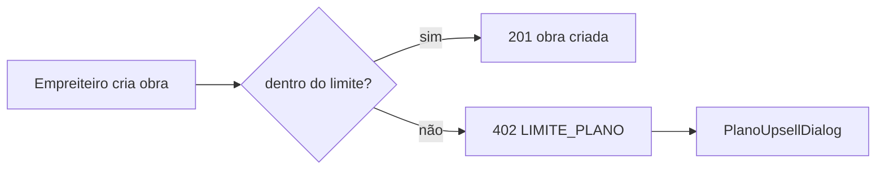

# Jornada — XG03: Planos, limites e teste de 3 meses

> Status: planejada (§8 bloqueada por definição de preços) | Prioridade: alta | Wave: xgestão-3
> Última atualização: 2026-08-19

> **Desbloqueio parcial (2026-08-19):** a reunião 002 fechou o limite do Pro em **10 obras** e descreveu a composição do Freemium. O que segue bloqueado é **só a mecânica do teste** (§8) e os preços. Persona, catálogo, contagem por `empreiteiraId` e o 402 podem ser implementados agora.

## 1. Contexto & Objetivo

Esta jornada protege a receita. Hoje **o plano gratuito não tem teto nenhum** — e por dois motivos independentes que se somam:

1. `obrasAtivas` está no catálogo e é **exibido** na interface, mas **nunca é verificado em nenhuma escrita**. Os únicos limites realmente aplicados são `obrasAbertas` (contratante) e `propostasMes`.
2. O contador existente ([app/api/obras/route.ts:391](../../app/api/obras/route.ts)) filtra por `clienteId` — que é **NULL** em toda obra xgestão. `COUNT(*) WHERE cliente_id = NULL` é sempre 0.

Sem esta jornada, o Freemium é ilimitado na prática.

## 2. Personas

- **Empreiteiro (xgestão)**: assina um dos 3 planos e esbarra no limite de obras.
- **Superadmin**: acompanha planos e assinaturas.

## 3. Fluxo ponta-a-ponta

1. Ao criar obra, a rota consulta o limite do plano na persona `xgestao`.
2. A contagem é feita **por `empreiteiraId`**, dentro da mesma transação do insert.
3. Estourou → 402 com `code: "LIMITE_PLANO"` → a interface abre o diálogo de upgrade que já existe.

## 4. Telas envolvidas

- [app/xgestao/planos/page.tsx](../../app/xgestao/planos/page.tsx) — **a criar**, espelhando [app/empreiteiro/planos/page.tsx](../../app/empreiteiro/planos/page.tsx).
- [features/planos/ui/PlanoUpsellDialog.tsx](../../features/planos/ui/PlanoUpsellDialog.tsx) — **já existe**, só ligar ao 402 da rota nova.

## 5. Componentes-chave

- [shared/lib/plans-catalog.ts](../../shared/lib/plans-catalog.ts) — catálogo de limites por persona.
- [features/planos/assinatura-service.ts:21](../../features/planos/assinatura-service.ts) — `getLimitesUsuario`, hoje deriva a persona de `users.role` (binário contratante/empreiteiro).
- [features/planos/grace-period-downgrade-job.ts](../../features/planos/grace-period-downgrade-job.ts) — molde para o fim do teste.
- `features/obras/api/create-obra.ts` — criado em XG02; aqui ganha a checagem de limite por dono.

## 6. Schema (Drizzle)

- `planoPersonaEnum` ([schema.ts:1029](../../shared/db/schema.ts)) — adicionar `"xgestao"`. **Também é enum Postgres real** → migration `ALTER TYPE`, mesma ressalva de XG01 §6.
- Semear 3 linhas em `planos` com `(tier, persona)` = `(free, xgestao)`, `(pro, xgestao)`, `(enterprise, xgestao)`. Há unique nesse par, então não colide com as linhas do marketplace.
- **Não** mexer em `planoEnum` — reaproveitamos os tiers existentes.

> 💡 **Preços vêm do banco** (`planos.valorMensal`), nunca hardcoded. Eles ainda vão mudar, e mudar preço deve ser edição de dado, não deploy.

Mapeamento acordado:

| Plano comercial | tier técnico | obras ativas |
|---|---|---|
| Freemium | `free` | 1 |
| Basic | `pro` | 3 |
| Pro | `enterprise` | **10** |

> **Decisão do cliente (2026-08-19):** o limite do Pro é **10 obras**, encerrando a bifurcação "10 ou 15". *"Eu pensei no limite do plano Pro, a gente deixar dez obras, como já estava definido anteriormente ali pelo documento do Ed"* (01:13), confirmado em *"o freemium, ele é que só pode ter uma obra... aí o basic já são três e o pro vamos ser dez"* (15:06).

**Composição funcional do Freemium — premissa provisória.** O cliente descreveu o Freemium como *"tudo do básico, só que com um pouco menos de função"* (15:20-15:28): serve para o empreiteiro *"ter um gostinho do que é a plataforma"*. Como decisão de limite de obras, está fechado (1 obra). Como decisão de **quais funcionalidades** ficam de fora, **não está** — o cliente ficou de enviar o documento detalhando a composição dos três planos (18:44).

Isso não bloqueia a jornada: o modelo de limites é o mesmo independente de quais features entram em cada tier. Implementar a contagem de obras primeiro e ligar as demais entitlements quando o documento chegar.

## 7. Endpoints

- `POST /api/xgestao/obras` — passa a retornar **402** `LIMITE_PLANO` ao estourar.
- `GET /api/perfil/plano` — deve refletir a persona xgestão no medidor de uso.
- Rotas de assinatura/checkout existentes — reaproveitadas.

## 8. Teste de 3 meses — trabalho novo

**Não existe implementação de trial.** Verificado: `"trial"` aparece apenas como string de tipo em [assinatura-service.ts:631](../../features/planos/assinatura-service.ts). Não há coluna, job nem fluxo.

Duas mecânicas possíveis, e elas **não são a mesma implementação**:

- **(a)** tier `free` por N meses, depois cobrança obrigatória para continuar criando;
- **(b)** acesso `enterprise` por N meses, com redução automática ao final.

> ⚠️ **A reunião 002 contradiz o PDF de monetização neste ponto — não implementar até resolver.**
>
> O PDF sugere **(b)**: "3 meses 100% grátis (irrestrito)". A reunião 002 aponta para **(a)**: perguntado se no teste o cara teria *"o acesso full, a plataforma com todas as funcionalidades que o xgestão provém"*, a resposta foi **não** — *"ele vai ter o acesso ao plano dele, no caso"* (14:34-14:41). E o Freemium foi descrito como plano de verdade, permanente, com 1 obra e funções reduzidas (15:06), não como janela temporária de acesso elevado.
>
> A diferença é cara: **(b) exige um job de downgrade** (molde em [grace-period-downgrade-job.ts](../../features/planos/grace-period-downgrade-job.ts)) e a definição do que acontece com obras acima do limite quando o teste acaba. **(a) não exige nada disso** — o Freemium simplesmente é o que é.
>
> **Escolher errado custa um job inteiro, então esta seção fica bloqueada** até o documento de planos chegar (o cliente ficou de enviar, 18:44). O resto da jornada — persona, catálogo, contagem por `empreiteiraId`, o 402 — **não depende disso e pode ser implementado já**.

O prazo em si (2 ou 3 meses) é parâmetro comercial e ficou explicitamente em aberto: *"a parte dos três meses aí é indiferente"* (14:16). Não modelar o número como constante de código — ele muda sem deploy.

## 9. Checklist de implementação

- [ ] Adicionar persona `xgestao` em `plans-catalog.ts` + `XGESTAO_USAGE_LABELS`
- [ ] Adicionar `"xgestao"` ao `planoPersonaEnum` + migration
- [ ] Semear as 3 linhas de `planos` (preços vindos da definição do cliente)
- [ ] `getLimitesUsuario(userId, tx, persona?)` — parâmetro **explícito** de persona, passado pelo caller que já sabe ser xgestão
- [ ] `create-obra.ts` — contar por `empreiteiraId` no ramo xgestão, **dentro da transação**
- [ ] Ligar o 402 ao `PlanoUpsellDialog`
- [ ] Criar `app/xgestao/planos/page.tsx`
- [ ] Implementar o teste de 3 meses conforme a mecânica definida
- [ ] Spec `tests/e2e/integration/xgestao-planos.integration.spec.ts`

> ⚠️ `getLimitesUsuario` é chamada **dentro da transação de insert**. Não adicionar uma query a `user_roles` ali dentro — é caminho que segura lock. Daí o parâmetro explícito em vez de detecção automática.

## 10. Critérios de aceite

1. Freemium: obra 1 → **201**; obra 2 → **402** com `code: "LIMITE_PLANO"`.
2. Concluir a obra 1 e criar de novo → **201** (semântica de obra *ativa*).
3. Basic: 3 obras ok, a 4ª → **402**.
4. O contratante do marketplace continua limitado por `obrasAbertas`, sem alteração de comportamento.
5. `GET /api/perfil/plano` mostra o uso correto para o usuário xgestão.
6. Verificação: `SELECT tier, persona, valor_mensal FROM planos WHERE persona = 'xgestao'` retorna 3 linhas.

## 11. Riscos / Pontos de atenção

- **Bloqueada por definição de negócio.** Preços e mecânica do teste precisam vir do cliente antes de começar. Mitigação parcial: preços no banco.
- **Fim do teste com obras acima do limite.** Definição pendente. **Recomendação forte: nunca retirar acesso de leitura** — trancar um construtor fora dos registros da própria obra é o caminho mais rápido para chargeback. Bloquear apenas a criação de novas.
- **SINAPI passou a ter jornada própria — ver [XG07](07-integracao-sinapi.md), hoje congelada.** *(atualizado em 2026-08-10; congelado em 2026-08-19; a nota original está preservada abaixo porque o raciocínio continua válido para a rota de ETL próprio.)* A premissa de que só existiam planilhas mensais por UF estava correta quanto à Caixa — que não tem API oficial —, mas existe API de terceiro que reduz a integração a dias. **Enquanto XG07 estiver congelada, `consultasSinapiMes` não entra no catálogo de limites desta jornada** — não semear a chave, não exibir quota na UI de planos. Volta junto com XG07.

  > Nota original: a palavra aparece só em copy de marketing ([app/page.tsx](../../app/page.tsx), [app/xgestao-inteligente/](../../app/xgestao-inteligente/), seeds legais) e num nome de tipo em [features/obras/adapters.ts](../../features/obras/adapters.ts) — **zero implementação**. Os dados são publicados majoritariamente como planilhas mensais por UF, o que significa pipeline de ingestão + tabela de preços versionada + job mensal. É projeto de semanas. Enquanto não houver integração, a copy que promete SINAPI deveria sair do ar.
- Empreiteiro que seja **também** cliente xgestão terá `users.role = 'empreiteiro'`; por isso a persona é passada explicitamente, e não inferida.

## 12. Links cruzados

- Depende de: XG01 (role aditiva), XG02 (`create-obra.ts`)
- Bloqueia: XG06 (a visão admin mostra plano/tier e distribuição entre os 3 planos)
- Relacionada: J11 (planos e assinatura), J14 (gateway de pagamento)
- Congelada, mas dependeria daqui: XG07 (persona `xgestao` no catálogo)

## 13. Gaps descobertos durante execução

> Doc viva. Registrar aqui o que apareceu no caminho e não estava no roteiro original. Uma linha por item, com data.
