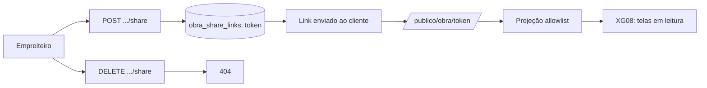

# Jornada — XG04: Link público de acompanhamento

> Status: concluída | Prioridade: alta | Wave: xgestão-4
> Última atualização: 2026-08-19

## 1. Contexto & Objetivo

O empreiteiro exporta um link e manda para o cliente dele, que abre **sem criar conta** e vê o andamento da obra. É o recurso que substitui a conta de contratante no xgestão, e o que o cliente mais quer ver funcionando.

Na reunião: *"é mais fácil que ele só exporte o link"*.

**Esta jornada é o mecanismo: token, rota, revogação e projeção de dados.** O *conteúdo* da página — quais telas o cliente vê e como elas são reaproveitadas — saiu para [XG08](08-visao-obra-read-only.md) na revisão de 2026-08-19.

> **Decisão do cliente (2026-08-19):** o link é **leitura pura**. *"Só que nesse caso, sem o cara poder modificar nada. Só visualizar"* (20:45). Sem upload, sem chat, sem comentário. A discussão sobre interação mínima do contratante ficou registrada como assunto de outro momento e **não entra neste MVP**.

O [CompartilharModal](../../features/empreiteiro/minhas-obras/components/CompartilharModal.tsx) atual apenas copia `window.location.href` — a URL autenticada, que dá 404 para qualquer outra pessoa. É o gancho de UI que já existe para a feature.

## 2. Personas

- **Empreiteiro (xgestão)**: gera, compartilha e revoga o link.
- **Cliente final (contratante)**: abre o link sem conta. **Não é usuário da plataforma.**

## 3. Fluxo ponta-a-ponta



1. O empreiteiro gera o link no console da obra.
2. Envia por WhatsApp/e-mail.
3. O cliente abre sem login e vê progresso, etapas, fotos, ocorrências e diário — as telas de [XG08](08-visao-obra-read-only.md).
4. A qualquer momento o empreiteiro revoga; o link passa a dar 404.

## 4. Telas envolvidas

- [app/publico/obra/[token]/page.tsx](../../app/publico/obra/[token]/page.tsx) — **a criar**. **Server Component**, deliberadamente.
- `app/publico/layout.tsx` — **a criar**. Layout sem sidebar nem topbar autenticados, com `noindex`.
- [features/empreiteiro/minhas-obras/components/CompartilharModal.tsx](../../features/empreiteiro/minhas-obras/components/CompartilharModal.tsx) — **reescrever**, não remendar.

## 5. Componentes-chave

- `features/xgestao/obra-publica/server/projection.ts` — **a criar**. A allowlist. Superfície crítica desta jornada.
- `features/xgestao/obra-publica/server/token.ts` — **a criar**. Emissão, verificação e revogação.
- [features/empreiteiro/minhas-obras/api/build-detalhe-server.ts](../../features/empreiteiro/minhas-obras/api/build-detalhe-server.ts) — **já existe**. Molde da projeção: JOINs e `resolveSignedFotoUrl`.
- Os componentes de conteúdo estão em [XG08 §5](08-visao-obra-read-only.md).

## 6. Schema (Drizzle)

Nova tabela `obra_share_links`:

| coluna | tipo | nullable | notas |
|---|---|---|---|
| `id` | varchar PK | não | uuid |
| `obraId` | varchar FK → `obras` | não | `onDelete: cascade` |
| `token` | text | não | **unique + índice**. 32 bytes base64url |
| `criadoPor` | varchar FK → `users` | não | trilha |
| `ativo` | boolean | não | default `true` — revogação |
| `expiraEm` | timestamp | sim | opcional |
| `visualizacoes` | integer | não | default 0 |
| `ultimoAcessoEm` | timestamp | sim | |
| `criadoEm` | timestamp | não | `defaultNow` |

**Tabela separada, não coluna em `obras`** — permite revogar e reemitir mantendo histórico. O cliente vai pedir revogação na primeira vez que um link vazar.

> ⚠️ **Token em claro é desvio consciente da convenção do repo — leia antes de implementar.** [passwordSetupTokens](../../shared/db/schema.ts) guarda `tokenHash`, não o token. Aqui a escolha é oposta, e o motivo é funcional: o empreiteiro precisa **reexibir** o link (reenviar por WhatsApp semanas depois, recuperar após trocar de celular). Com hash, "ver o link de novo" é impossível — só resta rotacionar, o que invalida o link que o cliente dele já tem salvo.
>
> O trade-off aceito: quem tiver leitura da tabela `obra_share_links` lê os links ativos. É aceitável porque a projeção (§8) já garante que o link **não expõe dado financeiro nem PII de terceiros** — a capability vale exatamente o que a projeção deixa passar, e nada além.
>
> **Se a projeção algum dia crescer para incluir dado sensível, esta decisão precisa ser revista junto.** As duas coisas estão amarradas.

## 7. Endpoints

- `POST /api/xgestao/obras/[id]/share` — cria ou rotaciona o token.
- `GET /api/xgestao/obras/[id]/share` — retorna o link atual.
- `DELETE /api/xgestao/obras/[id]/share` — revoga (`ativo = false`).
- `GET /publico/obra/[token]` — página pública, **sem autenticação**. `/publico` não está no `config.matcher` do [proxy.ts](../../proxy.ts), então é público por construção.

## 8. Projeção — o que vai e o que não vai

> **Decisão do cliente (2026-08-09):** o mais completo possível, sem senha, com o filtro "o que faz sentido para o contratante ver".

**O produto já respondeu essa pergunta**, e a reunião 002 confirmou: a página pública **espelha as telas que o contratante do marketplace já vê**, em modo leitura. Como isso é feito sem duplicar código está em [XG08](08-visao-obra-read-only.md).

E as fotos já vêm resolvidas: `obra_fotos.enviadaAoContratante` ([schema.ts:819](../../shared/db/schema.ts)) **já é uma flag por foto**, default `true`. O empreiteiro já escolhe foto a foto o que vai para o cliente — a projeção só precisa respeitar.

| Vai para o link | Por quê |
|---|---|
| Nome, status, progresso, datas previstas | É a obra dele; identificação e prazo são o motivo do link |
| Cidade e UF | Localização suficiente para identificar a obra — ver a ressalva de endereço abaixo |
| Etapas com % e status | Núcleo do "como está minha obra" |
| Timeline / marcos | Narrativa do andamento |
| Fotos com `enviadaAoContratante = true` | Prova visual — maior impacto percebido |
| Ocorrências (título, gravidade, status) | Transparência é o diferencial vendido; ocorrência resolvida é argumento de competência |
| Checklists concluídos, inclusive assinados | Evidência de qualidade e segurança |
| Diário de obra | Registro do dia a dia; alto valor percebido, baixo risco |
| Nome da empreiteira | Marca de quem executa. **Sem** telefone, e-mail ou CNPJ |

| **Fica fora** | Por quê |
|---|---|
| `valorTotal`, `valorPago`, lançamentos de `financeiro` | **A margem do empreiteiro vazar para o cliente dele é catástrofe comercial.** Fica fora mesmo com "o mais completo possível" |
| Tudo de [features/shared/profit/](../../features/shared/profit/) | Idem — é o lucro dele |
| `obra_equipe` (nomes, contatos, CPFs) | LGPD: dado pessoal de terceiros que não consentiram com link público |
| Documentos e contratos | Anexos internos entre as partes |
| Disputas | Jurídico |
| Fotos com `enviadaAoContratante = false` | Respeitar a escolha que o empreiteiro já fez |
| **Health score** | **Revisto em 2026-08-19.** Era "confirmado pelo cliente", mas o diagnóstico incorpora fatores financeiros — entregar a nota sem entregar os números é dar o resultado de um cálculo que o cliente não pode auditar, e é vetor indireto de vazamento da margem |
| **Endereço completo (rua, número, CEP)** | **Acrescentado em 2026-08-19.** Link sem login revelando o endereço exato de uma obra é risco de **segurança física** — canteiro tem material e ferramenta. Cidade e UF bastam para identificar. Se o cliente quiser o endereço, que seja opt-in por link |
| **`autorNome` em fotos, diário e ocorrências** | **Acrescentado em 2026-08-19.** São nomes de pessoas físicas da equipe. Deixar `obra_equipe` fora por LGPD e vazar os mesmos nomes pelo diário é incoerente. Substituir pelo nome da empreiteira ou por "Equipe da obra" |
| `lat`/`lng`, `areaM2`, `padraoAcabamento`, `modalidade`, `materiaisPor` | Dados contratuais e de geolocalização |
| `visibilidade`, `statusModeracao`, `motivoModeracao` | Estado interno da plataforma |

**Implementar como allowlist explícita, nunca `delete` sobre o objeto completo.** Assim, campo novo em `obras` **não** entra na página por omissão. Essa tabela é a especificação.

### As três camadas da allowlist

Não basta escrever "allowlist" e confiar. São três garantias independentes:

**1. Allowlist no SQL.** Nada de `db.select().from(obras)` — que é o que [build-detalhe-server.ts](../../features/empreiteiro/minhas-obras/api/build-detalhe-server.ts) faz, e é correto lá, mas não aqui. Projeção explícita:

```ts
const [obra] = await db.select({
  id: obras.id, nome: obras.nome, descricao: obras.descricao,
  status: obras.status, progresso: obras.progresso,
  dataInicio: obras.dataInicio, dataPrevisao: obras.dataPrevisao,
  cidade: obras.cidade, uf: obras.uf, tipo: obras.tipo,
  // valorTotal, valorPago, clienteId, empreiteiraId, lat, lng: DELIBERADAMENTE AUSENTES
}).from(obras).where(eq(obras.id, obraId));
```

Coluna sensível adicionada a `obras` amanhã **não vaza** — não está na lista. Com `delete`, vazaria. É o ponto inteiro.

**2. O tipo não tem os campos proibidos.** `ObraPublicaView` **não estende** `ObraContratanteDetalhe` — é tipo independente, propositalmente. Herdar traria os campos financeiros de volta como opcionais, e o TypeScript deixaria de ser barreira.

**3. Teste de vazamento — obrigatório, não opcional.** É o que transforma a allowlist de convenção em invariante. Sem ele, um spread acidental daqui a seis meses reabre o vazamento em silêncio:

```ts
const raw = JSON.stringify(payload);
for (const proibido of ['valorTotal','valorPago','valorRestante','orcamento',
                        'medicoes','lancamentos','receitaTotal','custoTotal',
                        'margem','lucro','equipe','telefone','email','cpf','cnpj',
                        'disputas','documentos','clienteId','empreiteiraId']) {
  expect(raw).not.toContain(proibido);
}
```

A projeção mora em `features/xgestao/obra-publica/server/projection.ts`, com `import 'server-only'` no topo — erro de build se algum dia for importada por um Client Component. É o **único** lugar autorizado a produzir um `ObraPublicaView`.

> ⚠️ **As signed URLs expiram em 15 minutos e isso quebra as fotos do link.** [createSignedReadUrl](../../shared/lib/storage/r2.ts) usa `expiresIn ?? 15 * 60`. Numa tela autenticada é irrelevante — o usuário recarrega. Num link que o cliente deixa aberto ou revisita no dia seguinte, **as imagens somem sem mensagem de erro**. Descoberto em 2026-08-19, antes de implementar.
>
> Três saídas, em ordem de preferência:
> 1. **`expiresIn` maior na projeção pública** (ex.: 12h). Uma linha. A URL assinada vaza o objeto por 12h se for repassada — aceitável, já que o próprio link é o mecanismo de compartilhamento. **Recomendada para a v1.** Exige `export const dynamic = 'force-dynamic'` na página, para que cada acesso gere URLs frescas.
> 2. Rota de proxy `/publico/obra/[token]/foto/[fotoId]` que valida o token e faz stream. Mais correto, mais trabalho, mais uma rota pública.
> 3. Marcar as fotos como `visibility: 'public'` no R2. **Rejeitada** — torna o objeto permanentemente público e irrevogável, o oposto do que a revogação do link promete.

## 9. Checklist de implementação

- [x] Criar a tabela `obra_share_links` + migration
- [x] `POST`/`GET`/`DELETE /api/xgestao/obras/[id]/share`, guardados por `requireVerifiedUser` + `canWriteObraContent` de [features/obras/api/access.ts](../../features/obras/api/access.ts)
- [x] `features/xgestao/obra-publica/server/token.ts` — emissão com `crypto.randomBytes(32)` em base64url. **Nunca derivar o token do `obraId`**
- [x] `features/xgestao/obra-publica/server/projection.ts` como allowlist, com `import 'server-only'`
- [x] **O teste de vazamento (§8) antes da UI** — é o gate, não a conferência final
- [x] `app/publico/layout.tsx` + `app/publico/obra/[token]/page.tsx` como **Server Component**
- [x] `metadata` com `noindex` — o cliente quer que os clientes dele vejam, não o Google
- [x] `expiresIn` estendido nas signed URLs + `export const dynamic = 'force-dynamic'` (§8)
- [x] Estados de borda: link inválido, revogado, expirado, obra excluída
- [x] Rate limit por IP reusando o `isRateLimited` de [app/api/obras/route.ts](../../app/api/obras/route.ts)
- [x] Incrementar `visualizacoes` sem bloquear o render
- [x] Reescrever o `CompartilharModal` — WhatsApp e e-mail já existem no modal e passam a carregar a URL nova
- [x] Spec `tests/e2e/integration/xgestao-share.integration.spec.ts`

> **Congelado em 2026-08-19 — a zona de anúncio sai do MVP.** O plano previa `"publico-obra"` no array `ZONAS`, com card "Marketplace em breve" para os clientes do empreiteiro verem que o marketplace vem aí. A jornada do anunciante foi congelada na reunião 002 (*"então a gente congela por enquanto, né? Foca nessa parte do empreiteiro de fato"*, 16:04). Volta como fase 2, junto com o relançamento do marketplace. O trabalho é barato quando voltar: `zona` é TEXT validado contra `ZONA_IDS` em [anuncios-service.ts:12](../../features/anuncios/anuncios-service.ts), **sem migration**, e `GET /api/anuncios` já é rota pública com cache.

## 10. Critérios de aceite

1. Empreiteiro gera o link e o recebe em formato `https://host/publico/obra/<token>`.
2. Abrir em janela anônima → **200**, com nome, progresso, etapas, fotos, ocorrências e diário.
3. O corpo da resposta **não contém** `valorTotal`, `valorPago`, margem, health score, endereço completo, nem nomes de pessoas físicas — asserir por match no corpo cru, não só na forma parseada.
4. Fotos com `enviadaAoContratante = false` **não** aparecem.
5. Revogar → o mesmo link passa a dar **404**. Token inexistente → **404**. Token de obra excluída → **404**. **Sempre 404, nunca 403** — 403 confirmaria que o token existe.
6. A página não é indexável (`noindex` presente).
7. Recarregar a página 30 minutos depois: **as fotos continuam carregando** (regressão da expiração de signed URL, §8).
8. Verificação: `SELECT token, ativo FROM obra_share_links WHERE obra_id = '<id>';` — após o DELETE, `ativo = false` e a linha **permanece** (histórico preservado).

## 11. Riscos / Pontos de atenção

- **O risco caiu de alto para médio em 2026-08-19.** A jornada era "a única construída do zero, sem scaffold". Com a decisão de reaproveitar as telas do contratante ([XG08](08-visao-obra-read-only.md)), o trabalho aqui virou mecanismo — tabela, token, rota, projeção — que é território conhecido. O risco de extração migrou para XG08.
- **Se atrasar, cortar para:** um token por obra, sem expiração nem label, com botão "revogar e gerar novo". Adiar contadores e múltiplos links. Isso simplifica a API e a modal de forma significativa.
- **Server Component é decisão de segurança, não de estilo.** Como client component consumindo API, mais cedo ou mais tarde um campo vaza numa resposta ampla demais. Renderizando no servidor, a projeção é o único caminho até o browser.
- **Sem senha foi decisão explícita do cliente.** Retrofitar autenticação depois quebra links já compartilhados — se houver dúvida, é agora.
- **Não criar `/api/publico/*` sem necessidade.** Além da superfície extra, `/api/:path*` **está** no `config.matcher` do [proxy.ts](../../proxy.ts) — diferente de `/publico`, que não está. Se for criado, verificar o comportamento no proxy.
- A rota é anônima e faz trabalho de banco: o rate limit não é opcional.

## 12. Links cruzados

- Depende de: XG01 (shell), XG02 (a obra a compartilhar), XG08 (o conteúdo da página)
- Relacionada: J06 (medições, diário e fotos)
- Congelada junto: J12/J16 (anúncios) — ver a nota na seção 9

## 13. Gaps descobertos durante execução

> Doc viva. Registrar aqui o que apareceu no caminho e não estava no roteiro original. Uma linha por item, com data.
