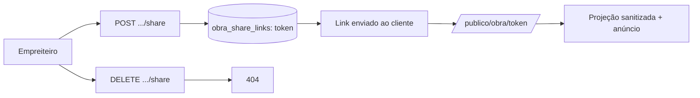

# Jornada — XG04: Link público de acompanhamento

> Status: planejada | Prioridade: alta | Wave: xgestão-4
> Última atualização: 2026-08-09

## 1. Contexto & Objetivo

O empreiteiro exporta um link e manda para o cliente dele, que abre **sem criar conta** e vê o andamento da obra. É o recurso que substitui a conta de contratante no xgestão, e o que o cliente mais quer ver funcionando.

Na reunião: *"é mais fácil que ele só exporte o link"* e *"se a gente tiver um empreiteiro com 10 obras, são 10 clientes que vão estar vendo que o marketplace vai ser lançado"* — daí o espaço de anúncio na página.

**É a única jornada construída do zero.** Não existe nada parecido hoje: o [CompartilharModal](../../features/empreiteiro/minhas-obras/components/CompartilharModal.tsx) atual apenas copia `window.location.href` — a URL autenticada, que dá 404 para qualquer outra pessoa. Por isso ela começa já na **semana 2**.

## 2. Personas

- **Empreiteiro (xgestão)**: gera, compartilha e revoga o link.
- **Cliente final (contratante)**: abre o link sem conta. **Não é usuário da plataforma.**

## 3. Fluxo ponta-a-ponta

1. O empreiteiro gera o link no console da obra.
2. Envia por WhatsApp/e-mail.
3. O cliente abre sem login e vê progresso, etapas, fotos, ocorrências e saúde da obra.
4. A qualquer momento o empreiteiro revoga; o link passa a dar 404.

## 4. Telas envolvidas

- [app/publico/obra/[token]/page.tsx](../../app/publico/obra/[token]/page.tsx) — **a criar**. **Server Component**, deliberadamente.
- [features/empreiteiro/minhas-obras/components/CompartilharModal.tsx](../../features/empreiteiro/minhas-obras/components/CompartilharModal.tsx) — **reescrever**, não remendar.

## 5. Componentes-chave

- `features/xgestao/share/public-projection.ts` — **a criar**. A allowlist. Superfície crítica desta jornada.
- `features/xgestao/share/components/` — cartões de leitura da página pública.
- [features/anuncios/anuncios-service.ts:14](../../features/anuncios/anuncios-service.ts) — array `ZONAS`.
- [features/contratante/minhas-obras/components/](../../features/contratante/minhas-obras/components/) — **referência de conteúdo**: são as abas que o contratante já vê hoje.

## 6. Schema (Drizzle)

Nova tabela `obra_share_links`:

| coluna | tipo | nullable | notas |
|---|---|---|---|
| `id` | varchar PK | não | uuid |
| `obraId` | varchar FK → `obras` | não | `onDelete: cascade` |
| `token` | text | não | **unique + índice**. 32 bytes base64url |
| `criadoPor` | varchar FK → `users` | não | trilha |
| `ativo` | boolean | não | default `true` — revogação |
| `expiraEm` | timestamp | sim | opcional |
| `visualizacoes` | integer | não | default 0 |
| `ultimoAcessoEm` | timestamp | sim | |
| `criadoEm` | timestamp | não | `defaultNow` |

**Tabela separada, não coluna em `obras`** — permite revogar e reemitir mantendo histórico. O cliente vai pedir revogação na primeira vez que um link vazar.

Token guardado **em claro**: é capability URL de dado pouco sensível, e o empreiteiro precisa reexibir o link depois. Hash impediria isso.

## 7. Endpoints

- `POST /api/xgestao/obras/[id]/share` — cria ou rotaciona o token.
- `GET /api/xgestao/obras/[id]/share` — retorna o link atual.
- `DELETE /api/xgestao/obras/[id]/share` — revoga (`ativo = false`).
- `GET /publico/obra/[token]` — página pública, **sem autenticação**. `/publico` não está no `config.matcher` do [proxy.ts](../../proxy.ts), então é público por construção.

## 8. Projeção — o que vai e o que não vai

> **Decisão do cliente (2026-08-09):** o mais completo possível, sem senha, com o filtro "o que faz sentido para o contratante ver".

**O produto já respondeu essa pergunta.** Existe hoje uma visão de obra feita exatamente para o contratante — [features/contratante/minhas-obras/components/](../../features/contratante/minhas-obras/components/) traz `TabVisaoGeral`, `TabEtapas`, `TabTimeline`, `TabFotos`, `TabOcorrencias`, `TabChecklists`. A página pública **espelha esse conjunto**, não inventa outro.

E as fotos já vêm resolvidas: `obra_fotos.enviadaAoContratante` ([schema.ts:819](../../shared/db/schema.ts)) **já é uma flag por foto**, default `true`. O empreiteiro já escolhe foto a foto o que vai para o cliente — a projeção só precisa respeitar.

| Vai para o link | Por quê |
|---|---|
| Nome, **endereço completo**, status, progresso, datas previstas | É a obra dele; identificação e prazo são o motivo do link |
| Etapas com % e status | Núcleo do "como está minha obra" |
| Timeline / marcos | Narrativa do andamento |
| Fotos com `enviadaAoContratante = true` | Prova visual — maior impacto percebido |
| Ocorrências (título, gravidade, status) | Transparência é o diferencial vendido; ocorrência resolvida é argumento de competência |
| Health score | Confirmado pelo cliente |
| Checklists concluídos, inclusive assinados | Evidência de qualidade e segurança |
| Diário de obra | Registro do dia a dia; alto valor percebido, baixo risco |

| **Fica fora** | Por quê |
|---|---|
| `valorTotal`, `valorPago`, lançamentos de `financeiro` | **A margem do empreiteiro vazar para o cliente dele é catástrofe comercial.** Fica fora mesmo com "o mais completo possível" |
| Tudo de [features/shared/profit/](../../features/shared/profit/) | Idem — é o lucro dele |
| `obra_equipe` (nomes, contatos, CPFs) | LGPD: dado pessoal de terceiros que não consentiram com link público |
| Documentos e contratos | Anexos internos entre as partes |
| Disputas | Jurídico |
| Fotos com `enviadaAoContratante = false` | Respeitar a escolha que o empreiteiro já fez |

**Implementar como allowlist explícita, nunca `delete` sobre o objeto completo.** Assim, campo novo em `obras` **não** entra na página por omissão. Essa tabela é a especificação.

## 9. Checklist de implementação

- [ ] Criar a tabela `obra_share_links` + migration
- [ ] `POST`/`GET`/`DELETE /api/xgestao/obras/[id]/share`
- [ ] `features/xgestao/share/public-projection.ts` como allowlist
- [ ] `app/publico/obra/[token]/page.tsx` como **Server Component**
- [ ] `metadata` com `noindex` — o cliente quer que os 10 clientes dele vejam, não o Google
- [ ] Adicionar `"publico-obra"` ao `ZONAS` e ao `AnuncioZonaId` em [features/shared/anuncios/types/index.ts](../../features/shared/anuncios/types/index.ts)
- [ ] Card estático "Marketplace em breve" para quando a zona estiver vazia
- [ ] Rate limit por IP reusando o `isRateLimited` de [app/api/obras/route.ts](../../app/api/obras/route.ts)
- [ ] Incrementar `visualizacoes` sem bloquear o render
- [ ] Reescrever o `CompartilharModal`
- [ ] Spec `tests/e2e/integration/xgestao-share.integration.spec.ts`

> 💡 **A zona de anúncio não precisa de migration.** O comentário em [anuncios-service.ts:12](../../features/anuncios/anuncios-service.ts) diz explicitamente que `zona` é TEXT validado contra `ZONA_IDS`. E `GET /api/anuncios` já é rota pública com cache.

## 10. Critérios de aceite

1. Empreiteiro gera o link e o recebe em formato `https://host/publico/obra/<token>`.
2. Abrir em janela anônima → **200**, com nome, progresso, etapas, fotos, ocorrências e saúde da obra.
3. O corpo da resposta **não contém** `valorTotal`, `valorPago`, margem, nem nomes de membros da equipe — asserir por match no corpo cru, não só na forma parseada.
4. Fotos com `enviadaAoContratante = false` **não** aparecem.
5. O espaço de anúncio renderiza; sem campanha ativa, mostra "Marketplace em breve".
6. Revogar → o mesmo link passa a dar **404**. Token inexistente → **404**. Token de obra excluída → **404**.
7. A página não é indexável (`noindex` presente).

## 11. Riscos / Pontos de atenção

- **Maior risco do projeto.** Único item sem nenhum scaffold. Começar na semana 2.
- **Se atrasar, cortar para:** link + página read-only + card "em breve". Adiar contadores, expiração e rotação.
- **Server Component é decisão de segurança, não de estilo.** Como client component consumindo API, mais cedo ou mais tarde um campo vaza numa resposta ampla demais. Renderizando no servidor, a projeção é o único caminho até o browser.
- **Sem senha foi decisão explícita do cliente.** Retrofitar autenticação depois quebra links já compartilhados — se houver dúvida, é agora.
- A rota é anônima e faz trabalho de banco: o rate limit não é opcional.

## 12. Links cruzados

- Depende de: XG01 (shell), XG02 (a obra a compartilhar)
- Relacionada: J12/J16 (anúncios), J06 (medições, diário e fotos)

## 13. Gaps descobertos durante execução

> Doc viva. Registrar aqui o que apareceu no caminho e não estava no roteiro original. Uma linha por item, com data.
