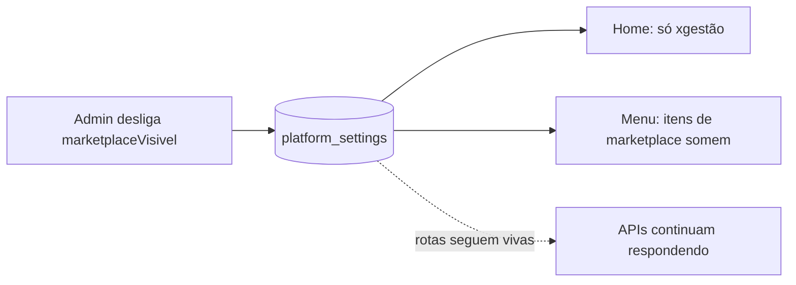

# Jornada — XG05: Ocultar o marketplace

> Status: concluída | Prioridade: alta | Wave: xgestão-5
> Última atualização: 2026-08-28

> **Confirmado na reunião 002 (2026-08-19):** ocultar o marketplace e a jornada do contratante segue no escopo, sem mudança. *"Das questões que você trouxe, a questão do MVP, da questão de ocultar o marketplace ali, ocultar a jornada do contratante, ele já está ok, já está confirmado da nossa parte"* (03:41).
>
> ❄️ **A jornada do anunciante fica congelada junto.** *"A jornada do anunciante, beleza. Então a gente congela por enquanto, né? Foca nessa parte do empreiteiro de fato"* (16:04). Ela já existe construída no marketplace (J12/J16/J23/J31) e permanece oculta pelo mesmo toggle — **nenhum trabalho adicional nesta jornada**. O efeito prático está em [XG04 §9](04-link-publico-obra.md): o espaço de anúncio no link público sai do MVP. Descongela junto com o relançamento do marketplace.

## 1. Contexto & Objetivo

Durante o lançamento do xgestão, o marketplace sai de cena — **por configuração, nunca por remoção**. A ordem do cliente foi literal: *"ocultar, não apagar"*. Todo o fluxo de contratante e empreiteiro-marketplace continua íntegro, testável e reversível a qualquer momento.

> **Decisão do cliente (2026-08-09):** os cadastros de marketplace hoje são **só testes** (dele e do próprio cliente) — não há usuário real. Então dá para ocultar de forma mais ampla sem risco. A exigência firme permanece: **não quebrar o que já funciona**. Depois do MVP do xgestão, um ambiente separado de homologação para retomar o marketplace.

A reversibilidade é o entregável desta jornada — vale demonstrar ao vivo para o cliente.

## 2. Personas

- **Visitante**: vê somente o xgestão na home, sem cartão ou chamada residual do marketplace.
- **Empreiteiro**: não vê mais os itens de menu do marketplace enquanto o toggle estiver desligado.
- **Superadmin**: liga e desliga o toggle.

## 3. Fluxo ponta-a-ponta

## 4. Telas envolvidas

- [app/page.tsx](../../app/page.tsx) — CTAs "Sou Empreiteiro" / "Sou Contratante" passam a depender do toggle.
- [app/acesso-plataforma/page.tsx](../../app/acesso-plataforma/page.tsx) — mesmo gate nos dois cards.
- [app/xgestao-inteligente/page.tsx](../../app/xgestao-inteligente/page.tsx) — **já existe e está órfã**.
- [app/sitemap.ts](../../app/sitemap.ts) — remover URLs do marketplace enquanto oculto.
- Login próprio do xgestão, com marca.

## 5. Componentes-chave

- [features/admin/platform-settings/server/settings-reader.ts](../../features/admin/platform-settings/server/settings-reader.ts) — toggle `marketplaceVisivel` (criado em XG01). Em produção, o override `MARKETPLACE_PUBLIC_VISIBILITY` tem precedência; fora dela, o valor persistido continua soberano.
- [features/empreiteiro/constants.ts](../../features/empreiteiro/constants.ts) e [EmpreiteiroSidebar.tsx](../../features/empreiteiro/components/EmpreiteiroSidebar.tsx) — nav condicional.
- [features/landing/components/GlassNav.tsx](../../features/landing/components/GlassNav.tsx) — navegação pública.

## 6. Schema (Drizzle)

Nenhuma alteração. `platformSettings` é JSONB key/value e o toggle já foi criado em XG01.

## 7. Endpoints

Nenhum novo. **As rotas e APIs do marketplace continuam vivas e respondendo** — é justamente o que o spec de integração prova.

## 8. Landing do produto

[app/xgestao-inteligente/page.tsx](../../app/xgestao-inteligente/page.tsx) permanece como página de apresentação do produto. Entradas de acesso e cadastro podem apontar diretamente para login/cadastro, mas nenhuma superfície pública deve prometer trial enquanto a definição comercial de [XG03 §8](03-planos-limites-trial.md) estiver bloqueada.

## 9. Checklist de implementação

- [x] Gatear os CTAs de marketplace na home pelo `marketplaceVisivel`, sem cartão ou chamada residual quando oculto
- [x] Apontar os CTAs do xgestão para `/xgestao-inteligente` (ou direto ao login do xgestão)
- [x] Mesmo gate em `/acesso-plataforma`
- [x] Ocultar do menu do empreiteiro: Novas Obras Disponíveis, Obras Salvas, Minhas Candidaturas, Meus Recebimentos, Meu Saldo
- [x] Remover URLs de marketplace do sitemap enquanto oculto
- [x] Login próprio do xgestão, com marca
- [x] Spec `tests/e2e/integration/xgestao-marketplace-oculto.integration.spec.ts`

> ⚠️ **Nenhuma rota apagada, nenhum componente comentado, nada removido de [features/marketplace/](../../features/marketplace/).** Ocultação é sempre condicional de renderização lida do toggle.

## 10. Critérios de aceite

1. Com `marketplaceVisivel = false`: a home mostra somente a entrada do xgestão, sem conteúdo residual do marketplace.
2. O menu do empreiteiro perde os itens de marketplace.
3. **As APIs do marketplace continuam respondendo normalmente** — a prova de que foi ocultado, não removido.
4. Sem override de ambiente, voltar o toggle para `true` restaura tudo em ≤30s, sem deploy. Em produção com `MARKETPLACE_PUBLIC_VISIBILITY` definido, alterar a variável e republicar é deliberadamente obrigatório.
5. `git diff` não mostra remoção de rota nem de componente do marketplace.
6. O fluxo completo do marketplace (contratante → candidatura → obra) segue funcionando com o toggle ligado.

## 11. Riscos / Pontos de atenção

- O reader é **fail-open**: erro de banco nunca deve esconder o site inteiro nem ligar manutenção. Preservar essa propriedade.
- Ocultar entradas deixando rotas vivas significa que um bookmark antigo ainda funciona. Como não há usuário real, é aceitável e até desejável — mas está registrado aqui para não virar surpresa.

## 12. Links cruzados

- Depende de: XG01 (toggles)
- Relacionada: J26 (configurações de plataforma), J25 (obras em destaque na home)

## 13. Gaps descobertos durante execução

> Doc viva. Registrar aqui o que apareceu no caminho e não estava no roteiro original. Uma linha por item, com data.

- 2026-08-21 — A entrega preserva todas as rotas e APIs legadas: o toggle controla somente a descoberta pública, o menu e os links de entrada. O sitemap também acompanha a configuração, sem exigir nova publicação.
