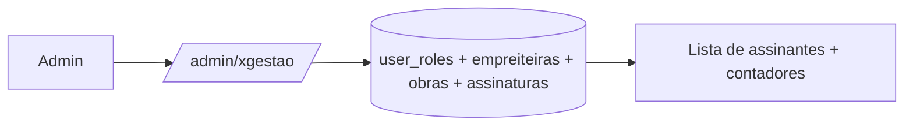

# Jornada — XG06: Visão administrativa do xgestão

> Status: planejada (escopo a confirmar com o cliente) | Prioridade: média | Wave: xgestão-6
> Última atualização: 2026-08-09

## 1. Contexto & Objetivo

Hoje o admin só enxerga o marketplace. Precisa passar a ver o xgestão como produto distinto: quem são os assinantes, quantas obras gerenciam e em que plano estão.

**Escopo deliberadamente apertado.** [features/admin/](../../features/admin/) tem 145 arquivos; espelhar isso para o xgestão seria semanas. Esta jornada entrega uma página e um filtro — e nada mais até o cliente definir o que realmente precisa acompanhar.

## 2. Personas

- **Admin / Superadmin**: acompanha a base de assinantes do xgestão.

## 3. Fluxo ponta-a-ponta

## 4. Telas envolvidas

- [app/admin/xgestao/page.tsx](../../app/admin/xgestao/page.tsx) — **a criar**. Uma página.
- [app/admin/obras/page.tsx](../../app/admin/obras/page.tsx) — ganha filtro por produto.

## 5. Componentes-chave

- Constantes de navegação do admin — adicionar a entrada.
- Componentes de tabela e KPI já existentes em [features/admin/](../../features/admin/) — reaproveitar, não recriar.

## 6. Schema (Drizzle)

**Nenhuma alteração.** O discriminador de produto sai de graça do modelo:

| Produto | Predicado |
|---|---|
| Marketplace | `cliente_id IS NOT NULL` |
| xgestão | `cliente_id IS NULL AND empreiteira_id IS NOT NULL` |

Não é preciso coluna nova.

## 7. Endpoints

- `GET /api/admin/xgestao` — **a criar**. Lista de assinantes + contadores.
- `GET /api/admin/obras` — **alterar**: aceitar parâmetro `produto`.

## 8. Conteúdo mínimo proposto

Lista de assinantes, com: nome da empreiteira, e-mail, quantidade de obras, plano/tier atual, fim do período de teste, data de entrada.

Quatro contadores: total de assinantes xgestão, obras gerenciadas, distribuição entre os 3 planos, links públicos ativos.

> ⚠️ **Escopo pendente de confirmação.** Sem um "sim" explícito do cliente sobre esse mínimo, a jornada expande sem limite. Levar a proposta na reunião.

## 9. Checklist de implementação

- [ ] Confirmar o escopo mínimo com o cliente
- [ ] `GET /api/admin/xgestao`
- [ ] `app/admin/xgestao/page.tsx` com a lista e os 4 contadores
- [ ] Entrada na navegação do admin
- [ ] Filtro `produto` em `/admin/obras`
- [ ] Verificar que a listagem de obras do admin continua correta para o marketplace

## 10. Critérios de aceite

1. Admin acessa `/admin/xgestao` e vê a lista de assinantes com obras, plano e fim do teste.
2. Os 4 contadores batem com o banco.
3. Em `/admin/obras`, filtrar por produto separa corretamente obras de marketplace das de xgestão.
4. Sem filtro, a listagem continua mostrando tudo, como hoje.
5. Verificação: a contagem da tela bate com `SELECT COUNT(*) FROM user_roles WHERE role = 'xgestao'`.

## 11. Riscos / Pontos de atenção

- **Risco de escopo, não técnico.** "Visão admin" é pedido aberto; sem definição vira projeto paralelo. Entregar o mínimo e iterar.
- Um empreiteiro pode ser assinante do xgestão **e** ter atividade no marketplace. A lista deve deixar claro que enxerga o recorte xgestão, não o usuário inteiro.

## 12. Links cruzados

- Depende de: XG01 (role aditiva), XG03 (planos), XG04 (contagem de links ativos)
- Relacionada: J09/J18 (financeiro admin), J33 (saúde da plataforma)

## 13. Gaps descobertos durante execução

> Doc viva. Registrar aqui o que apareceu no caminho e não estava no roteiro original. Uma linha por item, com data.
