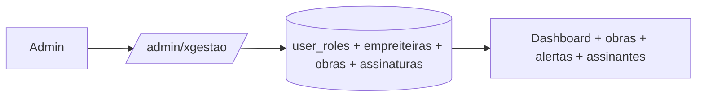

# Jornada — XG06: Visão administrativa do xgestão

> Status: pronto | Prioridade: média | Wave: xgestão-6
> Última atualização: 2026-09-02

## 1. Contexto & Objetivo

O administrador precisa acompanhar o xgestão como produto distinto — quem são os assinantes, quantas obras gerenciam, como está a operação e quais valores estão registrados — sem alterar a visão completa do marketplace.

**Escopo deliberadamente filtrado.** A visão xgestão não espelha a suíte administrativa global: reúne somente assinantes, obras próprias, progresso, status, valores da obra, planos, links e alertas operacionais derivados de dados persistidos.

## 2. Personas

- **Admin / Superadmin**: acompanha a base de assinantes do xgestão.

## 3. Fluxo ponta-a-ponta

## 4. Telas envolvidas

- [app/admin/xgestao/page.tsx](../../app/admin/xgestao/page.tsx) — **hub**: indicadores, obras recentes, alertas e assinantes, com navegação para as demais.
- [app/admin/xgestao/obras/page.tsx](../../app/admin/xgestao/obras/page.tsx) — lista completa, com busca, filtros e paginação.
- [app/admin/xgestao/obras/[id]/page.tsx](../../app/admin/xgestao/obras/[id]/page.tsx) — detalhe em leitura: KPIs, saúde, lucro, link público e o acompanhamento operacional.
- [app/admin/xgestao/assinantes/page.tsx](../../app/admin/xgestao/assinantes/page.tsx) — base do produto, com plano, valor e obras.
- [app/admin/xgestao/financeiro/page.tsx](../../app/admin/xgestao/financeiro/page.tsx) — receita da plataforma e lucro dos assinantes.
- [app/admin/obras/page.tsx](../../app/admin/obras/page.tsx) — mantém a visão operacional global do marketplace, **sem alteração**.

## 5. Componentes-chave

- Constantes de navegação do admin — entrada xgestão visível para os escopos global e xgestão.
- Componentes de tabela e KPI já existentes em [features/admin/](../../features/admin/) — reaproveitar, não recriar.
- Escopo administrativo — `adminEscopo="global"` preserva o painel existente; `adminEscopo="xgestao"` usa uma allowlist positiva e não abre as seções do marketplace.
- Contexto visual — dentro de `/admin/xgestao`, o shell mostra somente o produto xgestão, sem retorno direto, menu, busca, notificações ou atalhos globais misturados.

## 6. Schema (Drizzle)

**Nenhuma alteração.** O discriminador de produto sai de graça do modelo:

| Produto | Predicado |
|---|---|
| Marketplace | `cliente_id IS NOT NULL` |
| xgestão | `cliente_id IS NULL AND empreiteira_id IS NOT NULL` |

Não é preciso coluna nova.

## 7. Endpoints

- `GET /api/admin/xgestao` — indicadores, obras recentes, alertas operacionais e assinantes.
- `GET /api/admin/xgestao/obras` — lista paginada, com `q`, `status`, `empreiteira_id`, `pagina`.
- `GET /api/admin/xgestao/obras/[id]` — detalhe; **404 para obra fora do recorte**.
- `GET /api/admin/xgestao/assinantes` — base com plano, valor mensal, situação e obras.
- `GET /api/admin/xgestao/financeiro` — receita da plataforma e lucro consolidado.
- `GET /api/admin/obras` — permanece disponível ao administrador global; a visão xgestão não depende dessa rota compartilhada.

> ⚠️ **Por que rotas novas e não `/api/admin/obras?produto=xgestao`.** Aquela rota é
> compartilhada com o marketplace e valida apenas `isAdminLike`, sem checar `adminEscopo` —
> o recorte dependeria de um parâmetro que o cliente controla, e um admin restrito trocaria
> `produto=marketplace`. As rotas do produto ficam sob `/api/admin/xgestao/*`, onde a
> allowlist de [admin-scope.ts](../../features/auth/api/admin-scope.ts) já protege por
> prefixo (`startsWith`), e **reusam os serviços**, nunca a rota HTTP compartilhada.
> Consequência prática: rota nova sob esse prefixo entra autorizada sem editar a allowlist.

## 8. Conteúdo administrativo

Lista de assinantes, com: nome da empreiteira, e-mail, quantidade de obras, plano/tier atual, fim do período de teste, data de entrada.

Indicadores: assinantes, obras ativas, progresso médio, orçamento gerenciado, valor registrado como pago, distribuição de status e planos e links públicos ativos.

Obras recentes: nome, empreiteira, cidade/UF, status, progresso, orçamento e presença de link público. A lista inclui exclusivamente obras próprias de empreiteiras cujo usuário mantém o entitlement xgestão.

Alertas operacionais: ocorrências abertas, lançamentos de obra atrasados e obras pausadas. São sinais derivados das tabelas operacionais, não notificações artificiais nem a central global do marketplace.

### Revisão de 2026-09-02 — de tela única a produto navegável

O escopo original foi um mínimo para destravar o MVP: o [README](README.md) registra que
*"o que a visão admin precisa mostrar"* **nunca foi respondido** pelo cliente e ficou
despriorizado. Na revisão do produto o vazio apareceu na prática — a tela mostrava números
e **não tinha um único link clicável**: era possível saber que havia uma ocorrência aberta,
mas não chegar até a obra.

O que passou a existir, **sem tabela nova** (o recorte sai de `cliente_id IS NULL`) e sem
alterar nada do marketplace:

| Antes | Agora |
|---|---|
| 12 obras mais recentes, sem filtro | Lista paginada, com busca por obra/empreiteira/cidade, status e empreiteira |
| Nada clicável | Obra, alerta e assinante levam ao destino |
| Sem detalhe de obra | Detalhe em leitura: KPIs, saúde, lucro, link público e acompanhamento operacional |
| Sem lucro | `computeProfitSummaryForObras` por obra e consolidado |
| Sem saúde | `computeHealthMapForObras` na lista, `HealthCard` no detalhe |
| Plano sem valor | Valor mensal, situação da cobrança e obras ativas por assinante |
| Nenhuma receita | Receita acumulada, recorrente mensal e assinantes pagantes |

**Reuso, não cópia** (README §5): `ProfitSummary`, `ProfitCard`, `HealthCard`, `HealthBadge`,
`StatsCard` e `ObraPublicaShell` entraram como estão, recebendo dados por prop. O que foi
escrito é a camada de recorte em [features/xgestao/admin/server/](../../features/xgestao/admin/server/).

> **Não existe comissão nem repasse no xgestão.** `pagamentos_split` é modelo do
> marketplace, onde a plataforma retém parte do pagamento da obra. Aqui a receita é
> **assinatura**. São duas leituras distintas e o painel financeiro as separa: `lucro` é do
> assinante, `faturamento` é da plataforma. Registrado para não ser reaberto.

> **Escopo confirmado:** a visão administrativa xgestão continua somente leitura e sem chat,
> configurações globais ou operações financeiras do marketplace. O administrador global
> continua vendo tudo como antes.
>
> **Ajuste de 2026-08-30:** o contador de *links públicos ativos* depende de [XG04](04-link-publico-obra.md). Não incluir painel de quota SINAPI enquanto [XG07](07-integracao-sinapi.md) estiver congelada.

## 9. Checklist de implementação

- [x] Confirmar o escopo mínimo com o cliente
- [x] `GET /api/admin/xgestao`
- [x] `app/admin/xgestao/page.tsx` com a lista e os 4 contadores
- [x] Entrada na navegação do admin
- [x] Filtro `produto` em `/admin/obras`
- [x] Verificar que a listagem de obras do admin continua correta para o marketplace
- [x] Isolar visualmente o menu xgestão sem alterar a autorização do marketplace
- [x] Expandir indicadores operacionais e financeiros usando dados reais do recorte xgestão
- [x] Exibir obras recentes e alertas operacionais sem depender de APIs globais
- [x] Remover o retorno direto ao marketplace do shell xgestão
- [x] **Lista de obras** com busca, filtros e paginação, sem o corte fixo de 12
- [x] **Detalhe de obra** em leitura, com 404 para obra fora do recorte
- [x] **Lucro e saúde** reusando `features/shared/profit/` e `features/shared/health/`
- [x] **Receita da plataforma** (acumulada e recorrente) separada do lucro dos assinantes
- [x] Tornar obras, alertas e assinantes navegáveis a partir do hub
- [x] Aplicar o padrão mobile de `hidden md:table-cell` + reinjeção nas tabelas
- [x] Cobertura de integração das rotas novas, incluindo o 404 para obra de marketplace

## 10. Critérios de aceite

1. Admin acessa `/admin/xgestao` e vê a lista de assinantes com obras, plano e data de entrada.

   > **Corrigido em 2026-09-02.** O critério exigia "fim do teste", mas o trial nunca foi
   > implementado — [XG03 §8](03-planos-limites-trial.md) segue bloqueada por definição
   > comercial, e o campo era `null` fixo no servidor. Exibir um dado que não existe é
   > pior que omiti-lo: o critério passa a pedir a data de entrada, que é real. Quando o
   > trial for definido, o campo volta junto.
2. Indicadores de obras, progresso, orçamento, valores pagos, status, planos e links batem com o banco.
3. Em `/admin/obras`, filtrar por produto separa corretamente obras de marketplace das de xgestão.
4. Sem filtro, a listagem continua mostrando tudo, como hoje.
5. Verificação: a contagem da tela bate com `SELECT COUNT(*) FROM user_roles WHERE role = 'xgestao'`.
6. Um administrador global ou superadmin continua chegando a `/admin/financeiro` e acessando as seções do marketplace.
7. Um administrador com `adminEscopo="xgestao"` chega a `/admin/xgestao`, não recebe cadastro administrativo público e é bloqueado server-side fora da allowlist xgestão.
8. Um admin ou superadmin que entra pela tela contextual do xgestão é reconhecido sem precisar trocar para uma tela de login separada e chega a `/admin/xgestao`.
9. Em `/admin/xgestao`, moderação, financeiro, anúncios, leads, saúde, busca, notificações, configurações e demais operações globais não aparecem no shell.
10. Um admin global ou superadmin continua vendo o menu completo ao voltar para uma rota administrativa do marketplace.
11. A lista operacional contém somente obras próprias de usuários que mantêm o entitlement xgestão.
12. Os alertas resumem ocorrências abertas, pagamentos de obra atrasados e obras pausadas sem consultar a central global de notificações.

## 11. Riscos / Pontos de atenção

- **Risco de escopo, não técnico.** A visão permanece resumida e somente leitura para não virar uma segunda suíte administrativa.
- Um empreiteiro pode ser assinante do xgestão **e** ter atividade no marketplace. A lista deve deixar claro que enxerga o recorte xgestão, não o usuário inteiro.
- Superadmin é sempre global; para uma operação restrita, criar uma conta `admin` separada com `adminEscopo="xgestao"` em vez de rebaixar o superadmin.

## 12. Links cruzados

- Depende de: XG01 (role aditiva), XG03 (planos), XG04 (contagem de links ativos)
- Relacionada: J09/J18 (financeiro admin), J33 (saúde da plataforma)

## 13. Gaps descobertos durante execução

> Doc viva. Registrar aqui o que apareceu no caminho e não estava no roteiro original. Uma linha por item, com data.

- **2026-08-30 — contexto de acesso:** role continua sendo `admin`/`superadmin`; o recorte xgestão é uma dimensão adicional. O destino pós-login e o guard server-side precisam considerar `adminEscopo`, enquanto valores ausentes continuam globais por compatibilidade.
- **2026-08-30 — preservação do marketplace:** o painel global não é duplicado nem reconfigurado. A visão xgestão usa uma allowlist própria e não recebe acesso indireto a configurações, planos ou operações financeiras do marketplace.
- **2026-08-31 — login único do produto:** `/login?perfil=xgestao` aceita a autenticação de admin/superadmin e empreiteiro; o contexto só define o destino seguro, nunca a permissão, que continua baseada em role, escopo e entitlement no servidor.
- **2026-08-31 — shell por contexto:** a rota `/admin/xgestao` usa navegação mínima mesmo para admin global ou superadmin. Isso é separação visual de produto, não autorização; o retorno direto ao marketplace foi removido e contas restritas continuam presas à allowlist server-side.
- **2026-08-31 — painel enriquecido:** a expansão usa uma projeção própria baseada no entitlement xgestão. Valores financeiros pertencem às obras do produto; caixa, cobranças e notificações globais do marketplace permanecem fora.
- **2026-09-02 — o escopo mínimo não se sustentava no uso.** A tela era terminal: nenhum link, nenhum caminho da métrica até a obra. A causa está registrada no README — o requisito nunca foi levantado com o cliente. Resolvido com as quatro rotas da §4.
- **2026-09-02 — `fimTeste` era `null` fixo** e o critério de aceite 1 exigia exibi-lo. O trial nunca existiu (XG03 §8 bloqueada); o critério foi corrigido em vez de inventar o dado.
- **2026-09-02 — a única tabela ignorava o padrão mobile do próprio repo.** Seis colunas com apenas `overflow-x-auto`, enquanto `admin/planos`, `admin/obras` e `admin/contratos` já escondiam colunas com reinjeção sob o nome. Padrão aplicado.
- **2026-09-02 — a receita do produto não se recorta por usuário.** A primeira versão somava `financeiro` filtrando pelo pagador, mas a mesma conta pode ter assinatura de marketplace **e** de xgestão (`assinaturas.persona`): a receita do marketplace entrava justamente na tela criada para separar as duas. Corrigido com join em `assinaturas` filtrando `persona = 'xgestao'`, via `financeiro.origemId`.
- **2026-09-02 — o tier do assinante precisa vir de assinatura ativa.** Pegar a mais recente de qualquer status faria quem cancelou o pro aparecer como pro na lista e como free no painel. Alinhado ao critério de `dashboard.ts`.
- **2026-09-02 — `/api/admin/obras` não valida `adminEscopo`,** só `isAdminLike`. Reusá-la com `?produto=xgestao` teria deixado o recorte na mão do cliente. As rotas do produto reusam os *serviços*, não a rota compartilhada.
