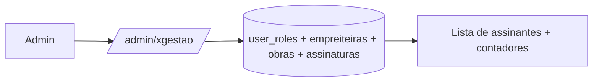

# Jornada — XG06: Visão administrativa do xgestão

> Status: concluída | Prioridade: média | Wave: xgestão-6
> Última atualização: 2026-08-30

## 1. Contexto & Objetivo

O administrador precisa acompanhar o xgestão como produto distinto — quem são os assinantes, quantas obras gerenciam e em que plano estão — sem perder a visão completa do marketplace quando estiver no escopo global.

**Escopo deliberadamente apertado.** [features/admin/](../../features/admin/) tem 145 arquivos; espelhar isso para o xgestão seria semanas. Esta jornada entrega uma página e um filtro — e nada mais até o cliente definir o que realmente precisa acompanhar.

## 2. Personas

- **Admin / Superadmin**: acompanha a base de assinantes do xgestão.

## 3. Fluxo ponta-a-ponta

## 4. Telas envolvidas

- [app/admin/xgestao/page.tsx](../../app/admin/xgestao/page.tsx) — página enxuta de acompanhamento do xgestão.
- [app/admin/obras/page.tsx](../../app/admin/obras/page.tsx) — mantém a visão operacional global do marketplace.

## 5. Componentes-chave

- Constantes de navegação do admin — entrada xgestão visível para os escopos global e xgestão.
- Componentes de tabela e KPI já existentes em [features/admin/](../../features/admin/) — reaproveitar, não recriar.
- Escopo administrativo — `adminEscopo="global"` preserva o painel existente; `adminEscopo="xgestao"` usa uma allowlist positiva e não abre as seções do marketplace.

## 6. Schema (Drizzle)

**Nenhuma alteração.** O discriminador de produto sai de graça do modelo:

| Produto | Predicado |
|---|---|
| Marketplace | `cliente_id IS NOT NULL` |
| xgestão | `cliente_id IS NULL AND empreiteira_id IS NOT NULL` |

Não é preciso coluna nova.

## 7. Endpoints

- `GET /api/admin/xgestao` — lista de assinantes + contadores, protegida pelo escopo administrativo.
- `GET /api/admin/obras` — permanece disponível ao administrador global; a visão xgestão não depende dessa rota compartilhada.

## 8. Conteúdo mínimo proposto

Lista de assinantes, com: nome da empreiteira, e-mail, quantidade de obras, plano/tier atual, fim do período de teste, data de entrada.

Quatro contadores: total de assinantes xgestão, obras gerenciadas, distribuição entre os 3 planos, links públicos ativos.

> **Escopo confirmado:** a visão administrativa xgestão é deliberadamente enxuta, somente leitura e sem chat, relatórios, configurações globais ou operações financeiras do marketplace. O administrador global continua vendo tudo como antes.
>
> **Ajuste de 2026-08-30:** o contador de *links públicos ativos* depende de [XG04](04-link-publico-obra.md). Não incluir painel de quota SINAPI enquanto [XG07](07-integracao-sinapi.md) estiver congelada.

## 9. Checklist de implementação

- [x] Confirmar o escopo mínimo com o cliente
- [x] `GET /api/admin/xgestao`
- [x] `app/admin/xgestao/page.tsx` com a lista e os 4 contadores
- [x] Entrada na navegação do admin
- [x] Filtro `produto` em `/admin/obras`
- [x] Verificar que a listagem de obras do admin continua correta para o marketplace

## 10. Critérios de aceite

1. Admin acessa `/admin/xgestao` e vê a lista de assinantes com obras, plano e fim do teste.
2. Os 4 contadores batem com o banco.
3. Em `/admin/obras`, filtrar por produto separa corretamente obras de marketplace das de xgestão.
4. Sem filtro, a listagem continua mostrando tudo, como hoje.
5. Verificação: a contagem da tela bate com `SELECT COUNT(*) FROM user_roles WHERE role = 'xgestao'`.
6. Um administrador global ou superadmin continua chegando a `/admin/financeiro` e acessando as seções do marketplace.
7. Um administrador com `adminEscopo="xgestao"` chega a `/admin/xgestao`, não recebe cadastro administrativo público e é bloqueado server-side fora da allowlist xgestão.

## 11. Riscos / Pontos de atenção

- **Risco de escopo, não técnico.** A visão permanece mínima para não virar uma segunda suíte administrativa.
- Um empreiteiro pode ser assinante do xgestão **e** ter atividade no marketplace. A lista deve deixar claro que enxerga o recorte xgestão, não o usuário inteiro.
- Superadmin é sempre global; para uma operação restrita, criar uma conta `admin` separada com `adminEscopo="xgestao"` em vez de rebaixar o superadmin.

## 12. Links cruzados

- Depende de: XG01 (role aditiva), XG03 (planos), XG04 (contagem de links ativos)
- Relacionada: J09/J18 (financeiro admin), J33 (saúde da plataforma)

## 13. Gaps descobertos durante execução

> Doc viva. Registrar aqui o que apareceu no caminho e não estava no roteiro original. Uma linha por item, com data.

- **2026-08-30 — contexto de acesso:** role continua sendo `admin`/`superadmin`; o recorte xgestão é uma dimensão adicional. O destino pós-login e o guard server-side precisam considerar `adminEscopo`, enquanto valores ausentes continuam globais por compatibilidade.
- **2026-08-30 — preservação do marketplace:** o painel global não é duplicado nem reconfigurado. A visão xgestão usa uma allowlist própria e não recebe acesso indireto a configurações, planos ou operações financeiras do marketplace.
