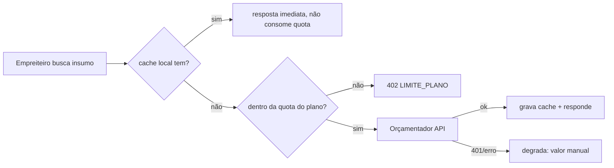

# Jornada — XG07: Integração SINAPI (consulta de preços de referência)

> Status: congelada (2026-08-19) | Prioridade: média | Wave: xgestão-7
> Última atualização: 2026-08-19

> ❄️ **Congelada na reunião 002 (2026-08-19). Não implementar até o gatilho abaixo.**
>
> **Decisão:** SINAPI sai do MVP. O motivo não é técnico — a pesquisa desta jornada continua válida e o caminho por API continua sendo de dias, não semanas. É de sequenciamento: o Dedé precisa da plataforma funcionando **para testar nas obras reais dele**, e não precisa de SINAPI para isso. *"Nesse primeiro momento, se a gente vai começar agora testando em obra do cara, não precisa a gente ter esse custo, por exemplo, inicial já"* (03:03). Todo tempo gasto aqui sai de outra coisa: *"cada coisa que tu tiver que gastar tempo vai naturalmente tirar tempo de outras coisas"* (01:52).
>
> **Gatilho para descongelar:** a ida a mercado. *"Então, quando começa no mercado, sim. Já é interessante começar com isso, já que é um adicional que a gente tem de valor"* (03:11). Não é cancelamento — é adiamento com condição definida.
>
> **Conteúdo preservado na íntegra abaixo.** A pesquisa da API do Orçamentador, os termos de uso, as quotas, o desenho de porta e adapters e as correções de premissa sobre a Caixa custaram trabalho real e voltam a valer sem retrabalho quando a jornada descongelar.
>
> **Estado da chave de testes:** solicitada em 2026-08-10, **sem resposta do fornecedor** até 2026-08-19 (*"eu li o e-mail aqui, que eu pedi a solicitação pra poder fazer o teste. Não me responderam ainda"*, 15:48). O congelamento tornou isso irrelevante para o prazo — que era justamente o risco que ele representava.

## 1. Contexto & Objetivo

Esta jornada **reabre um escopo que estava fechado**. XG03 §11 e o [resumo executivo](../novo-fluxo/xgestao-plano-40-45-dias.pdf) entregue ao cliente afirmam que SINAPI está fora do escopo, com o argumento de que os dados só existem como planilhas mensais por UF e exigiriam pipeline de ingestão — projeto de semanas que derrubaria o prazo de 40–45 dias.

**O argumento continua correto para ETL próprio e está errado para a via API.** O [Orçamentador](https://orcamentador.com.br/api/) expõe insumos, composições, encargos e preços por UF em REST com autenticação por chave. Isso muda a ordem de grandeza: dias, não semanas.

Duas correções de premissa que a pesquisa produziu:

1. **A Caixa não restringe os dados do SINAPI.** O que exige "cliente autorizado" é o **SIPCI** — o sistema web de consulta — cujo acesso se dá por convênio e **apenas para órgãos públicos** (TCEs, TJs, MPs). Não há caminho para empresa privada. Já os relatórios mensais (ZIP com XLSX e PDF, 27 UFs) são **download livre, sem login e sem custo** em [caixa.gov.br](https://www.caixa.gov.br/poder-publico/modernizacao-gestao/sinapi/Paginas/default.aspx).
2. **Não existe API oficial da Caixa nem do IBGE.** É publicação de arquivo. Todo provedor de API SINAPI no mercado é um terceiro que faz ETL desses ZIPs.

Objetivo desta jornada: dar ao empreiteiro consulta de **preço de referência** dentro do console de obra, sem transformar o produto num sistema de orçamento estruturado (isso é projeto próprio — ver §13).

Esta jornada também **fecha a definição pendente #2** do [README](README.md) ("SINAPI: existe serviço de consulta automática?"): sim, existe, via terceiro.

## 2. Personas

- **Empreiteiro (xgestão)**: consulta preço de insumo/composição por UF enquanto planeja ou revisa a obra.
- **Superadmin / admin xgestão**: acompanha consumo de quota e é alertado quando a chave expira.

## 3. Fluxo ponta-a-ponta



1. A consulta entra sempre pelo cache local (`sinapi_itens`).
2. Miss → verifica a quota do plano **antes** de chamar a rede.
3. Resposta da rede é gravada no cache e o miss é contabilizado.
4. Falha ou chave inválida **nunca bloqueia** o trabalho: a interface cai para entrada manual de valor.

## 4. Telas envolvidas

- `app/xgestao/obras/[id]/page.tsx` — o console extraído em XG01 ganha a busca de insumo (aba ou diálogo).
- `app/admin/xgestao` — criado em XG06; ganha o painel de consumo de quota e o alerta de chave expirada.

## 5. Componentes-chave

- `features/xgestao/sinapi/sinapi-provider.ts` — **a criar**, a porta.
- [features/planos/gateway/index.ts](../../features/planos/gateway/index.ts) — **molde direto** da factory (singleton `cached`, `_overrideForTest`, `switch` com `default` defensivo).
- [shared/lib/plans-catalog.ts](../../shared/lib/plans-catalog.ts) — ganha `consultasSinapiMes` na persona `xgestao`.
- [features/admin/platform-settings/server/settings-reader.ts](../../features/admin/platform-settings/server/settings-reader.ts) — flag `plataforma.sinapi`.

## 6. Schema (Drizzle)

Duas tabelas novas. Nenhuma alteração em tabela existente.

**`sinapi_itens`** — cache de dados:

| coluna | tipo | nota |
|---|---|---|
| `id` | varchar PK | |
| `codigo` | text | código SINAPI |
| `tipo` | text | `insumo` \| `composicao` |
| `uf` | varchar(2) | + `BR` (média nacional) |
| `mes_referencia` | date | `AAAA-MM-01` |
| `descricao`, `unidade` | text | |
| `valor` | numeric(15,4) | |
| `payload` | jsonb | resposta bruta, para não perder campo |
| `fetched_at` | timestamp | |

Unique em (`codigo`, `tipo`, `uf`, `mes_referencia`).

**`sinapi_consultas`** — log e contador de quota: `user_id`, `empreiteira_id`, `endpoint`, `cache_hit` (boolean), `created_at`.

> 💡 **TTL é efetivamente infinito.** Os dados SINAPI são mensais por definição: item com `mes_referencia` fechado não muda mais. Revalidação só via `/atualizacao`. É isso que torna a quota gratuita viável.

## 7. Endpoints

Todos sob `/api/xgestao/sinapi/*`, atrás de `assertXgestaoUser` (XG01):

- `GET /api/xgestao/sinapi/insumos` — busca paginada
- `GET /api/xgestao/sinapi/composicoes`
- `GET /api/xgestao/sinapi/composicao/[codigo]`
- `GET /api/xgestao/sinapi/estados`
- `GET /api/admin/xgestao/sinapi/status` — quota, hit rate, validade da chave

Do lado do fornecedor (base `https://orcamentador.com.br/api/`, header `X-API-Key`), o tier gratuito cobre `/insumos`, `/composicoes`, `/composicao`, `/encargos`, `/estados`. Ficam no PRO: `/composicao_explode`, `/orcamento` (com BDI), `/previsao`, `/webhook`.

## 8. Porta e adapters

```
features/xgestao/sinapi/
  sinapi-provider.ts       # a porta — ninguém depende de concreto
  orcamentador-adapter.ts  # HTTP + X-API-Key + leitura de X-RateLimit-*
  null-adapter.ts          # dev sem chave; dataset fixo pequeno
  cache.ts                 # repositório de sinapi_itens
  index.ts                 # factory por env
```

Interface: `buscarInsumos`, `buscarComposicoes`, `obterComposicao`, `listarEstados`, `obterEncargos`, `status()`. Erros tipados: `SinapiIndisponivelError`, `SinapiQuotaExcedidaError`, `SinapiChaveInvalidaError`.

> ⚠️ **Divergência deliberada do gateway de pagamento.** Aquele *lança* se `manual` em produção ([gateway/index.ts:35-39](../../features/planos/gateway/index.ts)). Aqui o adapter `null` em produção apenas **degrada** (warn + "consulta indisponível"). SINAPI é auxiliar: derrubar o boot do xgestão porque uma chave de teste expirou troca um problema pequeno por um incidente.

## 9. Configuração

- Env: `SINAPI_PROVIDER` (`null` \| `orcamentador`, default `null`), `ORCAMENTADOR_API_KEY`, `ORCAMENTADOR_BASE_URL`, `ORCAMENTADOR_KEY_EXPIRES_AT`.
- Flag `plataforma.sinapi`, **default `false`**, nos DEFAULTS do [settings-reader.ts](../../features/admin/platform-settings/server/settings-reader.ts) **com o espelho obrigatório** em [app/api/admin/configuracoes/route.ts](../../app/api/admin/configuracoes/route.ts) — esquecer um dos dois é o erro clássico aqui (J26).

### Quota por tier

| Plano comercial | tier | consultas/mês |
|---|---|---|
| Freemium | `free` | 20 |
| Basic | `pro` | 100 |
| Pro | `enterprise` | ilimitado |

**Contar apenas cache miss.** Hit local não consome quota nossa nem do fornecedor, e cobrar por hit puniria o usuário por eficiência nossa.

## 10. Restrições contratuais (projeto, não opinião)

Os [termos de uso da API](https://orcamentador.com.br/termos-de-uso-api.php) permitem "armazenar resultados localmente para uso interno" e proíbem "revender, sublicenciar ou redistribuir os dados da API como produto concorrente". Daí três regras de implementação:

1. **Não varrer a base** para montar espelho local. Cache é do que o usuário consultou; crawling sistemático descaracteriza "uso interno".
2. **Não expor dado SINAPI no link público de obra (XG04)** — ali entra valor consolidado, nunca tabela item a item. Coerente com a regra que XG04 já tem: a margem do empreiteiro não vaza para o cliente dele.
3. **Não criar endpoint próprio que sirva SINAPI cru** a terceiros.

## 11. Checklist de implementação

- [ ] Obter chave de testes (conta em `orcamentador.com.br` + solicitação por formulário)
- [ ] `sinapi-provider.ts` (porta) + `null-adapter.ts`
- [ ] Tabelas `sinapi_itens` e `sinapi_consultas` + bootstrap idempotente
- [ ] `cache.ts` cache-first
- [ ] `orcamentador-adapter.ts` com validação **Zod na borda** (sem OpenAPI, o contrato pode mudar sem aviso)
- [ ] `index.ts` factory espelhando o gateway de pagamento
- [ ] `consultasSinapiMes` no catálogo + checagem **no choke point**
- [ ] Circuit breaker + degradação para valor manual
- [ ] Busca no console de obra (`framer-motion` no loading e na transição)
- [ ] Painel de quota em `/admin/xgestao`
- [ ] Spec `tests/e2e/integration/xgestao-sinapi.integration.spec.ts`

> ⚠️ **Aprender com o bug de XG03.** `obrasAtivas` está no catálogo, aparece na interface e **nunca é checado em nenhuma escrita**. Para não repetir: `consultasSinapiMes` tem de ser verificado no **mesmo choke point que executa a consulta** (`sinapi/index.ts`), nunca na UI.

## 12. Critérios de aceite

1. Freemium: 20ª consulta (miss) → 200; a 21ª → **402** `LIMITE_PLANO`.
2. Consulta repetida do mesmo item → cache hit, **não** incrementa o contador.
3. `SINAPI_PROVIDER=null` → busca responde "indisponível" e **salvar a obra continua funcionando**.
4. Chave inválida (401 do fornecedor) → circuit breaker abre, interface degrada, alerta em `/admin/xgestao`. Nenhum 500 vazado.
5. Flag `plataforma.sinapi=false` → a busca não aparece no console.
6. Nenhum dado SINAPI presente na resposta de `/publico/obra/[token]` (XG04).

## 13. Riscos / Pontos de atenção

- **A chave gratuita expira a cada 15 dias** e é obtida por **formulário de contato**, não pelo painel — não há como automatizar a renovação. Consequência direta: **o tier gratuito não é viável em produção**, serve para desenvolvimento e homologação. O PRO (**R$ 79,90/mês**, 500k req/mês) é pré-requisito de go-live. Isso está registrado na seção 5 do [resumo executivo](../novo-fluxo/xgestao-plano-40-45-dias.pdf) e o aceite do custo virou pergunta formal ao cliente. **A chave de testes já foi solicitada** (2026-08-10).
- **Quota do plano gratuito: 50 req/hora e 2.000 req/mês** — confirmado na tabela de planos em `/api/` (2026-08-10). A página `/api/docs` informa 100/h e 3.000/mês; **prevalece a tabela de planos**, que é a que rege a contratação. Tratar os headers `X-RateLimit-*` como verdade em runtime.
- **Cláusula "produto concorrente" não é definida** nos termos. Nós exporíamos consulta SINAPI dentro de um SaaS de gestão; eles vendem consulta SINAPI. Zona cinzenta que não se resolve lendo o contrato — **confirmar por escrito com o fornecedor** antes do go-live pago e registrar a resposta aqui.
- **Sem OpenAPI e sem SDK JavaScript** (só PHP). Tipos escritos à mão a partir de respostas observadas; validar com Zod na borda e nunca propagar `any`.
- **Fornecedor único.** A porta `SinapiProvider` existe justamente para permitir um adapter futuro de ingestão dos ZIPs oficiais da Caixa sem tocar em nenhum caller — rota mais robusta a médio prazo, sem contrato intermediário e sem teto de requisições.
- **Orçamento estruturado fica fora.** `obras.orcamento` segue sendo um `numeric` único. Uma tabela de itens de orçamento por obra é projeto próprio e não entra aqui.

## 14. Links cruzados

- Depende de: XG01 (shell e `assertXgestaoUser`), XG03 (persona `xgestao` no catálogo — a quota depende de `getLimitesUsuario` com persona explícita)
- Relacionada: XG04 (restrição de vazamento no link público), XG06 (painel de quota)
- Referência: [XG03 §11](03-planos-limites-trial.md) — nota original que colocava SINAPI fora do escopo

## 15. Gaps descobertos durante execução

> Doc viva. Registrar aqui o que apareceu no caminho e não estava no roteiro original. Uma linha por item, com data.
