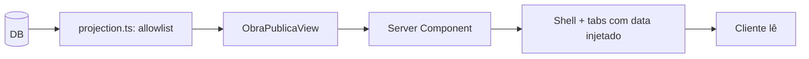

# Jornada — XG08: Visão da obra em modo leitura

> Status: concluída | Prioridade: alta | Wave: xgestão-8
> Última atualização: 2026-08-21

## 1. Contexto & Objetivo

O contratante do xgestão abre um link e vê a obra. O que ele vê **não é uma tela nova** — é a mesma visão de obra que o contratante do marketplace já usa hoje, com as ações removidas.

> **Decisão do cliente (2026-08-19):** *"a gente pode pegar o que já tá na... já usar o que já tem desenhado da jornada do contratante do marketplace, que ele tem acesso a ver de dados das obras dele e fazer as telas iguais"* (19:47) — *"só que nesse caso, sem o cara poder modificar nada. Só visualizar"* (20:45).

Esta jornada é o **conteúdo**. [XG04](04-link-publico-obra.md) é o **mecanismo** (token, rota, revogação). Foram separadas porque o conteúdo mexe em componentes que rodam em **duas telas de produção** — a do contratante e a do empreiteiro — e o risco de regressão é de natureza diferente do risco do link.

> ⚠️ **O princípio desta jornada, e ele não é negociável: extrair e parametrizar, nunca copiar.** O cliente foi explícito em não duplicar. Toda duplicação de árvore de render é desvio que precisa ser justificado por escrito nesta seção 13. Duplicar significa que daqui a três meses uma correção de bug entra em uma tela e não na outra.

## 2. Personas

- **Cliente final (contratante)**: abre o link, lê, não interage. **Não é usuário da plataforma.**
- **Empreiteiro (xgestão)**: é quem alimenta o que o cliente vê. Nesta jornada ele não age — o trabalho dele está em [XG02](02-obra-do-empreiteiro.md).
- **Contratante do marketplace**: **não é afetado** — mas usa os mesmos componentes. É a persona cuja não-regressão define o sucesso desta jornada.

## 3. Fluxo ponta-a-ponta



1. A projeção server-side monta um `ObraPublicaView` **construindo campo a campo**, nunca removendo campos de um objeto completo.
2. O Server Component passa o payload por prop.
3. As tabs recebem `data` e **não fazem fetch** — o mesmo componente que fetcha sozinho na tela autenticada.
4. `canWrite={false}` desliga toda a escrita na UI.

## 4. Telas envolvidas

- [app/contratante/minhas-obras/[id]/page.tsx](../../app/contratante/minhas-obras/[id]/page.tsx) — **referência e tela a não quebrar**. 552 linhas, client component, 11 tabs, até 12 requests autenticados quando o usuário navega tudo.
- `features/xgestao/obra-publica/components/ObraPublicaShell.tsx` — **a criar**. O shell (header, KPIs, tab bar). É a única parte reescrita, e a seção 6 explica por quê.

## 5. Componentes-chave

**Reaproveitados sem nenhuma alteração** — são puros, recebem tudo por prop:

- [features/contratante/minhas-obras/components/TabChecklists.tsx](../../features/contratante/minhas-obras/components/TabChecklists.tsx) — `TabChecklists({ checklists })`
- [features/shared/components/TimelineDisplay.tsx](../../features/shared/components/TimelineDisplay.tsx)

**Parametrizados** (mudança aditiva, retrocompatível) — os quatro cards J06:

- [features/obras/medicoes/components/EtapasJ06Card.tsx](../../features/obras/medicoes/components/EtapasJ06Card.tsx)
- [features/obras/medicoes/components/FotosJ06Card.tsx](../../features/obras/medicoes/components/FotosJ06Card.tsx)
- [features/obras/medicoes/components/OcorrenciasJ06Card.tsx](../../features/obras/medicoes/components/OcorrenciasJ06Card.tsx)
- [features/obras/medicoes/components/DiarioJ06Card.tsx](../../features/obras/medicoes/components/DiarioJ06Card.tsx)

**Molde da projeção:**

- [features/empreiteiro/minhas-obras/api/build-detalhe-server.ts](../../features/empreiteiro/minhas-obras/api/build-detalhe-server.ts) — **já existe** e já faz o trabalho pesado: JOINs em 10 tabelas e `resolveSignedFotoUrl` para arquivos privados. A projeção pública é esse builder com allowlist no lugar do `select()` amplo.

> 💡 **Duas descobertas que tornam a extração barata.** Os quatro hooks já aceitam `enabled` ([use-obra-j06.ts:88,124,151,179](../../features/obras/medicoes/hooks/use-obra-j06.ts)) e os quatro cards já aceitam `canWrite`. O modo leitura e o desligamento do fetch **já são parametrizáveis** — ninguém precisou prever esta jornada para que isso existisse, mas existe. A extração vira mudança de poucas linhas por card em vez de refactor.

## 6. Schema (Drizzle)

- Tabelas existentes: `obras`, `obraEtapas`, `obraFotos`, `obraOcorrencias`, `obraDiario`, `obraChecklists`, `userFiles`.
- **Nenhuma tabela a criar ou alterar.** A tabela do link (`obra_share_links`) pertence a [XG04](04-link-publico-obra.md).
- Migration: **nenhuma**.

## 7. Endpoints

**Nenhum endpoint novo.** É decisão de arquitetura, não omissão: a página é Server Component e chama a projeção **diretamente**. Criar `/api/publico/obra/[token]` adicionaria superfície de ataque sem necessidade — e cairia no `config.matcher` do [proxy.ts](../../proxy.ts), que inclui `/api/:path*`.

Se algum dia houver necessidade (polling, por exemplo), o endpoint deve consumir a **mesma** `projection.ts`. Nunca uma segunda projeção.

## 8. A fronteira de reuso — o que se extrai e o que se reescreve

**Extrai-se o conteúdo (~2500 linhas de tabs). Reescreve-se o shell (~150 linhas de layout).**

A tela do contratante tem cinco blocos que **existem apenas porque ele está autenticado e pode agir**: `ObraVisibilidadeActions`, o botão "Trocar capa" (usa `useUpload` + `PATCH`), `ContratoCard`, `CandidaturasCard` e `ContatoEmpreiteiroCard`. Um componente de página único para os dois casos precisaria aceitar cinco slots opcionais e viraria um `if (readOnly)` gigante — que é exatamente o emaranhado que "não duplicar" queria evitar.

O KPI grid do contratante ([page.tsx:331-465](../../app/contratante/minhas-obras/[id]/page.tsx)) também é **100% financeiro** — Orçamento Total, Valor Pago, Valor Restante. Nada disso vai para o link (§8 de [XG04](04-link-publico-obra.md)). O shell público precisa de KPIs diferentes: progresso, etapas concluídas, dias restantes, última atualização.

Reescrever 150 linhas de layout que **não** têm equivalente semântico não é duplicação — é o oposto: é o que evita que o componente compartilhado vire um switch de dois produtos.

### O padrão `J06DataSource<T>`

O problema: React proíbe hook condicional, então `useObraEtapas(obraId)` **precisa** ser chamado sempre. A solução já está no código — o parâmetro `enabled`.

```ts
/**
 * Contrato de fonte de dados dos cards J06.
 * - `data` ausente  → o card fetcha sozinho (comportamento legado, todos os callers atuais).
 * - `data` presente → o card NÃO fetcha; renderiza o que recebeu.
 */
export interface J06DataSource<TRow> {
  data?: TRow[];
  isLoading?: boolean;
}
```

Aplicado em cada card:

```ts
export function EtapasJ06Card({ obraId, canWrite, canEditScope, data, isLoading: isLoadingProp }: Props) {
  const injected = data !== undefined;
  const query = useObraEtapas(obraId, /* enabled */ !injected);
  const etapas = injected ? data : query.data;
  const isLoading = injected ? (isLoadingProp ?? false) : query.isLoading;
  // ... resto IDÊNTICO
```

**Retrocompatível por construção:** sem `data`, `injected` é `false`, `enabled` é `true`, e o caminho é byte-a-byte o atual. Nenhum caller existente muda.

As mutations (`useCreateEtapa` etc.) continuam sendo criadas incondicionalmente — são hooks de mutação, não disparam rede. Os handlers só são alcançáveis por botões guardados por `canWrite`/`canEditScope`, que serão `false`.

> 💡 **Defesa em profundidade barata:** `if (!canWrite) return;` no topo de cada handler de mutação. Hoje é redundante — os botões já estão dentro de `{canWrite && ...}`. Custa uma linha e protege contra uma refatoração futura que exponha o botão sem perceber.

### Inventário: esforço e risco de regressão

Risco medido **na tela do contratante do marketplace**, que está em produção.

| Arquivo | Mudança | Esforço | Risco |
|---|---|---|---|
| `features/obras/medicoes/components/types.ts` | **a criar** — define `J06DataSource<T>` | trivial | **zero** (arquivo novo) |
| [EtapasJ06Card.tsx](../../features/obras/medicoes/components/EtapasJ06Card.tsx) | **alterar** — `data`/`isLoading` opcionais | trivial (~5 linhas) | **baixo** — sem `data`, caminho idêntico |
| [FotosJ06Card.tsx](../../features/obras/medicoes/components/FotosJ06Card.tsx) | **alterar** — idem | trivial | **baixo** |
| [OcorrenciasJ06Card.tsx](../../features/obras/medicoes/components/OcorrenciasJ06Card.tsx) | **alterar** — idem | trivial | **baixo** |
| [DiarioJ06Card.tsx](../../features/obras/medicoes/components/DiarioJ06Card.tsx) | **alterar** — idem | trivial | **baixo** |
| [TabChecklists.tsx](../../features/contratante/minhas-obras/components/TabChecklists.tsx) | **sem alteração** — import direto | trivial | **zero** |
| [TabVisaoGeral.tsx](../../features/contratante/minhas-obras/components/TabVisaoGeral.tsx) | ver ressalva abaixo | médio | **médio** |
| `features/xgestao/obra-publica/types.ts` | **a criar** — `ObraPublicaView` | médio | **zero** |
| `features/xgestao/obra-publica/server/projection.ts` | **a criar** — a allowlist | alto | **zero** |
| `features/xgestao/obra-publica/components/ObraPublicaShell.tsx` | **a criar** — shell + tab bar | médio | **zero** |
| `features/xgestao/obra-publica/components/Tab*Publica.tsx` | **a criar** — 4 wrappers de ~8 linhas | trivial | **zero** |

> ⚠️ **`TabVisaoGeral` é o único arquivo de layout compartilhado que muda, e é onde a regressão vai aparecer se aparecer.** Ele chama `useObraHealth(obra.id)` internamente ([TabVisaoGeral.tsx:38](../../features/contratante/minhas-obras/components/TabVisaoGeral.tsx)) — um fetch autenticado escondido dentro de um componente que parece puro. Sem sessão ele não quebra a tela (o bloco é guardado por `{health && ...}`), mas gera um 401 por render.
>
> **Alternativa de menor risco, e a recomendada se o prazo apertar:** não tocar em `TabVisaoGeral` e escrever um `VisaoGeralPublica.tsx` enxuto. O layout público é genuinamente diferente — sem KPIs financeiros, sem card de contato do empreiteiro — então aqui a reescrita é honesta, não preguiça. Fica registrado como a exceção prevista ao princípio da seção 1.

### O empreiteiro não entra como terceiro caller

Registrado como decisão, para não ser reaberto a cada revisão: as telas do contratante e do empreiteiro **não compartilham componentes de tab nem o tipo de dado**. O contratante usa `ObraContratanteDetalhe` com tabs `Tab*`; o empreiteiro usa `MinhaObraDetalhe` com `*Section`, e os campos divergem (`orcamento/valorPago` contra `aReceber/diasAtraso`).

Unificar exigiria fundir dois modelos de dados em duas telas de produção — refactor de alto risco e **zero valor para esta entrega**. Os quatro cards J06 já são o ponto de encontro real das duas telas, e melhoram para ambas de graça com esta jornada.

## 9. Checklist de implementação

- [x] `features/xgestao/obra-publica/types.ts` — escrever `ObraPublicaView` **primeiro**; ele é o contrato e força as decisões de projeção antes de existir SQL
- [x] `features/obras/medicoes/components/types.ts` com `J06DataSource<T>`
- [x] `data`/`isLoading` nos 4 cards J06, usando o `enabled` que os hooks já aceitam
- [x] `if (!canWrite) return;` no topo dos handlers de mutação dos 4 cards
- [x] **Verificar as duas telas de produção** com a suíte de obras xgestão: Etapas e Ocorrências continuam aceitando escrita autenticada
- [x] `features/xgestao/obra-publica/server/projection.ts` com `import 'server-only'` no topo
- [x] `ObraPublicaShell.tsx` + os 4 wrappers `Tab*Publica`
- [x] Estados de borda: os quatro cards e `TabChecklists` preservam seus estados vazios com dados injetados
- [x] Spec `tests/e2e/integration/xgestao-obra-publica.integration.spec.ts`

## 10. Critérios de aceite

1. Abrir a obra em `/contratante/minhas-obras/[id]` como contratante do marketplace: as 11 tabs carregam e **as ações de escrita continuam funcionando** — criar etapa, subir foto, registrar ocorrência. **Regressão zero é o critério principal desta jornada.**
2. Abrir `/empreiteiro/minhas-obras/[id]`: idem para as seções do empreiteiro.
3. A visão pública renderiza etapas, fotos, diário, ocorrências e checklists com os dados corretos, **sem nenhum botão de escrita**.
4. Na visão pública, o painel de rede do browser mostra **zero requests** para `/api/obras/[id]/etapas`, `/fotos`, `/ocorrencias`, `/diario` — prova de que `enabled: false` funcionou e o `data` foi injetado.
5. Fotos com `enviadaAoContratante = false` **não** aparecem.
6. `grep -rn "canWrite={true}"` nos wrappers públicos não retorna nada.
7. Verificação: `SELECT COUNT(*) FROM obra_fotos WHERE obra_id = '<id>' AND enviada_ao_contratante = false;` — esse número de fotos deve estar ausente da página.

## 11. Riscos / Pontos de atenção

- **O risco desta jornada é regressão, não construção.** Os quatro cards J06 rodam em duas telas de produção. A mudança é aditiva e retrocompatível por construção, mas o critério 1 e 2 não são formalidade — são o gate.
- **`TabVisaoGeral`** é o ponto sensível. Ver a ressalva na seção 8 e a alternativa de menor risco.
- **Cache do TanStack Query:** `enabled: false` não impede que dados em cache de uma sessão anterior apareçam. Na página pública não há sessão anterior, então é teórico — mas garantir que os wrappers públicos **sempre** passem `data`, nunca deixem cair no fetch.
- **`autorNome` em fotos, diário e ocorrências é PII.** Entra pela porta lateral enquanto `obra_equipe` sai pela porta da frente por LGPD. Resolver na projeção — substituir pelo nome da empreiteira ou por "Equipe da obra". Ver [XG04 §8](04-link-publico-obra.md).
- **A projeção é o único lugar autorizado a produzir um `ObraPublicaView`.** `import 'server-only'` no topo garante erro de build se algum dia for importada por um Client Component.

## 12. Links cruzados

- Depende de: XG01 (shell), XG02 (a obra a exibir)
- Bloqueia: XG04 (o link sem conteúdo não entrega nada)
- Relacionada: J06 (medições, diário e fotos), J03 (visão de obra do contratante no marketplace)

## 13. Gaps descobertos durante execução

> Doc viva. Registrar aqui o que apareceu no caminho e não estava no roteiro original. Uma linha por item, com data.

- 2026-08-21 — A rota e o token não foram criados nesta jornada: o shell e a projeção server-only ficam prontos para a XG04 consumir diretamente, sem introduzir uma API pública paralela.
