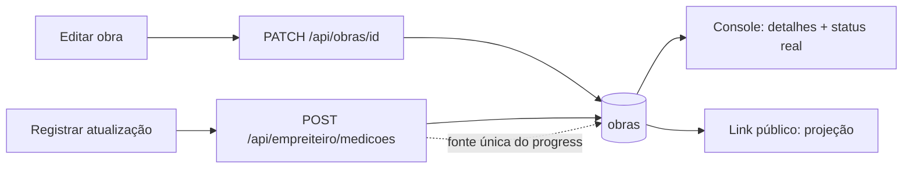

# Jornada — XG09: Administração da obra ponta a ponta

> Status: concluída | Prioridade: alta | Wave: xgestão-9
> Última atualização: 2026-09-02

## 1. Contexto & Objetivo

A execução do xgestão já funcionava, mas havia um descompasso entre **o que o dono edita**, **o que a tela de detalhes mostra** e **o que chega ao link público**. O relato do cliente: *"atualizo a obra e não ressoa certinho ali nos detalhes; consequentemente algumas coisas iam ou não pro link público"*.

**O achado central inverte a suspeita: não havia bug de persistência.** O `PATCH /api/obras/[id]` foi verificado executando o schema real contra o payload real do formulário — os 15 campos passam intactos, e a spec de integração já cobria esse PATCH e passava.

O problema era de **leitura**: as duas telas de exibição liam subconjuntos menores do que o formulário escrevia, e uma delas reinterpretava o dado. Por isso os testes de API passavam enquanto o usuário via o problema na tela — ninguém testava "editei → apareceu no detalhe".

Junto entrou a **clareza da jornada de edição**: o guia de ajuda era um card que, uma vez dispensado, nunca mais voltava.

## 2. Personas

- **Empreiteiro (xgestão)**: edita a obra, acompanha o console e compartilha o link.
- **Cliente final**: abre o link público e lê o andamento. **Não é usuário da plataforma.**
- **Marketplace**: **não afetado.** As mudanças em código compartilhado são condicionadas à propriedade da obra.

## 3. Fluxo ponta-a-ponta

## 4. Telas envolvidas

- [features/xgestao/components/EditarObraPage.tsx](../../features/xgestao/components/EditarObraPage.tsx) — ganha a seção de link público, perde o campo de progresso, valida formato antes de enviar.
- [app/empreiteiro/minhas-obras/[id]/page.tsx](../../app/empreiteiro/minhas-obras/[id]/page.tsx) — ganha o bloco "Detalhes da obra", o status real e o tour.
- [features/xgestao/obra-publica/components/ObraPublicaShell.tsx](../../features/xgestao/obra-publica/components/ObraPublicaShell.tsx) — badge de status traduzido.

## 5. Componentes-chave

- `features/xgestao/components/GuidedTour.tsx` — **criado.** Spotlight reutilizável, sem dependência nova (`framer-motion` + portal).
- `features/xgestao/hooks/use-guided-tour.ts` — **criado.** Primeira visita, reabertura e migração da chave legada.
- [features/empreiteiro/minhas-obras/components/CompartilharModal.tsx](../../features/empreiteiro/minhas-obras/components/CompartilharModal.tsx) — prop estreitada para `{ id, titulo }`, servindo console e edição **sem cópia** (princípio de [XG08](08-visao-obra-read-only.md)).
- [shared/constants/status.ts](../../shared/constants/status.ts) — ganha `OBRA_STATUS_DB_LABELS`, o vocabulário do banco.

## 6. Schema (Drizzle)

**Nenhuma alteração.** Todos os campos envolvidos já existiam em `obras`.

## 7. Endpoints

- `PATCH /api/obras/[id]` — **alterado**: recusa `progresso` em obra própria, valida CEP/UF/numéricos, amplia o strip, converte erro de banco em 400.
- `GET /api/empreiteiro/minhas-obras/[id]` — **alterado**: passa a expor `descricao`, `areaM2` e `statusObra`.
- Demais rotas **sem alteração**.

## 8. As sete divergências corrigidas

| # | Sintoma | Causa |
|---|---|---|
| D1 | Descrição e área salvas, invisíveis no detalhe | O adapter não retornava os campos, e o tipo não os declarava |
| D2 | "Pausada" exibida como "Com pendências" | `mapStatus` colapsa o enum do banco no vocabulário derivado da UI |
| D3 | **Cliente final via `em_andamento` cru** | `STATUS_LABELS` (vocabulário da UI) aplicado sobre valor do banco |
| D4 | Card de localização sumia | Só era montado quando havia cidade ou UF |
| D5 | Valor antigo por instantes após salvar | `staleTime` de 5 min com gate só em `isLoading` |
| D6 | Progresso digitado brigava com o medido | Duas fontes de verdade escrevendo `obras.progresso` |
| D7 | CEP/área inválidos entravam; área não-numérica dava 500 | O schema estrito só roda ao publicar, caminho impossível no xgestão |

> **Achado extra de segurança.** O PATCH aceitava `valorPago` (financeiro), `destaque`/`destaqueOrdem` (curadoria da home do marketplace) e `contratoStatus` — este último contornando o gate de `em_andamento` da J58. Os quatro entraram no strip.

### D3 em detalhe — dois vocabulários, um dicionário

O banco usa `planejamento | em_andamento | pausada | concluida`. A UI do marketplace usa `em_execucao | com_atrasos | com_pendencias | planejamento | finalizada`. São **conjuntos diferentes** que se cruzam em uma única chave, e era essa coincidência que mascarava o bug: `planejamento` funcionava, os outros três apareciam crus.

O tipo era `status: string`, então o TypeScript não tinha como reclamar. Estreitá-lo para o enum do banco é o que impede a repetição.

### D6 em detalhe — avanço se mede, não se digita

Em obra própria, `POST /api/empreiteiro/medicoes` soma o percentual **sobre o valor atual da obra**. Um campo editável no formulário sobrescrevia esse acumulado, e a medição seguinte partia do valor sobrescrito. Editar para 30% depois de medições somarem 60% fazia o próximo avanço partir de 30%.

A decisão foi remover o campo: o avanço passa a ser sempre grandeza medida, com autor, data e fotos. É o modelo correto de engenharia — e alinha com a regra já registrada em [.agents/memory/progress-semantics.md](../../.agents/memory/progress-semantics.md).

## 9. Checklist de implementação

- [x] `OBRA_STATUS_DB_LABELS` + badge traduzido no link público
- [x] `ObraPublicaView.status` estreitado para o enum do banco
- [x] `descricao`, `areaM2` e `statusObra` no detalhe do console
- [x] Bloco "Detalhes da obra" espelhando o link público, com estado vazio orientando
- [x] Status real da obra própria, com atraso como badge adicional
- [x] `localizacao` montada com qualquer campo de endereço
- [x] Campo de progresso removido da edição + recusa server-side (409)
- [x] Validação de CEP/UF/numéricos no cliente e no servidor
- [x] Strip de `valorPago`, `contratoStatus`, `destaque`, `destaqueOrdem`
- [x] Erro de banco vira 400 com mensagem, não 500
- [x] Seção "Link público" na edição, reusando o `CompartilharModal`
- [x] `GuidedTour` + `useGuidedTour`, com roteiros de console e edição
- [x] Botão "Ajuda" fixo nas duas telas
- [x] Specs estendidas: 15 campos, releitura, detalhe do console, rejeições

## 10. Critérios de aceite

1. Editar preenchendo todos os campos → salvar → o detalhe mostra **todos**.
2. Status "Pausada" → o console exibe "Pausada", não "Com pendências".
3. Link público em janela anônima → badge legível; descrição, tipo e área presentes.
4. O público **não** traz valores, equipe nem endereço exato (asserts de [XG04](04-link-publico-obra.md) preservados).
5. Só número e CEP, sem cidade/UF → card de Localização aparece.
6. `PATCH` com `progresso` em obra própria → **409**. Avanço só por medição.
7. `PATCH` com CEP/UF/área inválidos → **400** com mensagem por campo.
8. `PATCH` com `valorPago`/`destaque`/`contratoStatus` → **200**, valores **inalterados**.
9. Primeiro acesso → tour com spotlight; "Pular" dispensa; "Ajuda" reabre.
10. **Regressão do marketplace:** obra com contratante intacta; `PATCH` de obra do marketplace por empreiteiro segue **403** ([XG02 §10.5](02-obra-do-empreiteiro.md)).

## 11. Riscos / Pontos de atenção

- **`mapStatus` continua servindo o marketplace.** A mudança é aditiva: `statusObra` convive com `status`. Substituir um pelo outro quebraria o filtro por status da listagem.
- **A remoção do campo de progresso é mudança de comportamento visível.** Quem usava o campo para ajustar o número precisa registrar uma atualização. É o custo de ter fonte única, e a tela explica o caminho.
- **O tour trava a rolagem enquanto aberto.** Testes de browser que interagem com o console precisam dispensá-lo antes — a spec já faz isso.
- **A preferência do tour vive no navegador.** Trocar de dispositivo reexibe uma vez. Persistir no perfil exigiria coluna nova, o que não se justificou aqui.

## 12. Links cruzados

- Depende de: [XG02](02-obra-do-empreiteiro.md) (a obra e sua edição), [XG04](04-link-publico-obra.md) (o link), [XG08](08-visao-obra-read-only.md) (as telas em leitura)
- Relacionada: J06 (medições, diário e fotos), J58 (contrato — motivo do strip de `contratoStatus`), J25 (destaque)

## 13. Gaps descobertos durante execução

> Doc viva. Registrar aqui o que apareceu no caminho e não estava no roteiro original. Uma linha por item, com data.

- **2026-09-02 — o teste que passa e o bug que existe:** a spec cobria o PATCH e asseria 5 dos 15 campos enviados, e nada verificava a tela de leitura. Foi o suficiente para o backend parecer correto (e estar) enquanto o usuário via campos sumirem. Cobertura de endpoint não é cobertura de jornada.
- **2026-09-02 — tipo frouxo esconde descasamento de vocabulário:** `status: string` deixou passar a aplicação do dicionário da UI sobre o valor do banco. Onde dois vocabulários convivem, tipar estreito é o que transforma o erro em falha de compilação.
- **2026-09-02 — `insertObraSchemaStrict` nunca roda no xgestão:** por depender da transição para `publicada`, que a obra própria não faz. Validação de formato precisa ser explícita nesse caminho.
