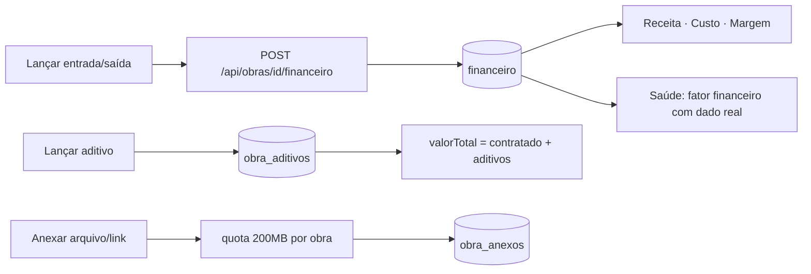

# Jornada — XG10: Ajustes do teste em obra real

> Status: pronto (8 blocos) | Prioridade: alta | Wave: xgestão-10
> Última atualização: 2026-09-13

## 1. Contexto & Objetivo

Guilherme e Dedé testaram o xgestão numa obra real em 2026-09-12 e levantaram ~20 ajustes
([transcrição](../novo-fluxo/reuniao-xconstrucao-testes-xgestao.json), 30 min), complementados
pelas anotações tomadas durante a chamada — a conexão caiu no meio, então a transcrição não
cobre tudo.

**O achado central: cinco dos itens não são ajuste de UI, são funcionalidade que nunca existiu.**
O relato *"não tenho onde lançar nem pagamento para o empreendedor, nem recebimento de cliente"*
(00:27) não descreve um botão mal posicionado — descreve a ausência do fluxo financeiro inteiro.

| Relato | Causa raiz |
|---|---|
| "não tenho onde lançar finanças" | Não existe UI de lançamento. `POST /api/financeiro` existe **sem validação de ownership** |
| "receita total não está puxando" | Soma depende de `recebedorUserId`/`pagadorUserId`, que nenhuma tela preenche |
| "aditivo, não vi local para colocar" | **Não existe tabela de aditivos.** `const aditivos = 0` em 4 serviços, UI pronta |
| "não consigo abrir a PDF" | Botão é `window.open('#')` — stub. E `DocumentosSection` não persiste (estado local) |
| "obra saudável não ficou coerente" | Sem lançamento, `valorPago=0` → **qualquer progresso vira risco** |
| "expira depois de cinco minutos" | Access token de 15 min **sem refresh periódico** |
| "tarefa em execução dá alerta" | `tarefasPendentes` conta tudo `!== concluido`, incluindo `em_andamento` |
| "cronograma não é cronograma, é etapa" | Correto: a aba já renderiza `EtapasJ06Card` |

**Objetivo:** o Guilherme roda a obra dele ponta a ponta — dinheiro que entra e sai, lucro real,
cronograma com datas, projeto anexado em DWG/vídeo/link — sem a sessão cair.

**Decisões:** jornada única, executada e aprovada bloco a bloco; storage 200 MB/obra + teto por
tipo, liberando vídeo e DWG.

## 2. Personas

- **Empreiteiro (xgestão)** — o cliente pagante. Lança finanças, gerencia etapas, anexa projetos.
- **Cliente final** — lê o link público. **Não é usuário.** Não afetado por esta jornada.
- **Marketplace** — **não afetado.** O console da obra é compartilhado; toda mudança é
  condicionada à propriedade da obra (princípio de [XG09](09-administracao-obra-ponta-a-ponta.md)).

## 3. Fluxo ponta-a-ponta

## 4. Blocos de execução

Ordem escolhida por dependência, cada bloco é entrega verificável e aprovada antes do próximo.

| # | Bloco | Status |
|---|---|---|
| 1 | Sessão que cai | ✅ |
| 2 | Financeiro — entrada/saída | ✅ |
| 3 | Aditivos | ✅ |
| 4 | Etapas × Cronograma (Gantt) | ✅ |
| 5 | Saúde + KPIs | ✅ |
| 6 | Documentos | ✅ |
| 7 | Storage — quota e barra | ✅ |
| 8 | Excluir obra + UX pontual | ✅ |

## 5. Checklist de implementação

### Bloco 1 — Sessão ✅
- [x] Timer de refresh a cada 10 min no `AuthInit` + renovação no `visibilitychange`
- [x] Refresh no 401 em `apiRequest` e `getQueryFn` (`shared/lib/queryClient.ts`)
- [x] Serializar refreshes concorrentes (`_refreshPromise` no auth-store)
- [x] **`/xgestao` faltava em `PROTECTED_ROUTE_PREFIXES`** — o `checkAuth` nem rodava lá

> Verificado: `npm run check` limpo; 38 specs de auth passando (inclui o ciclo de refresh).

### Bloco 2 — Financeiro ✅
- [x] `GET/POST /api/obras/[id]/financeiro` + `PATCH/DELETE .../[lancamentoId]`, com ownership
- [x] **Corrigido `POST /api/financeiro`** — aceitava lançamento em obra alheia (**segurança**)
- [x] `LancamentoFinanceiroModal`: entrada (descrição + valor) / saída (categoria + descrição + valor)
- [x] Categorias: mão de obra · material · outras despesas (`features/financeiro/lancamentos.ts`)
- [x] Aba "Financeiro" substitui "Lucro": lista + filtro por tipo/categoria, editar e excluir na aba
- [x] Card "Lucro estimado" oculto na obra (prop `mostrarLucroEstimado`); Receita, Custo e Margem ficam
- [x] Lançamento automático (medição/webhook) é protegido de edição → 409
- [x] Anexo de nota fiscal — entregue na [XG12](12-console-obra-tela-unica.md) Bloco 7
      (`FileUploader` no `LancamentoFinanceiroModal` + link do comprovante na lista,
      com validação de posse em `features/financeiro/api/validar-comprovante.ts`)

> Verificado: `npm run check` limpo; 3 specs novas passando (soma real de receita/custo no
> detalhe + IDOR nas duas rotas); 59 specs de regressão passando. A única falha da suíte é
> ambiental e pré-existente (teste de browser sem Chromium instalado neste ambiente).

### Bloco 3 — Aditivos ✅
- [x] Tabela `obra_aditivos` + bootstrap idempotente + migration `0002_obra_aditivos.sql`
- [x] `GET/POST /api/obras/[id]/aditivos` + `PATCH/DELETE .../[aditivoId]`
- [x] SUM real no detalhe da obra (`build-detalhe-server.ts`) e no admin financeiro
- [x] UI: `AditivosCard` na aba Financeiro (o resumo é "somente leitura" por design)
- [x] Spec de integração — soma no `valorTotal`, supressão (valor negativo), validação e IDOR

> `features/admin/obras/api/admin-obra-detalhe-service.ts:154` segue com `aditivos: 0` — é um
> mapper puro sobre `/api/obras/[id]`, que não expõe o campo. Tela de admin do marketplace,
> fora do caminho do xgestão; anotado como gap em vez de forçar a leitura ali.

> Verificado: `npm run check` limpo; 5 specs de financeiro+aditivos passando; 65 specs de
> regressão passando. O bootstrap criou a tabela sozinho no boot, sem `db:push` manual.

### Bloco 4 — Etapas × Cronograma ✅
- [x] Renomear aba "Cronograma" → "Etapas" (o componente já era `EtapasJ06Card`)
- [x] Remover input de % da etapa em obra própria (prop `progressoDerivado`)
- [x] `obraEtapas.dataInicio` + bootstrap (ALTER idempotente) + migration `0003`
- [x] API de etapas aceita `dataInicio`; PATCH de `progresso` em obra xgestão → **409** (derivado)
- [x] Nova aba "Cronograma" com Gantt em SVG inline (`CronogramaGanttCard`), com scroll horizontal
- [x] Spec de integração — datas persistidas, 409 do progresso derivado, avanço via medição

> Verificado: `npm run check` limpo; 3 specs novas passando; 55 specs de regressão passando
> (inclui medições do marketplace, o fluxo de maior risco nesta mudança).
>
> **Decisão:** o 409 vale só na obra do xgestão (`clienteId IS NULL`). No marketplace o
> empreiteiro segue atualizando progresso/status da etapa como antes — mudar aquilo seria
> alterar contrato de outra jornada sem pedido.

### Bloco 5 — Saúde + KPIs ✅
- [x] Fator financeiro neutro (100) quando não há contrato/pagamento/lançamento
- [x] "Progresso Real" → "Progresso"
- [x] "Dias em Atraso" → "Prazo da obra" (✓ verde "No prazo"; dias só quando atrasa)
- [x] "Tarefas Pendentes" → "Em andamento"
- [x] Separar `tarefasEmAndamento` de `tarefasPendentes` no servidor
      ⚠️ **Correção parcial — fechada só na [XG15](15-coerencia-saude-e-progresso.md).**
      A separação chegou ao KPI, mas o **score de saúde continuou lendo
      `tarefasPendentes`**: obra no prazo com uma tarefa em andamento seguia caindo em
      "Risco" — o mesmo relato de 11:42/28:00 que este bloco pretendia fechar. O sintoma
      visível sumiu e o defeito continuou no cálculo.
- [x] Remover textos hardcoded (`~7% do cronograma`, `1 crítico, 2 médios`)
- [x] Card de equipe: badge "Hoje" → "Cadastrados" (medía cadastro, não presença)
- [x] 7 testes unitários do cálculo (`compute-from-obra.test.ts`) + 3 de integração

> Verificado: `npm run check` limpo; 7 unitários + 6 specs de etapas/saúde passando;
> 42 specs de regressão passando (inclui saúde no admin e no marketplace).
>
> **A conta que explicava o "por que risco?":** sem contrato lançado, `valorPago` ficava 0 e
> qualquer progresso virava gap — 34% de avanço já derrubava o fator financeiro abaixo de 60
> e escalava o status. Agora o fator é neutro (100) enquanto não há contrato, pagamento **ou
> lançamento**; com dinheiro lançado ele volta a medir.

### Bloco 6 — Documentos ✅
- [x] `obra_anexo` aceita role `empreiteiro` (o dono não podia anexar na própria obra)
- [x] Guards das rotas de anexo trocados por `findObraAccess`/`canWriteObraContent`
- [x] `linkUrl` + `titulo` no schema (+ bootstrap e migration `0004`); `fileId` vira nullable
- [x] API aceita arquivo **ou** link (exatamente um), com validação de `http(s)`
- [x] Detalhe expõe `mime` e `isLink` para o preview
- [x] UI persiste de verdade: `EnviarDocumentoModal` usa o `FileUploader` real (presign → R2 →
      commit) e a exclusão chama a API; a lista vem do servidor
- [x] `DocumentoPreviewModal` — PDF em `<iframe>`, imagem em ``, download e "abrir em nova aba"
- [x] Aba "Link" no modal de envio + badge "Link" na lista
- [x] Spec de integração (4 testes)

> Verificado: `npm run check` limpo; 4 specs novas passando; 39 de regressão passando
> (inclui anexos do marketplace).
>
> **Removido:** `EditarDocumentoModal` e a ação "Renovar" — mexiam em `status` e `venceEmDias`,
> campos que `obra_anexos` **não tem**. Era UI prometendo controle de validade inexistente; o
> que persiste é enviar, abrir e excluir. Gestão de vencimento seria feature nova.

### Bloco 7 — Storage ✅
- [x] Novos MIMEs em `obra_anexo`: DWG/DXF, planilha, documento, vídeo
- [x] Tetos por família (`MIME_MAX_BYTES`): imagem 10 · PDF/CAD/planilha/doc 20 · vídeo 50 MB
- [x] Teto global do Zod: 20 → 50 MB no presign e no commit
- [x] Quota de 200 MB/obra (`QUOTA_OBRA_BYTES`) no presign **e** no commit → 413
- [x] `GET /api/obras/[id]/storage`
- [x] `StorageBar` na aba Documentos (verde <70% · âmbar 70–90% · vermelho >90%)
- [x] 10 testes unitários (`validation.test.ts`) + 3 de integração

> Verificado: `npm run check` limpo; 10 unitários + 7 specs de documentos/storage passando;
> 60 de regressão passando (pipeline de upload da plataforma inteira).
>
> **Decisões:** a quota conta anexos **e** fotos (mesmo bucket); é checada no presign (poupa
> banda do usuário) **e** no commit (o espaço pode ter sido ocupado no intervalo), com o
> objeto apagado do R2 quando o commit recusa. DWG/DXF aceitam MIME amplo, inclusive
> `application/octet-stream`, porque o formato não tem MIME padronizado — o teto de tamanho é
> o que segura o abuso. `obra_foto` **não** herdou vídeo: galeria de fotos não foi pedida.

### Bloco 8 — Excluir obra + UX ✅
- [x] DELETE liberado para obra própria; 403 preservado no marketplace
- [x] Limpeza de FKs sem cascade no DELETE (`financeiro`, `candidaturas`, `pagamentos_split`)
- [x] `ExcluirObraDialog` — confirmação digitando o nome da obra
- [x] Salvar → volta ao detalhe da obra (`router.push` no `onSuccess`)
- [x] Marcar/desmarcar tarefa direto na lista (o checkbox era `readOnly`, decorativo)
- [x] Aba "Disputas" oculta na obra do xgestão; código e rotas preservados para o marketplace
- [x] Equipe editável em obra própria (backend já aceitava; a UI é que travava)
- [x] Fotos do diário e da galeria passam a contar na quota da obra
- [x] Spec de integração (3 testes, com regressão do marketplace)

> Verificado: `npm run check` limpo; **332 specs da suíte completa passando, zero falhas**.

> ⚠️ **Achado grave durante a execução — o cascade era promessa não cumprida.** O primeiro
> teste do DELETE passou no status mas falhou no banco: a etapa continuava lá. A auditoria das
> constraints reais mostrou que **11 tabelas não têm FK alguma** para `obras`
> (`obra_etapas`, `obra_tarefas`, `obra_fotos`, `obra_diario`, `obra_anexos`, `obra_equipe`,
> `obra_ocorrencias`, `obra_checklists`, `medicoes`, `obras_salvas`, `atividades`), embora o
> schema Drizzle declare `onDelete: cascade`. As tabelas nascem de bootstrap em runtime e a
> constraint nunca chegou ao Postgres. Outras três (`financeiro`, `candidaturas`,
> `pagamentos_split`) têm FK com `NO ACTION`, que faria o DELETE falhar.
> **Correção:** a exclusão apaga os filhos explicitamente, em transação, sem depender de
> cascade — vale em qualquer ambiente, tenha ele recebido as constraints ou não.

> **Diário de obra:** avaliado, **nenhuma mudança feita**. O `DiarioJ06Card` já persiste via
> `POST /api/obras/[id]/diario` e tem botão "Publicar" explícito. Registro de diário é datado e
> assinado — salvar sozinho a cada tecla criaria entradas pela metade. O que faltava ali era o
> retorno visual, não a persistência.

## 6. Schema (Drizzle)

- `obra_aditivos` — **nova**
- `obra_anexos.link_url` — nova coluna (text nullable)
- `obra_etapas.data_inicio` — nova coluna (timestamp nullable)
- `financeiro` — **sem alteração**: `tipo` e `categoria` são text livre

Aplicação: `npm run db:push` + bootstrap idempotente. O journal do drizzle está vazio — a fonte
de verdade é `shared/db/schema.ts` + `server/bootstrap-*.ts`, não migrations versionadas.

## 7. Critérios de aceite

1. Sessão aberta por **>20 min** continua válida, sem relogar.
2. Entrada de R$ 250 lançada → Receita total mostra 250.
3. Saída de mão de obra "Jefferson Hidráulica" → Custo total e filtro por categoria funcionam.
4. Aditivo lançado → `valorTotal = contratado + aditivo`.
5. Obra recém-criada **não** aparece em risco.
6. Tarefa `em_andamento` não conta como pendente nem gera alerta de atraso.
7. Etapa sem campo de %; Cronograma com Gantt legível no celular.
8. PDF anexado abre em preview; link do Drive clicável.
9. Vídeo de 30 MB sobe; arquivo que estoura 200 MB → 413 com aviso na barra.
10. Excluir obra própria funciona; **obra de marketplace segue 403** (regressão).
11. Aba Disputas ausente no xgestão, **presente no marketplace**.

## 8. Riscos / Pontos de atenção

- **O console da obra é um arquivo compartilhado** entre xgestão e marketplace, diferenciado por
  props. Toda mudança em `TABS`/KPIs precisa de regressão do marketplace.
- **Componentes órfãos:** `CronogramaSection` (409 linhas), `FotoGallerySection` (648) e
  `RelatoriosSection` (235) não são importados por ninguém. O cronograma ativo é `EtapasJ06Card`.
- **Rotação de `sessionToken`** no refresh: duas abas refrescando juntas derrubam a segunda.
- **Sem `relations()` no schema** — a API relacional do Drizzle não está disponível; joins explícitos.
- **Datas como `text`** em várias tabelas, sem validação de formato no banco.

## 9. Links cruzados

- Depende de: [XG02](02-obra-do-empreiteiro.md), [XG08](08-visao-obra-read-only.md), [XG09](09-administracao-obra-ponta-a-ponta.md)
- Relacionada: J06 (medições/diário), J10 (disputas — ocultadas aqui), J30 (timeout de sessão)

## 10. Gaps descobertos durante execução

> Doc viva. Uma linha por item, com data.

- **2026-09-13 — o card que existe e o dado que nunca chegou:** "Aditivos" está renderizado no
  resumo financeiro desde sempre, lendo um `0` hardcoded em 4 serviços. O usuário procurou onde
  lançar porque a UI prometia o recurso. Card sem fonte de dado é dívida que o usuário cobra.
- **2026-09-13 — % da etapa era segunda fonte de verdade:** a medição já recalcula
  `obra_etapas.progresso` pela média das tarefas. O input editável brigava com esse cálculo — o
  mesmo padrão que a XG09 corrigiu no progresso da obra (D6). O pedido de "tirar a porcentagem"
  descreve, sem saber, um bug real.
- **2026-09-13 — o cascade declarado que o banco nunca teve:** `onDelete: cascade` aparece em
  ~11 tabelas do schema Drizzle, mas nenhuma delas tem FK registrada no Postgres — nascem de
  `server/bootstrap-*.ts` em runtime, e o `CREATE TABLE IF NOT EXISTS` não recria constraint em
  tabela existente. Só apareceu porque um assert foi ao banco depois do DELETE; o status HTTP
  era 200. **Ler o schema não basta para saber o que o banco garante.** Uma auditoria das FKs
  de todas as tabelas (não só `obra_id`) vale como tarefa própria.
- **2026-09-13 — o checkbox decorativo:** a caixa de concluir tarefa era `readOnly`, sem
  `onChange`, enquanto `handleConcluir`/`handleReabrir` já existiam e funcionavam pelo menu.
  Controle que parece interativo e não é custa mais confiança do que controle ausente.
- **2026-09-13 — dois "em breve" que o backend já suportava:** a equipe estava travada com
  aviso de "Gestão de equipe em breve" e o `obra_anexo` recusava o empreiteiro — mas
  `obra_equipe.user_id` é nullable desde sempre e a rota aceitava nome+telefone. O bloqueio era
  de UI, não de capacidade.
