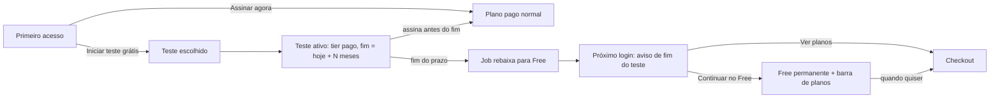

# Jornada — XG35: teste grátis de 3 meses e o que acontece quando ele acaba

> Status: implementada (falta verificação visual; testes na rodada final) | Prioridade: alta | Wave: xgestão-35
> Última atualização: 2026-10-04

## 1. Contexto & Objetivo

A [XG03 §8](03-planos-limites-trial.md) deixou o teste bloqueado por uma contradição entre o PDF
(acesso irrestrito por 3 meses) e a reunião 002 (acesso ao plano dele). **O Ramon resolveu em
2026-10-04:**

> Durante o teste o assinante usa as funcionalidades pagas. Passados os 3 meses sem assinar, ele
> **perde as funcionalidades automaticamente** e fica no **Free de forma permanente**. Aparece um
> aviso (modal ou barra) explicando; ele pode dizer "quero continuar no Free" e segue usando. Fica
> uma barra do plano Free com chamada para ver os planos e ativar o pago. Ele só troca de plano
> quando quiser.

Isso é a mecânica **(b)** da XG03: acesso elevado por N meses, rebaixamento automático ao fim.

**Complemento (Ramon, 2026-10-04): o teste é opcional, oferecido no primeiro acesso.** Quem
quiser assina direto e entra com o plano já ativo; quem preferir inicia o teste grátis. O teste
não começa sozinho no cadastro.

## 2. Personas

- **Assinante novo**: entra em teste ao criar a conta xgestão.
- **Assinante com teste vencido**: vê o aviso, escolhe Free ou planos.
- **Membro da empresa**: herda o plano do dono; não vê ações de cobrança ([XG31](31-multiusuario-empresa.md)).
- **Admin**: vê quem está em teste e quando acaba ([XG36](36-admin-xgestao-fechamento.md)).

## 3. Fluxo ponta-a-ponta

## 4. Telas envolvidas

- Layout do xgestão ([app/xgestao/layout.tsx](../../app/xgestao/layout.tsx)) — barra do teste (dias restantes) e barra do Free
- Aviso de fim do teste (modal, usando os componentes de diálogo que já existem)
- [app/xgestao/configuracoes](../../app/xgestao/configuracoes) aba Plano — mostra teste, data de fim e planos

## 5. Componentes-chave

- [features/planos/grace-period-downgrade-job.ts](../../features/planos/grace-period-downgrade-job.ts) — molde do job de rebaixamento
- [features/planos/assinatura-service.ts](../../features/planos/assinatura-service.ts) — resolução do tier xgestão (`:22-44`)
- [features/obras/api/create-obra.ts](../../features/obras/api/create-obra.ts) — onde o limite é aplicado (402)
- [features/admin/platform-settings/server/settings-reader.ts](../../features/admin/platform-settings/server/settings-reader.ts) — duração do teste como configuração

## 6. Schema (Drizzle)

- Registrar início e fim do teste por empresa (colunas na assinatura xgestão ou tabela própria;
  decidir na implementação seguindo o padrão do repo: bootstrap idempotente + migration documental).
- Registrar que o aviso de fim foi visto/respondido (para não reaparecer a cada login).
- Duração do teste em configuração da plataforma, **não** constante de código (XG03 §8).

## 7. Endpoints

- `GET /api/perfil/plano?persona=xgestao` — passa a devolver `emTeste`, `fimTeste`, `avisoFimPendente`
- `POST /api/xgestao/plano/continuar-free` — registra a escolha do aviso
- Job diário (mesmo mecanismo do `mark-overdue`/grace period) — rebaixa testes vencidos

## 8. Mocks a remover

Nenhum. O `fimTeste: null` fixo do admin (`dashboard.ts:189,386`) passa a vir do banco.

## 9. Checklist de implementação

- [x] Modelo: **sem schema novo**. O teste é uma linha em `assinaturas` com `gateway_provider='trial'`, `status='ativa'` e `renova_em` = fim; eventos `teste_iniciado`/`teste_expirado`/`teste_aviso_confirmado` em `assinatura_eventos`. Índice único `(user_id, persona) WHERE status='ativa'` impede duplicidade _(2026-10-04, `features/xgestao/teste/server/teste-service.ts`)_
- [x] Primeiro acesso oferece "Iniciar teste grátis" ou "Assinar agora"; teste só começa por escolha (vale também para conta via OAuth); só uma vez por empresa
- [x] Resolução de tier considera teste ativo e ignora teste vencido (`naoEhTesteVencido()` em `getLimitesUsuario` e `GET /api/perfil/plano`)
- [x] Rebaixamento: vencimento preguiçoso na leitura do plano + passe no boot (`instrumentation.ts`) + antes das listas do admin. Não depende de cron
- [x] Obras acima do limite: nada some; só a criação segue o limite do Free (comportamento natural do 402 existente)
- [x] Barra "teste: faltam N dias" no layout do xgestão (`TesteGratisAviso`, só para o responsável)
- [x] Aviso de fim do teste com "Continuar no Free" (grava `teste_aviso_confirmado`) e "Ver planos"
- [x] Barra permanente do Free com chamada para os planos
- [x] Admin: `fimTeste` real no painel (`fimTestePorUsuario`)
- [ ] _(rodada final)_ Testes: teste ativo libera, vencido rebaixa, aviso aparece uma vez, escolha persiste,
      membro não vê ações de cobrança

## 10. Critérios de aceite

1. Conta nova vê a oferta no primeiro acesso; ao escolher o teste, fica com data de fim = escolha + duração configurada. Quem assina direto não entra em teste.
2. Forçando a data de fim para ontem e rodando o job, a conta vira Free e o aviso aparece no login.
3. "Continuar no Free" some com o aviso e deixa a barra do Free.
4. Assinar durante o teste encerra o teste sem rebaixar.

## 11. Riscos / Pontos de atenção

- **Decisão 1: qual plano o teste libera?** Recomendação: o **Pro** (tier `enterprise`, 10 obras),
  que é o "pago completo". Alternativa: deixar o assinante escolher qual plano testar.
  A confirmar com o Ramon antes de implementar esta jornada.
- **Decisão 2: obras acima do limite ao rebaixar.** Recomendação: **nada é apagado nem escondido**;
  as obras continuam abertas para leitura e edição, e só a **criação** de obra nova fica bloqueada
  até ficar abaixo do limite ou assinar. É a regra menos agressiva e a mais simples.
- Enquanto o Freemium estiver ilimitado (fase de teste, ver XG33 AJ-10), o rebaixamento não muda
  o número de obras na prática. Testar com o limite real num ambiente de teste.
- "Funcionalidades" além do número de obras ainda não estão definidas por plano (XG03 §6). Esta
  jornada entrega o mecanismo; o que cada plano libera entra quando o documento do cliente chegar.
- "Barra com anúncios" = chamada para os planos do próprio xgestão. A jornada do anunciante segue
  congelada (reunião 002).

## 12. Links cruzados

- Depende de: [XG03](03-planos-limites-trial.md), [XG33](33-ajustes-pendentes-mvp.md) AJ-01/AJ-02 (checkout fechando o ciclo)
- Relacionada: [XG36](36-admin-xgestao-fechamento.md), [XG38](38-termos-privacidade-no-ar.md) (termos citam o teste)

## 13. Gaps descobertos durante execução

- 2026-10-04: jornada criada; destrava a XG03 §8 com a decisão do Ramon.
- 2026-10-04: implementação. Endpoints `POST /api/xgestao/teste` (409 se já usou ou já assina) e `POST /api/xgestao/teste/continuar-free`, ambos só para o responsável (membro recebe 403). Duração e tier em `platform_settings.xgestao` (`testeDias` 90, `testeTier` enterprise), sem tela de edição ainda.
- 2026-10-04: checkout durante o teste: `JA_ASSINANTE` não bloqueia assinar o mesmo plano do teste; o webhook de ativação já cancela a linha `ativa` anterior (o teste); `cancelSubscription(null)` no gateway é no-op. Aba Plano: o plano testado continua assinável e o Free fica desabilitado até o fim do teste. Tela de retorno reconhece "saiu do teste" como ativação.
- 2026-10-04: decisão 1 (tier do teste) ainda aberta com o Ramon; implementado com o default recomendado (Pro), trocável na configuração sem deploy.
