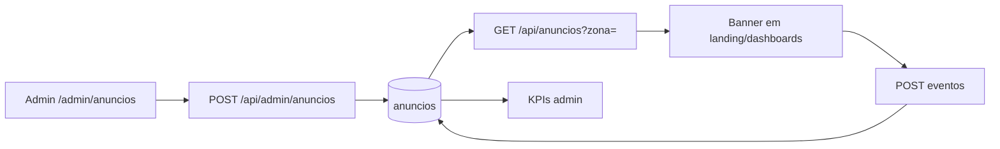

# Jornada — Gestão de Anúncios

> Status: parcial | Prioridade: média | Wave: 2
> Última atualização: 2026-05-05

## 1. Contexto & Objetivo
Permitir que o admin venda/gerencie campanhas internas exibidas na landing pública e nos dashboards das personas, com tracking de impressão/clique e KPIs (CTR, receita, performance por zona). Hoje a UI está pronta mas tudo lê de mocks atrás de uma flag.

## 2. Personas
- **Admin**: CRUD de campanha, anunciante, zona; vê métricas.
- **Contratante / Empreiteiro**: vêem banners segmentados em dashboards/sidebars.
- **Visitante público**: vê banners na landing.

## 3. Fluxo ponta-a-ponta

## 4. Telas envolvidas
- [app/admin/anuncios/](../../app/admin/anuncios/) — listagem + KPIs + CRUD
- [app/page.tsx](../../app/page.tsx) — landing (slot `home-hero`)
- [app/contratante/dashboard/](../../app/contratante/dashboard/) — slot `dash-contratante`
- [app/empreiteiro/dashboard/](../../app/empreiteiro/dashboard/) — slot `dash-empreiteiro`

## 5. Componentes-chave
- [features/admin/anuncios/](../../features/admin/anuncios/) — `api/`, `components/`, `hooks/use-anuncios.ts`, `mocks/`, `schemas/`, `types/`
- [features/shared/anuncios/](../../features/shared/anuncios/) — `components/`, `hooks/`, `types/` (slot reutilizado)

## 6. Schema (Drizzle)
**A criar** em [shared/db/schema.ts](../../shared/db/schema.ts):
- `anunciantes` (id, nome, contato, cnpj, ativo)
- `anuncios` (id, anuncianteId, titulo, subtitulo, criativoUrl, ctaUrl, zona, personaAlvo [`publico`|`contratante`|`empreiteiro`|`todos`], inicio, fim, status [`rascunho`|`agendado`|`ativo`|`pausado`|`encerrado`], orcamento, criadoEm)
- `anuncio_eventos` (id, anuncioId, tipo [`impressao`|`clique`], userId nullable, criadoEm)
- Enums correspondentes.

## 7. Endpoints
- `GET/POST /api/admin/anuncios` — existente em [app/api/admin/anuncios/](../../app/api/admin/anuncios/) (verificar se já bate no banco)
- `GET/PATCH/DELETE /api/admin/anuncios/[id]`
- `GET /api/anuncios?zona=&persona=` — público, com cache curto
- `POST /api/anuncios/[id]/eventos` — tracking
- `GET /api/admin/anuncios/[id]/kpis`

## 8. Mocks a remover
- [features/admin/anuncios/mocks/](../../features/admin/anuncios/mocks/) — `mockAnuncioKpi`, `mockCampanhas`, `mockAnunciantes`
- [features/admin/anuncios/hooks/use-anuncios.ts](../../features/admin/anuncios/hooks/use-anuncios.ts) — flag `NEXT_PUBLIC_ENABLE_EMPREITEIRO_MOCK` no início do arquivo
- [features/shared/anuncios/hooks/](../../features/shared/anuncios/hooks/) — flags análogas

## 9. Checklist de implementação
- [ ] Criar tabelas `anunciantes`, `anuncios`, `anuncio_eventos` + enums + migration
- [ ] CRUD admin batendo no banco real (substituir o que está mockado em [features/admin/anuncios/api/](../../features/admin/anuncios/api/))
- [ ] Endpoint público `GET /api/anuncios` com filtro de zona/persona e revalidação curta
- [ ] Componente `BannerSlot` shared chamando endpoint público
- [ ] Plug do `BannerSlot` em landing, dashboard contratante, dashboard empreiteiro
- [ ] Tracking de impressão (intersection observer) + clique
- [ ] KPIs reais em `/admin/anuncios` (impressões, cliques, CTR, receita)
- [ ] Remover flag `NEXT_PUBLIC_ENABLE_EMPREITEIRO_MOCK` do módulo de anúncios
- [ ] Seeds de exemplo

## 10. Critérios de aceite
1. Login como admin → criar campanha "Cimento ACME" zona `home-hero`, ativa hoje.
2. Abrir landing deslogado → banner aparece.
3. Clicar no banner → `SELECT count(*) FROM anuncio_eventos WHERE tipo='clique' AND anuncio_id='X'` cresce.
4. Pausar campanha → recarregar landing → banner some (ou expira no cache em segundos).
5. Dashboard admin mostra impressões>0, CTR calculado.

## 11. Riscos / Pontos de atenção
- Cache do Next em rota pública pode esconder pausas — usar `revalidate` curto (ex: 30s) ou tag-based revalidation.
- Tracking pode ser bloqueado por adblock — logar via API same-origin reduz mas não elimina.
- LGPD em `userId` do evento — guardar só se logado, e respeitar opt-out.
- Performance: `GET /api/anuncios` é hot path; indexar `(zona, persona, status, inicio, fim)`.

## 12. Links cruzados
- Depende de: J01 (autorização do admin).
- Alimenta: J09 (entrada de anunciante).

## 13. Gaps descobertos durante execução
> Doc viva. Registrar aqui o que apareceu no caminho e não estava no roteiro original. Uma linha por item, com data.

- _Sem registros ainda._
