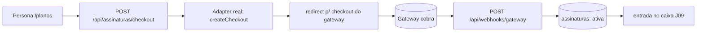

# Jornada — Integração de Gateway de Pagamento

> Status: bloqueada | Prioridade: média | Wave: 3
> Última atualização: 2026-06-01
>
> **BLOQUEADA**: aguarda decisão de negócio sobre QUAL gateway usar
> (Stripe / PayPal / MercadoPago / Asaas / outro). Toda a fundação já existe
> (J11) — esta jornada só pluga o provedor real. Quando o gateway for escolhido,
> desbloquear e implementar o adapter correspondente.

## 1. Contexto & Objetivo
A Jornada 11 (Planos & Assinatura) já está funcional ponta-a-ponta usando um
**adapter de gateway "manual"** que ativa assinaturas direto no banco, sem
cobrança real. Esta jornada substitui o adapter manual por um **gateway de
pagamento real** — cobrança recorrente, checkout hospedado, webhooks
autenticados. Decisão de negócio adiada de propósito: o ecossistema foi
construído com abstração para que a troca seja barata e isolada.

## 2. Personas
- **Contratante / Empreiteiro**: paga de verdade (cartão/PIX/boleto) no checkout do gateway.
- **Admin**: acompanha receita real conciliada com o gateway.
- **Sistema (gateway)**: chama o webhook em eventos de cobrança.

## 3. Fluxo ponta-a-ponta

## 4. Telas envolvidas
- [app/contratante/planos/](../../app/contratante/planos/) e [app/empreiteiro/planos/](../../app/empreiteiro/planos/) — checkout passa a redirecionar para o gateway (hoje ativa direto).
- Sem telas novas — o checkout hospedado é do provedor.

## 5. Componentes-chave (já existem — só plugar)
- **Porta**: [features/planos/gateway/payment-gateway.ts](../../features/planos/gateway/payment-gateway.ts) — interface `PaymentGateway`.
- **Adapter manual (ativo)**: [features/planos/gateway/manual-gateway.ts](../../features/planos/gateway/manual-gateway.ts).
- **Factory**: [features/planos/gateway/index.ts](../../features/planos/gateway/index.ts) — resolve por env `PAYMENT_GATEWAY`.
- **Service de assinatura**: [features/planos/assinatura-service.ts](../../features/planos/assinatura-service.ts) — `iniciarCheckout`, `cancelarAssinatura`, `aplicarEventoWebhook` (idempotente).
- **Webhook**: [app/api/webhooks/gateway/route.ts](../../app/api/webhooks/gateway/route.ts).

## 6. Schema (Drizzle)
Nada novo. As tabelas de J11 já têm os campos agnósticos de gateway:
- `assinaturas.gatewayProvider`, `gatewayCustomerId`, `gatewaySubscriptionId`
- `assinatura_eventos.gatewayEventId` (único — idempotência de webhook)

## 7. Endpoints
Nenhum novo. Os de J11 já cobrem: `POST /api/assinaturas/checkout`,
`POST /api/assinaturas/cancelar`, `POST /api/webhooks/gateway`. O adapter real
muda o COMPORTAMENTO (retorna `redirect` em vez de `activated`), não a rota.

## 8. Mocks a remover
- Nenhum. O adapter manual NÃO é mock de UI — é uma implementação real da porta.
  Pode coexistir (ex: ambiente de dev/demo) mesmo após o gateway real entrar.

## 9. Checklist de implementação (quando desbloquear)
- [ ] **Decidir o gateway** (Stripe / PayPal / MercadoPago / Asaas) — input do usuário
- [ ] Provisionar conta + chaves de API (env: chaves secretas, webhook secret)
- [ ] Criar adapter `features/planos/gateway/<provider>-gateway.ts` implementando `PaymentGateway`
  - [ ] `createCheckout` → cria sessão/assinatura no gateway, retorna `{ kind: "redirect", url }`
  - [ ] `cancelSubscription` → cancela no gateway
  - [ ] `parseWebhook` → **valida a assinatura do payload** (rejeita se inválida) e normaliza para `NormalizedWebhookEvent`
- [ ] Mapear o provider no factory [features/planos/gateway/index.ts](../../features/planos/gateway/index.ts)
- [ ] Setar env `PAYMENT_GATEWAY=<provider>` + segredos
- [ ] Mapear preços/planos do catálogo para os price IDs do gateway
- [ ] Testar webhook real (evento duplicado não pode duplicar lançamento — já garantido por `uq_assinatura_eventos_gateway`)
- [ ] Conciliação: job que compara `assinaturas` com o estado do gateway
- [ ] Proration na troca de plano no meio do ciclo

## 10. Critérios de aceite
1. `PAYMENT_GATEWAY=<provider>` → checkout redireciona para o provedor.
2. Pagamento aprovado → webhook → `assinaturas.status='ativa'` + `users.plano` atualizado.
3. Reenvio do mesmo evento de webhook → `SELECT COUNT(*) FROM assinatura_eventos WHERE gateway_event_id='X'` continua 1.
4. Receita real aparece em J09 (`financeiro` escopo plataforma, categoria `assinatura`).
5. Cancelar no gateway → webhook `subscription_canceled` → rebaixa para free.

## 11. Riscos / Pontos de atenção
- **Verificação de assinatura do webhook é obrigatória** — sem ela, qualquer um ativa assinaturas. O adapter manual NÃO valida (aceita payload simulado); o real DEVE.
- Idempotência já coberta pelo schema; o adapter só precisa fornecer um `eventId` estável.
- Segredos do gateway nunca no client — só server/env.
- Moeda/locale: garantir BRL e impostos conforme o provedor.

## 12. Links cruzados
- Depende de: J11 (toda a fundação) + decisão de negócio do gateway.
- Desbloqueia: cobrança real (monetização efetiva da plataforma).

## 13. Gaps descobertos durante execução
> Doc viva. Registrar aqui o que apareceu no caminho e não estava no roteiro original. Uma linha por item, com data.

- 2026-06-01: Jornada criada como continuação natural de J11. Fundação (porta + adapter manual + idempotência) entregue em J11; esta jornada fica BLOQUEADA aguardando o usuário definir o gateway. Trocar = 1 adapter novo + env var, sem tocar service/rotas/schema.
- 2026-07-18: `POST /api/webhooks/gateway` aceitava qualquer chamada sem verificar origem — qualquer agente podia disparar eventos de pagamento falsos. _Resolvido_: `AsaasGateway.parseWebhook` agora verifica o IP do chamador contra a env var `ASAAS_WEBHOOK_IPS` (lista separada por vírgula). Se não configurada, emite aviso mas não bloqueia (compatibilidade sandbox). Usa `TRUST_PROXY_HEADERS=1` para ler `X-Forwarded-For` atrás de proxy.
