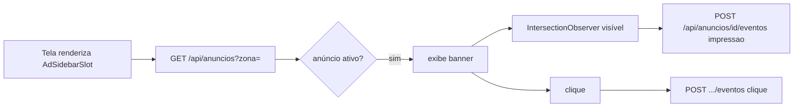

# Jornada — Exibição de Anúncios (BannerSlot nas telas)

> Status: pronto | Prioridade: média | Wave: 2
> Última atualização: 2026-06-01
>
> Fecha o lado VISÍVEL da J12. Backend, endpoint público e o componente
> `AdSidebarSlot` já existem — falta posicionar o slot nas telas e disparar o
> tracking de impressão.

## 1. Contexto & Objetivo
A J12 entregou CRUD de campanhas, endpoint público por zona e tracking. O
`AdSidebarSlot` já era renderizado nas zonas de chat (sidebar) via
`useActiveAdForZone`, mas não na landing nem nos dashboards, e não disparava
tracking de impressão/clique. Esta jornada pluga o slot na landing e nos
dashboards, consome o endpoint público leve por zona, renderiza o criativo real
e contabiliza impressão (viewport) e clique.

## 2. Personas
- **Visitante público**: vê banner na landing.
- **Contratante / Empreiteiro**: vê banner segmentado no dashboard/sidebar.

## 3. Fluxo ponta-a-ponta

## 4. Telas envolvidas
- [app/page.tsx](../../app/page.tsx) — landing pública (zona `banner-qa` ou similar).
- [app/contratante/dashboard/](../../app/contratante/dashboard/) — `banner-dashboard-contratante` / `sidebar-*-contratante`.
- [app/empreiteiro/dashboard/](../../app/empreiteiro/dashboard/) — `banner-dashboard-empreiteiro` / `sidebar-*-empreiteiro`.

## 5. Componentes-chave
- [features/shared/anuncios/components/AdSidebarSlot.tsx](../../features/shared/anuncios/components/AdSidebarSlot.tsx) — já existe; hoje busca por zona via `useActiveAdForZone`/`useZonasAnuncio`.
- A criar: `useAnuncioAtivo(zona)` consumindo `GET /api/anuncios?zona=` diretamente (mais leve que listar todas as zonas), + hook de tracking.

## 6. Schema (Drizzle)
Nada novo. Usa `anuncios`, `anuncio_eventos` (J12).

## 7. Endpoints (já existem — J12)
- `GET /api/anuncios?zona=` — anúncio ativo da zona (cache 30s).
- `POST /api/anuncios/[id]/eventos` — tracking impressão/clique.

## 8. Mocks a remover
- Nenhum — J12 já removeu os mocks. Esta jornada só adiciona uso real.

## 9. Checklist de implementação
- [x] Hook `useAnuncioAtivo(zona)` consumindo `GET /api/anuncios?zona=` ([features/shared/anuncios/hooks/use-anuncio-ativo.ts](../../features/shared/anuncios/hooks/use-anuncio-ativo.ts))
- [x] Posicionar `AdSidebarSlot` na landing (`banner-qa`) + dashboards (`banner-dashboard-contratante`/`-empreiteiro`)
- [x] IntersectionObserver dispara `POST .../eventos { tipo: "impressao" }` uma vez por exibição (flag `impresso` + `disconnect`)
- [x] Clique no banner → `POST .../eventos { tipo: "clique" }` + abre `ctaUrl` (nova aba, `noopener`)
- [x] Renderizar criativo real (imagem `criativoUrl`) com fallback de texto
- [x] Slot some graciosamente quando não há anúncio ativo (`return null`)

## 10. Critérios de aceite
1. Admin cria campanha ativa na zona `banner-dashboard-contratante`.
2. Contratante abre dashboard → vê o banner.
3. Banner entra na viewport → `anuncio_eventos` ganha 1 impressão.
4. Clica → 1 clique registrado + abre destino.
5. Admin pausa → em ≤30s o banner some.

## 11. Riscos / Pontos de atenção
- Impressão deve disparar UMA vez por exibição (debounce no IntersectionObserver), não a cada scroll.
- Cache de 30s do endpoint público: pausa reflete em até 30s (aceito).
- Adblock pode bloquear o POST — same-origin reduz.

## 12. Links cruzados
- Depende de: J12 (backend + componente).
- Alimenta: J09 (impressões/cliques aparecem nos KPIs de anúncios).

## 13. Gaps descobertos durante execução
- 2026-06-01: **Implementada.** `AdSidebarSlot` reescrito ([features/shared/anuncios/components/AdSidebarSlot.tsx](../../features/shared/anuncios/components/AdSidebarSlot.tsx)) para consumir o endpoint público leve por zona (`useAnuncioAtivo`) em vez de listar todas as zonas (`useActiveAdForZone`, agora órfão — mantido pois `useZonasAnuncio` ainda serve a UI admin).
- 2026-06-01: Slot da landing (`banner-qa`) inserido num container estreito antes da CTA final; como `return null` quando sem campanha, **fica invisível até o admin ativar** — não altera a landing atual.
- 2026-06-01: Tracking é best-effort (`try/catch` + `keepalive`) — adblock/offline não quebram a página. Impressão dispara uma vez por montagem (threshold 0.5).
