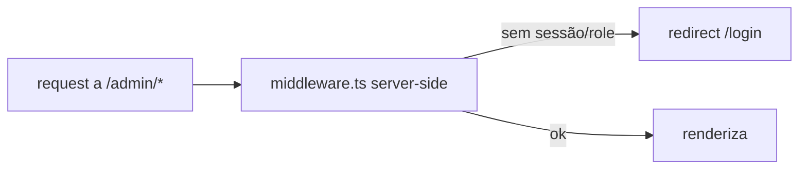

# Jornada — Hardening de Segurança (pré-produção)

> Status: pronto | Prioridade: alta | Wave: 3
> Última atualização: 2026-06-01
>
> Tarefas de blindagem antes de produção, descobertas durante o mapeamento da
> Wave 3. Não é feature de produto — é fechar furos.

## 1. Contexto & Objetivo
A proteção de rotas internas hoje é **client-side** (layouts em `app/*/layout.tsx`
checam o role e redirecionam). Funciona para UX, mas não é uma barreira de
servidor — o conteúdo das páginas é montado no client. Além disso, o código ainda
carrega a flag `NEXT_PUBLIC_ENABLE_EMPREITEIRO_MOCK` e mocks de fallback que nunca
devem ativar em produção. Esta jornada blinda ambos.

## 2. Personas
- Transversal (todas). Foco em segurança/infra.

## 3. Fluxo ponta-a-ponta

## 4. Telas envolvidas
- Nenhuma nova. Afeta todos os `app/{contratante,empreiteiro,admin}/**`.

## 5. Componentes-chave
- A criar: `middleware.ts` (raiz) — guard server-side por cookie/JWT + role.
- [app/contratante/layout.tsx](../../app/contratante/layout.tsx), [app/empreiteiro/layout.tsx](../../app/empreiteiro/layout.tsx), [app/admin/layout.tsx](../../app/admin/layout.tsx) — mantêm o guard client como UX, mas a barreira real passa a ser o middleware.
- Flags de mock espalhadas (ver J09/levantamento): `features/*/constants.ts` com `ENABLE_MOCK`.

## 6. Schema (Drizzle)
Nada.

## 7. Endpoints
Nenhum novo. As rotas `/api/**` já validam server-side via `requireVerifiedUser`
— o gap é só nas PÁGINAS (não-API), que o middleware cobre.

## 8. Mocks a remover
- Flag `NEXT_PUBLIC_ENABLE_EMPREITEIRO_MOCK` e os fallbacks `if (ENABLE_MOCK)` remanescentes (FAQ, chat, clientes, empreiteiras, auditoria) — depois que as jornadas de dados (J17/J18) tornarem tudo real.

## 9. Checklist de implementação
- [x] Barreira server-side: validar **assinatura do JWT** + role vs. prefixo de rota, redirecionar para `/login?next=` se inválido — feito em [proxy.ts](../../proxy.ts) (Next 16 renomeou `middleware.ts` → `proxy.ts`, que já roda em nodejs)
- [x] Matcher cobrindo `/contratante/:path*`, `/empreiteiro/:path*`, `/admin/:path*` (+ `/api/:path*` p/ os guards globais existentes)
- [x] Manter guard client como UX (evita flash) — preservado nos layouts
- [x] Neutralizar a flag de mock em produção _(superado pela remoção física — ver item abaixo)_
- [x] Remover os ~28 branches `if (ENABLE_MOCK)` _(2026-06 — remoção física concluída; `ENABLE_MOCK`/`isMockEnabled` não existem mais no código, `mock-flag.ts` e os diretórios `mocks/` foram deletados. Verificado: 0 ocorrências em `--include=*.ts,*.tsx`)_
- [ ] Confirmar adapter de gateway `manual` bloqueado em prod (validar quando J14 desbloquear)
- [x] Revisar `getClientIp` (confia em `x-forwarded-for`) _(código concluído com safeguard `TRUST_PROXY_HEADERS` em [rate-limit.ts](../../features/auth/api/rate-limit.ts): sem a flag, ignora `x-forwarded-for` forjável e usa só `x-real-ip`. **Resta apenas a ação de deploy** `TRUST_PROXY_HEADERS=1` em produção atrás de proxy confiável — registrada no [backlog](_backlog-paralelo.md) como checklist de infra, não código)_

## 10. Critérios de aceite
1. Deslogado faz GET direto a `/admin/financeiro` → 307 para `/login` no servidor (não renderiza nada).
2. Contratante logado tenta `/admin/*` → bloqueado no servidor.
3. `NEXT_PUBLIC_ENABLE_EMPREITEIRO_MOCK` não tem efeito em produção.

## 11. Riscos / Pontos de atenção
- Middleware roda no edge — cuidado com libs Node-only (verificar `verifyAccessToken`).
- Não quebrar rotas públicas (`/`, `/login`, `/cadastro`, `/api/webhooks/*`, landing).

## 12. Links cruzados
- Depende de: J01 (auth).
- Pré-requisito recomendado para: produção / testes com usuários reais.

## 13. Gaps descobertos durante execução
- 2026-06-01: **Descoberta importante:** o Next 16 renomeou `middleware.ts` para **`proxy.ts`**, que **já roda no runtime nodejs** (não é mais edge). O projeto já tinha um `proxy.ts` cobrindo guards globais de `/api/*` (must-change-password e impersonation read-only). Em vez de criar `middleware.ts` (proibido coexistir), **estendi o `proxy.ts`** existente: somei a validação de assinatura do JWT + role para as páginas, preservando os guards de `/api/*`. Como já é nodejs, a decisão "runtime nodejs vs jose" virou não-questão — `verifyAccessToken` (crypto) roda nativo.
- 2026-06-01: `export const runtime` **não é permitido** no `proxy.ts` (sempre nodejs) — removido.
- 2026-06-01: `isAdminLike` foi **inlineado** no proxy para não puxar `auth-utils` (DB/audit) para o bundle do proxy.
- 2026-06-01: A lista de rotas protegidas da versão antiga citava `/administrador` (rota inexistente) — corrigido para `/admin`.
- 2026-06-01: Flag de mock **forçada off em produção** (não removidos os branches). Acceptance #3 atendida sem risco de regressão na limpeza dos 28 pontos.
- 2026-06-01: **Tolerância a token expirado (pós-review):** o access token vive só 15 min e o refresh é client-side. Bloquear no proxy todo token expirado causaria logout em navegação normal. Ajuste: token **ausente** → redireciona; token **válido** → checa role (fonte de verdade); token **expirado mas com assinatura íntegra** → deixa passar (client faz refresh, APIs revalidam) mas ainda checa a role decodificada para não renderizar área de outra persona; assinatura **adulterada** → bloqueia. Novo helper `verifyAccessTokenAllowExpired` em [features/auth/api/auth-service.ts](../../features/auth/api/auth-service.ts) (valida HMAC + tipo, tolera `exp`). NÃO usar para autorizar mutações.
- 2026-06-01: `ctaUrl` de anúncio agora só abre com scheme `http(s)` no `AdSidebarSlot` (defesa em profundidade contra `javascript:`/`data:`).
- 2026-06: **Limpeza de mock concluída** — a remoção física dos ~28 branches `if (ENABLE_MOCK)` foi finalizada (não ficou só na neutralização da flag). `ENABLE_MOCK`/`isMockEnabled`, o helper `mock-flag.ts` e os diretórios `mocks/` não existem mais no código. Verificação: 0 ocorrências em busca por `--include=*.ts,*.tsx`.
- 2026-06: **`getClientIp` validado** — código já trazia o safeguard `TRUST_PROXY_HEADERS` (sem a flag, `x-forwarded-for` forjável é ignorado). O único pendente é **operacional/deploy**: setar `TRUST_PROXY_HEADERS=1` em produção atrás de proxy confiável (Replit/Vercel/Cloudflare). Movido para o backlog como item de checklist de infra. O único `[ ]` restante nesta jornada (adapter `manual` em prod) depende do desbloqueio da J14.
