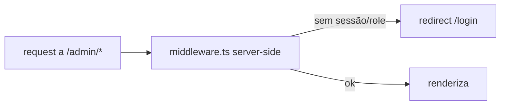

# Jornada — Hardening de Segurança (pré-produção)

> Status: pendente | Prioridade: alta | Wave: 3
> Última atualização: 2026-06-01
>
> Tarefas de blindagem antes de produção, descobertas durante o mapeamento da
> Wave 3. Não é feature de produto — é fechar furos.

## 1. Contexto & Objetivo
A proteção de rotas internas hoje é **client-side** (layouts em `app/*/layout.tsx`
checam o role e redirecionam). Funciona para UX, mas não é uma barreira de
servidor — o conteúdo das páginas é montado no client. Além disso, o código ainda
carrega a flag `NEXT_PUBLIC_ENABLE_EMPREITEIRO_MOCK` e mocks de fallback que nunca
devem ativar em produção. Esta jornada blinda ambos.

## 2. Personas
- Transversal (todas). Foco em segurança/infra.

## 3. Fluxo ponta-a-ponta

## 4. Telas envolvidas
- Nenhuma nova. Afeta todos os `app/{contratante,empreiteiro,admin}/**`.

## 5. Componentes-chave
- A criar: `middleware.ts` (raiz) — guard server-side por cookie/JWT + role.
- [app/contratante/layout.tsx](../../app/contratante/layout.tsx), [app/empreiteiro/layout.tsx](../../app/empreiteiro/layout.tsx), [app/admin/layout.tsx](../../app/admin/layout.tsx) — mantêm o guard client como UX, mas a barreira real passa a ser o middleware.
- Flags de mock espalhadas (ver J09/levantamento): `features/*/constants.ts` com `ENABLE_MOCK`.

## 6. Schema (Drizzle)
Nada.

## 7. Endpoints
Nenhum novo. As rotas `/api/**` já validam server-side via `requireVerifiedUser`
— o gap é só nas PÁGINAS (não-API), que o middleware cobre.

## 8. Mocks a remover
- Flag `NEXT_PUBLIC_ENABLE_EMPREITEIRO_MOCK` e os fallbacks `if (ENABLE_MOCK)` remanescentes (FAQ, chat, clientes, empreiteiras, auditoria) — depois que as jornadas de dados (J17/J18) tornarem tudo real.

## 9. Checklist de implementação
- [ ] `middleware.ts` server-side: ler cookie de sessão, validar JWT, checar role vs. prefixo de rota (`/admin` → admin/superadmin, etc.), redirecionar para `/login?next=` se inválido
- [ ] Matcher cobrindo `/contratante/:path*`, `/empreiteiro/:path*`, `/admin/:path*`
- [ ] Manter guard client como UX (evita flash), mas a barreira de verdade é o middleware
- [ ] Auditar headers de segurança (CSP, no-cache em rotas sensíveis já existe)
- [ ] Remover/neutralizar a flag de mock em produção (garantir que `NEXT_PUBLIC_ENABLE_EMPREITEIRO_MOCK` nunca seja `true` em prod; idealmente remover os branches após J17/J18)
- [ ] Confirmar adapter de gateway `manual` bloqueado em prod (já feito em J11 — validar)
- [ ] Revisar `getClientIp` (confia em `x-forwarded-for`) — validar proxy confiável

## 10. Critérios de aceite
1. Deslogado faz GET direto a `/admin/financeiro` → 307 para `/login` no servidor (não renderiza nada).
2. Contratante logado tenta `/admin/*` → bloqueado no servidor.
3. `NEXT_PUBLIC_ENABLE_EMPREITEIRO_MOCK` não tem efeito em produção.

## 11. Riscos / Pontos de atenção
- Middleware roda no edge — cuidado com libs Node-only (verificar `verifyAccessToken`).
- Não quebrar rotas públicas (`/`, `/login`, `/cadastro`, `/api/webhooks/*`, landing).

## 12. Links cruzados
- Depende de: J01 (auth).
- Pré-requisito recomendado para: produção / testes com usuários reais.

## 13. Gaps descobertos durante execução
- _Sem registros ainda._
