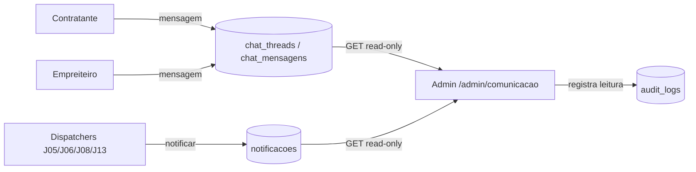

# Jornada — Observabilidade de Comunicação (Admin)

> Status: revisão | Prioridade: média | Wave: 4
> Última atualização: 2026-06-02

## 1. Contexto & Objetivo
Dar ao admin visibilidade **read-only** sobre a comunicação da plataforma: ler os chats 1:1 entre contratante e empreiteiro (auditoria/moderação), ver o painel real de notificações disparadas (hoje mock) e ter uma trilha de rastreio do que foi enviado, para quem e quando. Fecha os dois itens de observabilidade que sobraram da J13 (`tela admin de monitoramento`) e profissionaliza o suporte sem mexer no chat das partes.

**Princípio de desenho (decisão 2026-06-02):** o admin **não vira participante** das threads. O schema de chat é 1:1 rígido ([shared/db/schema.ts:339](../../shared/db/schema.ts) — `chat_threads.obra_id` UNIQUE + `contratanteUserId` + `empreiteiroUserId`, sem coluna de participante extra). O admin lê as tabelas existentes via endpoints administrativos novos. Schema de chat fica **intocado**. Comunicação ativa admin↔usuário, se necessária, é canal separado (fora do escopo desta jornada — ver §11).

## 2. Personas
- **Admin / superadmin**: lê chats e notificações de qualquer obra para auditoria/moderação e suporte. Sem capacidade de escrever na thread das partes.
- **Contratante / Empreiteiro**: não participam ativamente desta jornada — são os observados. (Transparência sobre a leitura admin é decisão de produto — ver §11.)

## 3. Fluxo ponta-a-ponta
1. Admin abre `/admin/comunicacao` (ou `/admin/chat`).
2. Lista de threads de todas as obras, com busca/filtro (por obra, por usuário, por data, por "tem mensagem não respondida").
3. Admin abre uma thread → vê o histórico completo de mensagens **em modo leitura** (sem input de envio).
4. Aba/seção de **Notificações**: painel real (substitui o mock de [features/admin/notifications/](../../features/admin/notifications/)) listando notificações disparadas, com filtro por tipo/destinatário/status (lida/não-lida) e canal (in-app/email).
5. Trilha de **auditoria**: cada acesso de leitura a uma thread registra em `audit_logs` (quem leu, qual thread, quando).

## 4. Telas envolvidas
- `app/admin/comunicacao/` — **a criar** — painel de monitoramento (abas Chats + Notificações + Auditoria)
- (reaproveita layout/shell de `app/admin/*`)

## 5. Componentes-chave
- [features/admin/notifications/](../../features/admin/notifications/) — **migrar de mock para real** (hoje só `hooks/`, `mocks/`, `types/`)
- `features/admin/comunicacao/` — **a criar** — api/service real (leitura de threads/mensagens) + hooks + components
- Reusa shapes de mensagem de [features/chat/](../../features/chat/) (read-only)

## 6. Schema (Drizzle)
- **Chat fica intocado.** `chat_threads` e `chat_mensagens` em [shared/db/schema.ts](../../shared/db/schema.ts) já têm tudo que a leitura precisa.
- `notificacoes` em [shared/db/schema.ts:325](../../shared/db/schema.ts) já é a fonte real do painel — basta consultar (filtros por `tipo`, `destinatarioUserId`, `lidaEm`, `criadaEm`).
- `audit_logs` já existe — registrar `action='admin.chat.read'` com `target=threadId` para rastreio. Confirmar colunas disponíveis antes (não criar tabela nova se evitável).
- **A criar:** nada de tabela nova obrigatória. (Se a trilha de auditoria de leitura exigir mais granularidade que `audit_logs` oferece, avaliar então.)

## 7. Endpoints
- `GET /api/admin/chat/threads` — lista paginada de threads (join obra + nomes das partes + última mensagem), filtros por obra/usuário/data
- `GET /api/admin/chat/threads/[id]/mensagens` — histórico read-only de uma thread (registra leitura em `audit_logs`)
- `GET /api/admin/notificacoes` — painel real (filtros tipo/destinatário/status/canal)
- Todos guardados por `isAdminLike(role)` ([features/auth/api/auth-utils.ts:189](../../features/auth/api/auth-utils.ts)) — **sem** rota de POST/escrita em thread das partes.

## 8. Mocks a remover
- [features/admin/notifications/mocks/](../../features/admin/notifications/mocks/) — substituir o consumo do hook por API real

## 9. Checklist de implementação
- [ ] `GET /api/admin/chat/threads` — lista paginada com filtros, guard `isAdminLike`
- [ ] `GET /api/admin/chat/threads/[id]/mensagens` — leitura read-only + registro em `audit_logs`
- [ ] `GET /api/admin/notificacoes` — painel real (filtros tipo/destinatário/status/canal)
- [ ] `features/admin/comunicacao/` — service + hooks (React Query) reais
- [ ] `app/admin/comunicacao/page.tsx` — tela com abas Chats / Notificações / Auditoria, modo leitura (sem input de envio)
- [ ] Migrar [features/admin/notifications/](../../features/admin/notifications/) do mock para o hook real
- [ ] Trilha de auditoria: cada abertura de thread pelo admin grava `action='admin.chat.read'`
- [ ] (avaliar) Indexar `chat_mensagens (thread_id, criada_em DESC)` se a leitura admin ficar pesada

## 10. Critérios de aceite
1. Admin abre `/admin/comunicacao` → vê lista de threads de obras com partes e última mensagem.
2. Admin abre uma thread → lê o histórico completo, **sem** caixa de envio.
3. Painel de notificações lista dados reais da tabela `notificacoes` (não mais o mock), com filtro por tipo e status.
4. `SELECT * FROM audit_logs WHERE action='admin.chat.read' ORDER BY created_at DESC` retorna a leitura recém-feita.
5. Usuário não-admin recebe 403 em qualquer endpoint `/api/admin/chat/*`.

## 11. Riscos / Pontos de atenção
- **Privacidade/transparência:** admin lendo chat privado é sensível. Decisão de produto pendente: avisar as partes ("admin pode acessar para suporte/moderação") nos termos ou na UI do chat? Registrar quando decidido.
- **Escopo controlado:** manter estritamente read-only nesta jornada. Não introduzir escrita do admin na thread das partes — isso quebraria o modelo 1:1 e a expectativa de privacidade.
- **Canal admin↔áreas (futuro):** se o produto quiser comunicação ativa admin↔usuário (suporte), é **canal separado** com modelo de thread próprio (`admin_threads` desacoplado da obra) — vira jornada/escopo próprio, NÃO se mistura no chat da obra. Adiado conscientemente.
- **Volume:** painel de notificações e listagem de threads precisam de paginação desde o início.

## 12. Links cruzados
- Depende de: J13 (chat e notificações reais já entregues).
- Relacionada: J19 (hardening — guard admin), J02 (preferências de notificação refletidas no painel).
- Absorve: os 2 itens abertos de observabilidade de [J13](13-chat-notificacoes.md) (tela admin de monitoramento).

## 13. Gaps descobertos durante execução
> Doc viva. Registrar aqui o que apareceu no caminho e não estava no roteiro original. Uma linha por item, com data.

- 2026-06-02: Jornada criada a partir do levantamento `/jornada`. Decisão registrada: chat admin é **leitura-only por fora**, schema de chat 1:1 fica intocado; canal admin↔áreas (escrita) adiado como escopo separado.
