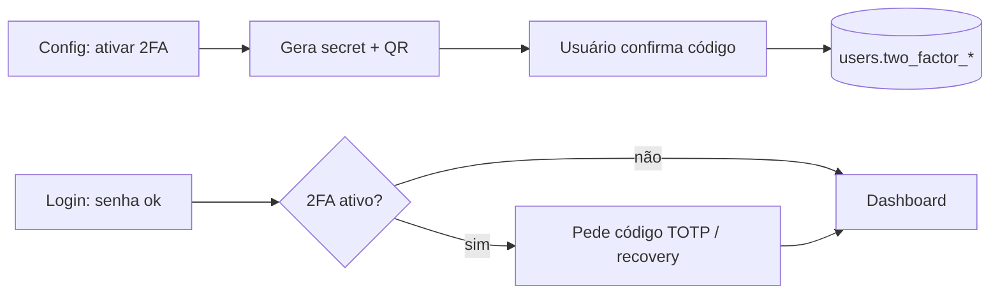

# Jornada — Autenticação Forte (2FA)

> Status: pronto | Prioridade: média | Wave: 4
> Última atualização: 2026-06-05

## 1. Contexto & Objetivo
Adicionar um segundo fator de autenticação (2FA/MFA) opcional às contas, reduzindo o risco de comprometimento por senha vazada/credential stuffing. Nasceu de um gap levantado na J02 (Perfis & Configurações): 2FA não era critério de aceite original e é uma feature do zero que mexe no caminho crítico de login — por isso foi extraída para jornada própria em 2026-06-02, em vez de inflar a J02.

## 2. Personas
- **Contratante / Empreiteiro / Admin**: qualquer conta com senha local pode ativar 2FA por TOTP. Contas OAuth (sem senha local) ficam fora do escopo (o 2FA é responsabilidade do provedor).
- **Admin**: pode (decisão de produto) exigir 2FA para contas admin/superadmin.

## 3. Fluxo ponta-a-ponta
1. Usuário vai em Configurações → aba Segurança → "Ativar verificação em duas etapas".
2. Backend gera um secret TOTP, mostra QR code (otpauth://) + secret manual.
3. Usuário escaneia no app autenticador (Google Authenticator, Authy, etc.) e digita o código de 6 dígitos para confirmar.
4. Backend valida o código contra o secret, ativa o 2FA e gera **recovery codes** (uso único) que o usuário deve guardar.
5. A partir daí, o login passa a ter um segundo passo: após senha válida, pede o código TOTP (ou um recovery code).
6. Desativar 2FA exige confirmação por senha + código atual.

## 4. Telas envolvidas
- `app/contratante/configuracoes/` e `app/empreiteiro/configuracoes/` — aba Segurança ganha card de 2FA (setup/disable) — reaproveitar o padrão de [ContaSection](../../features/perfil/components/ContaSection.tsx) (J02).
- `app/admin/configuracoes/` — idem para admins.
- Tela de login — segundo passo (input do código) quando 2FA ativo. Hoje: [app/login/](../../app/login/) + `POST /api/auth/login`.

## 5. Componentes-chave
- `features/auth/components/TwoFactorSetup` — **a criar** — QR + confirmação + recovery codes.
- `features/auth/api/` — geração/validação TOTP (lib tipo `otplib`/`speakeasy` — avaliar via [context7] antes de escolher).

## 6. Schema (Drizzle)
Tabela `users` em [shared/db/schema.ts](../../shared/db/schema.ts) — **colunas a criar** (bootstrap idempotente, padrão dos outros `server/bootstrap-*.ts`):
- `two_factor_secret` (text, nullable) — secret TOTP (cifrar em repouso se possível).
- `two_factor_enabled` (boolean, default false).
- `two_factor_recovery_codes` (text[] ou jsonb) — hashes dos códigos de recuperação (uso único).
- (avaliar) `two_factor_confirmed_at` (timestamp).

> Hoje o schema de `users` NÃO tem nenhuma coluna de 2FA (confirmado no levantamento de 2026-06-02). Tudo nasce nesta jornada.

## 7. Endpoints
- `POST /api/auth/2fa/setup` — gera secret + otpauth URL (não ativa ainda).
- `POST /api/auth/2fa/confirmar` — valida o primeiro código, ativa, devolve recovery codes.
- `POST /api/auth/2fa/desativar` — exige senha + código atual.
- Alterar `POST /api/auth/login` — quando `two_factor_enabled`, exigir segundo passo (código TOTP ou recovery) antes de emitir tokens.

## 8. Mocks a remover
Nenhum — feature nova, sem mock prévio.

## 9. Checklist de implementação
- [x] Migration: tabela dedicada `user_totp` (não colunas em `users`) via [bootstrap-2fa.ts](../../server/bootstrap-2fa.ts) idempotente, registrada em [instrumentation.ts](../../instrumentation.ts).
- [x] Escolher lib TOTP e isolar num helper testável — `otplib` v13 + `qrcode`, em [features/auth/api/totp.ts](../../features/auth/api/totp.ts).
- [x] `POST /api/auth/2fa/setup` (gera secret + QR otpauth) — [route](../../app/api/auth/2fa/setup/route.ts).
- [x] `POST /api/auth/2fa/confirmar` (valida código, ativa, gera recovery codes hash) — [route](../../app/api/auth/2fa/confirmar/route.ts).
- [x] `POST /api/auth/2fa/desativar` (senha + código) — [route](../../app/api/auth/2fa/desativar/route.ts).
- [x] Alterar fluxo de login para o segundo passo quando ativo (sem quebrar contas sem 2FA) — challenge token + [`POST /api/auth/2fa/verificar`](../../app/api/auth/2fa/verificar/route.ts); login em [route](../../app/api/auth/login/route.ts).
- [x] UI: card de 2FA na aba Segurança das 3 personas — [TwoFactorSection](../../features/auth/components/TwoFactorSection.tsx) em contratante/empreiteiro/admin; 2º passo na [tela de login](../../app/login/page.tsx).
- [x] (decisão de produto) Exigir 2FA para admin/superadmin — opt-in por env `ADMIN_2FA_OBRIGATORIO=1` ([totp-policy.ts](../../features/auth/api/totp-policy.ts)); desligado por padrão.

## 10. Critérios de aceite
1. Ativar 2FA → escanear QR → confirmar código → recovery codes exibidos uma única vez.
2. Logout → login → após senha, é pedido o código TOTP; código correto → entra.
3. Usar um recovery code → login funciona e o código é invalidado (uso único).
4. Conta SEM 2FA continua logando normalmente (sem regressão).
5. Desativar 2FA exige senha + código atual; depois disso o login volta a um passo só.
6. `SELECT enabled FROM user_totp WHERE user_id=…` reflete o estado.

## 11. Riscos / Pontos de atenção
- **Caminho crítico**: alterar o login afeta 100% dos usuários — cobrir com teste de regressão (conta sem 2FA tem que continuar entrando).
- **Recovery codes**: guardar só hash; mostrar em claro uma única vez.
- **Secret em repouso**: avaliar cifragem (não deixar o secret TOTP em texto puro no banco se a infra permitir).
- **Clock drift**: tolerância de ±1 janela no TOTP.
- **Rate-limit** no segundo passo (anti-brute-force do código de 6 dígitos).
- Contas OAuth sem senha: não oferecer 2FA local (provedor já cobre).

## 12. Links cruzados
- Origem: [J02](02-perfis-configuracoes.md) (gap extraído — 2FA não era critério de aceite da J02).
- Relacionada: [J19](19-hardening-seguranca.md) (hardening), [J01](01-identidade-onboarding.md) (login/identidade).

## 13. Gaps descobertos durante execução
> Doc viva. Registrar aqui o que apareceu no caminho e não estava no roteiro original. Uma linha por item, com data.

- 2026-06-02: Jornada criada ao fechar a J02 — 2FA foi conscientemente adiado da J02 (feature do zero, mexe no login) e ganhou lar próprio aqui.
- 2026-06-03: Schema modelado como tabela dedicada `user_totp` (decisão), não como colunas em `users` (§6 sugeria colunas). Segue o padrão dos outros `bootstrap-*.ts` e mantém a tabela `users` (a mais quente) enxuta.
- 2026-06-03: Lib TOTP — `otplib` instalado veio na v13 (reescrita major, API funcional `generate/verify/generateURI`, sem o singleton `authenticator` da v12). `verify` é assíncrono ⇒ `validarCodigo` virou `async`. Tolerância de clock drift via `epochTolerance: 30` (±1 janela).
- 2026-06-03: Login de 2 passos via **challenge token** assinado (HMAC/SESSION_SECRET, type `2fa-challenge`, 5min), não sessão parcial. A emissão de sessão foi extraída pra [session-issuer.ts](../../features/auth/api/session-issuer.ts) e é compartilhada entre login normal e `verificar` (mesma sessão/cookies).
- 2026-06-03: Auditoria de segurança aplicada — rate-limit do `verificar` reforçado **por conta** além de por IP (anti-brute-force do código de 6 dígitos), e status/mensagem unificados (sem oráculo código-errado vs conta-inválida). Eventos `2fa.enabled`/`2fa.disabled`/`2fa.login_verified` em `audit_logs`.
- 2026-06-03: **Pendência de hardening (LOW):** o `secret` TOTP é gravado em claro em `user_totp.secret`. Cifragem em repouso (AES-GCM com `TOTP_ENC_KEY` dedicada) fica como item futuro — depende de decisão de infra sobre gestão de chave. Recovery codes já são hash.
- 2026-06-03: **Pendência de teste:** falta o teste de regressão e2e (conta SEM 2FA continua logando; login com TOTP; recovery code uso único). Critérios de aceite validados por type-check + auditoria, ainda não por e2e.
- 2026-06-05: Jornada promovida a **pronto** — todos os 8 itens do checklist e os 6 critérios de aceite têm código correspondente (verificado). As duas pendências acima (secret TOTP em claro — LOW; teste e2e) são follow-ups de hardening/qualidade e **não bloqueiam** a entrega funcional; ficam registradas como itens de backlog.
