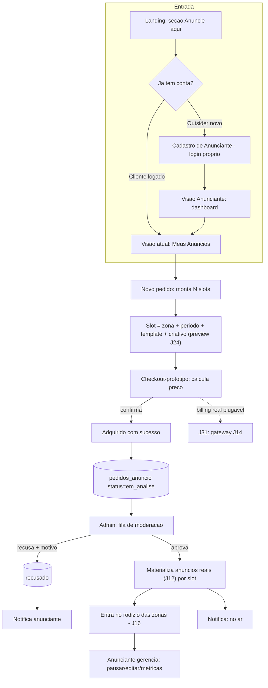

# Jornada — Self-Service de Anúncios (Visão Anunciante + Meus Anúncios)

> Status: planejada (reestruturada) | Prioridade: alta | Wave: 6
> Última atualização: 2026-06-07
>
> **Desbloqueada para implementação por etapas (decisão de produto 2026-06-07).**
> A cobrança real fica de fora desta jornada por design: o checkout é um
> **protótipo funcional** ("adquirido com sucesso" sem cobrar), com o passo de
> billing desenhado como **porta plugável**. A integração de pagamento de verdade
> vira a **J31** (depende da J14/gateway). Esta jornada entrega tudo o resto —
> nova visão de anunciante, área "Meus Anúncios" para clientes existentes,
> entrada pela landing, pedido multi-slot e moderação — pronto para a J31 ligar
> o gateway sem refazer nada.

## 0. Decisões tomadas (travadas com o PO em 2026-06-07)

| # | Decisão | Escolha | Consequência |
|---|---|---|---|
| D1 | **Quem pode anunciar** | Logados (contratante/empreiteiro) **e** outsiders | Outsider vira uma **conta de anunciante real** (login próprio), não um envio anônimo que some. |
| D2 | **Modelo de papel** | **Papel acoplável ao usuário** (multi-role) | Anunciante deixa de ser tabela isolada; vira mais um papel do `users`. Virar contratante/empreiteiro = **adicionar papel**, sem migrar dados nem duplicar cadastro. |
| D3 | **Unidade de venda** | **Pedido com múltiplos slots** | Um pedido agrupa N slots = (zona/local + período + template+criativo). Bate com "anunciar em mais de um lugar, por horários". |
| D4 | **Moderação** | **Obrigatória antes de exibir** | "Adquirido com sucesso" = entrou na fila do admin, **não** "no ar". Nada auto-publica. |
| D5 | **Cobrança** | **Protótipo agora, J31 depois** | Checkout calcula e mostra preço, registra o pedido como "adquirido", mas não cobra. Porta de billing plugável (espelha `ManualGateway` da J11). |
| D6 | **Navegação multi-papel** | **Anúncios embutido na visão de cliente; visão dedicada só p/ outsider** | Cliente anuncia pela própria visão (item "Meus Anúncios"); visão `app/anunciante/*` só para outsider puro; ao virar cliente, converge para a visão de cliente. Sem deslogar, sem seletor de workspace. Ver §1 (regra de ouro) e §6.4. |

> **Achado de arquitetura (crítico).** Hoje `users.role` é um **enum de valor único**
> (`superadmin | admin | contratante | empreiteiro`) — não existe múltiplos papéis —
> e `anunciantes` é uma **tabela desacoplada de `users`** (advertiser externo do
> ponto de vista da J12). A decisão D2 exige introduzir multi-role. Ver §6.1 para
> a estratégia de migração sem quebrar o que já existe.

## 1. Contexto & Objetivo

A **J12/J16** entregaram o backend de anúncios, as 8 zonas e o pipeline de
exibição. A **J24** entregou o lado do **admin**: templates selecionáveis, preview
ao vivo, home dinâmica e master toggle — o admin hoje **cria, configura e gerencia
todo o ecossistema de anúncios** (campanhas, anunciantes, zonas, visibilidade).

Esta jornada abre a outra ponta: o **auto-atendimento**. Transforma o módulo de
"venda manual pelo admin" em **marketplace de mídia self-service**, com três
movimentos:

1. **Nova visão de Anunciante** — uma persona de primeira classe (login, "esqueci
   senha", verificação de email, dashboard próprio), para quem **não é**
   contratante/empreiteiro mas quer anunciar. Robusta, espelhando as visões
   existentes.
2. **"Meus Anúncios" para clientes existentes** — contratante/empreiteiro logado
   ganha a capacidade de anunciar **dentro da visão que já tem**, sem conta nova.
3. **Entrada pela landing** — uma seção "Anuncie na X-Construção" na home
   (padrão visual das seções atuais) que conduz qualquer visitante ao fluxo.

O anunciante monta um **pedido multi-slot** (escolhe locais + períodos + template
e criativo de cada um, reusando os templates/preview da J24), passa por um
**checkout-protótipo** ("adquirido com sucesso"), o pedido cai na **fila de
moderação** do admin, e ao ser aprovado **materializa anúncios reais** que entram
no rodízio das zonas (pipeline J16) — com o anunciante mantendo **controle próprio**
(pausar/reativar/editar/ver métricas), sem depender do admin para o dia a dia.

### O que muda de papel
- **Admin** deixa de ser o único que cria anúncios; vira **moderador + gestor** do
  marketplace (aprova/recusa, define/ajusta preço, supervisiona). A visão admin da
  J24 é reaproveitada, ganhando a **fila de solicitações**.
- **Anunciante** ganha autonomia operacional sobre os próprios anúncios.

### Regra de ouro da navegação (D6 — decisão de produto 2026-06-07)

> **"Anunciante" não é uma visão concorrente. É uma capacidade que aparece onde o
> usuário já está.**

Isto resolve o caso de **usuário com múltiplos papéis** sem nunca exigir deslogar
nem trocar de conta (com multi-role o JWT já carrega o usuário; papel é consulta):

1. **Cliente que também anuncia** (contratante **ou** empreiteiro): "Meus Anúncios"
   é apenas **mais um item de menu DENTRO da visão que ele já usa**. Não existe
   "visão de anunciante" para ele. Sem troca de contexto.
2. **Outsider puro** (não é cliente): tem a **visão dedicada de anunciante**
   (`app/anunciante/*`) — é a "casa" de quem só anuncia.
3. **Outsider que vira cliente**: tudo **converge para a visão de cliente**. Ele
   passa a ter a visão de contratante/empreiteiro **com "Meus Anúncios" embutido**;
   os anúncios continuam dele (`solicitanteUserId` inalterado), só mudam de lugar
   no menu. A visão de anunciante deixa de ser necessária para ele — e
   **redireciona graciosamente** para a visão de cliente em vez de manter duas
   portas (default tomado para evitar ambiguidade; ver §6.4).

Em uma frase: **se o usuário tem uma visão de cliente, é sempre por ela que ele
anuncia; a visão de anunciante só sobrevive para quem não tem outra.**

## 2. Personas

- **Anunciante (visão nova)**: empresa/profissional de fora do ecossistema de
  obras. Cria conta de anunciante, faz login, monta pedidos, acompanha
  moderação, gerencia os próprios anúncios (pausar/reativar/editar criativo),
  vê métricas (impressões/cliques). **Pode evoluir** para contratante/empreiteiro
  depois, reaproveitando o cadastro (D2).
- **Contratante / Empreiteiro (logado)**: já tem conta; ganha a área **"Meus
  Anúncios"** na própria visão. Mesmo fluxo de pedido e gestão, sem novo cadastro.
- **Admin**: recebe a **fila de solicitações**, modera (aprova/recusa com motivo),
  confirma/ajusta o preço do pedido, publica. Reusa o painel da J24 + nova aba.
- **Visitante (landing)**: vê a seção "Anuncie aqui" e é conduzido ao login de
  anunciante ou ao cadastro.

## 3. Fluxo ponta-a-ponta



## 4. Telas envolvidas

### A criar — Visão Anunciante (nova, robusta)
- `app/anunciante/layout.tsx` — guard de papel `anunciante` (espelha
  [app/contratante/layout.tsx](../../app/contratante/layout.tsx)).
- `app/anunciante/dashboard/page.tsx` — visão geral (pedidos, anúncios ativos,
  métricas agregadas).
- `app/anunciante/meus-anuncios/page.tsx` — listagem dos anúncios do anunciante
  (status, pausar/reativar, editar criativo, ver métricas). Padrão de listagem
  espelha [app/empreiteiro/minhas-candidaturas/](../../app/empreiteiro/minhas-candidaturas/).
- `app/anunciante/novo-pedido/page.tsx` — montagem do pedido multi-slot + checkout.
- `app/anunciante/configuracoes/page.tsx` — perfil do anunciante + **"tornar-me
  contratante/empreiteiro"** (upgrade de papel, §6.1).

### A criar — Autenticação do Anunciante
- `app/cadastro-anunciante/page.tsx` — signup específico (ou estender o registro
  existente com a opção de papel; ver §6.2). "Esqueci senha", verificação de email
  e 2FA **reusam a infra existente** (mesma `users`, mesmo `/api/auth/*`).

### A alterar — Landing
- [app/page.tsx](../../app/page.tsx) — nova seção **"Anuncie na X-Construção"**:
  card no padrão das seções atuais (cor de destaque, título, descrição persuasiva,
  imagem/ilustração, CTA "Quero anunciar"). Conteúdo **estático/editorial** nesta
  jornada (não confundir com a vitrine dinâmica "Mercado em Foco" da J24 — aquela
  exibe anúncios; esta **convida a anunciar**). CTA → `/cadastro-anunciante` (ou
  `/anunciante/novo-pedido` se já logado).

### A alterar — Visões de cliente existentes
- `app/contratante/meus-anuncios/page.tsx` e `app/empreiteiro/meus-anuncios/page.tsx`
  — mesma área "Meus Anúncios", montada sobre componentes compartilhados (§5), só
  embrulhada no layout/guard de cada papel.

### A alterar — Admin (reusa J24)
- [app/admin/anuncios/page.tsx](../../app/admin/anuncios/page.tsx) — nova aba
  **"Solicitações"** (fila de moderação) ao lado de Campanhas / Anunciantes /
  Config. Modal de moderação (aprovar/recusar + ajustar preço + publicar).

## 5. Componentes-chave

- **A criar** `features/anuncios/self-service/` (o coração da jornada):
  - `pedido-service.ts` — regras de pedido multi-slot, cálculo de preço, transição
    de status, materialização em `anuncios` na aprovação.
  - `precificacao.ts` — **tabela de preços plugável** por zona × período (valores
    de protótipo configuráveis; ver §8). Isolada para a J31 trocar pela cobrança real.
  - `billing-port.ts` — **porta de billing** (interface). Implementação atual:
    `PrototipoBilling` (registra "adquirido", não cobra). J31 pluga o gateway real.
  - `schemas/` — Zod do pedido e de cada slot (valida template×zona reusando
    `templateAceitoNaZona` da J24).
  - `components/` — UI compartilhada entre as 3 visões (anunciante, contratante,
    empreiteiro):
    - `MontadorPedido.tsx` — adiciona/remove slots, escolhe zona+período+template.
    - `SlotEditor.tsx` — editor de um slot, com **preview ao vivo reusando
      `AdCreativeCard`** ([features/shared/anuncios/components/AdCreativeCard.tsx](../../features/shared/anuncios/components/AdCreativeCard.tsx)) e upload R2 (`kind: anuncio_criativo`).
    - `CheckoutPrototipo.tsx` — resumo do pedido, preço calculado, "Confirmar
      aquisição" → tela de sucesso.
    - `MeusAnunciosLista.tsx` — listagem + ações de gestão (pausar/reativar/editar).
    - `PedidoStatusCard.tsx` — card de status (em análise / aprovado / recusado / no ar / encerrado).
- **A criar** `features/admin/anuncios/components/ModeracaoPedidoModal.tsx` —
  aprovar/recusar com motivo, conferir/ajustar preço, publicar (materializa slots).
- **A criar** `features/notificacoes/anuncio-dispatcher.ts` — dispatcher de
  notificações (recebido / aprovado / recusado / no ar / pausado-pelo-admin),
  reusando [features/notificacoes/service.ts](../../features/notificacoes/service.ts).
- **Reuso direto da J24**: templates, `AdCreativeCard`, registry em
  [features/shared/anuncios/templates/](../../features/shared/anuncios/templates/),
  catálogo `ZONAS` e `templateAceitoNaZona` de
  [features/anuncios/anuncios-service.ts](../../features/anuncios/anuncios-service.ts).

## 6. Arquitetura

### 6.1 Multi-role: o papel "anunciante" acoplável (D2) — **decisão estrutural**

Hoje `users.role` é enum de valor único. Para que um anunciante **vire**
contratante/empreiteiro reaproveitando o cadastro (e para que um cliente existente
**também seja** anunciante sem perder o papel atual), introduzimos papéis
**aditivos** sem quebrar o que já roda.

**Estratégia escolhida — papéis aditivos com retrocompat:**
- Manter `users.role` como está (papel **primário**, não quebra nenhum guard atual).
- **A criar** tabela `user_roles` (N papéis por usuário): `userId` (FK), `role`
  (enum estendido com `anunciante`), `criadoEm`, `origem`. Migration idempotente
  faz **backfill**: para cada `users.role` atual, insere a linha correspondente em
  `user_roles` — assim o estado fica consistente desde o dia 1.
- `requireVerifiedUser` / guards passam a oferecer um helper `userHasRole(user,
  'anunciante')` que consulta `user_roles` (com a `users.role` como fallback). Os
  guards existentes de contratante/empreiteiro **continuam funcionando** via o papel
  primário; só as rotas novas de anunciante usam o helper aditivo.
- **A criar** tabela complementar `anunciantes_perfil` 1:1 com `users` (dados do
  anunciante: empresa, CNPJ, contato), espelhando o padrão `clientes`/`empreiteiras`.
  Não confundir com a `anunciantes` legada da J12 (advertiser cadastrado pelo admin)
  — ver nota de convergência abaixo.

**Upgrade de papel (anunciante → contratante/empreiteiro):**
- Em `app/anunciante/configuracoes`, ação "tornar-me contratante/empreiteiro" →
  adiciona o papel em `user_roles` + cria a tabela complementar (`clientes`/
  `empreiteiras`) **reaproveitando** nome/email/CNPJ já no cadastro. **Zero
  duplicação de usuário, zero novo login.** Opcionalmente promove o `role` primário.

> **Convergência da `anunciantes` legada (J12).** Hoje `anunciantes` é um cadastro
> manual do admin, sem vínculo com `users`. Nesta jornada, anúncios self-service
> apontam para o **usuário-anunciante** (via `user_roles`/`anunciantes_perfil`).
> Para não duplicar conceito, adicionar coluna nullable `anuncios.solicitanteUserId`
> (FK → users) **convivendo** com `anuncios.anuncianteId` (legado do admin). Anúncio
> criado pelo admin segue usando `anuncianteId`; anúncio self-service usa
> `solicitanteUserId`. Migração total da `anunciantes` legada fica fora de escopo
> (não é necessária para destravar a jornada). Registrar em §13.

### 6.2 Autenticação do anunciante — reuso, não reescrita

A "visão robusta com login/esqueci-senha/2FA" **não** exige um sistema de auth
novo. Reusa 100% o existente:
- Mesma tabela `users`, mesmo JWT em cookies httpOnly, mesmo `/api/auth/*`
  (login, refresh, forgot/reset-password, verify-email, 2FA da J22).
- O **signup** ganha a opção de criar com papel `anunciante` (estender
  `POST /api/auth/register` com `role: 'anunciante'` **ou** rota dedicada
  `app/cadastro-anunciante` que chama o mesmo service). O que é novo é a **visão**
  (`app/anunciante/*`) e o **guard de papel aditivo**, não o motor de auth.

### 6.3 Checkout-protótipo plugável (D5) — pronto para a J31

```
MontadorPedido → precificacao.ts (calcula preço por slot)
              → CheckoutPrototipo (mostra total)
              → billing-port.ts
                   ├─ HOJE:  PrototipoBilling.cobrar() → { status: 'adquirido', pago: false }
                   └─ J31:   GatewayBilling.cobrar()   → integra J14 (Pix/cartão real)
```
O pedido nasce com `cobrancaStatus = 'prototipo'`. A J31 só troca a implementação
da porta e adiciona os estados reais (`pendente`/`paga`/`falhou`) — **nenhuma tela
ou schema desta jornada precisa mudar**, só ganham significado.

### 6.4 Roteamento por papéis (D6) — onde "Meus Anúncios" vive

A lógica de navegação deriva direto da regra de ouro (§1). Implementação:

- **`MeusAnunciosLista` é um componente compartilhado** (§5), montado em **três
  pontos de entrada** que só diferem pelo layout/guard que os embrulha:
  - `app/contratante/meus-anuncios` (guard papel `contratante`)
  - `app/empreiteiro/meus-anuncios` (guard papel `empreiteiro`)
  - `app/anunciante/meus-anuncios` (guard papel `anunciante`, **só p/ outsider puro**)
- **Item de menu condicional**: o menu da visão de contratante/empreiteiro mostra
  "Meus Anúncios" **quando o usuário tem o papel `anunciante`** (`userHasRole`). Se
  ainda não tem, o item pode aparecer como CTA "Começar a anunciar" que adiciona o
  papel no primeiro pedido (onboard suave) — decisão de UX (§13).
- **Convergência na visão de anunciante** (caso 3 da regra de ouro): o
  `app/anunciante/layout.tsx` checa — se o usuário **também** tem papel
  `contratante`/`empreiteiro`, **redireciona** para a área "Meus Anúncios" da visão
  de cliente correspondente, em vez de renderizar a visão dedicada. Assim o outsider
  que evoluiu nunca fica com duas portas para a mesma coisa. Outsider puro (só
  `anunciante`) permanece na visão dedicada normalmente.
- **Sem deslogar, sem seletor de workspace**: a troca é só de rota; o token e a
  identidade são os mesmos. O papel é resolvido por consulta (`user_roles`).

## 7. Schema (Drizzle)

Tabelas existentes em [shared/db/schema.ts](../../shared/db/schema.ts): `users`,
`clientes`, `empreiteiras`, `anuncios`, `anunciantes`, `anuncio_eventos`,
`anuncio_config`, `userFiles`. Tudo novo via bootstrap idempotente (§ padrão
[server/bootstrap-anuncios.ts](../../server/bootstrap-anuncios.ts)).

### A criar
- **`user_roles`** (multi-role, §6.1): `id`, `userId` (FK users), `role`
  (enum estendido c/ `anunciante`), `origem` [`signup`|`upgrade`|`backfill`],
  `criadoEm`. Único parcial `(userId, role)`. **Backfill** dos roles atuais.
- **`anunciantes_perfil`** (1:1 com users): `userId` (PK/FK), `empresaNome`,
  `empresaCnpj` (nullable), `contatoNome`, `contatoEmail`, `contatoTelefone`,
  `criadoEm`, `atualizadoEm`.
- **`pedidos_anuncio`** (cabeçalho do pedido — D3): `id`, `solicitanteUserId`
  (FK users), `status` [`em_analise`|`aprovado`|`recusado`|`publicado`|`encerrado`],
  `motivoRecusa` (nullable), `valorTotal` NUMERIC(15,2), `cobrancaStatus`
  [`prototipo`|`pendente`|`paga`|`isenta`] DEFAULT `'prototipo'`, `criadoEm`,
  `moderadoEm` (nullable), `moderadoPor` (nullable, FK admin).
- **`pedido_slots`** (itens do pedido — D3): `id`, `pedidoId` (FK), `zona` (TEXT,
  validado por `isZonaValida`), `template` (TEXT, validado por `templateAceitoNaZona`),
  `titulo`, `subtitulo`, `criativoUrl`, `ctaUrl`, `ctaTexto`, `conteudo` JSONB
  (campos do template, padrão J24), `periodoInicio` TEXT, `periodoFim` TEXT,
  `valorSlot` NUMERIC(15,2), `anuncioId` (nullable, FK → anuncios — preenchido na
  materialização). Índice por `pedidoId`.

### A alterar
- **`anuncios`**: `ADD COLUMN IF NOT EXISTS solicitanteUserId VARCHAR` (FK users,
  nullable) — distingue anúncio self-service do anúncio legado por `anuncianteId`
  (§6.1, convergência). Permite ao anunciante gerenciar **só os seus**.

### Materialização (aprovar+publicar)
Ao aprovar um `pedido_anuncio`: para cada `pedido_slot`, **inserir em `anuncios`**
(reusando todo o pipeline da J16/J24: template, conteudo, zona, datas), gravar
`anuncios.solicitanteUserId`, ligar `pedido_slots.anuncioId` ao registro criado, e
mover o pedido para `publicado`. Receita: reusar `maybeLancarReceita` quando a J31
ligar a cobrança real; no protótipo, não lança receita (ou lança como `isenta`,
decisão de §13).

## 8. Endpoints

### Anunciante / cliente logado (auth + papel)
- `POST /api/anuncios/pedidos` — cria pedido multi-slot (auth; `solicitanteUserId`
  do token; valida cada slot via Zod + template×zona). Calcula preço via
  `precificacao.ts`, passa por `billing-port` (protótipo), grava `em_analise`.
- `GET /api/anuncios/pedidos` — lista pedidos do usuário logado.
- `GET /api/anuncios/pedidos/[id]` — detalhe/status do pedido + slots.
- `GET /api/anuncios/meus` — anúncios já materializados do usuário (para gestão).
- `PATCH /api/anuncios/meus/[id]` — anunciante pausa/reativa/edita o **próprio**
  anúncio (guard: `anuncios.solicitanteUserId === user.id`). Editar criativo de
  anúncio já no ar pode reentrar em moderação (decisão §13).
- `POST /api/anunciante/upgrade` — adiciona papel contratante/empreiteiro
  reaproveitando cadastro (§6.1).

### Admin (reusa J24 + moderação)
- `GET /api/admin/anuncios/pedidos` — fila de moderação (filtros por status).
- `PATCH /api/admin/anuncios/pedidos/[id]` — aprovar/recusar (motivo), ajustar
  preço, publicar (dispara materialização §7).

### Precificação (leitura para o checkout)
- `GET /api/anuncios/precos` — tabela de preços de protótipo por zona×período
  (alimenta o `CheckoutPrototipo`). Valores configuráveis (§13).

> **Billing**: nenhuma cobrança real nesta jornada. `billing-port` retorna
> "adquirido". A J31 implementa o adapter de gateway (depende da J14).

## 9. Mocks a remover / evitar

- Nenhum mock pré-existente a remover. **Evitar** mockar feio: o checkout é um
  **protótipo estruturado** (preço real calculado, pedido real persistido,
  fluxo real de moderação) — só o **passo de cobrança** é stub plugável. A tela de
  "adquirido com sucesso" deve ser real, não um alert.

## 10. Checklist de implementação (por etapas)

### Etapa A — Fundação multi-role + perfil de anunciante
- [ ] Enum estendido com `anunciante`; tabela `user_roles` + backfill idempotente
- [ ] Helper `userHasRole` em [features/auth/api/auth-utils.ts](../../features/auth/api/auth-utils.ts) sem quebrar guards atuais
- [ ] Tabela `anunciantes_perfil` (1:1 users) via bootstrap
- [ ] Signup com papel `anunciante` (estende `/api/auth/register` ou rota dedicada) — reusa forgot/reset/verify/2FA

### Etapa B — Pedido multi-slot + checkout-protótipo
- [ ] Schema `pedidos_anuncio` + `pedido_slots` + `anuncios.solicitanteUserId` (bootstrap idempotente); espelhar em [schema.ts](../../shared/db/schema.ts)
- [ ] `pedido-service.ts`, `precificacao.ts`, `billing-port.ts` (`PrototipoBilling`), `schemas/` Zod
- [ ] `MontadorPedido` + `SlotEditor` (preview via `AdCreativeCard` + upload R2) + `CheckoutPrototipo`
- [ ] Endpoints `POST/GET /api/anuncios/pedidos`, `GET /api/anuncios/precos`

### Etapa C — Visão Anunciante + "Meus Anúncios" nos clientes
- [ ] `app/anunciante/*` (layout+guard, dashboard, novo-pedido, meus-anuncios, configuracoes)
- [ ] `MeusAnunciosLista` compartilhado; embrulhar nos **3 pontos de entrada** (`contratante`/`empreiteiro`/`anunciante`) — §6.4
- [ ] **Item de menu condicional** "Meus Anúncios" nas visões de cliente quando `userHasRole('anunciante')` (D6)
- [ ] **Convergência** no `app/anunciante/layout.tsx`: se também é cliente, redireciona p/ a área de cliente (§6.4)
- [ ] `GET /api/anuncios/meus` + `PATCH /api/anuncios/meus/[id]` (gestão: pausar/reativar/editar; guard de posse)
- [ ] Upgrade de papel: `app/anunciante/configuracoes` + `POST /api/anunciante/upgrade`

### Etapa D — Entrada pela landing
- [ ] Seção "Anuncie na X-Construção" em [app/page.tsx](../../app/page.tsx) (padrão visual das seções atuais; CTA por estado de login)

### Etapa E — Moderação (admin) + notificações
- [ ] Aba "Solicitações" em [app/admin/anuncios/page.tsx](../../app/admin/anuncios/page.tsx) + `ModeracaoPedidoModal`
- [ ] `GET/PATCH /api/admin/anuncios/pedidos[...]` (aprovar/recusar/ajustar preço/publicar → materializa)
- [ ] `anuncio-dispatcher.ts` (recebido/aprovado/recusado/no ar/pausado)

### Fora desta jornada (→ J31)
- [ ] Cobrança real via gateway (J14). `billing-port` já está pronta para receber.

## 11. Critérios de aceite

1. **Outsider vira anunciante**: visitante na landing clica "Quero anunciar" →
   cadastra conta de anunciante → faz login → cai em `app/anunciante/dashboard`.
   Logout/login e "esqueci senha" funcionam (reuso da infra existente).
2. **Pedido multi-slot**: anunciante monta um pedido com **2+ slots** (zonas/
   períodos/templates diferentes), cada um com **preview ao vivo** fiel (J24);
   checkout mostra preço por slot + total; "Confirmar aquisição" → tela "adquirido
   com sucesso"; pedido persistido como `em_analise` com `cobrancaStatus='prototipo'`.
3. **Cliente existente anuncia**: contratante logado abre "Meus Anúncios" na sua
   visão, cria pedido **sem novo cadastro**, status `em_analise`.
4. **Moderação obrigatória**: admin vê o pedido na fila → recusa com motivo →
   anunciante é notificado, status `recusado`; aprova outro → cada slot vira
   `anuncios` real e aparece na zona escolhida (J16); anunciante notificado "no ar".
   Nada é exibido antes da aprovação.
5. **Controle do anunciante**: anunciante pausa um anúncio **seu** → some da zona;
   reativa → volta. Tentar gerenciar anúncio de outro usuário → 403.
6. **Upgrade de papel + convergência (D6)**: anunciante (outsider) em
   `configuracoes` escolhe "tornar-me contratante" → ganha o papel (linha em
   `user_roles` + `clientes` criado com os dados reaproveitados), **mesma conta/
   login**. A partir daí, acessar `app/anunciante/*` **redireciona** para
   `app/contratante/meus-anuncios`; "Meus Anúncios" aparece no menu de contratante;
   os anúncios dele continuam visíveis (mesmo `solicitanteUserId`). Ele **não fica
   com duas portas** para a mesma coisa.
7. **Cliente que também anuncia (D6)**: contratante com papel `anunciante` vê "Meus
   Anúncios" no menu de contratante; **não existe** visão de anunciante separada
   para ele; nunca precisa deslogar nem trocar de workspace.
8. **Plugabilidade**: trocar `PrototipoBilling` por um stub que retorna `paga` não
   exige mudar nenhuma tela nem schema (prova a porta da J31).
9. **Queries de verificação**:
   - `SELECT status, count(*) FROM pedidos_anuncio GROUP BY status;` reflete o funil.
   - `SELECT role, count(*) FROM user_roles GROUP BY role;` mostra o backfill + novos anunciantes.

## 12. Riscos / Pontos de atenção

- **Multi-role sem quebrar guards (maior risco técnico).** A introdução de
  `user_roles` não pode regredir nenhum guard de contratante/empreiteiro. Mitigar:
  manter `users.role` como papel primário e canônico para os guards atuais; usar o
  helper aditivo **só** nas rotas novas; backfill idempotente para consistência;
  testar login/redirect de cada papel após a migração.
- **Formulário/cadastro público é superfície de abuso**: spam, criativos
  impróprios, links maliciosos. Mitigar com rate-limit por IP (reusar infra da J19),
  verificação de email obrigatória antes de submeter pedido, validação de URL de
  criativo/destino, e **moderação obrigatória antes de qualquer exibição** (D4 —
  nunca auto-publica).
- **Posse de anúncio (IDOR)**: todas as rotas `/api/anuncios/meus/*` devem checar
  `solicitanteUserId === user.id`. Anunciante nunca gerencia anúncio de outro.
- **Convergência `anunciantes` legada × usuário-anunciante**: dois conceitos de
  "anunciante" coexistindo (admin-criado vs self-service). Documentado em §6.1;
  não unificar agora, mas evitar telas que misturem os dois sem rótulo claro.
- **Conflito de zona/período**: dois pedidos aprovados para a mesma zona não-múltipla
  no mesmo período. Definir regra (rodízio? primeira aprovada leva? a zona vira
  múltipla?). O catálogo `ZONAS` já tem `multiplo` (J24) — usar como base. Decisão
  de negócio + nota de modelagem (§13).
- **LGPD**: dados de contato do anunciante são PII — aplicar retenção/consentimento
  da J19; `anuncio_eventos.userId` continua nullable para visitante público.
- **Preço de protótipo vs realidade**: deixar claro na UI que o valor é simulado
  até a J31 (ex.: badge "simulação"); evitar que o anunciante ache que pagou.
- **CLS/preview**: reusar o `AdCreativeCard` real no `SlotEditor` (não recriar
  markup) para o preview ser fiel ao que publica — mesma regra da J24.

## 13. Links cruzados

- **Depende de**: J12 (backend de anúncios), J16 (pipeline de exibição), **J24**
  (templates + preview + `AdCreativeCard`), J13 (notificações), J19 (rate-limit/
  anti-abuso/LGPD), J22 (2FA, reusado na visão anunciante), J01/J02 (auth e perfis,
  reusados/estendidos).
- **Cria**: o papel `anunciante` (multi-role) e a base de pedido multi-slot.
- **Alimenta**: J09 (receita de anúncio self-service — só quando a J31 ligar a
  cobrança real), J17 (KPIs de anúncio incluem self-service).
- **É continuada por**: **J31 (a criar)** — integração do gateway de pagamento
  (J14) ao checkout de anúncios, trocando `PrototipoBilling` pelo billing real.
  Esta jornada deixa a porta pronta.

## 14. Gaps descobertos durante execução

> Doc viva. Registrar aqui o que apareceu no caminho e não estava no roteiro
> original. Uma linha por item, com data.

- **2026-06-02** — Jornada criada (bloqueada por decisão de negócio + J14).
- **2026-06-07** — **Reestruturada e desbloqueada** (decisão de produto). Escopo
  reescrito de "form de solicitação + moderação" para **marketplace self-service
  com visão de Anunciante de primeira classe**. Decisões travadas: D1 (logados +
  outsiders), D2 (**multi-role aditivo** — `user_roles`, anunciante vira papel
  acoplável que pode evoluir p/ contratante/empreiteiro reaproveitando cadastro),
  D3 (**pedido multi-slot**), D4 (moderação obrigatória), D5 (**checkout-protótipo
  plugável**, cobrança real adiada). Achado de arquitetura: `users.role` é enum de
  valor único hoje e `anunciantes` é desacoplada de `users` — daí a estratégia de
  multi-role com retrocompat (§6.1) e a coluna `anuncios.solicitanteUserId`.
  Cobrança real extraída para a **J31** (depende da J14). Decisões abertas a
  resolver na execução: regra de conflito de zona/período; valores da tabela de
  preços de protótipo; se editar criativo no ar reentra em moderação; se o protótipo
  lança receita `isenta` ou nenhuma; profundidade da convergência da `anunciantes`
  legada.
- **2026-06-07** — **Implementada (fim a fim).** Etapas A→E entregues. Decisões de
  execução registradas: (1) **enum aditivo dedicado** `user_additive_role`
  (contratante/empreiteiro/anunciante) na coluna `user_roles.role` — admin/superadmin
  não podem ser papéis aditivos (constraint de banco, não convenção). (2) **Unificação
  do anunciante**: `anunciantes.userId` nullable — self-service preenche, legado admin
  fica null; sem coluna paralela `solicitanteUserId` (posse via `anunciantes.userId`).
  (3) **`destaque-dados` fora do self-service**: o editor de slot oferece só
  `imagem-card`/`banner-imagem`/`conteudo-texto` (blocos de dados são editoriais/admin).
  (4) **Zero slots publicados** (todas as zonas em conflito): pedido vira `aprovado`
  (revisado, sem veiculação), não `publicado` — não engana o anunciante. (5) **Primeiro
  pedido concede o papel `anunciante`** ao cliente (contratante/empreiteiro) para o
  item "Meus Anúncios" aparecer no menu. (6) **Período opcional**: sem datas, preço
  assume 30 dias e o anúncio é veiculado sem data-fim — divergência aceitável no
  protótipo, a **amarrar na J31** (período obrigatório quando a cobrança for real).
  (7) URLs de criativo/CTA restritas a http(s) no Zod (defesa-em-profundidade).
- **2026-06-07** — **D6 (navegação multi-papel) travada.** Anunciar é capacidade
  embutida na visão de cliente, não visão concorrente: "Meus Anúncios" é item de
  menu dentro de contratante/empreiteiro; visão `app/anunciante/*` dedicada só para
  outsider puro; ao virar cliente, converge (redirect) para a visão de cliente —
  nunca duas portas, nunca deslogar, sem seletor de workspace (§1, §6.4). Decisão
  de UX em aberto: como onboardar o cliente que ainda não tem o papel `anunciante`
  — item de menu já visível como CTA "Começar a anunciar" que adiciona o papel no
  primeiro pedido, vs. esconder até o primeiro pedido. Resolver na Etapa C.
