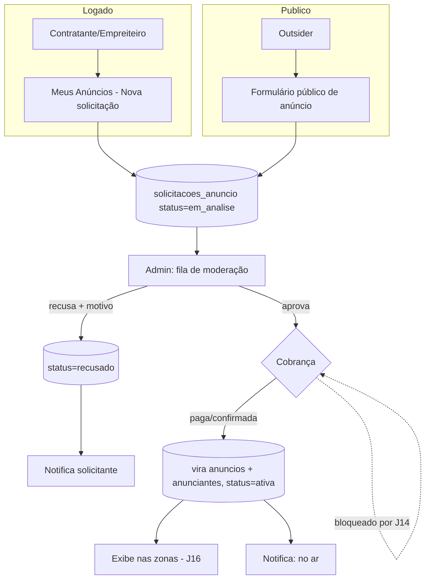

# Jornada — Meus Anúncios (Self-Service de Anunciantes)

> Status: bloqueada | Prioridade: baixa | Wave: 4
> Última atualização: 2026-06-02
>
> **Bloqueada por decisão de negócio.** Roteiro pré-criado para retomada num
> segundo momento. Pendências de negócio a resolver com os sócios da
> X-Construção **antes** de implementar:
> 1. **Quem pode solicitar** anúncio (qualquer contratante/empreiteiro? só plano
>    pago? empresas de fora — "outsiders" — via form público?).
> 2. **Como cobrar** — modelo de preço por zona/período, gateway, faturamento.
>    Depende da **J14** (gateway de pagamento), também bloqueada.
> 3. **Política de moderação** — critérios de aprovação/recusa, prazos, SLA.
>
> Dependência técnica: implementar **depois da J24** (preview + home dinâmica),
> que o anunciante reusa para ver o que está comprando.

## 1. Contexto & Objetivo
Hoje anúncios são 100% admin-only (J12). Esta jornada abre o **auto-atendimento**:
um anunciante (contratante/empreiteiro logado **ou** uma empresa de fora via
formulário público) submete um anúncio → admin modera (aprova/recusa) → ao
aprovar e cobrar, o anúncio entra no rodízio das zonas. Transforma o módulo de
anúncios de "venda manual pelo admin" em "marketplace de mídia self-service" com
moderação e billing.

## 2. Personas
- **Contratante / Empreiteiro (logado)**: cria solicitação de anúncio a partir
  de uma área "Meus Anúncios", reaproveitando seus dados de cadastro; acompanha
  status (em análise / aprovado / recusado / no ar / encerrado).
- **Outsider (empresa de fora, não cadastrada)**: submete anúncio por um
  **formulário público** (sem login), informando dados da empresa + criativo +
  contato. Vira um `anunciante` pendente para moderação.
- **Admin**: recebe a fila de solicitações, modera (aprova/recusa com motivo),
  define/confirma cobrança, publica nas zonas. Reusa o painel da J12.

## 3. Fluxo ponta-a-ponta

## 4. Telas envolvidas
- A criar — **logado**: `app/contratante/meus-anuncios/` e `app/empreiteiro/meus-anuncios/` (listagem das solicitações do usuário + form de nova solicitação + status). Padrão de listagem espelha [app/empreiteiro/minhas-candidaturas/](../../app/empreiteiro/minhas-candidaturas/).
- A criar — **público**: `app/anuncie/page.tsx` (formulário aberto para outsiders; sem auth).
- A alterar — **admin**: [app/admin/anuncios/page.tsx](../../app/admin/anuncios/page.tsx) ganha aba/seção "Solicitações" (fila de moderação) ao lado de Campanhas e Anunciantes.

## 5. Componentes-chave
- A criar: `features/anuncios/self-service/` — `solicitacao-service.ts` (regras de submissão/moderação), `schemas/` (Zod do form), `components/` (form de solicitação + card de status).
- **Reuso da J24**: `AdCreativeCard` + preview ao vivo para o anunciante ver o criativo antes de submeter; seção de formato por zona.
- A criar: `features/admin/anuncios/components/ModeracaoSolicitacaoModal.tsx` — aprovar/recusar com motivo, definir cobrança, publicar.
- Notificações: reusar os dispatchers de [features/notificacoes/](features/notificacoes/) (novo dispatcher `anuncio-dispatcher.ts` para: recebido / aprovado / recusado / no ar).

## 6. Schema (Drizzle)
- Tabelas existentes em [shared/db/schema.ts](../../shared/db/schema.ts): `anuncios`, `anunciantes`, `anuncio_eventos` (J12).
- **A criar** `solicitacoes_anuncio`:
  - `id`, `solicitanteTipo` [`usuario`|`outsider`], `usuarioId` (nullable — preenchido se logado), `empresaNome`, `empresaCnpj` (nullable), `contatoNome`, `contatoEmail`, `contatoTelefone`
  - `zonaDesejada` (TEXT, validado contra catálogo `ZONAS`), `criativoUrl`, `titulo`, `subtitulo`, `ctaUrl`, `ctaTexto`, `periodoInicio`, `periodoFim`
  - `status` [`em_analise`|`aprovado`|`recusado`|`publicado`|`encerrado`], `motivoRecusa` (nullable)
  - `valorCobranca` (nullable — definido na moderação), `cobrancaStatus` [`pendente`|`paga`|`isenta`] (nullable)
  - `criadoEm`, `moderadoEm` (nullable), `moderadoPor` (nullable, fk admin)
  - Migration idempotente via `server/bootstrap-anuncios.ts` (mesmo padrão da J12).
- Ao **aprovar+cobrar**: criar/reusar `anunciantes` (a partir dos dados da solicitação) e inserir em `anuncios` com `status` apropriado — reusa todo o pipeline de exibição da J16 e a receita da J09.

## 7. Endpoints
- A criar — **logado**:
  - `POST /api/anuncios/solicitacoes` — cria solicitação (auth; `usuarioId` do token).
  - `GET /api/anuncios/solicitacoes` — lista as solicitações do usuário logado.
  - `GET /api/anuncios/solicitacoes/[id]` — detalhe/status.
- A criar — **público**:
  - `POST /api/anuncie` — submissão de outsider (sem auth; **rate-limit por IP** + validação forte + anti-spam/captcha — ver §11).
- A criar — **admin**:
  - `GET /api/admin/anuncios/solicitacoes` — fila de moderação (filtros por status).
  - `PATCH /api/admin/anuncios/solicitacoes/[id]` — aprovar/recusar, definir cobrança, publicar.
- **Billing**: o passo de cobrança depende da **J14**. Até lá, modo manual: admin marca `cobrancaStatus='paga'`/`'isenta'` à mão (mesmo padrão do `ManualGateway` da J11).

## 8. Mocks a remover
- Nenhum mock pré-existente. Jornada é greenfield sobre o backend real da J12.

## 9. Checklist de implementação
- [ ] Schema `solicitacoes_anuncio` + enums + migration idempotente (`server/bootstrap-anuncios.ts`)
- [ ] `solicitacao-service.ts` — submissão (logado e outsider), transição de status, validação
- [ ] Form de solicitação logado + área "Meus Anúncios" (contratante e empreiteiro) com listagem e status
- [ ] Formulário público `app/anuncie` para outsiders (sem auth) + rate-limit + anti-spam
- [ ] Preview ao vivo no form (reuso `AdCreativeCard` da J24)
- [ ] Fila de moderação no painel admin + `ModeracaoSolicitacaoModal` (aprovar/recusar com motivo)
- [ ] Ao aprovar+cobrar: materializar `anunciantes` + `anuncios` (reusa pipeline J16/J09)
- [ ] Dispatcher de notificações `anuncio-dispatcher.ts` (recebido/aprovado/recusado/no ar)
- [ ] Billing: integrar com J14 quando destravar; até lá, marcação manual de cobrança pelo admin
- [ ] Definir e aplicar as **3 decisões de negócio** (quem pode solicitar / preço / política de moderação)

## 10. Critérios de aceite
1. Contratante logado abre "Meus Anúncios" → cria solicitação com preview → status fica `em_analise`.
2. Outsider acessa `/anuncie` deslogado → submete → solicitação criada como `outsider`, sem `usuarioId`.
3. Admin vê a solicitação na fila → recusa com motivo → solicitante é notificado; status `recusado` com `motivoRecusa`.
4. Admin aprova outra → define cobrança → marca paga → solicitação vira `anuncios`/`anunciantes` e aparece na zona escolhida (J16).
5. Query de verificação: `SELECT status, count(*) FROM solicitacoes_anuncio GROUP BY status;` reflete o funil de moderação.
6. Anti-spam: submissões repetidas do mesmo IP em `/anuncie` são limitadas (rate-limit retorna 429).

## 11. Riscos / Pontos de atenção
- **Formulário público é superfície de abuso**: spam, criativos impróprios, links maliciosos. Mitigar com rate-limit por IP (reusar infra da J19), captcha, validação de URL de criativo/destino, e **moderação obrigatória antes de qualquer exibição** (nunca auto-publicar).
- **Conteúdo do criativo**: política clara de recusa (conteúdo proibido, concorrente direto, etc.) — decisão de negócio.
- **Billing acoplado à J14**: não dá para cobrar de verdade até o gateway existir. Desenhar o fluxo de forma que o passo de cobrança seja plugável (porta), espelhando o `ManualGateway` da J11 no interim.
- **LGPD**: dados de contato de outsiders (e-mail/telefone) são PII — aplicar as mesmas regras de retenção/consentimento da J19.
- **Conflito de zona**: duas solicitações aprovadas para a mesma zona/período — definir regra (rodízio? leilão? primeira paga leva?). Decisão de negócio + nota de modelagem.
- **Identidade do anunciante**: outsider aprovado vira `anunciante` — evitar duplicar anunciantes (dedupe por CNPJ/e-mail).

## 12. Links cruzados
- Depende de: J12 (backend de anúncios), J16 (pipeline de exibição), **J24** (preview + home dinâmica), J13 (notificações), J19 (rate-limit/anti-abuso/LGPD).
- Bloqueada por: **J14** (cobrança real) + 3 decisões de negócio (quem/preço/moderação).
- Alimenta: J09 (receita de anunciante self-service entra no caixa).

## 13. Gaps descobertos durante execução
> Doc viva. Registrar aqui o que apareceu no caminho e não estava no roteiro original. Uma linha por item, com data.

- **2026-06-02** — Jornada criada (bloqueada por decisão de negócio + J14). Escopo cobre os dois fluxos por decisão do PO: usuário logado (contratante/empreiteiro) **e** outsider via formulário público. Billing fica plugável até a J14 destravar (modo manual no interim). Pendente alinhamento com sócios da X-Construção sobre quem pode solicitar, modelo de cobrança e política de moderação.
