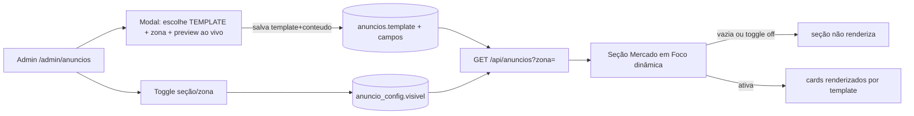

# Jornada — Anúncios Ricos (Templates, Preview, Home Dinâmica & Master Toggle)

> Status: concluída (admin) | Prioridade: alta | Wave: 5
> Última atualização: 2026-06-06
>
> **Desbloqueada em 2026-06-05** (aval de produto dado): pode reescrever a seção
> "Mercado em Foco" da landing tornando-a dinâmica. Engenharia destravada.
> Implementar **antes** da J23, que reusa os templates, o preview e a home
> dinâmica desta jornada.

## 1. Contexto & Objetivo
A J12/J16 entregaram o backend de anúncios, as 7 zonas e o `AdSidebarSlot` real.
Hoje o **formato visual do anúncio é fixo por zona** e a vitrine pública é
estática. Esta jornada fecha quatro lacunas:

1. **Templates de anúncio (formatos selecionáveis)** — hoje o layout do criativo
   é fixo: imagem 4:3 + título + CTA. O anunciante/admin precisa poder **escolher
   um template** por anúncio (ex.: `imagem-card` = imagem+título+anunciante+CTA;
   `banner-imagem` = só imagem clicável; `conteudo-texto` = card editorial com
   título+texto+fonte, tipo o "advertorial"; `cotacao/destaque-dados` = card com
   blocos de dados, no espírito do widget de cotações que o cliente sugeriu). Cada
   **zona aceita um subconjunto de templates** compatíveis com seu formato físico.
2. **Preview ao vivo** no painel admin — hoje o admin cola uma URL de imagem e
   salva às cegas. Com templates, o preview renderiza **o template escolhido**,
   fiel a como vai aparecer na zona (card 4:3 / banner 728×90 / editorial).
3. **Seção "Mercado em Foco" da home é hardcoded** — os dois cards ("Conteúdo de
   Marca" e "Widget de Cotação") são exemplos estáticos no JSX; só o slot
   `banner-qa` é dinâmico. A seção inteira deve virar gerenciável pelo admin,
   comportando **múltiplos anúncios de templates diferentes** lado a lado.
4. **Sem master toggle por local/seção** — hoje "desligar" é pausar campanha a
   campanha. Falta um interruptor de seção/zona ("ocultar Mercado em Foco da
   home"), e a seção deve sumir graciosamente quando vazia (não deixar buraco).

> **Nota sobre o widget de cotações:** o bloco "Ibovespa/Dólar/Euro" hoje
> hardcoded na home **não é dado real** — é um exemplo do **tipo de conteúdo**
> que o cliente sugeriu vender como anúncio. Nesta jornada ele deixa de ser
> código fixo e vira **um template de anúncio** (`destaque-dados`) que o admin
> preenche e ativa como qualquer outro criativo. Sem integração de bolsa real no
> escopo — é um template editorial de blocos de dados preenchidos manualmente.

## 2. Personas
- **Admin**: cria anúncio escolhendo **template** e **zona** compatíveis,
  com **preview ao vivo** fiel ao template; liga/desliga a seção "Mercado em
  Foco" e zonas individuais por um toggle.
- **Anunciante (via J23, futuro)**: reusa os mesmos templates/preview para montar
  seu próprio anúncio dentro do formato permitido.
- **Visitante público**: vê a seção "Mercado em Foco" **só quando há anúncio
  ativo**; caso contrário a seção inteira desaparece sem buraco no layout.

## 3. Fluxo ponta-a-ponta

## 4. Telas envolvidas
- [app/admin/anuncios/page.tsx](../../app/admin/anuncios/page.tsx) — painel; ganha o **seletor de template**, o preview no modal e o toggle de seção/zona.
- [app/page.tsx](../../app/page.tsx) — landing; a seção "Mercado em Foco" (hoje ~linhas 329-443) passa a ler do banco e some quando vazia.

## 5. Componentes-chave
- **Catálogo de templates** (a criar) — `features/shared/anuncios/templates/` : registry declarativo dos templates (`id`, `label`, `campos` que exige, `formatosCompatíveis`/zonas que o aceitam, e o componente de render). Fonte única consumida pelo seletor admin, pelo preview e pelo render público.
- A criar: `features/shared/anuncios/components/AdCreativeCard.tsx` — **dispatcher apresentacional** (sem I/O) que recebe `{ template, ...conteudo }` e delega para o componente do template correspondente. Variantes iniciais: `imagem-card`, `banner-imagem`, `conteudo-texto`, `destaque-dados`.
- [features/shared/anuncios/components/AdSidebarSlot.tsx](../../features/shared/anuncios/components/AdSidebarSlot.tsx) — **a refatorar** para renderizar via `AdCreativeCard` (passa a respeitar o `template` do anúncio em vez do layout fixo atual; sem regressão visual no template default).
- [features/admin/anuncios/components/VincularZonaModal.tsx](../../features/admin/anuncios/components/VincularZonaModal.tsx) — **a alterar**: dropdown de template (filtrado pelos compatíveis com a zona escolhida) + painel de preview lado a lado que renderiza o `AdCreativeCard` do template selecionado, ao vivo conforme os campos mudam.
- A criar: `features/landing/components/MercadoEmFoco.tsx` — seção dinâmica que consome os anúncios ativos das zonas da home e renderiza cada um pelo seu template (ou `return null` se vazia / toggle off).

## 6. Schema (Drizzle)
- Tabelas existentes em [shared/db/schema.ts](../../shared/db/schema.ts): `anuncios`, `anunciantes`, `anuncio_eventos`.
- **Templates — coluna em `anuncios`:** adicionar `template TEXT NOT NULL DEFAULT 'imagem-card'` (validada em app contra o registry de templates, mesma estratégia de `zona` validada por `isZonaValida`). Os campos extras que cada template usa (ex.: `texto`, `fonte`, blocos de dados do `destaque-dados`) ficam numa coluna `conteudo JSONB` (flexível, sem migration por template novo) — os campos já existentes (`imagemUrl`, `titulo`, `ctaTexto`, `ctaUrl`) seguem como colunas dedicadas por retrocompat. Migration idempotente via `server/bootstrap-anuncios.ts` (`ADD COLUMN IF NOT EXISTS`).
- **Master toggle — decisão tomada: Opção B** (interruptor explícito, independente do conteúdo): criar `anuncio_config` (id, chave [`secao:mercado-em-foco`, `zona:<id>`], `visivel BOOLEAN NOT NULL DEFAULT true`, `atualizado_em`). Permite "esconder a seção mesmo com campanha ativa", que a Opção A (derivada) não cobre. Migration idempotente via `server/bootstrap-anuncios.ts`.
- **Novas zonas da home** para os cards hoje hardcoded: adicionar ao catálogo estático `ZONAS` em [features/anuncios/anuncios-service.ts](../../features/anuncios/anuncios-service.ts) (ex.: `home-mercado` aceitando múltiplos criativos de templates variados). `anuncios.zona` é TEXT validado contra esse catálogo (`isZonaValida`) — **não precisa de migration** para novas zonas, só editar o catálogo. Cada zona declara também quais templates aceita.

## 7. Endpoints
- `GET /api/anuncios?zona=` — já existe ([features/anuncios/anuncios-service.ts](../../features/anuncios/anuncios-service.ts) `getAnuncioAtivoPorZona`); passa a retornar `template` + `conteudo` e a servir as novas zonas da home (ajustar para retornar lista quando a zona aceita múltiplos criativos).
- A criar: `GET/PATCH /api/admin/anuncios/config` — lê/grava o estado do master toggle por seção/zona (`anuncio_config`).
- Preview é **client-side puro** — não precisa de endpoint (renderiza o template+estado atual do form).

## 8. Mocks a remover
- [app/page.tsx](../../app/page.tsx) — remover o markup hardcoded dos cards "Conteúdo de Marca" (vira template `conteudo-texto`) e "Widget de Cotação" (vira template `destaque-dados` preenchido pelo admin), substituindo a seção pela `MercadoEmFoco` dinâmica.

## 9. Checklist de implementação
- [x] **Registry de templates** em `features/shared/anuncios/templates/`: 4 templates iniciais (`imagem-card`, `banner-imagem`, `conteudo-texto`, `destaque-dados`) com campos exigidos + zonas compatíveis
- [x] Coluna `anuncios.template` (default `imagem-card`) + `anuncios.conteudo JSONB` via `bootstrap-anuncios.ts` (idempotente); espelhar em [schema.ts](../../shared/db/schema.ts)
- [x] `AdCreativeCard` dispatcher apresentacional (sem fetch) que renderiza por `template`
- [x] `AdSidebarSlot` passa a renderizar via `AdCreativeCard` respeitando o `template` (sem regressão no template default)
- [x] Seletor de template no [VincularZonaModal.tsx](../../features/admin/anuncios/components/VincularZonaModal.tsx), filtrado pelos compatíveis com a zona; campos do form mudam conforme o template
- [x] Preview ao vivo: renderiza o `AdCreativeCard` do template escolhido; estados loading/erro de imagem/vazio
- [x] Adicionar a(s) zona(s) da home ao catálogo `ZONAS` em [anuncios-service.ts](../../features/anuncios/anuncios-service.ts), declarando templates aceitos
- [x] `MercadoEmFoco` consome os anúncios ativos das zonas da home e renderiza cada um pelo template; `return null` quando vazia ou toggle off
- [x] Substituir o JSX hardcoded em [app/page.tsx](../../app/page.tsx) pela seção dinâmica
- [x] `anuncio_config` + `GET/PATCH /api/admin/anuncios/config` + toggle de seção/zona no painel admin (Opção B)
- [x] Tracking de impressão/clique continua funcionando nas novas zonas/templates da home

## 10. Critérios de aceite
1. Admin cria anúncio, escolhe o template `imagem-card` e cola uma URL → vê o preview atualizar ao vivo; troca o template para `destaque-dados` → o form mostra campos de blocos de dados e o preview vira o card de dados; troca a zona p/ banner → só templates compatíveis aparecem no seletor.
2. Admin salva 2 anúncios de templates diferentes numa zona da home → recarregar a landing → a seção "Mercado em Foco" mostra os 2 criativos reais, cada um no seu template (não o exemplo hardcoded).
3. Admin pausa/oculta todas as campanhas da home → recarregar → a seção "Mercado em Foco" **desaparece inteira**, sem deixar espaço vazio.
4. Admin desliga o toggle "Mercado em Foco" (`anuncio_config.visivel=false`) mesmo com campanha ativa → seção some; religa → volta.
5. O widget de "cotações" não é mais código fixo: é um anúncio do template `destaque-dados` que o admin preenche/edita/desativa pelo painel.
6. Query de verificação: `SELECT zona, template, status FROM anuncios WHERE zona LIKE 'home-%';` reflete o que está na home.

## 11. Riscos / Pontos de atenção
- **Registry de templates como fonte única:** o mesmo registry deve alimentar o seletor admin, o preview e o render público. Se divergirem, o admin vê um preview que não corresponde ao que publica. Um template = um componente, consumido nos 3 lugares.
- **Validação de `template` server-side:** assim como `zona` é validada por `isZonaValida`, o `template` precisa ser validado contra o registry no POST/PATCH — não confiar no client. Template inválido → 400.
- **`conteudo JSONB` por template:** cada template declara quais chaves espera; validar o shape (zod por template) antes de salvar, senão o render público quebra com dado malformado.
- **Compatibilidade template×zona:** o seletor só deve oferecer templates compatíveis com a zona; e o backend deve rejeitar combinação inválida (ex.: `destaque-dados` numa zona de banner fino).
- **Preview precisa ser fiel**, não aproximado: reusar o `AdCreativeCard` real evita divergência entre o que o admin vê e o que publica. Não recriar markup paralelo.
- **CORS/hotlink de imagem**: a URL colada pode bloquear hotlinking — tratar `onError` no preview com fallback claro ("imagem não carregou / verifique a URL").
- **Layout shift na home**: a seção dinâmica não pode causar CLS — reservar/colapsar suavemente quando vazia (`return null` antes do paint, não depois).
- **Cache de 30s** do endpoint público vale também para a home — pausa reflete em ≤30s (aceito, herdado da J16).
- Se escolher Opção A (toggle derivado), documentar que "esconder seção com campanha ativa" fica fora de escopo até migrar para Opção B.

## 12. Links cruzados
- Depende de: J12 (backend + componente), J16 (slot plugado + tracking).
- Bloqueia: **J23** (self-service de anúncios) — o anunciante precisa do preview e da home dinâmica para ver o que está comprando. Implementar J24 antes da J23.
- Alimenta: J09 (impressões/cliques das novas zonas da home entram nos KPIs).

## 13. Gaps descobertos durante execução
> Doc viva. Registrar aqui o que apareceu no caminho e não estava no roteiro original. Uma linha por item, com data.

- **2026-06-02** — Jornada criada (bloqueada por decisão de produto). Investigação confirmou: seção "Mercado em Foco" em [app/page.tsx](../../app/page.tsx) tem 2 cards hardcoded (Unsplash + dados de bolsa estáticos) + 1 slot dinâmico (`banner-qa`); nenhum preview no [VincularZonaModal.tsx](../../features/admin/anuncios/components/VincularZonaModal.tsx); upload de criativo é por URL manual (presign de [app/api/uploads/](../../app/api/uploads/) existe mas não está plugado aqui — candidato a melhoria junto da J23).
- **2026-06-05** — **Desbloqueada** (aval de produto). Escopo ampliado com **templates de anúncio** (formatos selecionáveis por zona) a pedido do cliente: o layout do criativo deixa de ser fixo por zona. O widget de "cotações" sugerido pelo cliente foi reenquadrado como o template `destaque-dados` (dados preenchidos manualmente, sem integração de bolsa). Master toggle definido como **Opção B** (`anuncio_config`). Prioridade subiu p/ **alta** e movida p/ **Wave 5** por ser pré-requisito da J23 e por destravar a vitrine pública. Upload de criativo via presign ([app/api/uploads/](../../app/api/uploads/)) em vez de URL manual fica como melhoria a avaliar junto (reduz fricção e o risco de hotlink).
- **2026-06-06** — **Implementada (visão admin)**. Entregue: registry de templates server-safe (`features/shared/anuncios/templates/`) com 4 templates; colunas `anuncios.template`+`conteudo JSONB` + tabela `anuncio_config` via bootstrap idempotente (backfill p/ `imagem-card`); `AdCreativeCard` dispatcher; `AdSidebarSlot` refatorado sem regressão; `VincularZonaModal` reescrito (form dirigido por template + preview ao vivo + **upload R2** novo kind `anuncio_criativo` + persistência real); `CampanhaModal` com edição de metadados real; rota `GET/PATCH /api/admin/anuncios/config` + toggle no painel; endpoint público com branch single/lista por zona `multiplo`; zona `home-mercado` + `MercadoEmFoco` na landing (some quando vazia/toggle off); JSX hardcoded removido. **Decisões:** upload primário via R2 (não URL manual), sem seed permanente (seção some quando vazia). **Fora desta entrega:** J23 (empreiteiro/contratante/anunciantes externos) — admin-only por ora. Edição de `conteudo` rico pós-criação é feita recriando no VincularZonaModal; o CampanhaModal edita só metadados.
