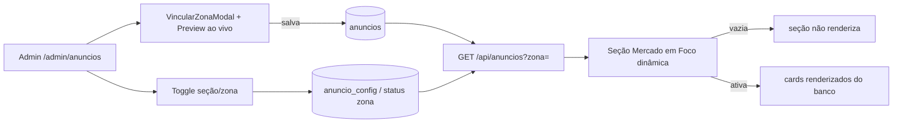

# Jornada — Anúncios Ricos (Preview, Home Dinâmica & Master Toggle)

> Status: bloqueada | Prioridade: média | Wave: 4
> Última atualização: 2026-06-02
>
> **Bloqueada por decisão de produto** (não por dependência técnica): aguarda o
> aval para reescrever a seção "Mercado em Foco" da landing. A engenharia está
> destravada — pode iniciar assim que liberada. Implementar **antes** da J23,
> que reusa o preview e a home dinâmica desta jornada.

## 1. Contexto & Objetivo
A J12/J16 entregaram o backend de anúncios, as 7 zonas e o `AdSidebarSlot` real.
Sobraram três lacunas de refinamento que esta jornada fecha:
1. **Preview ao vivo** no painel admin — hoje o admin cola uma URL de imagem e
   salva às cegas, sem ver como o card 4:3 / banner 728×90 vai ficar.
2. **Seção "Mercado em Foco" da home é hardcoded** — os dois cards ("Conteúdo de
   Marca" e "Widget de Cotação") são exemplos estáticos no JSX; só o slot
   `banner-qa` é dinâmico. A seção inteira deve virar gerenciável pelo admin.
3. **Sem master toggle por local/seção** — hoje "desligar" é pausar campanha a
   campanha. Falta um interruptor de seção/zona ("ocultar Mercado em Foco da
   home"), e a seção deve sumir graciosamente quando vazia (não deixar buraco).

## 2. Personas
- **Admin**: configura anúncio com **preview ao vivo** fiel ao formato da zona;
  liga/desliga a seção "Mercado em Foco" e zonas individuais por um toggle.
- **Visitante público**: vê a seção "Mercado em Foco" **só quando há anúncio
  ativo**; caso contrário a seção inteira desaparece sem buraco no layout.

## 3. Fluxo ponta-a-ponta

## 4. Telas envolvidas
- [app/admin/anuncios/page.tsx](../../app/admin/anuncios/page.tsx) — painel; ganha o preview no modal e o toggle de seção/zona.
- [app/page.tsx](../../app/page.tsx) — landing; a seção "Mercado em Foco" (hoje ~linhas 329-443) passa a ler do banco e some quando vazia.

## 5. Componentes-chave
- [features/admin/anuncios/components/VincularZonaModal.tsx](../../features/admin/anuncios/components/VincularZonaModal.tsx) — **a alterar**: adicionar painel de preview ao lado do form, atualizando ao vivo conforme `imagemUrl`/`titulo`/`ctaTexto` mudam, respeitando o formato da zona (4:3 web, 728×90 dashboard, landscape help).
- [features/shared/anuncios/components/AdSidebarSlot.tsx](../../features/shared/anuncios/components/AdSidebarSlot.tsx) — **a reaproveitar como base do preview**: extrair o markup de renderização do criativo (imagem `aspect-[4/3]` + fallback de texto + rodapé CTA) para um componente puro `AdCreativeCard` que recebe `props` (sem fetch), usável tanto no slot real quanto no preview admin.
- A criar: `features/shared/anuncios/components/AdCreativeCard.tsx` (apresentacional, sem I/O) + variantes por formato de zona.
- A criar: `features/landing/components/MercadoEmFoco.tsx` — seção dinâmica que consome os anúncios ativos das zonas da home e renderiza (ou `return null` se vazia).

## 6. Schema (Drizzle)
- Tabelas existentes em [shared/db/schema.ts](../../shared/db/schema.ts): `anuncios`, `anunciantes`, `anuncio_eventos`.
- **Decisão de modelagem do master toggle** (escolher na implementação):
  - **Opção A (sem schema novo):** o toggle de seção é derivado — a seção "Mercado em Foco" aparece sse ≥1 zona da home tem anúncio `ativa`. "Desligar" = pausar as campanhas daquelas zonas. Zero migration, mas não permite "esconder a seção mesmo com campanha ativa".
  - **Opção B (schema novo, recomendada):** criar `anuncio_config` (id, chave [`secao:mercado-em-foco`, `zona:<id>`], visivel boolean, atualizadoEm) para um interruptor explícito independente do conteúdo. Migration idempotente via `server/bootstrap-anuncios.ts`.
- **Novas zonas da home** para os 2 cards hoje hardcoded: adicionar ao catálogo estático `ZONAS` em [features/anuncios/anuncios-service.ts](../../features/anuncios/anuncios-service.ts) (ex.: `home-mercado-marca`, `home-mercado-cotacoes` — ou um id único `home-mercado` com múltiplos criativos). `anuncios.zona` é TEXT validado contra esse catálogo (`isZonaValida`), então **não precisa de migration de schema** para novas zonas — só editar o catálogo.

## 7. Endpoints
- `GET /api/anuncios?zona=` — já existe ([features/anuncios/anuncios-service.ts](../../features/anuncios/anuncios-service.ts) `getAnuncioAtivoPorZona`); passa a servir as novas zonas da home.
- A criar (se Opção B): `GET/PATCH /api/admin/anuncios/config` — lê/grava o estado do master toggle por seção/zona.
- Preview é **client-side puro** — não precisa de endpoint (renderiza o estado atual do form).

## 8. Mocks a remover
- [app/page.tsx](../../app/page.tsx) — remover o markup hardcoded dos cards "Conteúdo de Marca" e "Widget de Cotação" (imagem fixa do Unsplash + dados estáticos de bolsa), substituindo pela seção dinâmica `MercadoEmFoco`.

## 9. Checklist de implementação
- [ ] Extrair `AdCreativeCard` apresentacional de [AdSidebarSlot.tsx](../../features/shared/anuncios/components/AdSidebarSlot.tsx) (sem fetch; recebe `criativoUrl/titulo/subtitulo/ctaTexto/formato`)
- [ ] `AdSidebarSlot` passa a renderizar via `AdCreativeCard` (sem regressão visual)
- [ ] Preview ao vivo no [VincularZonaModal.tsx](../../features/admin/anuncios/components/VincularZonaModal.tsx): painel lado a lado, atualiza em tempo real, respeita o formato da zona selecionada (4:3 / 728×90 / landscape)
- [ ] Estado de imagem do preview: loading, erro (URL inválida), vazio (fallback de texto) — espelha o comportamento real do slot
- [ ] Adicionar novas zonas da home ao catálogo `ZONAS` em [anuncios-service.ts](../../features/anuncios/anuncios-service.ts)
- [ ] Componente `MercadoEmFoco` consome os anúncios ativos das zonas da home; `return null` quando todas vazias (seção some sem buraco)
- [ ] Substituir o JSX hardcoded em [app/page.tsx](../../app/page.tsx) pela seção dinâmica
- [ ] Master toggle no painel admin (Opção A derivada **ou** Opção B com `anuncio_config` + endpoint)
- [ ] Tracking de impressão/clique continua funcionando nas novas zonas da home

## 10. Critérios de aceite
1. Admin abre o modal de anúncio, cola uma URL de imagem → vê o preview do card 4:3 atualizar ao vivo; troca para uma zona de banner → preview vira 728×90.
2. Admin salva campanha numa zona da home → recarregar a landing → a seção "Mercado em Foco" aparece com o criativo real (não o exemplo hardcoded).
3. Admin pausa/oculta todas as campanhas da home → recarregar a landing → a seção "Mercado em Foco" **desaparece inteira**, sem deixar espaço vazio.
4. (Opção B) Admin desliga o toggle "Mercado em Foco" mesmo com campanha ativa → seção some; religa → volta.
5. Query de verificação: `SELECT zona, status FROM anuncios WHERE zona LIKE 'home-%';` reflete o que está na home.

## 11. Riscos / Pontos de atenção
- **Preview precisa ser fiel**, não aproximado: reusar o `AdCreativeCard` real evita divergência entre o que o admin vê e o que publica. Não recriar markup paralelo.
- **CORS/hotlink de imagem**: a URL colada pode bloquear hotlinking — tratar `onError` no preview com fallback claro ("imagem não carregou / verifique a URL").
- **Layout shift na home**: a seção dinâmica não pode causar CLS — reservar/colapsar suavemente quando vazia (`return null` antes do paint, não depois).
- **Cache de 30s** do endpoint público vale também para a home — pausa reflete em ≤30s (aceito, herdado da J16).
- Se escolher Opção A (toggle derivado), documentar que "esconder seção com campanha ativa" fica fora de escopo até migrar para Opção B.

## 12. Links cruzados
- Depende de: J12 (backend + componente), J16 (slot plugado + tracking).
- Bloqueia: **J23** (self-service de anúncios) — o anunciante precisa do preview e da home dinâmica para ver o que está comprando. Implementar J24 antes da J23.
- Alimenta: J09 (impressões/cliques das novas zonas da home entram nos KPIs).

## 13. Gaps descobertos durante execução
> Doc viva. Registrar aqui o que apareceu no caminho e não estava no roteiro original. Uma linha por item, com data.

- **2026-06-02** — Jornada criada (bloqueada por decisão de produto). Investigação confirmou: seção "Mercado em Foco" em [app/page.tsx](../../app/page.tsx) tem 2 cards hardcoded (Unsplash + dados de bolsa estáticos) + 1 slot dinâmico (`banner-qa`); nenhum preview no [VincularZonaModal.tsx](../../features/admin/anuncios/components/VincularZonaModal.tsx); upload de criativo é por URL manual (presign de [app/api/uploads/](../../app/api/uploads/) existe mas não está plugado aqui — candidato a melhoria junto da J23).
