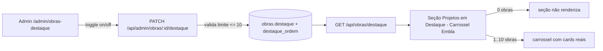

# Jornada — Obras em Destaque na Home (Curadoria Admin + Carrossel)

> Status: pronto | Prioridade: alta | Wave: 5
> Última atualização: 2026-06-05
>
> **Criada em 2026-06-05** a partir de demanda de produto: a seção "Projetos em
> Destaque" da landing hoje é 100% hardcoded (3 obras fictícias). Tornar a
> curadoria dinâmica pelo admin, exibindo obras reais num carrossel. Sem
> dependência de gateway/billing — pode iniciar a qualquer momento.

## 1. Contexto & Objetivo
A seção "Projetos em Destaque" em [app/page.tsx:275-327](../../app/page.tsx) mostra
**3 cards fictícios** ("Residência Aurora/Alphaville", "Edifício Horizonte",
"Loft Industrial") com imagens placeholder (`lh3.googleusercontent.com/aida-public/...`).
Não há coluna `destaque` em `obras`, nem endpoint, nem tela admin para curar isso.

Objetivo: dar ao admin uma **curadoria editorial leve** — uma tela onde ele vê as
obras e, com um toggle simples ("chavezinha"), marca quais aparecem como destaque
na home, com **limite de 10** e **contador**. A home passa a exibir as obras
destacadas num **carrossel** (reaproveitando o `embla-carousel-react` já instalado),
em vez do grid fixo de 3.

**Princípio:** é curadoria, não automação. O admin escolhe manualmente o que
promover (vitrine institucional), sem expor dados sensíveis da obra — o card
público mostra só o essencial (imagem, título, localização).

## 2. Personas
- **Admin**: numa tela de curadoria, liga/desliga obras como destaque (máx. 10),
  com contador "X/10" e bloqueio ao tentar a 11ª (precisa desativar uma antes).
  Opcionalmente registra um motivo/nota interna e ordena os destaques.
- **Visitante público**: vê na home um carrossel com as obras destacadas (ou,
  se nenhuma estiver marcada, a seção some graciosamente — sem grid fake).

## 3. Fluxo ponta-a-ponta

## 4. Telas envolvidas
- **A criar:** `app/admin/obras-destaque/page.tsx` — tela de curadoria. Tabela/lista
  de obras (nome, localização, status, imagem) com um **switch de destaque** por
  linha + contador "X/10" no topo. (Alternativa: uma aba dentro de
  [app/admin/obras/[id]/page.tsx](../../app/admin/obras/[id]/page.tsx) e/ou um filtro
  "só destacadas" na listagem admin de obras existente — decidir na implementação;
  a tela dedicada é mais clara para curadoria.)
- [app/page.tsx](../../app/page.tsx) — a seção "Projetos em Destaque" (linhas 275-327)
  passa a consumir `GET /api/obras/destaque` e renderizar um carrossel; `return null`
  quando vazia.

## 5. Componentes-chave
- **A criar:** `features/admin/obras-destaque/` — service + hooks (React Query) +
  componentes da tela de curadoria (switch + contador + estado de limite atingido).
- **A criar:** `features/landing/components/ObrasDestaqueCarousel.tsx` — carrossel
  público com `embla-carousel-react` (já em `package.json`). Cards no mesmo formato
  visual do atual (imagem `aspect-video`, título, localização) + setas/dots de
  navegação, responsivo (1 card mobile / 2-3 desktop), acessível (teclado, aria).
- **Reusar:** o card de obra pode espelhar o markup atual (linhas 310-323) extraído
  para um componente apresentacional `ObraDestaqueCard`.

## 6. Schema (Drizzle)
- **Coluna em `obras`** ([shared/db/schema.ts](../../shared/db/schema.ts), tabela `obras`):
  - `destaque BOOLEAN NOT NULL DEFAULT FALSE` — marca a obra como destaque.
  - `destaque_ordem INTEGER` (nullable) — ordem de exibição no carrossel (admin
    arrasta/define; se null, ordena por `destaque` mais recente).
  - (opcional) `destaque_motivo TEXT` (nullable) — nota interna do admin (não exibida ao público).
  - Migration idempotente via `server/bootstrap-obras.ts` (`ADD COLUMN IF NOT EXISTS`);
    espelhar em [schema.ts](../../shared/db/schema.ts).
  - **Índice parcial** `CREATE INDEX ... ON obras (destaque_ordem) WHERE destaque = true`
    para listar os destaques rápido.
- **Limite de 10 — onde garantir:** validar no endpoint de PATCH (contar destaques
  ativos antes de ativar o 11º → 409/422 com mensagem clara). Um índice não força
  "máx N linhas", então a regra é de aplicação. (Defesa extra opcional: checagem
  atômica via `SELECT count(*) ... FOR UPDATE` ou transação.)

## 7. Endpoints
- **A criar:** `PATCH /api/admin/obras/[id]/destaque` — body `{ destaque: boolean, ordem?, motivo? }`.
  Guard `isAdminLike`. Ao ativar, valida o limite de 10 (rejeita o 11º). Audita em `audit_logs` (`obra.destaque.toggle`).
- **A criar:** `GET /api/admin/obras/destaque` — lista as obras destacadas para a tela de curadoria (com ordem).
- **A criar:** `GET /api/obras/destaque` — **público**, read-only, retorna só os campos
  seguros (id, nome, cidade/uf, imagem de capa, slug/href se houver) das obras
  destacadas, ordenadas. Cacheável (ex.: 60s) como as demais rotas públicas.
- Reaproveitar a imagem de capa da obra: confirmar de onde vem a foto pública
  (anexos da obra? primeira imagem? campo dedicado?) — se não houver capa pública
  definida, **adicionar a escolha da imagem de capa na tela de curadoria** (decisão
  de implementação; ver Riscos).

## 8. Mocks a remover
- [app/page.tsx](../../app/page.tsx) — remover o array hardcoded de 3 projetos fictícios
  (linhas 290-308) + imagens `lh3.googleusercontent.com/aida-public/...`, substituindo
  pelo `ObrasDestaqueCarousel` que consome `/api/obras/destaque`.

## 9. Checklist de implementação
- [x] Colunas `obras.destaque` (default false) + `destaque_ordem` + `foto_capa_file_id` via [bootstrap-obras.ts](../../server/bootstrap-obras.ts) (idempotente, FK `ON DELETE SET NULL`); espelhadas em [schema.ts](../../shared/db/schema.ts)
- [x] Índice parcial `idx_obras_destaque_ordem (destaque_ordem) WHERE destaque = true`
- [x] `PATCH /api/admin/obras/[id]/destaque` com guard admin + **validação de limite 10** (transação `FOR UPDATE`) + validação de capa + auditoria `admin.obra.destaque.toggle`
- [x] `GET /api/admin/obras/destaque` (curadoria + contador) e `GET /api/obras/destaque` (público, whitelist de campos seguros, cacheável 60s)
- [x] Tela [app/admin/obras-destaque/](../../app/admin/obras-destaque/page.tsx) — lista de obras (publicadas+aprovadas) + switch por linha + **contador "X/10"** + bloqueio ao atingir o limite
- [ ] (opcional) Reordenar destaques (drag-and-drop) gravando `destaque_ordem` — **follow-up**: a coluna existe; o PATCH aceita `ordem`, mas a UI de reordenar fica para depois
- [x] [ObraDestaqueCard](../../features/landing/components/ObraDestaqueCard.tsx) apresentacional (extraído do markup hardcoded)
- [x] [ObrasDestaqueCarousel](../../features/landing/components/ObrasDestaqueCarousel.tsx) com `embla-carousel-react` (via `Carousel` shadcn): responsivo (1/2/3 por breakpoint), setas, acessível, loop quando >3
- [x] Imagem de capa: **congelada** via `foto_capa_file_id` — admin escolhe entre as fotos da obra ([SelecionarCapaModal](../../features/admin/obras-destaque/components/SelecionarCapaModal.tsx)); não muda se o contratante alterar as fotos
- [x] Substituído o grid hardcoded em [app/page.tsx](../../app/page.tsx) pelo carrossel; `return null` quando vazio (seção some)
- [x] Item "Destaques" no menu admin ([features/admin/constants.ts](../../features/admin/constants.ts))

## 10. Critérios de aceite
1. Admin abre `/admin/obras-destaque` → vê a lista de obras com um switch de destaque e o contador "0/10".
2. Admin ativa o destaque de uma obra → contador vira "1/10"; recarregar a home → a obra aparece no carrossel "Projetos em Destaque" (dados reais, não os fictícios).
3. Admin tenta ativar a 11ª obra com 10 já ativas → bloqueado com mensagem clara; contador permanece "10/10".
4. Admin desativa uma obra → ela some do carrossel; contador decrementa.
5. Nenhuma obra destacada → a seção "Projetos em Destaque" **não renderiza** na home (sem grid fake, sem buraco).
6. O carrossel navega por setas/dots e por teclado; em mobile mostra 1 card por vez, em desktop 2-3.
7. Query de verificação: `SELECT id, nome, destaque, destaque_ordem FROM obras WHERE destaque = true ORDER BY destaque_ordem;` reflete o que está na home.

## 11. Riscos / Pontos de atenção
- **Imagem de capa pública:** obras podem não ter uma foto "de capa" curada — usar anexo aleatório pode expor imagem inadequada. Decidir: campo de capa dedicado, ou o admin escolhe a imagem na tela de curadoria. **Não publicar imagem sem curadoria.**
- **Privacidade da obra:** o card público deve expor só o essencial (nome, cidade/UF, imagem). NÃO vazar valor, contratante, empreiteira, endereço completo, status financeiro. Endpoint público com whitelist de campos.
- **Obra que muda de estado:** se uma obra destacada for arquivada/cancelada/despublicada, ela deve sair do carrossel automaticamente (filtrar por status válido no `GET /api/obras/destaque`, não só por `destaque=true`).
- **Limite 10 sob concorrência:** dois toggles simultâneos podem furar o limite — validar atomicamente (transação/SELECT count FOR UPDATE) ou aceitar verificação simples (risco baixíssimo com 1 admin).
- **Carrossel e CLS/acessibilidade:** Embla é leve, mas garantir navegação por teclado, `aria-roledescription="carousel"`, e reserva de altura para não causar layout shift.
- **Consentimento do cliente final:** exibir uma obra real publicamente pode exigir aval do contratante/empreiteira dona da obra. Decisão de produto/jurídico: pedir opt-in antes de permitir destaque? Registrar quando decidido.

## 12. Links cruzados
- Relacionada: J24 (home dinâmica — ambas reescrevem seções hardcoded da landing; podem compartilhar o padrão de "seção some quando vazia").
- Depende de: dados reais de obras (J03/J06 — já entregues).
- Não depende de: J14 (gateway). É curadoria editorial, sem billing.

## 13. Gaps descobertos durante execução
> Doc viva. Registrar aqui o que apareceu no caminho e não estava no roteiro original. Uma linha por item, com data.

- **2026-06-05** — Jornada criada a partir de auditoria `/jornada`. Confirmado: "Projetos em Destaque" 100% hardcoded ([app/page.tsx:275-327](../../app/page.tsx)); sem coluna `destaque` em `obras`; sem endpoint; sem tela admin. `embla-carousel-react` já está em `package.json` (instalado, sem uso) — base pronta para o carrossel. Decisão de imagem de capa pública e de consentimento do dono da obra ficam como pontos a resolver na implementação.
- **2026-06-05** — **Entregue.** Capa **congelada** resolvida: `foto_capa_file_id` com FK `ON DELETE SET NULL` (`obra_fotos.file_id` é cascade, então capa deletada → null → obra sai do carrossel; nunca publica imagem não-curada). Admin escolhe a capa entre as fotos reais da obra (reusa `GET /api/obras/[id]/fotos`, que já libera admin via `findObraAccess`). Endpoint público com whitelist (sem valor/contratante/endereço). Limite 10 em transação `FOR UPDATE`. Carrossel reusa o `Carousel` shadcn (Embla) já existente. Schema aplicado via bootstrap idempotente (colunas + FK + índice parcial verificados no banco); endpoint público retorna 200. type-check limpo.
- **2026-06-05** — **Consentimento do dono da obra**: mantido apenas curadoria admin por ora (decisão de produto). Exibir obra real na home só depende do admin marcar; opt-in do contratante/empreiteira é decisão jurídica a revisitar (junto de J20/J28). Reordenação manual de destaques (`destaque_ordem`) fica como follow-up — coluna e PATCH já suportam.
