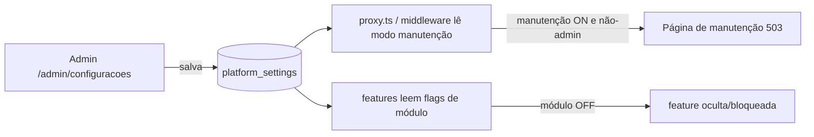

# Jornada — Ativação das Configurações da Plataforma (tirar config do "modo fantasma")

> Status: pronto | Prioridade: alta | Wave: 5
> Última atualização: 2026-06-05
>
> **Criada em 2026-06-05** a partir de auditoria `/jornada`. Achado de risco
> operacional: o painel de configurações do admin grava no banco, mas **nada no
> sistema lê** esses valores — os toggles dão ilusão de controle sem efeito real.

## 1. Contexto & Objetivo
[app/admin/configuracoes/page.tsx](../../app/admin/configuracoes/page.tsx) oferece ao
admin vários controles (modo manutenção, módulos on/off, política de segurança,
webhooks, descrição da plataforma) que **persistem** em `platform_settings` via
[app/api/admin/configuracoes/route.ts](../../app/api/admin/configuracoes/route.ts).
Porém, o único consumidor de `useAdminConfig`
([features/admin/hooks/use-admin-config.ts](../../features/admin/hooks/use-admin-config.ts))
é **a própria página de config**. Ou seja: o admin liga "modo manutenção" e nada
acontece; desliga o módulo "anúncios" e os anúncios continuam aparecendo; clica
"Testar webhook" e é um `setTimeout` fake.

**Isto é pior do que não existir** — passa ao admin uma sensação falsa de controle,
com risco operacional (acha que colocou o site em manutenção e não colocou).

Objetivo: para cada toggle, **ou** fazê-lo ter efeito real, **ou** removê-lo/ocultá-lo
até ser implementado. Nada de controle que mente. MVP-first: priorizar o **modo
manutenção** (o mais perigoso de fingir) e o **gating de módulos**; webhooks reais
ficam para depois.

## 2. Personas
- **Admin**: configura a plataforma e confia que os controles têm efeito real.
- **Todos os usuários**: afetados por modo manutenção (veem página de manutenção)
  e por módulos desligados (feature some/bloqueia).

## 3. Fluxo ponta-a-ponta

## 4. Telas envolvidas
- [app/admin/configuracoes/page.tsx](../../app/admin/configuracoes/page.tsx) — auditar
  cada controle: marcar quais passam a ter efeito e **remover/ocultar** os que não
  serão implementados agora (não deixar toggle morto).
- **A criar:** `app/manutencao/page.tsx` (ou resposta 503 do proxy) — tela exibida
  quando o modo manutenção está ligado.

## 5. Componentes-chave
- [features/admin/hooks/use-admin-config.ts](../../features/admin/hooks/use-admin-config.ts)
  — hoje só lê para a UI de config. Criar um leitor **server-side** das settings
  (cacheado) para o proxy e as features consumirem.
- [proxy.ts](../../proxy.ts) — já roda guards globais (J19). Ponto natural para checar
  o modo manutenção antes de servir páginas (admin sempre passa).
- **A criar:** helper `getPlatformSetting(chave)` server-side com cache curto, lendo
  `platform_settings`, para uso em features (gating de módulo) e no proxy.

## 6. Schema (Drizzle)
- `platform_settings` ([shared/db/schema.ts:451](../../shared/db/schema.ts)) **já existe**
  — sem migration nova. É uma tabela chave/valor; cada controle é uma chave.
- Nenhuma tabela nova obrigatória. Eventual normalização de chaves pode ser feita
  na implementação (documentar as chaves canônicas: `manutencao.ativo`,
  `modulos.anuncios`, `modulos.faq`, `seguranca.timeoutMin`, etc.).

## 7. Endpoints
- `GET/PATCH /api/admin/configuracoes` — **já existe**. Mantém.
- Não precisa de endpoint novo: o consumo passa a ser server-side direto (proxy +
  features), não por API pública.

## 8. Mocks a remover
- O **"Testar webhook"** que é `setTimeout` fake na página de config — ou implementar
  disparo real, ou remover o botão até a implementação real.
- Qualquer toggle exibido que não tenha efeito (decisão item a item: implementar vs ocultar).

## 9. Checklist de implementação
- [x] Inventário: cada controle mapeado → seguro (implementado) vs crítico (movido p/ J30)
- [x] Helper server-side `getPlatformSetting(chave)` com cache curto _([settings-reader.ts](../../features/admin/platform-settings/server/settings-reader.ts): cache TTL 30s, **fail-open**, `isManutencaoAtiva`/`getSenhaMinima`)_
- [x] **Modo manutenção real:** [proxy.ts](../../proxy.ts) lê `plataforma.manutencao`; não-admin em `/contratante`/`/empreiteiro` → redirect `/manutencao`; admin passa; landing `/` no ar
- [x] `app/manutencao/page.tsx` (tela amigável, `noindex`)
- [x] **Gating de módulo:** anúncios ([/api/anuncios](../../app/api/anuncios/route.ts) retorna null quando off) e FAQ (páginas consultam a flag via [public-config](../../app/api/plataforma/public-config/route.ts) → `ModuloIndisponivel`)
- [x] Senha mínima lida no registro e troca de senha _([password.ts](../../features/auth/schemas/password.ts) `minLength` com piso 8; plugado em `register` e `change-password`)_
- [x] Webhooks: botão "Testar" fake **removido** + nota "em breve"; disparo real movido p/ J30
- [x] Descrição/nome da plataforma consumidos no rodapé _([SiteFooter.tsx](../../features/landing/components/SiteFooter.tsx) via `usePublicConfig`)_
- [x] Controles críticos sem efeito **ocultados** ("em breve") em vez de mentir: timeout, máx tentativas, 2FA global, bloqueio por perfil, relatórios → **J30**
- [x] **Modal de confirmação reforçado** ([ConfirmImpactDialog](../../features/admin/configuracoes/components/ConfirmImpactDialog.tsx)) ao ligar o modo manutenção
- [x] Invalidação de cache no PATCH de configurações (efeito imediato)
- [x] Endpoint público enxuto [/api/plataforma/public-config](../../app/api/plataforma/public-config/route.ts) (whitelist: nome/descrição + flags anuncios/faq)

## 10. Critérios de aceite
1. Admin liga "modo manutenção" → visitante não-admin vê página de manutenção (503); admin continua navegando normalmente. Desliga → site volta.
2. Admin desliga o módulo "anúncios" → a seção/feature de anúncios sai do ar para os usuários; religa → volta.
3. Nenhum toggle visível na página de config é "fantasma": todo controle exibido ou tem efeito demonstrável, ou foi removido/ocultado.
4. O botão "Testar webhook" ou dispara um webhook real verificável, ou não existe mais.
5. Query de verificação: alterar uma chave em `platform_settings` e observar o comportamento correspondente mudar.

## 11. Riscos / Pontos de atenção
- **Não se trancar fora:** o modo manutenção precisa **sempre** liberar admin/superadmin, senão o admin se bloqueia. Testar exaustivamente o bypass admin.
- **Cache vs reatividade:** settings server-side cacheadas precisam de TTL curto (ou invalidação no PATCH) para o toggle refletir rápido.
- **Gating de módulo no backend, não só na UI:** esconder no front sem bloquear no endpoint é falsa segurança — desligar um módulo deve bloquear também a API correspondente.
- **Escopo MVP:** resista a implementar tudo. Modo manutenção + gating de módulos cobrem o risco maior; webhooks/políticas avançadas podem ser ocultados e adiados sem dívida de confiança.

## 12. Links cruzados
- Depende de: J19 (proxy.ts já é o ponto de guard global — reusar).
- Relacionada: J18 (admin), J02 (preferências — não confundir com settings globais).

## 13. Gaps descobertos durante execução
> Doc viva. Registrar aqui o que apareceu no caminho e não estava no roteiro original.

- **2026-06-05** — Jornada criada por auditoria. Confirmado: `useAdminConfig` só é consumido por [app/admin/configuracoes/page.tsx](../../app/admin/configuracoes/page.tsx) (nenhum outro leitor); "Testar webhook" é `setTimeout` fake; `platform_settings` já existe no schema. Decisão pendente item-a-item: implementar vs ocultar cada controle.
- **2026-06-05** — **Entregue.** Implementado o subconjunto seguro: modo manutenção (proxy, com `ConfirmImpactDialog`), gating de anúncios/FAQ, senha mínima (piso 8), nome/descrição no footer. Leitor `settings-reader` com cache fail-open (erro de DB nunca liga manutenção). Itens críticos (timeout, máx tentativas, 2FA global, bloqueio por perfil, relatórios, webhooks reais) **ocultados** e desmembrados na nova **[J30](30-configuracoes-criticas-seguranca.md)**. type-check limpo.
- **2026-06-05** — Decisão técnica do leitor no proxy: o `proxy.ts` (runtime nodejs) importa `isManutencaoAtiva` de um módulo mínimo (`settings-reader`) que só puxa `db` + schema, evitando o bundle de `auth-utils`. Cache de 30s + invalidação no PATCH. Risco de bundle monitorado; se crescer, alternativa é query crua via `pg` Pool. Admin é isento por short-circuit de role antes de tocar o DB.
