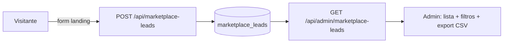

# Jornada — Gestão de Leads do Marketplace (admin)

> Status: pronto | Prioridade: alta | Wave: 5
> Última atualização: 2026-06-05
>
> **Criada em 2026-06-05** a partir de auditoria `/jornada`. Achado: a captura de
> leads do marketplace já existe e grava no banco, mas **o admin não tem nenhuma
> tela para ver/exportar essa lista** — o ativo de go-to-market está invisível.

## 1. Contexto & Objetivo
A landing captura interessados ("quero saber quando o marketplace lançar" / lista de
espera) via [app/api/marketplace-leads/route.ts](../../app/api/marketplace-leads/route.ts),
gravando em `marketplace_leads` ([shared/db/schema.ts:388](../../shared/db/schema.ts)).
Mas não existe tela, hook ou endpoint admin para **ler** essa lista — os leads
entram e "morrem" no banco. Se o marketplace é a aposta ("em breve" na home),
perder visibilidade desses leads é perder o canal de lançamento.

Objetivo (enxuto, alto valor): uma tela admin **read-only** que lista os leads com
filtros básicos e **export CSV**, para o time acionar a lista quando lançar. Sem
automação de e-mail nesta jornada (isso é evolução).

## 2. Personas
- **Admin / superadmin**: vê a lista de leads capturados, filtra (data, status,
  busca por e-mail/nome), exporta CSV para campanha de lançamento.
- **Visitante público**: continua se cadastrando como hoje (sem mudança no fluxo de captura).

## 3. Fluxo ponta-a-ponta

## 4. Telas envolvidas
- **A criar:** tela admin de leads — pode ser uma aba dentro de uma área admin
  existente (ex.: junto de clientes/usuários) ou rota própria `app/admin/leads/`.
  Lista paginada + filtros + botão "Exportar CSV".

## 5. Componentes-chave
- **A criar:** `features/admin/leads/` — service + hook (React Query) + componente
  de tabela. Reaproveitar padrões das tabelas admin existentes (ex.: `UsuariosTab`,
  paginação/filtros já usados em outras telas admin).
- Reusar utilitário de export CSV se já houver no projeto; senão, gerar CSV simples
  no client a partir dos dados, ou endpoint que devolve `text/csv`.

## 6. Schema (Drizzle)
- `marketplace_leads` ([shared/db/schema.ts:388](../../shared/db/schema.ts)) **já existe**
  (tem `status`, `created_at`, e os campos do lead). **Sem migration nova.**
- (Opcional) Se quiser marcar leads já contatados, usar/estender a coluna `status`
  existente (ex.: `novo` → `contatado` → `convertido`). Decidir na implementação.

## 7. Endpoints
- **A criar:** `GET /api/admin/marketplace-leads` — paginado, filtros (status, busca,
  intervalo de data), guard `isAdminLike`. Read-only.
- **A criar (ou parâmetro do anterior):** export CSV — `GET /api/admin/marketplace-leads?format=csv`
  retornando `text/csv` com os campos seguros.
- (Opcional) `PATCH /api/admin/marketplace-leads/[id]` — atualizar `status` (contatado/convertido), se entrar no escopo.

## 8. Mocks a remover
- Nenhum mock — é gap de funcionalidade (tela inexistente), não dado fake.

## 9. Checklist de implementação
- [x] `GET /api/admin/marketplace-leads` paginado + filtros + guard admin _([route.ts](../../app/api/admin/marketplace-leads/route.ts) → `listarLeadsAdmin`; filtros status/busca/data; `requireAdmin`)_
- [x] Export CSV (campos seguros, encoding UTF-8, separador adequado a pt-BR) _(client-side via `downloadCSV` extraído para [shared/lib/csv.ts](../../shared/lib/csv.ts) com BOM UTF-8; fetch `?all=1` auditado em `audit_logs` `admin.marketplace_lead.export`)_
- [x] Tela admin: tabela paginada (server-side) + filtros (status/busca/data) + botão exportar _([app/admin/marketplace-leads/page.tsx](../../app/admin/marketplace-leads/page.tsx) + [MarketplaceLeadsTable.tsx](../../features/admin/marketplace-leads/components/MarketplaceLeadsTable.tsx))_
- [x] Atualizar `status` do lead (pendente/notificado/descartado) _([[id]/route.ts](../../app/api/admin/marketplace-leads/[id]/route.ts) PATCH + select inline na tabela; auditado `admin.marketplace_lead.status`)_
- [x] Contador de leads (KPIs por status na própria tela) _(StatsCard total + pendente/notificado/descartado via `contarLeadsPorStatus`)_ — KPI no dashboard admin geral fica como follow-up opcional
- [x] Item no menu admin _("Leads" em `ADMIN_NAV_ITEMS`, [features/admin/constants.ts](../../features/admin/constants.ts))_

## 10. Critérios de aceite
1. Admin abre a tela de leads → vê a lista de `marketplace_leads` reais com data e status.
2. Admin filtra por intervalo de data / busca por e-mail → lista filtra corretamente.
3. Admin clica "Exportar CSV" → baixa arquivo com os leads (abre certo no Excel/Sheets, acentuação ok).
4. Usuário não-admin recebe 403 no endpoint.
5. Query de verificação: a contagem na tela bate com `SELECT count(*) FROM marketplace_leads`.

## 11. Riscos / Pontos de atenção
- **LGPD:** leads são dados pessoais. Export deve ser restrito a admin, logado em
  `audit_logs` (quem exportou, quando). Considerar finalidade declarada na captura.
- **Volume:** paginar desde o início (não carregar tudo). CSV pode ser grande —
  streamar ou limitar/segmentar por filtro.
- **Não duplicar captura:** esta jornada **só lê**; não mexe no fluxo de captura
  público existente.

## 12. Links cruzados
- Relacionada: J18 (dashboards admin — o KPI de leads pode entrar lá).
- Independente de: J14 (gateway), J23/J24 (anúncios).

## 13. Gaps descobertos durante execução
> Doc viva. Registrar aqui o que apareceu no caminho.

- **2026-06-05** — Jornada criada por auditoria. Confirmado: captura existe em [app/api/marketplace-leads/route.ts](../../app/api/marketplace-leads/route.ts) (insert), tabela `marketplace_leads` no schema, **nenhuma** tela/hook/endpoint admin de leitura. `status` já é coluna da tabela (base para lifecycle de lead, se desejado).
- **2026-06-05** — **Entregue.** Paginação **server-side** (LGPD/volume). Export CSV reusa `downloadCSV` (extraído de `RelatoriosSection` para [shared/lib/csv.ts](../../shared/lib/csv.ts), compartilhado). Export é auditado (`admin.marketplace_lead.export`) e mudança de status também (`admin.marketplace_lead.status`). Sem migration (tabela já existia). type-check limpo. Follow-up opcional: KPI de leads no dashboard admin geral (J18) e automação de e-mail para a lista (fora do escopo desta jornada).
