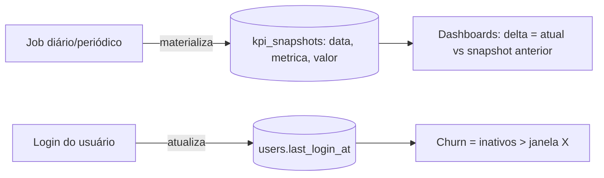

# Jornada — Observabilidade Histórica (snapshots de KPI, deltas reais, churn)

> Status: pronto | Prioridade: baixa | Wave: 6
> Última atualização: 2026-06-05
>
> **Criada em 2026-06-05** a partir de auditoria `/jornada`. Pós-MVP: agrupa itens
> P2 do backlog que dependem de **histórico acumulado** para fazer sentido. Não
> bloqueia lançamento — só ganha valor com volume real ao longo do tempo.

## 1. Contexto & Objetivo
Vários indicadores dos dashboards (J17/J18) hoje aparecem **zerados ou ocultos**
porque não há histórico para comparar:
- `*Delta` / `desvioPercentual` "vs período anterior" → zerados (sem snapshot do
  período anterior). Decisão correta na época: **não inventar dado**.
- `churnEmpreiteirosPercent` → `0` porque não há rastreio de último login.

Objetivo: criar a base de **observabilidade histórica** — snapshots periódicos dos
KPIs e rastreio de last-login — para que os deltas e o churn passem a refletir a
realidade. É fundação de dados, não tela nova (as telas já existem, só faltam os números).

## 2. Personas
- **Admin**: vê deltas reais ("+12% vs mês passado") e churn real nos dashboards.
- (Sistema): job periódico que materializa snapshots.

## 3. Fluxo ponta-a-ponta

## 4. Telas envolvidas
- [app/admin/financeiro/page.tsx](../../app/admin/financeiro/page.tsx) e demais dashboards
  admin/persona (J17/J18) — passam a exibir deltas/churn reais (sem mudança estrutural,
  só os números deixam de ser zero).

## 5. Componentes-chave
- **A criar:** job de snapshot (no padrão dos jobs existentes em `instrumentation.ts`,
  ex.: [features/financeiro/mark-overdue-job.ts](../../features/financeiro/mark-overdue-job.ts)).
- **A criar:** service de cálculo de delta (atual vs snapshot do período anterior).
- Atualizar o ponto de login ([app/api/auth/login/route.ts](../../app/api/auth/login/route.ts))
  para gravar `last_login_at`.

## 6. Schema (Drizzle)
- **A criar:** `kpi_snapshots` (id, `metrica` TEXT, `escopo` [global/obra/persona], `valor` NUMERIC,
  `periodo` DATE, `criado_em`). Migration idempotente via novo `server/bootstrap-kpi-snapshots.ts`.
- **Coluna em `users`:** `last_login_at TIMESTAMP` (nullable), via `bootstrap` idempotente.
- Índices por `(metrica, periodo)` e `(last_login_at)`.

## 7. Endpoints
- Em geral **sem endpoint novo** — os dashboards existentes passam a calcular deltas
  a partir dos snapshots. Se necessário, um `GET /api/admin/kpi-historico?metrica=` para séries temporais.

## 8. Mocks a remover
- Nenhum mock — os deltas hoje são **honestamente zerados** (não fake). Esta jornada
  os preenche com dado real.

## 9. Checklist de implementação
- [x] Tabela `kpi_snapshots` (índice ÚNICO `(metrica, periodo)` = idempotência) + bootstrap idempotente ([bootstrap-kpi-snapshots.ts](../../server/bootstrap-kpi-snapshots.ts)) + espelho em [schema.ts](../../shared/db/schema.ts)
- [x] Coluna `users.last_login_at` + gravação no login — feita no [session-issuer.ts](../../features/auth/api/session-issuer.ts) (`emitirSessao`), que cobre **login normal E 2FA** num só ponto; fire-and-forget (não quebra o login). Helper `updateUserLastLogin` em [auth-storage.ts](../../features/auth/api/auth-storage.ts)
- [x] Job periódico que materializa os KPIs-chave por período ([snapshot-kpis-job.ts](../../features/financeiro/snapshot-kpis-job.ts), registrado em [instrumentation.ts](../../instrumentation.ts)) — `usuariosAtivos`, `volumeContratado`, `taxasPlataforma`; `ON CONFLICT DO NOTHING` (idempotente). **Validado: 1ª run inserted=3, 2ª run inserted=0**
- [x] Service de delta (atual vs período anterior) — `getSnapshotValor`/`calcularDeltaPercent` em [caixa-service.ts](../../features/admin/financeiro/api/caixa-service.ts); **validado: base 6 → atual 9 = +50%**
- [x] Janela de churn (empreiteiro sem login há > 60 dias; conta nunca-logada só conta se cadastro antigo) → `churnEmpreiteirosPercent` real
- [x] Reativados os deltas em `getAdoptionMetrics` (`usuariosAtivos30dDeltaPercent` e `churnEmpreiteirosPercent` deixaram de ser `0` hardcoded). [AdoptionMetricsSection.tsx](../../features/admin/financeiro/components/AdoptionMetricsSection.tsx) não mudou — só recebe dados reais
- [x] ~~(opcional) Série temporal~~ — por métrica para gráficos — **follow-up** (a série já é coletada; falta o endpoint/visual)
- [x] ~~(opcional) Agendamento dedicado~~ — (hoje roda no boot via `instrumentation.ts`, idempotente por dia) — **follow-up**: para garantir 1 snapshot/dia mesmo sem reboot, plugar um Scheduled Deployment chamando o job

## 10. Critérios de aceite
1. Após ≥2 períodos de snapshot, os dashboards mostram deltas reais ("X% vs período anterior") em vez de zero.
2. `users.last_login_at` é atualizado a cada login; o churn de empreiteiros reflete inatividade real.
3. O job de snapshot roda no boot/agendado e popula `kpi_snapshots` sem duplicar (idempotente por período).
4. Query de verificação: `SELECT metrica, periodo, valor FROM kpi_snapshots ORDER BY periodo DESC` mostra a série.

## 11. Riscos / Pontos de atenção
- **Valor só aparece com tempo:** deltas precisam de ≥2 períodos; em ambiente novo,
  os primeiros dias ainda mostram zero — comunicar isso na UI ("coletando histórico").
- **Idempotência do job:** rodar duas vezes no mesmo período não pode duplicar snapshot.
- **Custo de agendamento:** definir o mecanismo de agendamento (cron real vs disparo no
  boot com checagem de "já rodou hoje") — o projeto hoje dispara jobs no `instrumentation.ts`.
- **Privacidade do last-login:** é dado comportamental; usar só para churn agregado.

## 12. Links cruzados
- Origem: itens P2 do [_backlog-paralelo.md](_backlog-paralelo.md) ("Baseline histórico para deltas", "Churn por last-login").
- Relacionada: J17, J18 (dashboards que consomem).
- Independente de: J14 (gateway).

## 13. Gaps descobertos durante execução
> Doc viva. Registrar aqui o que apareceu no caminho.

- **2026-06-05** — Jornada criada por auditoria, agrupando itens P2 do backlog. Confirmado: deltas/churn nos dashboards estão honestamente zerados por falta de snapshot histórico e de `last_login_at`. Sem mock a remover — é fundação de dados.
- **2026-06-05** — **Entregue.** Risco baixo por design (tudo aditivo). `last_login_at` gravado no `emitirSessao` (ponto único que cobre login + 2FA), fire-and-forget. Job de snapshot idempotente por dia (índice único + `ON CONFLICT DO NOTHING`), rodando no boot. Deltas religados em `getAdoptionMetrics` com degradação elegante (0 enquanto não há histórico). type-check limpo; schema aplicado e verificado no banco; job testado 2x (idempotência) e cálculo de delta validado (+50% com base de teste). **Nota de produto:** o delta de usuários ativos só fica != 0 após existir um snapshot de ~30 dias atrás (≥1 mês de coleta); o churn aparece conforme houver contas antigas sem login recente.
