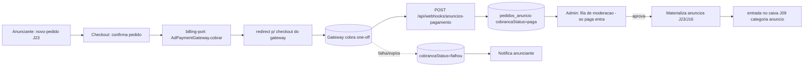

# Jornada — Pagamento Real de Anúncios (Billing do Marketplace de Mídia)

> Status: pronto (MVP) | Prioridade: média | Wave: 7
> Última atualização: 2026-07-22
>
> **MVP CONCLUÍDO (2026-07-22):** cobrança one-off real de anúncio via Asaas,
> **moderar-antes-de-pagar**, **período obrigatório**, janela de início hoje..+7
> dias, **expiração automática** (`ativa→expirada`) e bloqueio de pausa em anúncio
> pago. Gated por `AD_PAYMENT_GATEWAY=asaas` (+ `PAYMENT_GATEWAY=asaas`); o
> `PrototipoBilling` permanece como fallback dev/E2E (fluxo J23 intacto). Dinheiro
> 100% na conta-mãe (sem split) — ver [../asaas-modelo-financeiro.md](../asaas-modelo-financeiro.md).
>
> Fora do MVP (backlog, §14): pausa-com-crédito de dias, sobreposição real de
> período no conflito de zona, janela recorrente/horária, estorno automático.

## 0. Decisões travadas (com o dono, 2026-07-22)

| # | Decisão | Escolha | Consequência |
|---|---|---|---|
| E1 | **Escopo** | MVP: cobrança one-off + período obrigatório + expiração | Deixa pausa-com-crédito, sobreposição de período e recorrência para depois |
| E2 | **Ordem pagar × moderar** | **Moderar ANTES de pagar** | Admin pré-aprova → link de pagamento → pagou, materializa. **Sem estorno** no caminho feliz |
| E3 | **Início da veiculação** | Anunciante escolhe, janela **hoje..+7 dias** | Reusa o filtro de data (`whereAtivo`); sem job `agendada→ativa` |
| E4 | **Pausa em anúncio pago** | **Não permitir** por ora | Anúncio pago roda direto início→fim; sem mecânica de crédito de dias |
| E5 | **Customer do anunciante** | **Lazy no checkout** (coleta CPF/CNPJ) | Cadastro de anunciante segue isento; customer criado no `POST /pagar` |

## 1. Contexto & Objetivo

A **J23** entregou o marketplace de mídia self-service ponta-a-ponta, mas com a
cobrança **propositalmente como protótipo**: o checkout calcula e mostra o preço,
registra o pedido como "adquirido" (`cobrancaStatus = 'prototipo'`) e passa pela
moderação — **sem cobrar de verdade**. Toda a J23 foi desenhada para isto: o passo
de billing é uma **porta plugável** (`billing-port.ts`), e nenhuma tela ou schema
da J23 precisa mudar para a cobrança real entrar.

Esta jornada **liga a cobrança de verdade**: o anunciante paga (PIX/cartão/boleto)
pelo pedido de anúncio antes (ou depois) da moderação, conforme a política
escolhida; o pedido só vira anúncio no ar quando **pago + aprovado**; a receita
real entra no caixa (J09).

> **Diferença-chave vs J14**: a J14/J11 trata **assinatura recorrente** de plano.
> Aqui é **pagamento avulso** (um pedido de anúncio = uma cobrança pontual, possivelmente
> com múltiplos slots somados). Reusa a **abstração** de gateway da J14, mas com um
> fluxo de checkout one-off, não de subscription. Decidir na execução se cria uma
> porta separada (`AdPaymentGateway`) ou estende a existente (§6.1).

## 2. Personas
- **Anunciante / Cliente-anunciante**: paga de verdade pelo pedido de anúncio no
  checkout do gateway (deixa de ver "adquirido (simulação)" e passa a ver cobrança real).
- **Admin**: acompanha a receita de anúncios conciliada com o gateway; modera
  sabendo o estado real de pagamento de cada pedido.
- **Sistema (gateway)**: chama o webhook em eventos de cobrança do pedido.

## 3. Fluxo ponta-a-ponta

## 4. Telas envolvidas
- [app/anunciante/novo-pedido/](../../app/anunciante/novo-pedido/) e as áreas "Meus
  Anúncios" das visões de cliente (J23) — o `CheckoutPrototipo` passa a redirecionar
  para o gateway em vez de mostrar "adquirido (simulação)". **Reusa o componente da
  J23**; muda o comportamento da porta, não a tela.
- `app/anunciante/meus-anuncios` (e equivalentes de cliente) — card do pedido mostra
  estado real de pagamento (`pendente`/`paga`/`falhou`) e ação "pagar agora" / "tentar
  novamente" quando aplicável.
- Sem checkout próprio — o pagamento hospedado é do provedor (igual J14).

## 5. Componentes-chave (a maioria já existe — só plugar)
- **Porta de billing (existe, J23)**: `features/anuncios/self-service/billing-port.ts`
  — hoje com `PrototipoBilling`. Esta jornada adiciona a implementação real.
- **Fundação de gateway (existe, J14)**: reusar a abstração de
  [features/planos/gateway/payment-gateway.ts](../../features/planos/gateway/payment-gateway.ts)
  e o factory por env [features/planos/gateway/index.ts](../../features/planos/gateway/index.ts).
  Decidir se o adapter de anúncio é o **mesmo provider** da assinatura (provável) com
  um método de cobrança avulsa, ou um adapter dedicado.
- **A criar**: `features/anuncios/self-service/gateway/<provider>-ad-gateway.ts` —
  implementa cobrança one-off do pedido (`createAdCheckout`, `parseWebhook`).
- **Service de pedido (existe, J23)**: `pedido-service.ts` — `aplicarEventoPagamento`
  (idempotente) que move `cobrancaStatus` e libera para materialização.
- **A criar**: webhook `app/api/webhooks/anuncios-pagamento/route.ts` (separado do de
  assinatura para não acoplar fluxos; **valida assinatura do payload**).

## 6. Arquitetura

### 6.1 One-off vs recorrente — reuso da abstração da J14
A J14 modela `PaymentGateway` para **subscription**. Pagamento de anúncio é
**avulso**. Duas opções (decidir na execução):
- **(A)** Estender `PaymentGateway` com um método `createOneOffCheckout(...)` e
  reusar o mesmo adapter/provider — menos código, um provedor só para conciliar.
- **(B)** Porta dedicada `AdPaymentGateway` em `features/anuncios/self-service/gateway/`
  — isolamento total, à custa de duplicar parte da plumbing do provedor.
Recomendação preliminar: **(A)** se o provedor escolhido na J14 suportar pagamentos
avulsos com webhook próprio; **(B)** se os fluxos divergirem demais. Registrar a
decisão em §13 quando a J14 fixar o provedor.

### 6.2 Política de cobrança × moderação
A J23 fixou **moderação obrigatória** (D4). Esta jornada precisa decidir a **ordem**
entre pagar e moderar (decisão de negócio, §13):
- **Pagar antes de moderar**: anunciante paga no checkout; se o admin recusar, há
  **estorno** (refund) — exige `parseWebhook` tratar `refunded` e o pedido voltar a
  `recusado` + reembolsado. Mais atrito de implementação (refund), melhor fluxo de caixa.
- **Moderar antes de pagar**: admin pré-aprova; só então o anunciante recebe o link
  de pagamento; ao pagar, materializa. Sem refund no caminho feliz, mais etapas.
Recomendação preliminar: **moderar antes de pagar** (evita refund e conteúdo
impróprio cobrado). Mas depende do apetite comercial — decidir com os sócios.

### 6.2b Customer ASAAS do anunciante — criar lazy no checkout
O anunciante é **isento de CPF/CNPJ no cadastro** (para não friccionar a porta de
entrada da J23), então **não ganha o customer ASAAS proativo** que contratante/empreiteiro
recebem na J44. Decisão (2026-07-22): quando a cobrança real ligar, **coletar CPF/CNPJ
no checkout do anúncio e criar o customer lazy ali**, reusando `findOrCreateCustomer`
([features/planos/gateway/asaas-gateway.ts](../../features/planos/gateway/asaas-gateway.ts)) —
o mesmo fallback lazy que a J44 já mantém para o 1º checkout de assinatura. O anunciante
**paga a conta-mãe** e **não tem subconta** (nunca recebe). Ver o modelo completo em
[../asaas-modelo-financeiro.md](../asaas-modelo-financeiro.md).

### 6.3 Idempotência
Espelhar a garantia da J14: tabela de eventos de pagamento de anúncio com
`gatewayEventId` **único** — reenvio do mesmo webhook não duplica lançamento de
receita nem muda estado duas vezes.

## 7. Schema (Drizzle)
A J23 já deixou `pedidos_anuncio.cobrancaStatus` com os estados
`prototipo|pendente|paga|isenta`. Esta jornada:
- **A alterar** `pedidos_anuncio`: adicionar campos agnósticos de gateway
  (espelhando `assinaturas` da J11): `gatewayProvider`, `gatewayCustomerId` (nullable),
  `gatewayPaymentId` (nullable), e estado `falhou`/`reembolsado` no enum de cobrança.
- **A criar** `pedido_pagamento_eventos`: `id`, `pedidoId` (FK), `gatewayEventId`
  (**único** — idempotência), `tipo` (paid/failed/refunded), `payload` JSONB,
  `criadoEm`. Migration idempotente via `server/bootstrap-*.ts`.
- Receita: ao `paga`, lançar no financeiro reusando `maybeLancarReceita` (J09),
  categoria `anuncio`, escopo plataforma, idempotente por origem (o pedido).

## 8. Endpoints
- **A alterar** `POST /api/anuncios/pedidos` (J23): quando o gateway estiver ativo
  (`AD_PAYMENT_GATEWAY` setado), retorna `{ kind: 'redirect', url }` em vez de
  "adquirido (protótipo)".
- **A criar** `POST /api/webhooks/anuncios-pagamento` — recebe eventos do gateway,
  **valida assinatura**, normaliza e chama `aplicarEventoPagamento` (idempotente).
- **A criar (se ordem = moderar-antes-de-pagar)** `POST /api/anuncios/pedidos/[id]/pagar`
  — gera o link de pagamento de um pedido pré-aprovado.

## 9. Mocks a remover
- Substituir `PrototipoBilling` (J23) pelo adapter real **via env/factory**. O
  protótipo **não é mock de UI** — é implementação real da porta; pode coexistir
  para dev/demo (igual ao `ManualGateway` da J14). Remover apenas o badge
  "simulação" da UI quando o gateway estiver ativo.

## 10. Checklist de implementação (quando desbloquear)
- [ ] **Confirmar provedor** (deve casar com a decisão da J14) e modelo de cobrança avulsa
- [ ] **Coletar CPF/CNPJ do anunciante no checkout e criar customer ASAAS lazy** (`findOrCreateCustomer`) — anunciante não tem customer proativo (isento no cadastro). Ver §6.2b
- [ ] Decidir §6.1 (estender `PaymentGateway` vs porta `AdPaymentGateway` dedicada)
- [ ] Decidir §6.2 (pagar-antes vs moderar-antes) com os sócios → define refund ou não
- [ ] Adapter real implementando a porta: `createAdCheckout`, `parseWebhook` (**valida assinatura**)
- [ ] `pedido_pagamento_eventos` + campos de gateway em `pedidos_anuncio` (bootstrap idempotente)
- [ ] `aplicarEventoPagamento` idempotente em `pedido-service.ts` (paga/falhou/reembolsado)
- [ ] Webhook `app/api/webhooks/anuncios-pagamento/route.ts`
- [ ] Trocar o comportamento do checkout da J23 por redirect quando `AD_PAYMENT_GATEWAY` setado
- [ ] Receita real no caixa (J09) categoria `anuncio`, idempotente por pedido
- [ ] (se refund) tratar `refunded` → pedido `recusado`+reembolsado + notificação
- [ ] Conciliação: comparar `pedidos_anuncio` pagos com o estado do gateway
- [ ] Remover badge "simulação" da UI; "Meus Anúncios" mostra estado real de pagamento

## 11. Critérios de aceite
1. `AD_PAYMENT_GATEWAY=<provider>` → confirmar pedido redireciona para o provedor (não "adquirido simulação").
2. Pagamento aprovado → webhook → `pedidos_anuncio.cobrancaStatus='paga'`.
3. Reenvio do mesmo evento → `SELECT COUNT(*) FROM pedido_pagamento_eventos WHERE gateway_event_id='X'` continua 1.
4. Pedido pago **e** aprovado → materializa anúncios (J23/J16) e aparece na zona.
5. Receita real aparece em J09 (categoria `anuncio`, escopo plataforma).
6. Falha/expiração de pagamento → `cobrancaStatus='falhou'`, anunciante notificado, pedido não materializa.
7. (Se pagar-antes) recusa na moderação → estorno → `reembolsado` + notificação.
8. Nenhuma tela ou schema da **J23** precisou ser reescrita — só plugado o adapter (prova a porta).

## 12. Riscos / Pontos de atenção
- **Verificação de assinatura do webhook é obrigatória** — sem ela, qualquer um marca
  pedido como pago. O `PrototipoBilling` não valida; o real DEVE.
- **Refund** (se pagar-antes-de-moderar) é o maior risco de complexidade e de caixa —
  preferir moderar-antes-de-pagar se o comercial permitir (§6.2).
- **Idempotência** já garantida pelo schema (`gatewayEventId` único); o adapter só
  fornece um `eventId` estável.
- **Conciliação com a assinatura**: se reusar o mesmo provedor da J14, separar receita
  de `assinatura` vs `anuncio` por categoria no caixa para não misturar relatórios.
- **Segredos do gateway** nunca no client — só server/env.
- **Moeda/impostos/nota fiscal** de venda de mídia podem ter regra fiscal diferente da
  assinatura — validar com contabilidade (decisão de negócio).

## 13. Links cruzados
- **Depende de**: **J23** (checkout, porta de billing, modelo de pedido multi-slot,
  materialização) + **J14** (decisão de gateway e fundação de pagamento) + J11
  (abstração de porta reusada) + J09 (caixa) + J13 (notificações de pagamento).
- **Desbloqueia**: monetização **real** do marketplace de mídia self-service.

## 14. Gaps descobertos durante execução
> Doc viva. Registrar aqui o que apareceu no caminho e não estava no roteiro original.
> Uma linha por item, com data.

- **2026-06-07** — Jornada criada como continuação natural da **J23** (decisão de
  produto: cobrança de anúncio extraída da J23 para esta jornada, deixando o checkout
  da J23 como protótipo plugável). Bloqueada em série por J23 (precisa existir) e J14
  (precisa do provedor). Decisões a tomar na execução: §6.1 (porta única vs dedicada),
  §6.2 (pagar-antes vs moderar-antes → refund ou não), regra fiscal de venda de mídia.
- **2026-07-22** — Confirmado no modelo financeiro (ver [../asaas-modelo-financeiro.md](../asaas-modelo-financeiro.md))
  que o anunciante **não tem customer ASAAS** hoje (isento de CPF/CNPJ no cadastro) e
  **não tem subconta** (nunca recebe). Decisão: criar o customer **lazy no checkout**
  desta jornada, coletando o documento ali (§6.2b). Pagamento vai para a conta-mãe.
- **2026-07-22 — MVP IMPLEMENTADO.** Decisões E1–E5 (§0) travadas e entregues:
  - **Schema**: `pedidos_anuncio` += `gateway_provider/customer_id/payment_id/cpf_cnpj/invoice_url`; nova `pedido_pagamento_eventos` (`gateway_event_id` único = idempotência). Bootstrap idempotente + probe em `schema-health`.
  - **Cobrança**: `features/anuncios/self-service/asaas-ad-billing.ts` (one-off via `createPaymentWithSplit` com `split:[]` = 100% conta-mãe; `findOrCreateCustomer` lazy). Porta `billing-port.ts` resolve por `AD_PAYMENT_GATEWAY` (flag em `flags.ts`); protótipo é fallback.
  - **Moderar-antes-de-pagar**: `moderarPedido` bifurcado — modo pago aprova SEM materializar (`aprovado`/`pendente`). Materialização extraída para `materializarSlotsDoPedido`, chamada no webhook de pagamento confirmado.
  - **Webhook**: 3º prefixo `xconstrucao-anuncio|pedidoId` roteado no `/api/webhooks/gateway` único → `aplicar-evento-anuncio-pago.ts` (idempotente; materializa + `paga`/`publicado` + notifica).
  - **Endpoints**: `POST /api/anuncios/pedidos/[id]/pagar` (exige CPF/CNPJ, gera link); período obrigatório + janela hoje..+7 validados server-side (`validarPeriodoPago`) no criar-pedido; bloqueio de pausa (`ANUNCIO_PAGO` 409) em `/api/anuncios/meus/[id]` para origem paga.
  - **Expiração**: `expirar-anuncios-job.ts` (`ativa→expirada` por `fim<hoje`) + `scripts/expirar-anuncios.ts` + registro no `instrumentation.ts`.
  - **Conflito de zona**: verificado ANTES de emitir o link (`ZONAS_INDISPONIVEIS` 409) — não cobra veiculação que não vai acontecer. Sobreposição real de período fica no backlog.
- **2026-07-22 (code-review)** — **Race de webhook corrigido**: o Asaas envia `PAYMENT_RECEIVED` e `PAYMENT_CONFIRMED` com `eventId` distintos, ambos → `payment_succeeded`. O guard `cobrancaStatus!='pendente'` sozinho não era atômico (dois eventos concorrentes materializariam 2× → receita dobrada). Corrigido com **claim atômico**: `SELECT ... FOR UPDATE` no pedido + flip para `paga` dentro da transação (espelha `aplicar-evento-split.ts`); só o 1º evento materializa. Teste cobrindo os dois eventIds distintos adicionado.
