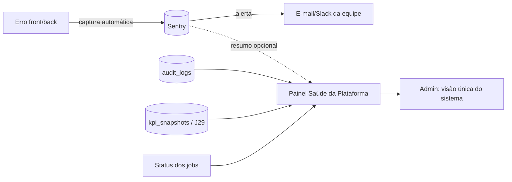

# Jornada — Observabilidade Técnica & Saúde da Plataforma (erros, logs e painel admin)

> Status: pronto (código entregue; config de deploy na §14) | Prioridade: alta | Wave: 8
> Última atualização: 2026-07-26
>
> **Revisão de status (2026-07-24):** o status "planejada" estava desatualizado. As
> frentes A.1 (Sentry SDK + scrubbing de PII), A.2 (Pino, `app_errors`/`job_runs`,
> wrapper de log, error boundary) e B (painel + endpoint admin-only) **já existem no
> código**. O que resta não é desenvolvimento: `SENTRY_DSN` nos Secrets do Replit,
> validar um erro de teste chegando, configurar alertas e monitorar o volume vs. free
> tier. O performance monitoring segue como fase 2.
>
> **Decisão tomada (2026-06-20):** abordagem **híbrida confirmada** — **Sentry (free tier)**
> para captura/alerta de erros front+back (rápido, completo, alertas prontos) **+ infra
> própria no nosso Postgres** (**Pino** como logger estruturado + tabela **`app_errors`**)
> para rastreio independente, com a **meta de longo prazo de não depender/pagar o Sentry**.
> Execução desta jornada será conduzida pelo dono no Replit; este PRD é o roteiro afiado.
>
> **Criada em 2026-06-08** a partir de demanda dos sócios da X Construção: antes de
> os clientes reais começarem a usar a plataforma em produção, precisamos **captar
> erros e problemas proativamente** — resolver conforme ocorrem, sem depender do
> usuário final reportar. Complementa (não duplica) a J21 (observabilidade de
> comunicação) e a J29 (observabilidade histórica de KPIs): aquelas cobrem
> observabilidade **funcional/de negócio**; esta cobre observabilidade **técnica**
> (o que *quebrou*, não o que o usuário *fez*).

## 1. Contexto & Objetivo

Hoje a plataforma já tem uma base **funcional** de auditoria sólida:
- `audit_logs` (quem fez, o quê, quando, IP, user-agent) — 21 tipos de ação
  ([features/auth/api/audit.ts](../../features/auth/api/audit.ts), exibido em
  [app/admin/auditoria/page.tsx](../../app/admin/auditoria/page.tsx)).
- KPIs históricos e churn (J29), observabilidade de comunicação (J21).

**O que falta — observabilidade técnica:**
- ❌ **Captura persistente de erros de aplicação.** Hoje erros vão só para
  `console.error` (efêmero, somem no restart). Não há registro de "erro X, no
  usuário Y, na tela Z, às H horas".
- ❌ **Alerta proativo.** Ninguém é avisado quando algo quebra — descobrimos pelo
  cliente reclamando.
- ❌ **Painel de saúde do sistema.** Não há uma visão única de "como a plataforma
  está agora": erros recentes, usuários ativos, status dos jobs.

**Objetivo:** dar ao admin (e à equipe) **visão técnica em tempo quase-real** do que
está acontecendo na plataforma, com alertas automáticos de erro, para um roteiro
contínuo de ajustes baseado em dados reais — não em reclamação de usuário.

## 2. Decisão-chave — Sentry vs. solução interna (PARA DECIDIR COM OS SÓCIOS)

A captura de erros pode ser feita por uma **ferramenta externa especializada
(Sentry)** ou **construída internamente** (tabela + painel próprios). Comparativo
para decisão de negócio:

| Critério | **Sentry (externo)** | **Solução interna (do zero)** |
|---|---|---|
| **Esforço de engenharia** | Baixo — SDK oficial Next.js, ~1 dia p/ ligar | Alto — captura, agrupamento, retenção, UI = semanas |
| **Alertas automáticos** | ✅ Prontos (e-mail/Slack, com stack trace, usuário, passos) | ❌ Construir do zero |
| **Agrupamento de erros iguais** | ✅ Automático (não afoga a caixa) | ❌ Lógica complexa a implementar |
| **Contexto rico** | ✅ Navegador, SO, usuário, breadcrumb, release | ⚠️ Só o que a gente capturar manualmente |
| **Custo financeiro** | Plano free generoso (≈5k erros/mês); pago só com escala | "Grátis" em licença, mas custa engenharia + storage |
| **Privacidade / dado nosso** | ⚠️ Dados de erro trafegam para SaaS externo (configurável/scrubbing) | ✅ 100% no nosso banco |
| **Manutenção** | ✅ Zero (eles mantêm) | ❌ Nossa (retenção, performance, evolução) |
| **Tempo até valor** | Horas | Semanas |

**Recomendação técnica:** **Sentry** para a captura/alerta de erros (resolve em horas
o que levaria semanas e já vem com alerta), e **solução interna** apenas para o
*painel de saúde* (que reusa nossos próprios dados: `audit_logs`, KPIs, status de
jobs). Híbrido: Sentry faz o trabalho pesado de erro; nosso painel dá a visão
executiva dentro do admin.

> **Ponto de privacidade a validar:** Sentry recebe payloads de erro. Configurar
> *data scrubbing* (remover PII: e-mail, CPF, tokens) antes do envio. Há também a
> opção *self-hosted* do Sentry caso o requisito seja dado 100% on-premise.

### ✅ DECISÃO (2026-06-20) — Híbrido: Sentry free + infra própria (Pino + `app_errors`)

Os dois, com papéis distintos e **redundância proposital**:

1. **Sentry (free tier)** — captura e **alerta** de erros front + back, agrupamento
   automático, stack trace, contexto. Liga rápido (SDK Next.js). Free cobre o início
   (≈5k erros/mês); monitorar volume e migrar de plano/desligar conforme a escala.
2. **Infra própria (do nosso lado, no Postgres)** — **não** depende do Sentry:
   - **Pino** como logger estruturado do backend (JSON, rápido — roda bem porque o
     projeto tem servidor Node real em [server/index.ts](../../server/index.ts), não é
     serverless puro). Substitui gradualmente os ~295 `console.error` espalhados.
   - Tabela **`app_errors`** no nosso banco persistindo cada erro (mensagem, stack,
     rota, nível, `user_id` nullable, `meta` JSONB, `created_at`). Um **wrapper de log**
     centraliza: escreve no Pino **e** grava em `app_errors`.

**Por que os dois:** Sentry entrega valor e alerta **hoje**; a infra própria garante
**independência** (rastreio nosso, sem PII saindo, e a meta de, no futuro, desligar o
Sentry sem ficar cego). O painel de saúde (Frente B) lê **da nossa tabela**, não do
Sentry — então o painel funciona mesmo sem Sentry.

> Nota de arquitetura (correção registrada): o projeto roda **Next.js full-stack com
> servidor Node customizado** (`tsx server/index.ts`), por isso **Pino/Winston são
> viáveis** no backend. **Pino** escolhido por ser mais leve/rápido e padrão atual.
> Para persistir no banco: Pino + um passo que grava em `app_errors` (via wrapper
> próprio), não só stdout.

## 3. Personas
- **Admin / equipe técnica**: recebe alerta quando algo quebra; abre o painel de
  saúde para ver o pulso da plataforma; prioriza ajustes por frequência/impacto.
- **(Sistema)**: captura automática de exceções (front + back) e coleta de métricas
  de saúde.

## 4. Fluxo ponta-a-ponta

## 5. Escopo — duas frentes

### Frente A — Captura de erros (decisão da seção 2)
- Integrar Sentry (ou a alternativa escolhida) no front e no back (Next.js).
- Alertas configurados para a equipe (e-mail/Slack).
- Data scrubbing de PII antes do envio.
- Capturar também falhas dos **jobs** (hoje só vão para console em
  [instrumentation.ts](../../instrumentation.ts)).

### Frente B — Painel "Saúde da Plataforma" no admin (completo)
Tela nova e intuitiva no admin, com visão executiva do pulso do sistema:
- **Erros recentes** — contagem por período + lista dos últimos (resumo do Sentry
  via API, ou da tabela interna se for a opção escolhida).
- **Usuários ativos agora / nas últimas 24h** — reusa `last_login_at` (J29) e sessões.
- **Status dos jobs** — última execução de cada job (snapshot KPIs, overdue, etc.) e
  se falhou.
- **Últimas ações relevantes** — atalho para a auditoria já existente (J21/auditoria).
- **Indicadores de saúde** — ex.: nº de erros hoje vs ontem, telas que mais quebram.

## 6. Tipos de log/informação a agregar (resposta à pergunta dos sócios)
1. **Erros de aplicação** (front + back) — o item crítico; via Sentry.
2. **Falhas de jobs/tarefas automáticas** (ex.: cobrança que não rodou) — hoje só console.
3. **Eventos de negócio** — já cobertos por `audit_logs` (cadastros, obras, pagamentos…).
4. **Acessos/login** — parcial via auditoria + `last_login_at`; consolidar no painel.
5. **Performance** — telas/endpoints lentos (Sentry Performance, fase 2).

## 7. Telas envolvidas
- **A criar:** `app/admin/saude/page.tsx` (ou `app/admin/observabilidade/`) — o
  painel da Frente B.
- Reuso: [app/admin/auditoria/page.tsx](../../app/admin/auditoria/page.tsx) (link
  cruzado), dashboards da J17/J18.

## 8. Componentes-chave
- **A criar:** integração Sentry (config Next.js `sentry.*.config.ts` + wrapper).
- **A criar:** service de saúde que agrega audit_logs + last_login + status de jobs
  num único payload para o painel.
- **A criar (se opção interna):** tabela `app_errors` + captura via error boundary
  (front) e handler global (back).
- Atualizar os jobs ([instrumentation.ts](../../instrumentation.ts)) para reportar
  falha ao Sentry/tabela em vez de só `console.error`.

## 9. Schema (Drizzle) — decisão híbrida (seção 2)
Como a decisão é **híbrida**, a infra própria tem tabela:
- **`app_errors`** (id, `level` [error|warn|fatal], `message`, `stack` nullable, `route`
  nullable, `user_id` nullable → `users.id`, `meta` JSONB, `fingerprint` nullable para
  agrupar iguais, `created_at`). Índices: `(created_at)` e `(route)`.
- **`job_runs`** (id, `job` text, `status` [ok|error], `started_at`, `finished_at`
  nullable, `error` nullable) — status de jobs no painel.
- Definir em [shared/db/schema.ts](../../shared/db/schema.ts); bootstrap no
  [instrumentation.ts](../../instrumentation.ts) no mesmo padrão das demais tabelas.

## 10. Endpoints
- `GET /api/admin/saude` — payload agregado para o painel (erros recentes, ativos,
  jobs, indicadores). Admin-only.
- (Se opção interna) handler global de captura de erro server-side.

## 11. Mocks a remover
- Nenhum mock existente. É fundação nova de observabilidade técnica.

## 12. Checklist de implementação
> ✅ Decisão fechada: **híbrido** (Sentry free + Pino + `app_errors` próprio). Ver seção 2.

**Frente A.1 — Sentry (free tier):**
- [x] Instalar e configurar o SDK do Sentry para Next.js (front + back). _(Task #106)_
- [x] ~~Gerar erro de teste e confirmar que chega no Sentry~~ → **ação de deploy** (bloco abaixo), não código
- [x] ~~Alertas para a equipe (e-mail/Slack)~~ → **ação de deploy** (bloco abaixo), não código
- [x] Data scrubbing de PII validado (`lib/sentry-scrub.ts` — CPF, e-mail, senhas, tokens). _(Task #106)_
- [x] ~~Monitorar volume vs. free tier~~ → **rotina operacional** (bloco abaixo), não código

**Frente A.2 — Infra própria (Pino + `app_errors`):**
- [x] Adicionar **Pino** como logger estruturado do backend. _(Task #105)_
- [x] Criar tabela `app_errors` (+ `job_runs`) em `schema.ts` e bootstrap no `instrumentation.ts`. _(Task #105)_
- [x] Criar **wrapper de log** central (`logError`/`logJobRun`) que escreve no Pino **e** grava em `app_errors`/`job_runs`. _(Task #105)_
- [x] Migrar os `console.error` críticos (auth, api, jobs) para o wrapper — 14 rotas auth + 25 bootstraps via `instrumentation.ts`. _(Task #105)_
- [x] **Error boundary no front** (`app/global-error.tsx` + `error.tsx` por rota crítica) capturando e reportando via `/api/log/client-error`. _(Task #105)_
- [x] Jobs reportam falha em `job_runs` (não só console) — `runBootstrap()` wraps todos os 25+ bootstraps. _(Task #105)_

**Frente B — Painel "Saúde da Plataforma":**
- [x] Painel no admin: erros recentes (de `app_errors`), usuários ativos, status de jobs (`job_runs`), indicadores, atalho p/ auditoria. _([app/admin/saude/page.tsx](../../app/admin/saude/page.tsx) → `SaudePage`)_
- [x] Endpoint `GET /api/admin/saude` admin-only, lendo da **nossa** tabela (funciona sem Sentry). _([app/api/admin/saude/route.ts](../../app/api/admin/saude/route.ts))_
- [x] ~~(fase 2) Performance monitoring~~ — **fase 2 declarada**, fora do escopo desta jornada

## 13. Critérios de aceite
1. Um erro provocado de propósito (front e back) aparece na ferramenta escolhida **e**
   dispara alerta para a equipe.
2. O painel `Saúde da Plataforma` carrega no admin e mostra, com dado real: erros
   recentes, usuários ativos, status dos jobs e últimas ações.
3. Falha de um job é registrada e visível (não some no console).
4. Nenhum dado sensível (PII) vaza no payload de erro (scrubbing validado).
5. O painel é admin-only (não acessível por contratante/empreiteiro).

## 14. Riscos / Pontos de atenção
- **Privacidade (PII em payloads de erro):** validar scrubbing; considerar Sentry
  self-hosted se exigência for dado on-premise.
- **Ruído de alerta:** calibrar para não afogar a equipe (agrupar, filtrar erros
  conhecidos/esperados).
- **Custo com escala:** o plano free do Sentry cobre o início; monitorar volume.
- **Infra Replit:** o projeto roda no Replit (`.replit`, deploy autoscale); o
  `console.error` chega ao log do Replit mas não persiste — daí a necessidade desta
  jornada. Sentry integra normalmente via SDK.
- **Não duplicar J21/J29:** esta jornada é a camada **técnica**; reusa, não recria, a
  auditoria funcional e os KPIs.

## 15. Links cruzados
- Complementa: J19 (hardening), J21 (observabilidade de comunicação), J29 (KPIs históricos).
- Reusa: `audit_logs` ([audit.ts](../../features/auth/api/audit.ts)), `last_login_at` (J29),
  jobs em [instrumentation.ts](../../instrumentation.ts).
- Independente de: J14 (gateway).

## 16. Gaps descobertos durante execução
> Doc viva. Registrar aqui o que apareceu no caminho.

- **2026-06-08** — Jornada criada a partir de demanda dos sócios (captar erros antes
  do usuário reportar, painel de saúde no admin). Confirmado por auditoria de código:
  auditoria funcional existe e é robusta (`audit_logs`, 21 ações); **falta a camada
  técnica** (captura de erro persistente, alerta, painel de saúde). Decisão Sentry vs.
  interno deixada explícita para os sócios — recomendação técnica é híbrido (Sentry p/
  erro + painel interno p/ saúde).
- **2026-06-20** — Decisão fechada pelo dono: **híbrido confirmado** — Sentry free tier
  (captura/alerta) **+ infra própria** (Pino + `app_errors`) com meta de independência
  futura. Correção de arquitetura registrada: o projeto tem servidor Node real
  (`server/index.ts`), então Pino/Winston são viáveis no back; **Pino** escolhido.
  Execução será conduzida no Replit; este PRD foi afiado para isso. Relaciona-se às
  novas jornadas de teste J35/J36/J37 (qualidade) — observabilidade + testes são as
  duas frentes de robustez pré-produção.

## 14. Ações de deploy (não são código)

> **Não abrir jornada nem checkbox para isto.** O código de observabilidade está
> entregue: Sentry SDK com scrub de PII, Pino, tabelas `app_errors` e `job_runs`,
> `runBootstrap()` envolvendo 25+ bootstraps, `app/global-error.tsx` e o painel
> `/admin/saude`. O que falta é configuração de ambiente e rotina — some assim que
> os Secrets forem preenchidos.

1. **`SENTRY_DSN` nos Secrets do Replit.** Sem ele o SDK é no-op (graceful por
   design — não quebra o boot). Depois de setar: provocar um erro de teste no front
   e no back e confirmar que chega no painel do Sentry.
2. **Alertas** por e-mail/Slack no projeto Sentry.
3. **Volume vs. free tier** — acompanhar a cota e definir o plano de ação ao estourar.

Enquanto o DSN não existir, o fallback local continua funcionando: erros vão para a
tabela `app_errors` e aparecem em `/admin/saude`.
