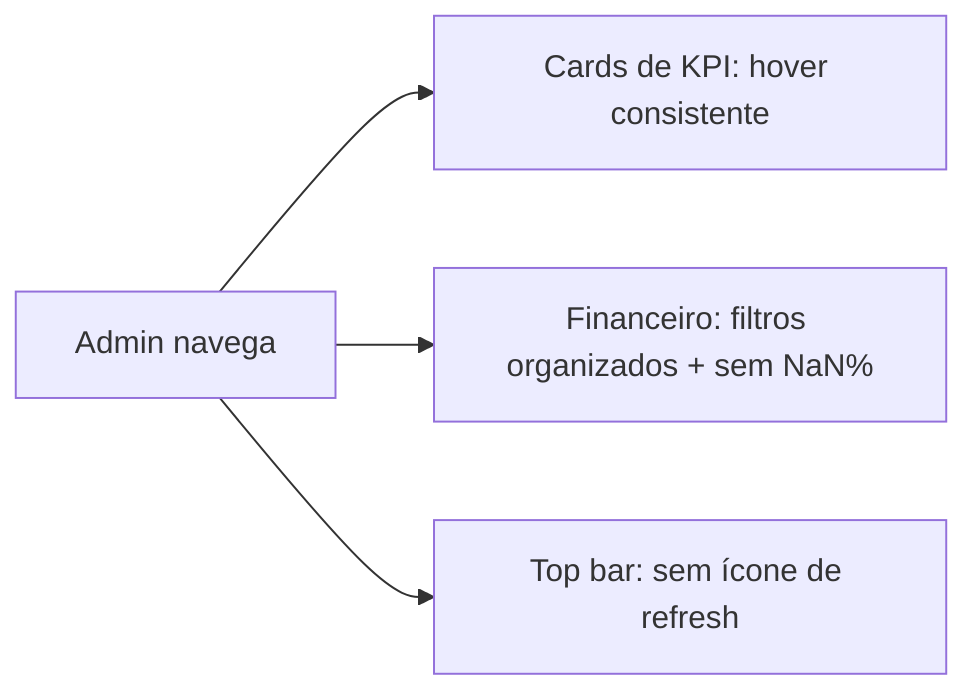

# Jornada — Ajustes Finos de UX (Visão Admin)

> Status: pronto | Prioridade: média | Wave: 8
> Última atualização: 2026-06-20

## 1. Contexto & Objetivo
Jornada **agrupadora** para um pacote de ajustes finos de UX da visão de administrador, identificados em uso real da plataforma. Não é uma feature nova — é refinamento de consistência e correção pontual, reutilizando padrões que já existem no projeto. Existir como jornada (e não como ajustes esporádicos) dá rastreabilidade: cada item vira tarefa marcável e o trabalho sobrevive a quedas de sessão/servidor. Novos ajustes finos do tipo podem ser anexados aqui no futuro.

## 2. Personas
- **admin**: principal afetado — telas de Financeiro, detalhe de Cliente e top bar do admin.

## 3. Fluxo ponta-a-ponta
Não há fluxo de dados novo. São correções de apresentação/consistência em telas já existentes da visão admin.

## 4. Telas envolvidas
- [app/admin/clientes/[id]/page.tsx](../../app/admin/clientes/[id]/page.tsx) — detalhe do cliente (cards KPI com hover divergente)
- [app/admin/financeiro/page.tsx](../../app/admin/financeiro/page.tsx) — tela financeiro (filtros + NaN%)

## 5. Componentes-chave
- [features/admin/caixa/components/IndicadorCard.tsx](../../features/admin/caixa/components/IndicadorCard.tsx) — **referência** do hover desejado (linha-topo + escurecimento)
- [features/shared/components/StatsCard/StatsCard.tsx](../../features/shared/components/StatsCard/StatsCard.tsx) — card de KPI compartilhado
- [features/admin/clientes/components/ClienteCard.tsx](../../features/admin/clientes/components/ClienteCard.tsx) — card da lista de clientes
- [features/admin/financeiro/components/StatsGrid.container.tsx](../../features/admin/financeiro/components/StatsGrid.container.tsx) — origem do NaN%
- [features/admin/financeiro/components/WelcomeSection.tsx](../../features/admin/financeiro/components/WelcomeSection.tsx) — seletor de período
- [features/admin/financeiro/components/AdoptionMetricsSection.tsx](../../features/admin/financeiro/components/AdoptionMetricsSection.tsx) — "Saúde da plataforma" (30d/7d hardcoded)
- [features/admin/components/AdminTopbar.tsx](../../features/admin/components/AdminTopbar.tsx) — top bar com botão de refresh
- [features/shared/components/filters/AdvancedFiltersPopover.tsx](../../features/shared/components/filters/AdvancedFiltersPopover.tsx) + [ActiveFilterChip.tsx](../../features/shared/components/filters/ActiveFilterChip.tsx) — padrão de filtro/legenda a reutilizar

## 6. Schema (Drizzle)
Nenhuma alteração de schema.

## 7. Endpoints
Nenhum endpoint novo. Item 2 pode tocar `caixa-service.ts`/hooks **apenas se** o pareamento por período for viável (a decidir na execução).

## 8. Mocks a remover
Nenhum.

## 9. Checklist de implementação

### Item 1 — Padronizar hover dos cards de KPI/valor
- [x] Extrair o padrão do `IndicadorCard` para um shell reutilizável: [shared/components/ui/LuminousHoverCard.tsx](../../shared/components/ui/LuminousHoverCard.tsx)
- [x] Refatorar `IndicadorCard` para consumir o shell (comportamento idêntico)
- [x] Aplicar o shell em `StatsCard` (KPIs do financeiro)
- [x] Aplicar nos KPI cards do detalhe de cliente (substituiu `KPI_HOVER` em `app/admin/clientes/[id]/page.tsx`)
- [x] Aplicar em `ClienteCard`
- [x] Varredura `whileHover`: aplicado também em `EmpreiteiraCard` (lista) e nos KPI grids de `app/admin/empreiteiras/[id]`, `app/admin/financeiro/obras/[id]`, `app/admin/obras/[id]`. Fora do escopo (mantidos): `ObraCard` (spring lift intencional), `HealthSummary`, list rows (`RecentActivitiesCard`, `ActivityItem`)

### Item 2 — Arquitetura de filtros da tela Financeiro
- [x] **Decisão (camada de dados):** só `payment-evolution` aceita `?periodo=`; adoption/receitas/stats são snapshots de janelas fixas de negócio (candidaturas 7d, churn 60d). Caminho escolhido: **honesto + legenda**, sem reescrever backend
- [x] `WelcomeSection` ganhou legenda de escopo (estilo painel Caixa) deixando claro que o período rege a série temporal; KPIs/saúde/distribuição = posição atual
- [x] `AdoptionMetricsSection` já rotula honestamente ("30d"/"7d"/"sem login 60d+" + descrição "métricas de adoção, não financeiras") — sem ambiguidade a remover
- [x] Filtros locais existentes (`ObrasAtencaoTable`, `TopRankingTable`) mantidos

### Item 3 — Remover ícone de refresh do top bar admin
- [x] Removido botão/popover de refresh em `AdminTopbar.tsx`
- [x] Removidos import `RiRefreshLine`, `handleRefresh`, estado (`isRefreshing`/`lastRefreshedAt`/`popoverOpen`), hook `useRelativeTime`, `useQueryClient`/`useCallback` órfãos

### Item 4 — Corrigir NaN% no Financeiro
- [x] Helper `safePercent(part, total)` em `features/admin/financeiro/utils.ts`
- [x] Aplicado em "Total pago a empreiteiras" e "Saldo a pagar" em `StatsGrid.container.tsx`
- [x] Varredura: únicas divisões sem guarda eram essas duas; demais (`ReceitasPlataformaTable`, API `caixa-service.ts`) já protegidas

### Item 5 — Boas práticas (transversal)
- [x] Padrão extraído (DRY), `data-testid` preservados, sem `NaN` na UI
- [x] `npm run check` sem erros

### Item 6 — Unificar legenda + seletor de período no Financeiro (padrão Caixa)
- [x] `WelcomeSection` reestruturado: título no topo + **um único bloco pontilhado** com legenda em cima e seletor de período (pílulas + calendário) embaixo, espelhando o `FiltrosGlobais` da Caixa
- [x] Seletor removido do header à direita; props (`periodo`/`customRange`/callbacks) e lógica inalteradas; `page.tsx` não tocado

### Item 7 — Corrigir active da sidebar admin (best-match)
- [x] Causa: `pathname.startsWith(url)` em `AdminSidebar.tsx` (match de prefixo puro) ativava "Obras" junto com filhas e com `/admin/obras-destaque`
- [x] Trocado por **best-match**: só o item de URL mais longa que casa (`=== url` ou `startsWith(url + '/')`) fica ativo, via `useMemo` sobre `pathname`
- [x] Validado: `/admin/obras/moderacao` → só Moderação; `/admin/obras/[id]` → só Obras; `/admin/obras-destaque` → só Destaques

## 10. Critérios de aceite
1. Detalhe de cliente e Financeiro: cards de KPI menores com hover idêntico ao `IndicadorCard` (sombra + linha-topo + escurecimento). Cards grandes inalterados.
2. Financeiro: período do topo com legenda; seções temporais respondem ao período OU estão rotuladas como snapshot. Filtros locais funcionando.
3. Top bar admin sem ícone de refresh; demais visões inalteradas.
4. Com `volumeContratado = 0`, "Total pago a empreiteiras" e "Saldo a pagar" exibem `0%` (não `NaN%`).
5. Financeiro: legenda + seletor de período num único bloco pontilhado (igual à Caixa); sem seletor solto no header.
6. Sidebar admin: em `/admin/obras/moderacao` só "Moderação" fica ativo; cada item ativo só na sua rota.
7. `npm run check` limpo.

## 11. Riscos / Pontos de atenção
- `IndicadorCard` usa `overflow-hidden` + spans `absolute`; o shell precisa de container `relative` e da classe global `luminous-card` disponível onde for usado.
- Item 2 depende da camada de dados: parear por período exige hooks/serviço aceitarem o parâmetro. Se não suportarem, rotular honestamente em vez de fingir filtro.

## 12. Links cruzados
- Relaciona-se com: J18 (Financeiro Admin Completo), J17 (Dashboards Reais)
- Depende de: —
- Bloqueia: —

## 13. Gaps descobertos durante execução
> Doc viva. Registrar aqui o que apareceu no caminho e não estava no roteiro original. Uma linha por item, com data.

- 2026-06-20: Seletor de período "global" do Financeiro hoje só afeta `PaymentsEvolutionChart` — as demais métricas "no período" não respondem (origem da reorganização do Item 2).
- 2026-06-20: Item 2 — confirmado na API que adoption/receitas/stats são snapshots de janelas fixas de negócio (não aceitam `periodo`). Decisão de produto: caminho **honesto + legenda** (não reescrever backend). Parear tudo ao período global fica como evolução futura, se houver demanda.
- 2026-06-20: Item 1 — o padrão luminous já estava (sem nome) duplicado em `StatsCard` e `IndicadorCard`; extraído para `LuminousHoverCard` e os 4 KPI grids do admin (cliente/empreiteira/obra/financeiro-obra) + cards de lista passaram a consumi-lo. O alias `@shared/*` aponta para `./shared/*` (não `./features/shared/`) — o shell mora em `shared/components/ui/`.
- 2026-06-20 (pacote 2): Item 6 — a legenda do Item 2 tinha ficado separada do seletor (seletor no header, legenda solta embaixo). Unificado num único bloco pontilhado espelhando o `FiltrosGlobais` da Caixa.
- 2026-06-20 (pacote 2): Item 7 — `pathname.startsWith(url)` ativava múltiplos itens da sidebar (Obras + Moderação; falso-positivo em obras-destaque). Trocado por best-match (item de URL mais longa que casa com separador `/`). Pares futuros como `/admin/financeiro/obras` ficam cobertos automaticamente.
