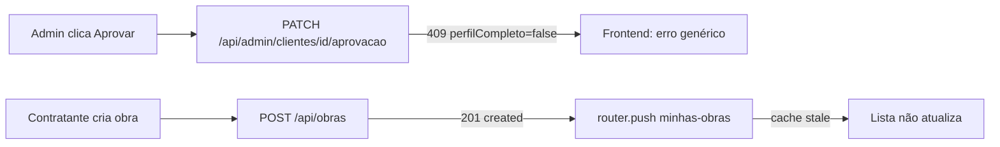

# Jornada — Correção de Bugs: Cadastro de Obra & Curadoria

> Status: pronto | Prioridade: alta | Wave: 10
> Última atualização: 2026-06-29

## 1. Contexto & Objetivo

Bugs críticos detectados em sessão de testes reais (22/06/2026) bloqueavam operações
essenciais da plataforma: a curadoria de clientes, empreiteiros e obras falhava
silenciosamente ao tentar aprovar; obras recém-cadastradas desapareciam da lista "Minhas
Obras" por problema de cache; e o formulário de cadastro de obra aceitava qualquer CEP
sem validação. Esta jornada documenta os bugs, suas raízes técnicas e os fixes aplicados.

## 2. Personas

- **Admin**: tentava aprovar cliente/empreiteiro/obra e recebia erro genérico sem explicação.
- **Contratante**: cadastrava obra e não a via na lista "Minhas Obras"; ao tentar novamente, via
  contradição "limite atingido mas lista vazia"; campo CEP aceitava qualquer valor.

## 3. Fluxo ponta-a-ponta (antes dos fixes)

## 4. Telas envolvidas

- [app/admin/clientes/[id]/page.tsx](../../app/admin/clientes/[id]/page.tsx) — detalhe de cliente com botões Aprovar/Reprovar
- [app/admin/empreiteiras/[id]/page.tsx](../../app/admin/empreiteiras/[id]/page.tsx) — detalhe de empreiteira com botões Aprovar/Reprovar
- [app/admin/obras/moderacao/page.tsx](../../app/admin/obras/moderacao/page.tsx) — moderação de obras publicadas
- [app/contratante/nova-obra/page.tsx](../../app/contratante/nova-obra/page.tsx) — formulário de cadastro de obra com CEP + ViaCEP

## 5. Componentes-chave

- [features/admin/clientes/hooks/use-clientes.ts](../../features/admin/clientes/hooks/use-clientes.ts) — mutation `useAprovarCliente`
- [features/admin/empreiteiras/hooks/use-empreiteiras.ts](../../features/admin/empreiteiras/hooks/use-empreiteiras.ts) — mutation `useAprovarEmpreiteira`

## 6. Schema (Drizzle)

- Tabelas existentes: `clientes`, `empreiteiras`, `obras` em [shared/db/schema.ts](../../shared/db/schema.ts)
- Colunas relevantes: `clientes.perfilCompleto` (boolean, default false), `empreiteiras.perfilCompleto` (boolean, default false)
- Coluna `obras.visibilidade` (rascunho | publicada | pausada | arquivada), `obras.statusModeracao` (pendente | aprovada | rejeitada)
- **Sem alterações de schema** nesta jornada — todos os bugs eram de lógica/cache, não de estrutura.

## 7. Endpoints

- `PATCH /api/admin/clientes/[id]/aprovacao` — aprovação de curadoria de cliente (corrigido)
- `PATCH /api/admin/empreiteiras/[id]/aprovacao` — aprovação de curadoria de empreiteira (corrigido)
- `POST /api/admin/obras/[id]/aprovar` — aprovação de obra (erro handling melhorado no front)
- `POST /api/obras` — cadastro de obra pelo contratante (cache invalidation adicionada no front)

## 8. Mocks a remover

- Nenhum mock envolvido — todos os bugs eram de código de produção.

## 9. Checklist de implementação

- [x] **Bug CRÍTICO — Curadoria clientes: Aprovar sempre falha (perfilCompleto gate)**
  Removido o bloqueio rígido de 409 no endpoint `PATCH /api/admin/clientes/[id]/aprovacao/route.ts`.
  Aprovação agora sempre prossegue; se `perfilCompleto = false`, resposta inclui `warning: "perfil_incompleto"`
  e `warningMessage` descritivo (sem quebrar o fluxo). _(Task #114)_

- [x] **Bug CRÍTICO — Curadoria empreiteiras: Aprovar sempre falha (perfilCompleto gate)**
  Mesma correção aplicada em `PATCH /api/admin/empreiteiras/[id]/aprovacao/route.ts`. _(Task #114)_

- [x] **Bug CRÍTICO — Mensagem de erro genérica nas mutações de curadoria**
  `useAprovarCliente` e `useAprovarEmpreiteira`: mutationFn agora lê o corpo JSON da resposta de erro
  e extrai `errBody.message` real antes de lançar o `Error`. `onError` nas páginas exibe a mensagem real. _(Task #114)_

- [x] **Bug CRÍTICO — Obra aprovação: erro raw JSON mostrado ao admin**
  `app/admin/obras/moderacao/page.tsx`: trocar `res.text()` por `res.json()` no handler de erro
  da mutation `aprovar`, extraindo `errBody.message` em vez de mostrar o JSON cru. _(Task #114)_

- [x] **Bug CRÍTICO — Obra cadastrada não aparece em "Minhas Obras" (cache stale)**
  `app/contratante/nova-obra/page.tsx`: adicionado `useQueryClient` + chamada a
  `qc.invalidateQueries({ queryKey: ['contratante', 'minhas-obras'] })` antes do `router.push`.
  Garante que a lista recarrega automaticamente ao chegar na página. _(Task #114)_

- [x] **Bug MÉDIO — CEP sem validação de formato e sem asterisco**
  `app/contratante/nova-obra/page.tsx`:
  - Schema Zod: `cep` tornou-se `z.string().optional().refine(...)` validando 8 dígitos quando preenchido.
  - FormLabel atualizado para `CEP *` (com asterisco de obrigatório visual).
  - ViaCEP effect: quando `data.erro === true`, chama `form.setError('cep', { message: 'CEP não encontrado. Verifique e tente novamente.' })`.
  - Toast informativo quando ViaCEP preenche automaticamente o endereço. _(Task #114)_

- [x] **Bug MÉDIO — CEP em desacordo com o endereço não era validado (gap reaberto)**
  Relato original do Guilherme: "informei CEP em desacordo com o endereço e ele não verificou, deixou passar".
  A correção #114 só tratava CEP _inexistente_; um CEP válido de outra cidade ainda passava porque o
  ViaCEP só preenchia cidade/UF quando os campos estavam vazios. Agora `app/contratante/nova-obra/page.tsx`:
  - Cidade e UF são **sempre** sobrescritas pelo retorno do ViaCEP (o CEP é a fonte de verdade da localização).
  - Quando o que o usuário digitou diverge do CEP, mostra toast "Cidade/UF ajustadas pelo CEP" informando
    o município/UF reais e pedindo para conferir se o CEP está correto.
  - O `endereco` (logradouro) continua respeitando o que o usuário digitou (pode ter número/complemento). _(Task #120)_

## 10. Critérios de aceite

1. Admin abre `/admin/clientes/[id]` → clica "Aprovar" em cliente com `perfilCompleto = false` → status muda
   para `ativo` sem erro vermelho. Se perfil incompleto, toast mostra aviso (não bloqueio).
2. Admin abre `/admin/empreiteiras/[id]` → mesmo comportamento do item 1 para empreiteiro.
3. Admin abre `/admin/obras/moderacao` → clica "Aprovar" em obra publicada → obra some da aba "Em revisão"
   e vai para "Aprovadas". Se erro real ocorrer, toast mostra mensagem legível (não JSON cru).
4. Contratante preenche `/contratante/nova-obra` → clica "Publicar obra" → é redirecionado para
   "Minhas Obras" → a obra recém-criada **já aparece na lista** sem necessidade de recarregar.
5. Contratante digita um CEP inválido (ex: 00000-000) → ViaCEP retorna erro → campo CEP mostra
   `"CEP não encontrado. Verifique e tente novamente."` inline.
6. FormLabel do CEP mostra `*` de obrigatório visual.

## 11. Riscos / Pontos de atenção

- **perfilCompleto como gate**: a decisão de remover o bloqueio é conservadora — admin é o curador
  humano, não um sistema. Se no futuro quiser reativar a restrição, mover para um dialog de
  confirmação (não um 409 silencioso).
- **Cache invalidation**: o `invalidateQueries` garante refetch na próxima renderização. Em conexões
  lentas o redirect pode chegar antes do refetch completar — considerar `await` no invalidate ou
  estado de loading global se houver reclamações.
- **ViaCEP disponibilidade**: a API pública pode ficar fora do ar; o código mantém o comportamento
  gracioso (silencioso) quando o fetch falha por erro de rede, mas mostra o erro quando CEP é
  inválido (status 200 com `erro: true`).

## 12. Links cruzados

- Relacionado: [J03 — Cadastro de Obra](03-cadastro-obra.md) (formulário nova-obra)
- Relacionado: [J01 — Identidade & Onboarding](01-identidade-onboarding.md) (curadoria de usuários)
- Relacionado: [J19 — Hardening de Segurança](19-hardening-seguranca.md) (validação de inputs)
- Independente de: J14 (gateway de pagamento)

## 13. Gaps descobertos durante execução

- **2026-06-22 (Task #114):** Aprovação de curadoria falhava silenciosamente porque `perfilCompleto`
  nunca é `true` por padrão e o endpoint bloqueava com 409 sem explicação ao admin. Fix: remover gate,
  adicionar `warning` informativo na resposta quando perfil incompleto.
- **2026-06-22 (Task #114):** Obra cadastrada não aparecia na lista porque `nova-obra/page.tsx` não
  invalidava o cache TanStack Query antes de redirecionar. Fix: `invalidateQueries` antes do `router.push`.
- **2026-06-22 (Task #114):** ViaCEP retornava `{ "erro": true }` para CEPs inválidos mas o código
  tratava isso como "sucesso silencioso" — nenhum feedback ao usuário. Fix: `form.setError` no campo.
- **2026-06-22 (Task #114):** Erro de aprovação de obra mostrava JSON bruto no toast porque
  `res.text()` capturava a string `{"error":"OBRA_NAO_PUBLICADA","message":"..."}`. Fix: `res.json()` + extração do campo `message`.
- **2026-06-29 (Task #120):** Em re-verificação dos bugs, identificado que o item "CEP em desacordo com o
  endereço" do relato do Guilherme **não havia sido resolvido** pela #114 — esta só tratava CEP inexistente.
  Um CEP válido de outra cidade ainda passava porque o ViaCEP só preenchia cidade/UF quando vazios.
  Fix: ViaCEP passa a sobrescrever cidade/UF sempre e avisar o usuário em caso de divergência.
