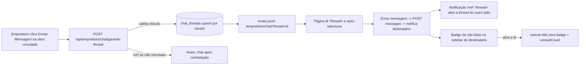

# Jornada — XChat Completo

> Status: pronto | Prioridade: alta | Wave: 8
> Última atualização: 2026-07-16

## 1. Contexto & Objetivo
Fechar o chat contratante↔empreiteiro por obra de ponta a ponta. A J13 entregou o backend (schema, service, rotas, notificações, polling) e o fluxo **do contratante já funciona**; o **empreiteiro só cria conversa efêmera** (não persiste, o contratante nunca recebe). Esta jornada faz o empreiteiro iniciar thread **real**, corrige o link da notificação, mostra **foto real** da contraparte (fallback iniciais+cor) e adiciona **badge de não-lidas na sidebar** visível de qualquer página. Dono primário da UI/UX de mensagens do chat — a J13 continua dona do schema e do disparo de notificação.

## 2. Personas
- **Contratante**: já inicia o chat da obra com empreiteira contratada. Ganha avatar real + badge de não-lidas na sidebar.
- **Empreiteiro**: passa a iniciar thread **real** a partir da obra vinculada; ganha auto-seleção por URL, avatar real e badge. No marketplace (obra sem vínculo), vê aviso e o chat **não** é criado.
- **Admin**: chat admin (suporte/disputas) e observabilidade read-only já cobertos por [J21](21-observabilidade-comunicacao-admin.md). Aqui só herda a padronização de `?thread=` e o avatar no `ChatHeader` compartilhado — sem mudança estrutural.

## 3. Fluxo ponta-a-ponta


## 4. Telas envolvidas
- [app/empreiteiro/chat/page.tsx](../../app/empreiteiro/chat/page.tsx) — adicionar auto-seleção por `?thread=` (espelhar contratante).
- [app/contratante/chat/page.tsx](../../app/contratante/chat/page.tsx) — já lê `?thread=` (referência).
- Detalhe de obra do empreiteiro (Minhas Obras / Novas Obras) — origem do botão "Enviar Mensagem".

## 5. Componentes-chave
- [features/empreiteiro/minhas-obras/components/ContatoContratanteCard.tsx](../../features/empreiteiro/minhas-obras/components/ContatoContratanteCard.tsx) — trocar fluxo efêmero por thread real.
- [features/empreiteiro/novas-obras/components/ObraDetalheContent.tsx](../../features/empreiteiro/novas-obras/components/ObraDetalheContent.tsx) — botão do marketplace: tratar 422 (aviso, sem navegar).
- [features/contratante/minhas-obras/components/ContatoEmpreiteiroCard.tsx](../../features/contratante/minhas-obras/components/ContatoEmpreiteiroCard.tsx) — referência do handler correto.
- [features/shared/xchat/components/](../../features/shared/xchat/components/) — `ChatHeader`, `ConversationList`, `MessageBubble` (render de avatar com fallback).
- `features/{contratante,empreiteiro}/components/{Persona}Sidebar.tsx` — badge de não-lidas.

## 6. Schema (Drizzle)
- **Sem alteração de tabelas.** Reusa `chat_threads` e `chat_mensagens` ([shared/db/schema.ts](../../shared/db/schema.ts):390-411) e campos de avatar já existentes: `users.image`, `users.avatarUrl`, `users.avatarFileId`→`user_files.publicUrl`, `clientes.avatarUrl`, `empreiteiras.avatarUrl`.
- **Índice a garantir** (perf do badge/contagem): `chat_mensagens(thread_id, lida_em, autor_user_id)` — já existe `idx_chat_mensagens_thread_keyset`; criar via bootstrap se o plano de query não usar um índice adequado.

## 7. Endpoints
- `POST /api/empreiteiro/chat/garantir-thread` — **criar**; espelha o do contratante com ownership invertido; `422 NAO_VINCULADO` se a obra não é da empreiteira logada.
- `GET /api/contratante/chat/unread-count` e `GET /api/empreiteiro/chat/unread-count` — **criar**; retornam `{ total }` agregado.
- Dispatcher de notificação — **editar**: `href` passa a usar `?thread=`.

## 8. Mocks a remover
- Fluxo **efêmero** do empreiteiro (`addEphemeralConversation` + `sendMessage` local nos dois cards) — substituído por thread real. O mecanismo do store permanece (usado por `EmptyChat`/otimista); apenas para de produzir conversa efêmera nova.

## 9. Checklist de implementação

### Item 1 — Padronizar link da notificação em `?thread=`
- [x] [features/notificacoes/nova-mensagem-chat-dispatcher.ts](../../features/notificacoes/nova-mensagem-chat-dispatcher.ts):69: `?conversationId=` → `?thread=`. É o único produtor do `href`; `?thread=` é o contrato já consumido pelas páginas.

### Item 2 — Extrair resolução de participantes no service
- [x] [features/chat/service.ts](../../features/chat/service.ts): novo `resolverParticipantesDaObra(obraId)` (JOIN `obras→clientes.userId` e `obras→empreiteiras.userId`; retorna participantes ou erro `NOT_FOUND | SEM_EMPREITEIRA | EMPREITEIRO_SEM_USER`).
- [x] [app/api/contratante/chat/garantir-thread/route.ts](../../app/api/contratante/chat/garantir-thread/route.ts): substituir a resolução inline (linhas 49-114) pela chamada ao helper, mantendo o guard de role/ownership. Reusa `garantirChatThread`.

### Item 3 — Auto-seleção por `?thread=` no empreiteiro
- [x] [app/empreiteiro/chat/page.tsx](../../app/empreiteiro/chat/page.tsx): `useSearchParams` + `didAutoSelectRef` + `useEffect` de auto-seleção (espelhar [app/contratante/chat/page.tsx](../../app/contratante/chat/page.tsx):42-52). Envolver em `<Suspense>` se o build Next 16 exigir.

### Item 4 — Rota garantir-thread do empreiteiro
- [x] [app/api/empreiteiro/chat/garantir-thread/route.ts](../../app/api/empreiteiro/chat/garantir-thread/route.ts) (novo): guard `role === 'empreiteiro'` (ou admin); resolve `empreiteiras.userId == user.id`; valida `obra.empreiteiraId === empreiteira.id` senão **422 `NAO_VINCULADO`**; chama o helper do Item 2 + `garantirChatThread`. Retorna `{ threadId }`.

### Item 5 — Empreiteiro inicia conversa REAL
- [x] [features/empreiteiro/minhas-obras/components/ContatoContratanteCard.tsx](../../features/empreiteiro/minhas-obras/components/ContatoContratanteCard.tsx): remover fluxo efêmero; replicar handler do contratante → `POST /api/empreiteiro/chat/garantir-thread` → `router.push('/empreiteiro/chat?thread=${threadId}')`; estados `loading/erro`; `data-testid="btn-enviar-mensagem"`.
- [x] [features/empreiteiro/novas-obras/components/ObraDetalheContent.tsx](../../features/empreiteiro/novas-obras/components/ObraDetalheContent.tsx): mesmo handler; no `422 NAO_VINCULADO` exibir "Chat disponível após a empreiteira ser contratada para esta obra" e **não** navegar.

### Item 6 — Avatar real no chat (backend)
Cadeia de fallback: `users.image` → `{empreiteiras|clientes}.avatarUrl` → `users.avatarUrl` → `user_files.publicUrl` → iniciais+cor.
- [x] [features/chat/service.ts](../../features/chat/service.ts) `listarConversasPorUsuario`: LEFT JOIN `clientes`/`empreiteiras` (por `userId` do counterpart) + `user_files` (por `avatar_file_id`); `counterpart_avatar_url = COALESCE(cu.image, cli.avatar_url, emp.avatar_url, cu.avatar_url, uf.public_url)`. Campo `counterpartAvatarUrl` em `ConversaRow`.
- [x] [features/chat/service.ts](../../features/chat/service.ts) `listarMensagensDaThread`: `autor_avatar_url` análogo. Campo `autorAvatarUrl`.
- [x] [features/chat/dto.ts](../../features/chat/dto.ts): `toConversationDTO.avatarUrl`, `toMessageDTO.senderAvatarUrl` — mantendo `participantInitials`/`participantColor` como fallback.

### Item 7 — Avatar real no chat (tipos + componentes)
- [x] [features/shared/xchat/types/](../../features/shared/xchat/types/) (+ tipos per-persona): `Conversation.avatarUrl?`, `Message.senderAvatarUrl?`.
- [x] [features/shared/xchat/components/](../../features/shared/xchat/components/) `ChatHeader` e `ConversationList`: renderizam `<ChatAvatar>` com `AvatarFallback` = círculo colorido + iniciais.
- [x] `MessageBubble` (opcional): mini-avatar da contraparte.

### Item 6b — Avatar nos Cards de contato (opcional, cosmético)
- [x] [app/api/obras/[id]/route.ts](../../app/api/obras/[id]/route.ts): adicionado `userImage`/`empreiteiraAvatarUrl` no select; `avatarUrl = userImage || empreiteiraAvatarUrl` no payload. `ContatoEmpreiteiroCard` e `ContatoContratanteCard` agora usam `<ChatAvatar>` com foto real + fallback iniciais+cor. _(Task #139)_

### Item 8 — Endpoint de contagem agregada de não-lidas
- [x] [features/chat/service.ts](../../features/chat/service.ts) `contarNaoLidasTotais(userId)`: `COUNT(*)` das mensagens do outro autor com `lida_em IS NULL` nas threads do usuário.
- [x] `app/api/{contratante,empreiteiro}/chat/unread-count/route.ts` (novos): guard + `{ total }` + `setNoCacheHeaders`.

### Item 9 — Badge global de não-lidas na sidebar
- [x] `features/{persona}/xchat/hooks/use-unread-count.ts` (novos): `useQuery` com `refetchInterval` do `QUERY_CONFIG` + `refetchOnWindowFocus`.
- [x] `features/{persona}/components/{Persona}Sidebar.tsx`: no item de url `/{persona}/chat`, badge vermelho (estilo Topbar, `>9 ? '9+'`) quando `total > 0`.
- [x] `features/{persona}/xchat/hooks/use-marcar-lida.ts`: adiciona invalidação de `['{persona}','chat','unread-count']` no `onSuccess`.

## 10. Critérios de aceite
1. Empreiteiro em Minhas Obras (obra vinculada) → "Enviar Mensagem" → vai para `/empreiteiro/chat?thread=<id>`, thread selecionada, foto+nome do contratante no header, input pronto. Refresh mantém a conversa.
2. Empreiteiro em Novas Obras (obra não vinculada) → "Enviar Mensagem" → aviso 422, **não** navega nem cria thread.
3. Empreiteiro envia mensagem → contratante vê no próximo poll + recebe notificação; clicar na notificação abre a thread correta (`?thread=`).
4. Badge vermelho no item "XChat" da sidebar aparece estando em outra página (ex.: dashboard); ao abrir a thread e ler, zera.
5. Avatar real aparece no `ChatHeader`/`ConversationList` quando há foto; cai para iniciais+cor quando não há.
6. Queries de verificação:
```sql
-- thread idempotente (1 por obra)
SELECT count(*) FROM chat_threads WHERE obra_id = :obraId; -- = 1
-- não-lidas agregadas = total do badge
SELECT count(*) FROM chat_mensagens m JOIN chat_threads t ON t.id = m.thread_id
 WHERE (t.contratante_user_id = :u OR t.empreiteiro_user_id = :u)
   AND m.autor_user_id <> :u AND m.lida_em IS NULL;
-- href padronizado
SELECT href FROM notificacoes WHERE thread_id = :t ORDER BY created_at DESC LIMIT 1; -- contém ?thread=
```

## 11. Riscos / Pontos de atenção
- `useSearchParams` no empreiteiro (Next 16 App Router) pode exigir `<Suspense>` — confirmar como o contratante evita o erro de build.
- COALESCE de avatar: se o arquivo estiver em `user_files` privado (sem `public_url`), cai no próximo fallback (iniciais). Signed URL fica fora de escopo.
- Ownership empreiteiro: admin faz bypass; empreiteiro de outra empreiteira → 403/422, nunca 500.
- Custo do poll do badge: 2 `COUNT` a cada 30-60s por usuário logado — garantir índice `(thread_id, lida_em, autor_user_id)`.
- Race de auto-seleção: `didAutoSelectRef` evita re-seleção; herdar o comportamento do contratante por consistência ao navegar entre notificações.

## 12. Links cruzados
- Depende de: J05 (criação de thread no aceite), J13 (schema + dispatcher + sino).
- Relacionada: J21 (chat admin read-only / observabilidade), J02 (avatar do perfil).
- Dono primário: UI/UX de mensagens do chat (J13 mantém schema e disparo de notificação).

## 13. Gaps descobertos durante execução
> Doc viva. Registrar aqui o que apareceu no caminho e não estava no roteiro original. Uma linha por item, com data.

- 2026-07-16: Fluxo efêmero (`addEphemeralConversation` + `sendMessage` local) fica sem produtor de conversa nova após o Item 5. Mantido no store por ora (baixo risco; `EmptyChat`/otimista ainda usam) — remover em jornada de limpeza futura.
- 2026-07-16: Ao rodar o E2E de regressão, 2 testes da [J21](21-observabilidade-comunicacao-admin.md) falhavam com **403 `PASSWORD_CHANGE_REQUIRED`** (não relacionado à J41 — confirmado rodando na `main` limpa). Causa: admin seed com `must_change_password=true` (gate J22/J30) travando toda rota autenticada; o helper de teste `/api/test/login-as` não neutralizava esse gate. Corrigido no helper (só sob `E2E_TEST_AUTH=1`). Nenhuma mudança na lógica de produção. Detalhe na seção 13 da J21.
- 2026-07-16: `role` do admin no banco de dev/e2e é `superadmin` (o seed cria como `admin`) — sinal de que o banco carrega estado além do seed base. Sem ação necessária para a J41; anotado para quem depender do estado exato do seed.
- 2026-07-16 (Task #142): `GET /api/{contratante,empreiteiro}/chat/conversations` retornava **500** com `TypeError: date.getFullYear is not a function`. Causa: `db.execute(sql\`...\`)` (raw SQL via Neon) retorna colunas `timestamp` como strings ISO, não objetos `Date` — a tipagem TypeScript dizia `Date` mas em runtime era string. Corrigido em `features/chat/dto.ts`: coagir `rawDate` com `new Date(rawDate as unknown as string)` antes de `formatRelativeShort` em `toConversationDTO`, e coagir `row.criadaEm` antes de `.toISOString()` em `toMessageDTO`. Tratar null (thread sem mensagens) retornando `""` em vez de quebrar.
- 2026-07-16 (Task #144): `GET /api/{contratante,empreiteiro}/chat/{id}/messages` retornava **500** com `TypeError: cursor.criadaEm.toISOString is not a function` em `features/chat/cursor.ts:17`. Mesma causa raiz — `service.ts:319` passava `maisAntiga.criada_em` (string raw) direto para `nextCursor` sem coagir. Corrigido: `new Date(maisAntiga.criada_em as unknown as string)`. Itens de polimento adicionados nesta task: ticks duplos azuis (`text-blue-400`) ao marcar mensagem como lida; barra de pesquisa dentro da conversa (client-side, filtra mensagens carregadas, ambas as personas via `SharedMessageArea`).
