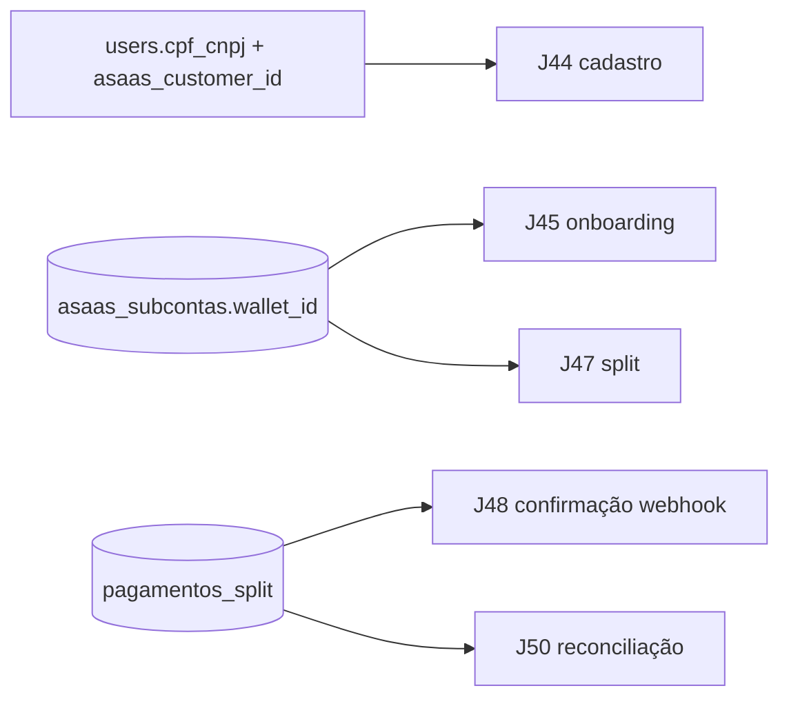

# Jornada — Fundação de Dados: Marketplace Split & Recebimento

> Status: planejada | Prioridade: alta | Wave: 10
> Última atualização: 2026-07-19
>
> Observação: jornada de **fundação** — só modelagem de dados (schema + migration
> idempotente), **sem comportamento novo**. Destrava J43–J50. Nenhuma rota muda de
> comportamento; nenhum mock é removido aqui.

## 1. Contexto & Objetivo
Hoje a plataforma só sabe **cobrar** (customer Asaas paga assinatura). Não há nada para o empreiteiro **receber** pela obra e sacar para o banco dele. Esta jornada cria toda a base de dados do modelo marketplace com split real via Asaas: documento fiscal do usuário, subconta Asaas do empreiteiro (com `walletId` — o campo que entra no split) e o registro de repasses por obra. Sem esta fundação, J43+ não têm onde persistir.

## 2. Personas
- **Empreiteiro**: passa a ter uma subconta Asaas (dados de recebimento + status de KYC).
- **Contratante**: passa a ter `cpf_cnpj` e `asaas_customer_id` (papel pagador).
- **Sistema/dev**: bootstrap idempotente que cria tabelas/colunas sem quebrar dados existentes.

## 3. Fluxo ponta-a-ponta
Esta jornada não tem fluxo de usuário — é infraestrutura de dados que as demais consomem.

## 4. Telas envolvidas
Nenhuma. Jornada de schema.

## 5. Componentes-chave
- [server/bootstrap-marketplace-split.ts](../../server/bootstrap-marketplace-split.ts) — **a criar**: migration idempotente (padrão dos demais `server/bootstrap-*.ts`), registrada em [instrumentation.ts](../../instrumentation.ts).
- Referência de idempotência a reusar: `uq_financeiro_origem` (índice único parcial) em [shared/db/schema.ts](../../shared/db/schema.ts) e o padrão de `server/bootstrap-planos.ts` / `server/bootstrap-webhook-delivery-log.ts`.

## 6. Schema (Drizzle)
Tabelas existentes tocadas em [shared/db/schema.ts](../../shared/db/schema.ts): `users`.

**Alterar `users`** (colunas novas, nullable — não quebra dados existentes):
- `cpf_cnpj text` — documento fiscal (papel pagador e recebedor).
- `asaas_customer_id text` — id do customer Asaas (criado proativamente em J44; elimina o lookup lazy por email).

**Criar enum `asaas_subconta_status`**: `pendente | aguardando_kyc | aprovada | rejeitada`.
**Criar enum `split_pagamento_status`**: `pendente | confirmado | repassado | falhou | estornado`.

**Criar tabela `asaas_subcontas`** (uma por empreiteiro):
- `id varchar PK default gen_random_uuid()`
- `user_id varchar → users.id (on delete cascade)` — **unique** (1 subconta por usuário)
- `asaas_account_id text` — id da subconta Asaas (`/accounts`)
- `wallet_id text` — **campo crítico**: entra no `split` dos pagamentos
- `asaas_api_key_enc text` — apiKey da subconta, **criptografada em repouso** (nunca texto puro)
- `onboarding_status asaas_subconta_status not null default 'pendente'`
- `kyc_status text` — status bruto do Asaas (auditoria)
- `tipo_conta text` — recebimento: `PIX | TED`
- `pix_chave text` / `pix_tipo text` — quando PIX
- `banco_codigo text` / `agencia text` / `conta text` / `conta_digito text` / `conta_tipo text` — quando TED
- `titular_nome text` / `titular_cpf_cnpj text`
- `created_at timestamp default now()` / `updated_at timestamp default now()`
- Índices: `unique (user_id)`, `index (asaas_account_id)` (lookup por webhook KYC), `index (wallet_id)`.

**Criar tabela `pagamentos_split`** (um registro por cobrança de obra com split):
- `id varchar PK default gen_random_uuid()`
- `financeiro_id varchar → financeiro.id` — liga ao livro-caixa
- `obra_id varchar → obras.id`
- `medicao_id varchar` — rastreio
- `pagador_user_id varchar → users.id` / `recebedor_user_id varchar → users.id`
- `asaas_payment_id text` — **unique** (idempotência do webhook)
- `asaas_checkout_id text`
- `valor_total numeric(15,2)` / `valor_plataforma numeric(15,2)` / `valor_empreiteiro numeric(15,2)`
- `percentual_plataforma numeric(5,2)` — snapshot da regra no momento
- `wallet_id_empreiteiro text` — snapshot do destino
- `status split_pagamento_status not null default 'pendente'`
- `billing_type text` — PIX/BOLETO/CREDIT_CARD
- `confirmado_em timestamp` / `created_at timestamp default now()` / `updated_at timestamp default now()`
- Índices: `unique (asaas_payment_id)`, `index (obra_id, status)`, `index (financeiro_id)`.

**Migration**: `server/bootstrap-marketplace-split.ts` (idempotente, `IF NOT EXISTS`), registrado no `instrumentation.ts`. Sem `drizzle/000X` manual — segue o padrão de bootstrap do projeto.

## 7. Endpoints
Nenhum endpoint novo nesta jornada.

## 8. Mocks a remover
Nenhum. (A fundação não remove mock; a remoção acontece em J45/J47/J48 ao ligar os fluxos reais.)

## 9. Checklist de implementação
- [ ] Colunas `cpf_cnpj`, `asaas_customer_id` em `users` (`shared/db/schema.ts`)
- [ ] Enums `asaas_subconta_status` e `split_pagamento_status`
- [ ] Tabela `asaas_subcontas` com índices (unique `user_id`, index `asaas_account_id`, index `wallet_id`)
- [ ] Tabela `pagamentos_split` com índices (unique `asaas_payment_id`, index `(obra_id,status)`, index `financeiro_id`)
- [ ] `server/bootstrap-marketplace-split.ts` idempotente, registrado em `instrumentation.ts`
- [ ] `npm run check` limpo; db-status sem divergência de schema

## 10. Critérios de aceite
1. Rodar o bootstrap duas vezes seguidas não gera erro nem duplica objetos (idempotência).
2. Query de verificação: `SELECT column_name FROM information_schema.columns WHERE table_name='users' AND column_name IN ('cpf_cnpj','asaas_customer_id');` retorna 2 linhas.
3. `SELECT to_regclass('public.asaas_subcontas'), to_regclass('public.pagamentos_split');` retorna as duas tabelas.
4. Nenhuma rota existente muda de comportamento (specs de assinatura continuam verdes).

## 11. Riscos / Pontos de atenção
- `asaas_api_key_enc` **deve** ser criptografada em repouso (dá acesso total à subconta do empreiteiro). A cripto em si é implementada em J45; aqui o campo já nasce com a intenção de guardar valor cifrado.
- Colunas novas em `users` devem ser nullable para não quebrar registros existentes.
- Não colocar regra de negócio no schema — `percentual_plataforma` é snapshot, a regra viva fica em `platform_settings` (J47).

## 12. Links cruzados
- Depende de: J01 (users), J08 (financeiro/obras).
- Bloqueia: J43, J44, J45, J47, J48, J49, J50.

## 13. Gaps descobertos durante execução
> Doc viva. Registrar aqui o que apareceu no caminho e não estava no roteiro original. Uma linha por item, com data.

- _(sem entradas ainda — jornada não iniciada)_
