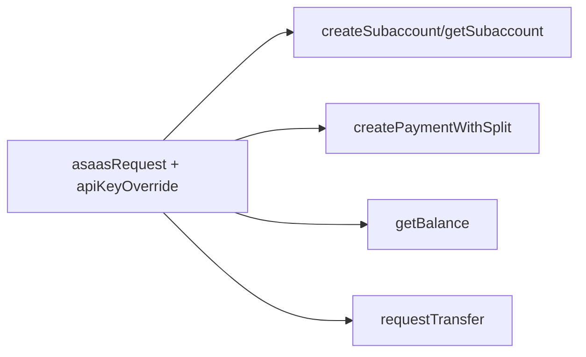

# Jornada — Extensão do asaas-client: Subcontas, Split, Saldo & Transferência

> Status: concluída | Prioridade: alta | Wave: 10
> Última atualização: 2026-07-22
>
> Observação: jornada de **camada de transporte** — adiciona métodos/tipos sobre o
> `asaasRequest` existente. Paralelizável com J42.
>
> **CONCLUÍDA (2026-07-22):** `asaasRequest` ganhou 4º param `apiKeyOverride`;
> tipos `AsaasSubaccount(Input)`, `AsaasSplit`, `AsaasBalance`, `AsaasTransfer(Input)`
> + `split?` em `AsaasPayment`/`AsaasCheckout`; funções `createSubaccount`,
> `getSubaccount`, `createPaymentWithSplit`, `getBalance`, `requestTransfer`.
> `createSubaccount`/`getSubaccount` já têm caller (J45); `createPaymentWithSplit`/
> `getBalance`/`requestTransfer` ainda sem caller (J47/J49). Testes unitários de
> fetch mockado **adiados** (decisão de produto) — cobertura via E2E sandbox quando
> houver caller.

## 1. Contexto & Objetivo
O client HTTP do Asaas ([shared/lib/asaas-client.ts](../../shared/lib/asaas-client.ts)) hoje só cobre customer/checkout/payment/subscription — o suficiente para cobrar assinatura. Para o marketplace precisamos das operações de **recebimento**: criar subconta (`/accounts`), pagar com split (`/payments` ou `/checkouts` com `split`), consultar saldo (`/finance/balance`) e transferir para banco (`/transfers`). Esta jornada adiciona esses métodos finos reusando o transporte `asaasRequest`, sem reescrever nada.

## 2. Personas
- **Sistema/dev**: consome a nova camada nas jornadas J45 (subconta), J47 (split), J49 (saldo/saque).

## 3. Fluxo ponta-a-ponta
Camada de biblioteca — sem fluxo de usuário.

## 4. Telas envolvidas
Nenhuma.

## 5. Componentes-chave
- [shared/lib/asaas-client.ts](../../shared/lib/asaas-client.ts) — **estender**: novos tipos + funções + `apiKeyOverride` no transporte.
- Reusar `asaasRequest(method, path, body)` já existente — não duplicar `fetch`/auth/tratamento de erro.

## 6. Schema (Drizzle)
Nenhuma mudança de schema (consome o que J42 criou; não persiste diretamente).

## 7. Endpoints
Chamadas à **API externa do Asaas** (não são endpoints internos):
- `POST /accounts` — criar subconta.
- `GET /accounts/{id}` (ou `GET /accounts?cpfCnpj=`) — consultar subconta/KYC.
- `POST /payments` (ou `POST /checkouts`) com array `split: [{ walletId, percentualValue | fixedValue }]`.
- `GET /finance/balance` — **usando a apiKey da subconta** (via `apiKeyOverride`).
- `POST /transfers` — saque PIX/TED para o banco do empreiteiro.

**Assinaturas propostas** (só contrato — implementação na execução):
- `createSubaccount(input: AsaasSubaccountInput): Promise<AsaasSubaccount>`
- `getSubaccount(accountIdOrCpfCnpj: string): Promise<AsaasSubaccount>`
- `createPaymentWithSplit(input: AsaasPaymentWithSplitInput): Promise<AsaasPayment>`
- `getBalance(apiKeyOverride: string): Promise<AsaasBalance>`
- `requestTransfer(input: AsaasTransferInput, apiKeyOverride: string): Promise<AsaasTransfer>`

**Ajuste no transporte:** adicionar parâmetro opcional `apiKeyOverride?: string` em `asaasRequest` (ou helper `asaasRequestAs(apiKey, ...)`) — hoje o header `access_token` é fixo na master key; operações de subconta exigem a apiKey dela.

**Tipos novos:** `AsaasSubaccount { id, walletId, apiKey?, accountNumber?, status?, onboardingUrl? }`, `AsaasSubaccountInput { name, email, cpfCnpj, companyType, mobilePhone, incomeValue, address... }`, `AsaasSplit { walletId, percentualValue?, fixedValue? }`, `AsaasBalance { balance }`, `AsaasTransfer { id, value, status }`, `AsaasTransferInput { value, pixAddressKey? | bankAccount... }`. Estender `AsaasPayment`/`AsaasCheckout` com `split?: AsaasSplit[]`.

## 8. Mocks a remover
Nenhum (camada nova, ainda sem caller).

## 9. Checklist de implementação
- [x] `apiKeyOverride?` no transporte (`asaasRequest`) ou `asaasRequestAs`
- [x] `createSubaccount` + tipos `AsaasSubaccount`/`AsaasSubaccountInput`
- [x] `getSubaccount`
- [x] `createPaymentWithSplit` + tipo `AsaasSplit`; estender `AsaasPayment`/`AsaasCheckout`
- [x] `getBalance` (contexto de subconta via apiKeyOverride)
- [x] `requestTransfer` + tipos `AsaasTransfer`/`AsaasTransferInput`
- [x] ~~Testes unitários com mock de `fetch` (feliz + erro HTTP) para cada método~~ _(**adiado por decisão de produto** — ver cabeçalho. Os métodos são exercitados de ponta a ponta pelos specs de integração de subconta/split/saldo. Reentra junto com a **J35**, que traz o runner unitário: hoje não existe Vitest no projeto.)_
- [x] `npm run check` limpo

## 10. Critérios de aceite
1. Cada método compila e é testável com `fetch` mockado (não requer credencial real).
2. `apiKeyOverride` faz o header `access_token` usar a chave da subconta, não a master (assert no mock).
3. Erro HTTP do Asaas propaga a `description` do erro (mesmo comportamento de `asaasRequest` atual).
4. Nenhum caller de produção referencia os novos métodos ainda (jornada isolada).

## 11. Riscos / Pontos de atenção
- A apiKey da subconta trafega em memória — nunca logar. Em J45 ela é persistida cifrada; aqui ela só é usada como header.
- `createPaymentWithSplit`: decidir entre `/payments` (avulso, controlamos a cobrança) e `/checkouts` (hospedado, PIX/Boleto/Cartão prontos). Recomendação: checkout hospedado com `split`, espelhando o `createCheckout` de assinatura.
- Estrutura de erro de split (walletId inválido/subconta não aprovada) precisa ser distinguível para o caller tratar em J47.

## 12. Links cruzados
- Depende de: J42 (campos `wallet_id`/`asaas_api_key_enc` para os callers persistirem depois).
- Bloqueia: J45, J47, J49.
- Relacionada: J11 (reusa `asaasRequest` e o padrão do `createCheckout` de assinatura em `features/planos/gateway/asaas-gateway.ts`).

## 13. Gaps descobertos durante execução
> Doc viva. Registrar aqui o que apareceu no caminho e não estava no roteiro original. Uma linha por item, com data.

- 2026-07-22: `createPaymentWithSplit` usa `/payments` (avulso/DETACHED) em vez de `/checkouts` — o split de obra é cobrança única, não recorrente. O payload de checkout hospedado foi espelhado só na estrutura, não no `chargeType`.
- 2026-07-22: `getSubaccount` decide entre `GET /accounts/{id}` e `GET /accounts?cpfCnpj=` pela contagem de dígitos (11=CPF, 14=CNPJ) — útil para o webhook KYC (J46) reidratar por documento.
