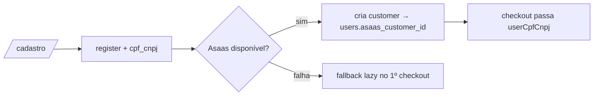

# Jornada — Cadastro: CPF/CNPJ + Customer Asaas Proativo

> Status: planejada | Prioridade: alta | Wave: 10
> Última atualização: 2026-07-19
>
> Observação: fecha um **gap bloqueante de produção** da J11 — o Asaas exige
> CPF/CNPJ para cobrança real, mas o fluxo atual nunca o coleta nem envia
> (`CheckoutInput.userCpfCnpj` existe mas `iniciarCheckout` nunca o popula).

## 1. Contexto & Objetivo
Coletar o documento fiscal do usuário e criar o customer Asaas **proativamente** (decisão de produto: "o cara já vai ter conta no Asaas após o cadastro"), em vez de lazy no primeiro checkout. Isso torna a cobrança de assinatura viável em produção e prepara o terreno para o empreiteiro virar recebedor (J45).

## 2. Personas
- **Contratante / Empreiteiro / Anunciante**: informa CPF/CNPJ (no cadastro ou numa etapa pós-cadastro antes do 1º pagamento).
- **Sistema**: cria o customer Asaas best-effort e persiste `asaas_customer_id`.

## 3. Fluxo ponta-a-ponta
1. Usuário se cadastra em `/cadastro` (`registerSchema`).
2. `cpf_cnpj` é coletado (opcional no register; **obrigatório antes do 1º pagamento**).
3. No registro, `createUserWithProfile` chama `findOrCreateCustomer` (best-effort) → persiste `users.asaas_customer_id`.
4. No checkout de assinatura, `iniciarCheckout` passa `userCpfCnpj` para o gateway (que hoje aceita mas nunca recebe).

## 4. Telas envolvidas
- [app/cadastro/page.tsx](../../app/cadastro/page.tsx) — campo CPF/CNPJ (ou etapa pós-cadastro).
- Etapa pós-cadastro / configurações onde o CPF/CNPJ vira obrigatório antes de pagar (reusar seções de perfil existentes).

## 5. Componentes-chave
- [features/auth/schemas/index.ts](../../features/auth/schemas/index.ts) — `registerSchema`: add `cpfCnpj` com validação (CPF 11 / CNPJ 14 dígitos).
- [app/api/auth/register/route.ts](../../app/api/auth/register/route.ts) — orquestra o registro.
- [features/auth/api/auth-storage.ts](../../features/auth/api/auth-storage.ts) — `createUserWithProfile`: chamar `findOrCreateCustomer` best-effort.
- [features/planos/assinatura-service.ts](../../features/planos/assinatura-service.ts) — `iniciarCheckout`: popular `userCpfCnpj` (hoje só passa name/email).
- [features/planos/gateway/asaas-gateway.ts](../../features/planos/gateway/asaas-gateway.ts) — `findOrCreateCustomer` já aceita `cpfCnpj`.

## 6. Schema (Drizzle)
Reusa colunas criadas em J42: `users.cpf_cnpj`, `users.asaas_customer_id`. Sem novas tabelas.

## 7. Endpoints
- `POST /api/auth/register` — passa a persistir `cpf_cnpj` e (best-effort) `asaas_customer_id`.
- (Opcional) `PATCH /api/perfil` ou similar — permitir informar/atualizar CPF/CNPJ pós-cadastro.

## 8. Mocks a remover
- Nenhum mock removido; porém elimina o **fallback frágil** de `findOrCreateCustomer` por email a cada checkout (passa a usar `asaas_customer_id` persistido quando existir).

## 9. Checklist de implementação
- [ ] `cpfCnpj` no `registerSchema` com validação de formato
- [ ] Coleta na tela de cadastro (ou etapa pós-cadastro) — decidir UX de fricção
- [ ] `createUserWithProfile` cria customer Asaas **best-effort não-bloqueante** (falha do Asaas NÃO impede cadastro; fallback lazy mantido)
- [ ] Persistir `users.asaas_customer_id`
- [ ] `iniciarCheckout` popula `userCpfCnpj` a partir de `users.cpf_cnpj`
- [ ] Guard: bloquear checkout de assinatura se `cpf_cnpj` ausente (mensagem amigável)
- [ ] Gate atrás de `PAYMENT_GATEWAY=asaas` — não disparar chamadas Asaas em ambiente sem chave
- [ ] Teste de integração em `tests/e2e/integration/` (registro persiste cpf_cnpj; checkout envia documento)

## 10. Critérios de aceite
1. Cadastro com CPF válido persiste `users.cpf_cnpj` e, com Asaas disponível, `asaas_customer_id`.
2. Cadastro com Asaas **indisponível** ainda conclui (customer criado lazy depois).
3. Checkout de assinatura em sandbox envia o CPF/CNPJ ao Asaas (verificável no painel).
4. Query: `SELECT cpf_cnpj, asaas_customer_id FROM users WHERE email='<user e2e>';` retorna os valores.

## 11. Riscos / Pontos de atenção
- **Fricção no funil**: exigir CPF/CNPJ no signup pode reduzir conversão. Recomendação: opcional no register, obrigatório na porta do pagamento.
- Criação do customer é **best-effort**: nunca bloquear o cadastro por falha de rede do Asaas (há transação + rollback de consentimento no register — tratar o customer fora do caminho crítico).
- Validar CPF/CNPJ (formato + dígito verificador) antes de enviar — o Asaas rejeita documento inválido.

## 12. Links cruzados
- Depende de: J42 (colunas em `users`), J43 (não estritamente — usa `findOrCreateCustomer` já existente).
- Bloqueia: J45 (empreiteiro precisa de CPF/CNPJ para abrir subconta).
- Fecha gap de: J11 (CPF/CNPJ ao Asaas).

## 13. Gaps descobertos durante execução
> Doc viva. Registrar aqui o que apareceu no caminho e não estava no roteiro original. Uma linha por item, com data.

- _(sem entradas ainda — jornada não iniciada)_
