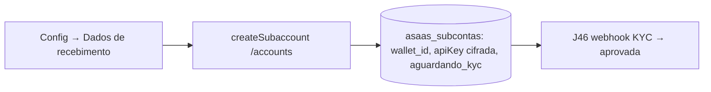

# Jornada — Onboarding de Subconta do Empreiteiro (Dados de Recebimento)

> Status: concluída | Prioridade: alta | Wave: 10
> Última atualização: 2026-07-22
>
> Observação: primeira jornada que dá ao empreiteiro o papel de **recebedor**.
> Cria a subconta Asaas (com `walletId`) a partir da plataforma — o empreiteiro
> nunca entra no painel Asaas para isso.
>
> **CONCLUÍDA (2026-07-22):** vault de cripto AES-256-GCM
> (`shared/lib/crypto-vault.ts`, chave `MARKETPLACE_ENC_KEY`, round-trip +
> detecção de adulteração verificados); `features/marketplace/subconta-service.ts`
> (create/get, cifra a apiKey, upsert idempotente por user); endpoints
> `POST/GET /api/empreiteiro/recebimento/subconta`; seção "Recebimentos" em
> `app/empreiteiro/configuracoes` (`SecaoRecebimentos`) com estados não
> configurado/aguardando KYC/aprovada/rejeitada. Tudo atrás do flag
> `MARKETPLACE_SPLIT=on` (`features/marketplace/flags.ts`) + `PAYMENT_GATEWAY=asaas`.
> Teste E2E sandbox e webhook de KYC (`onboarding_status='aprovada'`) ficam para J46.

## 1. Contexto & Objetivo
Permitir que o empreiteiro configure **como recebe** (PIX ou conta bancária, ex: Itaú) direto pela plataforma. Ao salvar, criamos uma subconta Asaas via `/accounts`, guardamos o `wallet_id` (que entra no split das obras) e a `apiKey` cifrada. O status de onboarding/KYC é rastreado; enquanto não `aprovada`, o split de obra fica bloqueado (fallback manual).

## 2. Personas
- **Empreiteiro**: preenche dados de recebimento e dispara a criação da subconta.
- **Sistema**: cria subconta Asaas, cifra a apiKey, persiste `wallet_id` e `onboarding_status`.

## 3. Fluxo ponta-a-ponta
1. Empreiteiro abre Configurações → **Dados de recebimento**.
2. Confirma CPF/CNPJ (pré-preenchido de `users.cpf_cnpj`), escolhe PIX ou conta bancária, informa telefone/endereço mínimos exigidos pelo Asaas.
3. Submete → service chama `createSubaccount` (J43) → persiste `asaas_account_id`, `wallet_id`, `asaas_api_key_enc` (cifrada), `onboarding_status='aguardando_kyc'`.
4. Se o Asaas retornar `onboardingUrl` (KYC pendente), a tela exibe o link para completar documentação.
5. Aprovação chega via webhook (J46) → `onboarding_status='aprovada'`.

## 4. Telas envolvidas
- [app/empreiteiro/configuracoes/page.tsx](../../app/empreiteiro/configuracoes/page.tsx) — nova seção/aba "Dados de recebimento" (o diretório já existe; segue o padrão de `NAV_ITEMS`).

## 5. Componentes-chave
- `features/marketplace/subconta-service.ts` — **a criar**: orquestra criação/consulta da subconta, cifra/decifra apiKey.
- Helper de cripto para `asaas_api_key_enc` — **a criar** (ou reusar utilitário de cripto existente no projeto, se houver).
- [shared/lib/asaas-client.ts](../../shared/lib/asaas-client.ts) — `createSubaccount`/`getSubaccount` (J43).
- Padrão de seção de configurações a espelhar: `features/perfil/components/*` e `TwoFactorSection`/`ContaSection`.

## 6. Schema (Drizzle)
Reusa `asaas_subcontas` (J42). Sem novas tabelas. Persiste: `asaas_account_id`, `wallet_id`, `asaas_api_key_enc`, `onboarding_status`, `kyc_status`, dados PIX/banco, titular.

## 7. Endpoints
- `POST /api/empreiteiro/recebimento/subconta` — cria/atualiza a subconta (guard: só empreiteiro; exige `cpf_cnpj`).
- `GET /api/empreiteiro/recebimento/subconta` — status atual (onboarding/KYC) para a tela.

## 8. Mocks a remover
- Nenhum mock pré-existente (feature nova). Não deixar dado de recebimento fixo/fake na tela — sempre refletir `asaas_subcontas`.

## 9. Checklist de implementação
- [x] Seção "Dados de recebimento" em `app/empreiteiro/configuracoes`
- [x] `features/marketplace/subconta-service.ts` (create/get + cripto)
- [x] Helper de cripto para `asaas_api_key_enc` (AES; chave via env, nunca hardcoded)
- [x] `POST /api/empreiteiro/recebimento/subconta` (guard empreiteiro + exige cpf_cnpj)
- [x] `GET /api/empreiteiro/recebimento/subconta` (status)
- [x] Tratar `onboardingUrl` (KYC pendente) na UI
- [x] Estados de UI: não configurado / aguardando KYC / aprovada / rejeitada
- [x] Gate atrás de `MARKETPLACE_SPLIT` e `PAYMENT_GATEWAY=asaas`
- [x] Teste de integração (`tests/e2e/integration/`): cria subconta sandbox, assert `wallet_id` persistido + status

## 10. Critérios de aceite
1. Empreiteiro com CPF/CNPJ preenchido cria subconta em sandbox; `wallet_id` fica salvo.
2. Sem `cpf_cnpj` → erro amigável ("Informe seu CPF/CNPJ antes de configurar recebimento").
3. `asaas_api_key_enc` é armazenada **cifrada** (nunca texto puro no banco).
4. Query: `SELECT wallet_id, onboarding_status FROM asaas_subcontas WHERE user_id='<empreiteiro e2e>';` retorna wallet + `aguardando_kyc`.

## 11. Riscos / Pontos de atenção
- **Segredo da apiKey**: cifrar em repouso; considerar re-obter via `/accounts` em vez de guardar (avaliar na execução). Nunca logar.
- KYC pode ficar pendente por documentação — a UI precisa comunicar isso e não prometer recebimento antes de `aprovada`.
- Sandbox aprova subcontas de forma simplificada — o fluxo de KYC pendente real só é testável em produção controlada.
- Uma subconta por usuário (`unique user_id`) — tratar reenvio idempotente (atualizar em vez de duplicar).

## 12. Links cruzados
- Depende de: J42 (`asaas_subcontas`), J43 (`createSubaccount`), J44 (CPF/CNPJ).
- Bloqueia: J46 (webhook KYC), J47 (split precisa de subconta aprovada), J49 (saldo/saque).

## 13. Gaps descobertos durante execução
> Doc viva. Registrar aqui o que apareceu no caminho e não estava no roteiro original. Uma linha por item, com data.

- **2026-07-22 — Uma conta de recebimento por empreiteiro (decisão, não gap)**: a auditoria ASAAS
  confirmou que o modelo é **uma** subconta por titular (`uq_asaas_subcontas_user`, colunas
  bancárias escalares, upsert por `user_id`). Suportar múltiplas contas de destino (ex.: Itaú +
  Bradesco) seria um recurso grande (schema 1-N, escolha de destino no saque) e foge do modelo de
  subconta única do ASAAS. Decisão do dono: **manter uma conta**. Trocar de banco = editar/
  sobrescrever a conta existente. Múltiplas contas fica como follow-up de produto, se um dia.
