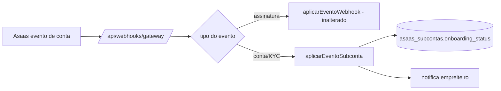

# Jornada — Webhooks de Status de Subconta (KYC)

> Status: concluída | Prioridade: média | Wave: 10
> Última atualização: 2026-07-22
>
> Observação: introduz **roteamento** no webhook único existente sem alterar o
> caminho de assinatura. Risco de regressão alto — cobrir com teste.
>
> **CONCLUÍDA (2026-07-22):** `parseWebhook` reconhece eventos `ACCOUNT_STATUS_*`
> (novo tipo normalizado `account_status_changed` + `accountId`/`accountStatus`);
> `route.ts` E o retry job roteiam esse tipo para
> `features/marketplace/aplicar-evento-subconta.ts` (localiza por
> `asaas_account_id`, transiciona status idempotentemente, notifica o empreiteiro).
> Simulador `POST /api/test/webhooks/asaas` estendido. Testes: 5 novos verdes +
> **regressão zero** confirmada (webhook de assinatura: 8+14 specs verdes).

## 1. Contexto & Objetivo
A subconta criada em J45 nasce `aguardando_kyc`. O Asaas emite eventos de conta (aprovação/rejeição de KYC). Esta jornada roteia esses eventos no webhook único e atualiza `asaas_subcontas.onboarding_status`/`kyc_status`, notificando o empreiteiro. Sem isso, a subconta nunca sai de "aguardando" e o split (J47) fica permanentemente bloqueado.

## 2. Personas
- **Empreiteiro**: recebe notificação "Recebimento aprovado" / "pendência de documentos".
- **Sistema**: consome evento, atualiza status, dispara notificação.

## 3. Fluxo ponta-a-ponta
1. Asaas envia evento de conta para `POST /api/webhooks/gateway`.
2. Route resolve tipo → **roteia** para `aplicarEventoSubconta` (eventos de assinatura continuam indo para `aplicarEventoWebhook`).
3. `aplicarEventoSubconta` localiza a subconta por `asaas_account_id`, atualiza `onboarding_status`/`kyc_status`.
4. Notifica o empreiteiro (in-app + email), reusando o dispatcher de notificações existente.

## 4. Telas envolvidas
- Nenhuma nova. A tela de J45 reflete o novo status ao recarregar.

## 5. Componentes-chave
- [app/api/webhooks/gateway/route.ts](../../app/api/webhooks/gateway/route.ts) — adicionar roteamento por tipo/externalReference **antes** de `aplicarEventoWebhook`.
- `features/marketplace/aplicar-evento-subconta.ts` — **a criar**.
- Reusar dead-letter/idempotência existentes: `webhook_delivery_log` + `getClientIp` + a validação de IP em `parseWebhook` (`features/planos/gateway/asaas-gateway.ts`).
- Dispatcher de notificação: espelhar `assinatura-admin-dispatcher.ts` / `criarNotificacao`.

## 6. Schema (Drizzle)
Reusa `asaas_subcontas` (J42) e `webhook_delivery_log` (dead-letter existente). Opcional: tabela `asaas_account_eventos` para histórico de KYC — **fora de escopo** nesta jornada (idempotência via transição de status).

## 7. Endpoints
- `POST /api/webhooks/gateway` — **estendido** com roteamento (sem novo endpoint).

## 8. Mocks a remover
- Nenhum. O simulador `app/api/test/webhooks/asaas/route.ts` pode ganhar suporte a eventos de conta para E2E (mantido gated por `E2E_TEST_AUTH`).

## 9. Checklist de implementação
- [ ] Roteamento no `route.ts` por tipo de evento (conta vs. assinatura vs. split)
- [ ] `parseWebhook` reconhece eventos de conta (estender parse ou parse dedicado)
- [ ] `features/marketplace/aplicar-evento-subconta.ts` (localiza por `asaas_account_id`, atualiza status)
- [ ] Idempotência via `webhook_delivery_log` + transição condicional de status
- [ ] Notificação ao empreiteiro (aprovada / rejeitada / pendência)
- [ ] **Teste de regressão**: eventos de assinatura continuam indo para `aplicarEventoWebhook`
- [ ] Teste de integração: evento de aprovação → `onboarding_status='aprovada'` + notificação

## 10. Critérios de aceite
1. Evento de aprovação de conta → `asaas_subcontas.onboarding_status='aprovada'` e empreiteiro notificado.
2. Evento duplicado não reaplica (idempotente).
3. **Regressão zero**: specs de webhook de assinatura (`planos-assinatura-webhook.integration.spec.ts`) continuam verdes.
4. Query: `SELECT onboarding_status FROM asaas_subcontas WHERE asaas_account_id='<acc>';` = `aprovada`.

## 11. Riscos / Pontos de atenção
- **Roteamento = maior risco de regressão da wave** no fluxo de assinatura. O caminho de assinatura NÃO pode mudar — teste obrigatório.
- Nem todo evento de conta é testável em sandbox (KYC documental real). Validar manualmente em produção controlada.
- Nomes/tipos de evento de conta do Asaas precisam ser confirmados na doc oficial no momento da execução (`ACCOUNT_STATUS_*`).

## 12. Links cruzados
- Depende de: J45 (subconta existe).
- Bloqueia: J47/J48 (split efetivo só com subconta `aprovada`).
- Relacionada: J11 (mesmo webhook), J33 (observabilidade de erros de webhook).

## 13. Gaps descobertos durante execução
> Doc viva. Registrar aqui o que apareceu no caminho e não estava no roteiro original. Uma linha por item, com data.

- 2026-07-22: os nomes de evento do Asaas foram confirmados na doc oficial (`ACCOUNT_STATUS_{BANK_ACCOUNT_INFO,COMMERCIAL_INFO,DOCUMENT,GENERAL_APPROVAL}_{APPROVED,AWAITING_APPROVAL,PENDING,REJECTED}`). Só `GENERAL_APPROVAL_APPROVED` leva a `aprovada`; as demais etapas são intermediárias (`aguardando_kyc`). Payload traz o id da subconta em `account.id` (casa com `asaas_account_id`).
- 2026-07-22: o roteamento foi replicado em DOIS lugares — o handler principal (`route.ts`) e o `webhook-retry-job.ts` (que re-parseia o `raw_body` do dead-letter). Ambos roteiam `account_status_changed` para `aplicarEventoSubconta`. Esquecer o retry job deixaria eventos de conta em dead-letter sendo reprocessados como assinatura.
- 2026-07-22: `mapStatus` nunca regride de `aprovada` por um evento intermediário `pending` (ex: reenvio de `DOCUMENT_PENDING` após aprovação geral não desfaz a aprovação).
