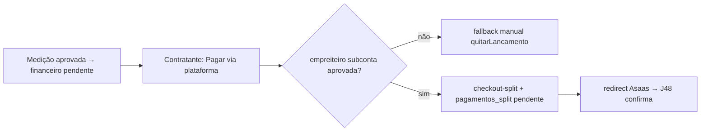

# Jornada — Checkout de Obra com Split (Iniciação)

> Status: concluída | Prioridade: alta | Wave: 10
> Última atualização: 2026-07-22
>
> Observação: **o pivô** — o dinheiro da obra passa a trafegar pela plataforma.
> Tudo atrás da flag `MARKETPLACE_SPLIT` (default off). O fluxo manual
> (`quitarLancamento`) permanece intacto como fallback.
>
> **CONCLUÍDA (2026-07-22):** `features/marketplace/split-service.ts`
> (`iniciarCheckoutSplit`: resolve subconta aprovada, calcula split, insere
> `pagamentos_split` pendente, chama `createPaymentWithSplit`, retorna
> `invoiceUrl`; + `filtrarRecebedoresAptos` para a lista). Endpoint
> `POST /api/contratante/pagamentos/[id]/checkout-split` reusa os guards do fluxo
> manual (ownership/pago/disputa). Comissão em `platform_settings`
> (`marketplace.percentualPlataforma`, default 10%, editável no admin) —
> `getPercentualPlataforma`. CTA "Pagar via plataforma" na tela de pagamentos
> (condicional a `splitElegivel`). Testes: 6 guards verdes + caminho feliz
> skipado no ambiente (força `PAYMENT_GATEWAY=manual`). **Confirmação → J48.**

## 1. Contexto & Objetivo
Hoje o pagamento de obra é registro manual: o contratante paga por fora e marca "pago" (`quitarLancamento`). Esta jornada adiciona a opção **"Pagar via plataforma"**: o contratante paga via checkout Asaas com `split` configurado (% plataforma + % empreiteiro), e o Asaas credita a subconta do empreiteiro. Esta jornada cobre a **iniciação** (criar o checkout + registro `pendente`); a confirmação via webhook é a J48.

## 2. Personas
- **Contratante**: escolhe pagar a medição via plataforma (checkout hospedado).
- **Empreiteiro**: recebe o repasse na subconta (efetivado em J48).
- **Plataforma**: retém a comissão via split.

## 3. Fluxo ponta-a-ponta
1. Medição aprovada (J06) gera lançamento `financeiro` (`pagadorUserId`/`recebedorUserId`).
2. Contratante, na tela de pagamentos, vê "Pagar via plataforma" (só se `MARKETPLACE_SPLIT` on e empreiteiro com subconta `aprovada`).
3. `POST /api/contratante/pagamentos/[id]/checkout-split`: valida ownership + sem disputa, resolve subconta do recebedor, calcula split, cria `pagamentos_split` (`pendente`), chama `createPaymentWithSplit`/checkout com `split:[{walletId, percentualValue}]` e externalReference `xconstrucao-obra|financeiroId|obraId|splitId`.
4. Retorna URL de redirect (checkout hospedado). Confirmação → J48.

## 4. Telas envolvidas
- [app/contratante/pagamentos/page.tsx](../../app/contratante/pagamentos/page.tsx) — CTA condicional "Pagar via plataforma" (coexiste com "quitar manual").

## 5. Componentes-chave
- [features/marketplace/split-service.ts](../../features/marketplace/split-service.ts) — monta o payload de split, calcula valores. _(planejado como `split-gateway.ts`; renomeado na implementação)_
- `app/api/contratante/pagamentos/[id]/checkout-split/route.ts` — **a criar**.
- Reusar validações existentes: `isContratanteOwnerOfLancamento` e `temDisputaAtivaNoAlvo` ([features/financeiro/lancamentos-service.ts](../../features/financeiro/lancamentos-service.ts)).
- [shared/lib/asaas-client.ts](../../shared/lib/asaas-client.ts) — `createPaymentWithSplit` (J43).
- Config de comissão: `platform_settings` (percentual da plataforma) — reusar infra de config (J26).

## 6. Schema (Drizzle)
Reusa `pagamentos_split` (J42). Insere registro `pendente` com snapshot de `percentual_plataforma`, `valor_*`, `wallet_id_empreiteiro`, `asaas_checkout_id`. `financeiro` **não** muda de status aqui (só em J48).

## 7. Endpoints
- `POST /api/contratante/pagamentos/[id]/checkout-split` — inicia o checkout com split (guard contratante dono; 402/erro amigável se empreiteiro sem subconta aprovada; 409 se já pago/disputa).

## 8. Mocks a remover
- Nenhum mock removido nesta jornada — o manual é **fallback legítimo**, não mock. `MARKETPLACE_SPLIT` off = comportamento atual preservado.

## 9. Checklist de implementação
- [x] Flag `MARKETPLACE_SPLIT`, default off _(entregue só via env em [features/marketplace/flags.ts](../../features/marketplace/flags.ts) — o gate por `platform_settings` (piloto por-usuário) foi adiado; ver §13 e `_rollout-marketplace-split.md`)_
- [x] Cálculo de split + payload _(entregue em [features/marketplace/split-service.ts](../../features/marketplace/split-service.ts) `iniciarCheckoutSplit`, não em um `split-gateway.ts` — arquivo renomeado durante a implementação)_
- [x] `POST /api/contratante/pagamentos/[id]/checkout-split` (valida ownership/disputa/subconta)
- [x] Config de `percentual_plataforma` (comissão) em `platform_settings`
- [x] Insert `pagamentos_split` status `pendente` com snapshots
- [x] externalReference `xconstrucao-obra|financeiroId|obraId|splitId`
- [x] UI condicional na tela de pagamentos do contratante
- [x] Bloqueio amigável quando empreiteiro sem subconta `aprovada`
- [x] Teste de integração (`tests/e2e/integration/`): inicia checkout-split, assert `pagamentos_split` pendente + redirect; bloqueio sem subconta

## 10. Critérios de aceite
1. Contratante inicia checkout-split de medição aprovada (empreiteiro aprovado) → `pagamentos_split` `pendente` + URL de redirect.
2. Empreiteiro sem subconta aprovada → CTA some/erro amigável; fallback manual disponível.
3. `MARKETPLACE_SPLIT` off → tela idêntica à atual (só manual).
4. Query: `SELECT status, valor_plataforma, valor_empreiteiro FROM pagamentos_split WHERE financeiro_id='<id>';` retorna `pendente` com valores coerentes.

## 11. Riscos / Pontos de atenção
- **Guard duro de subconta aprovada**: sem isso o Asaas rejeita o split e o pagamento falha para o contratante.
- **Taxa do Asaas / impostos**: decidir se sai da parte da plataforma ou do empreiteiro; explicitar na tela do contratante; snapshot em `percentual_plataforma`.
- Não confundir com o gateway de assinatura — split de obra é `MarketplaceGateway`, domínio separado (compartilha só o `asaas-client`).
- Disputa ativa deve bloquear o checkout (reusar `temDisputaAtivaNoAlvo`).

## 12. Links cruzados
- Depende de: J43 (`createPaymentWithSplit`), J45 (subconta aprovada).
- Bloqueia: J48 (confirmação).
- Relacionada: J06 (medição gera lançamento), J08 (fluxo manual coexistente), J10 (disputas).

## 13. Gaps descobertos durante execução
> Doc viva. Registrar aqui o que apareceu no caminho e não estava no roteiro original. Uma linha por item, com data.

- 2026-07-22: checkout usa `createPaymentWithSplit` (`/payments`) e redireciona para `payment.invoiceUrl` (decisão de produto — reusa o método da J43 em vez de criar `/checkouts` com split). `AsaasPayment` ganhou `invoiceUrl`/`dueDate`.
- 2026-07-22: split modelado como `fixedValue = valorEmpreiteiro` no array `split` (o repasse é valor fixo; a comissão da plataforma fica no que sobra na conta master). `billingType: "UNDEFINED"` deixa o pagador escolher PIX/Boleto/Cartão.
- 2026-07-22: o registro `pagamentos_split` é criado ANTES da chamada ao Asaas (para ter `splitId` no externalReference e rastro em caso de falha); se o Asaas falhar, o registro vira `falhou` (reconciliação J50).
- 2026-07-22: a elegibilidade do CTA ("Pagar via plataforma") é resolvida no endpoint de LISTA via `filtrarRecebedoresAptos` (1 query para todos os recebedores), evitando N chamadas — exposta como `splitElegivel` por item.
