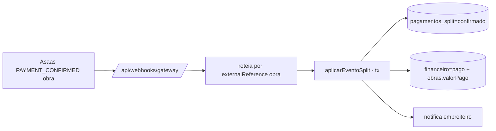

# Jornada — Confirmação de Pagamento de Obra via Webhook (Crédito + Caixa)

> Status: concluída | Prioridade: alta | Wave: 10
> Última atualização: 2026-07-22
>
> Observação: fecha o ciclo do split — o webhook confirma o pagamento, marca o
> lançamento como pago e credita o empreiteiro. Idempotência é crítica (não
> duplicar `financeiro`).
>
> **CONCLUÍDA (2026-07-22):** `features/marketplace/aplicar-evento-split.ts`
> (transacional: `pagamentos_split`→`confirmado`, `financeiro`→`pago`
> (`metodoPagamento='asaas_split'`), RECOMPUTA `obras.valorPago`, notifica
> recebedor; `payment_failed`→`falhou`). Roteamento por PREFIXO do
> externalReference (`xconstrucao-obra|...`) em `route.ts`, `webhook-retry-job.ts`
> e simulador. Idempotente (transição `pendente→confirmado` + `webhook_delivery_log`).
> Testes: 5 verdes incl. anti-duplicação de `valorPago` e regressão de fronteira
> (assinatura não vaza p/ split); webhooks assinatura/KYC (13) verdes.

## 1. Contexto & Objetivo
Quando o contratante paga o checkout-split (J47), o Asaas confirma via webhook (`PAYMENT_CONFIRMED`/`RECEIVED`). Esta jornada aplica esse evento: marca `pagamentos_split` como `confirmado`, seta `financeiro.status='pago'` (`metodoPagamento='asaas_split'`), recomputa `obras.valorPago` e notifica o empreiteiro. O crédito na subconta é automático pelo split do Asaas; aqui refletimos isso no caixa interno.

## 2. Personas
- **Empreiteiro**: notificado do recebimento; saldo creditado na subconta (saque em J49).
- **Contratante**: vê a medição como paga.
- **Sistema**: aplica o evento de forma transacional e idempotente.

## 3. Fluxo ponta-a-ponta
1. Asaas envia `PAYMENT_CONFIRMED` com externalReference `xconstrucao-obra|...` para `POST /api/webhooks/gateway`.
2. Route **roteia** por prefixo do externalReference → `aplicarEventoSplit` (não é assinatura).
3. `aplicarEventoSplit` (transacional): localiza `pagamentos_split` por `asaas_payment_id`, marca `confirmado`, seta `financeiro.status='pago'`, recomputa `obras.valorPago` (reusando lógica de `quitarLancamento`), registra atividade, notifica empreiteiro.

## 4. Telas envolvidas
- Nenhuma nova. As telas de pagamentos (contratante/empreiteiro) refletem o novo status.

## 5. Componentes-chave
- [app/api/webhooks/gateway/route.ts](../../app/api/webhooks/gateway/route.ts) — roteamento por externalReference de obra.
- `features/marketplace/aplicar-evento-split.ts` — **a criar** (transacional, idempotente).
- Reusar a lógica de quitação/recompute de `obras.valorPago` de `quitarLancamento` em [features/financeiro/lancamentos-service.ts](../../features/financeiro/lancamentos-service.ts) — **não** reimplementar incremento avulso.
- Notificação: reusar `criarNotificacao` + email (mesma lógica do route de quitar manual).

## 6. Schema (Drizzle)
Reusa `pagamentos_split` (idempotência via `asaas_payment_id` unique + transição de status) e `financeiro`. `financeiro` continua a fonte de verdade do caixa; `pagamentos_split` é satélite.

## 7. Endpoints
- `POST /api/webhooks/gateway` — **estendido** com o aplicador de split (sem novo endpoint).

## 8. Mocks a remover
- Nenhum. Com J47+J48, o pagamento de obra passa a ter caminho **real** end-to-end; o manual permanece como fallback.

## 9. Checklist de implementação
- [ ] Roteamento no `route.ts` por externalReference `xconstrucao-obra|...`
- [ ] `features/marketplace/aplicar-evento-split.ts` transacional
- [ ] Idempotência: `asaas_payment_id` unique + transição condicional (`pendente→confirmado`)
- [ ] `financeiro.status='pago'`, `metodoPagamento='asaas_split'`
- [ ] Recompute de `obras.valorPago` reusando lógica de `quitarLancamento`
- [ ] Notificação ao empreiteiro (in-app + email)
- [ ] **Teste de regressão**: eventos de assinatura NÃO caem em `aplicarEventoSplit`
- [ ] Teste de integração: `PAYMENT_CONFIRMED` de obra → split confirmado + caixa pago; evento duplicado não duplica

## 10. Critérios de aceite
1. Webhook `PAYMENT_CONFIRMED` de obra → `pagamentos_split.status='confirmado'` e `financeiro.status='pago'`.
2. `obras.valorPago` recomputado corretamente (não incrementado em dobro).
3. Evento duplicado → sem alteração adicional (idempotente).
4. **Regressão zero**: fluxo de assinatura intacto (specs de webhook verdes).
5. Query: `SELECT status FROM pagamentos_split WHERE asaas_payment_id='<pay>';` = `confirmado`.

## 11. Riscos / Pontos de atenção
- **Idempotência dupla**: `webhook_delivery_log` (dead-letter) + `asaas_payment_id` unique + transição de status. Nunca creditar `financeiro` duas vezes.
- **Recompute vs incremento**: sempre recomputar `obras.valorPago` a partir de `financeiro` — reprocessamento de webhook não pode divergir.
- Roteamento por externalReference não pode capturar eventos de assinatura (que usam `xconstrucao|...`, prefixo diferente de `xconstrucao-obra|...`) — testar a fronteira.
- Estorno/falha parcial de split não é testável em sandbox — tratar `payment_failed` de obra (marcar `pagamentos_split` `falhou`).

## 12. Links cruzados
- Depende de: J47 (`pagamentos_split` pendente criado).
- Bloqueia: J49 (saque pressupõe crédito), J50 (reconciliação).
- Relacionada: J08 (mesmo caixa `financeiro`), J46 (mesmo webhook, aplicador irmão).

## 13. Gaps descobertos durante execução
> Doc viva. Registrar aqui o que apareceu no caminho e não estava no roteiro original. Uma linha por item, com data.

- 2026-07-22: a distinção pagamento-obra vs assinatura é pelo PREFIXO do externalReference — ambos chegam como `payment_succeeded`. `parseExternalRefObra` exige `parts[0] === "xconstrucao-obra"`; o `parseExternalRef` de assinatura já exigia `=== "xconstrucao"` (não casa), então a fronteira é limpa nos dois sentidos.
- 2026-07-22: o handler localiza o `pagamentos_split` pelo `splitId` do externalReference (PK, sempre presente), não pelo `payment.id` — o `parseWebhook` não expõe o `payment.id` do `/payments` avulso separadamente, e o splitId é mais confiável.
- 2026-07-22: recompute de `obras.valorPago` replicado inline na transação (não reusa `quitarLancamento`, que não aceita `tx`) — replicar preserva atomicidade confirmar-split + pagar-financeiro + recompute.
- 2026-07-22: roteamento replicado nos 3 pontos que aplicam eventos — `route.ts`, `webhook-retry-job.ts` (dead-letter) e o simulador de teste. Manter os três em sincronia.
