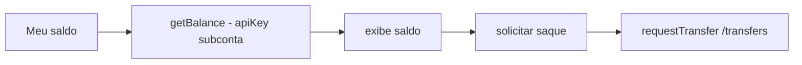

# Jornada — Saldo e Saque do Empreiteiro (Transferência)

> Status: planejada | Prioridade: média | Wave: 10
> Última atualização: 2026-07-19
>
> Observação: menor prioridade — o crédito no split já é automático; o saque
> pode começar manual pelo painel Asaas. Esta jornada traz o saque para dentro
> da plataforma.

## 1. Contexto & Objetivo
Depois do split (J48), o empreiteiro tem saldo na subconta Asaas. Esta jornada dá a ele uma tela "Meu saldo" para ver o saldo real e **solicitar saque** para o banco dele (ex: Itaú) direto pela plataforma, via `/transfers` do Asaas — sem entrar no painel Asaas.

## 2. Personas
- **Empreiteiro**: consulta saldo e solicita transferência para a conta bancária/PIX cadastrada.
- **Sistema**: consulta `getBalance` e dispara `requestTransfer` no contexto da subconta.

## 3. Fluxo ponta-a-ponta
1. Empreiteiro abre "Meu saldo".
2. Plataforma chama `getBalance` (com a apiKey cifrada da subconta) → mostra saldo.
3. Empreiteiro solicita saque → `requestTransfer` (PIX/TED para a conta cadastrada em J45).
4. Status do saque exibido (pendente/concluído).

## 4. Telas envolvidas
- `app/empreiteiro/saldo/page.tsx` — **a criar**: saldo + histórico + botão de saque.

## 5. Componentes-chave
- `features/marketplace/saldo-service.ts` — **a criar** (ou estender `subconta-service.ts`): decifra apiKey, chama `getBalance`/`requestTransfer`.
- [shared/lib/asaas-client.ts](../../shared/lib/asaas-client.ts) — `getBalance`, `requestTransfer` (J43).
- Reusar dados bancários/PIX de `asaas_subcontas` (J42/J45).

## 6. Schema (Drizzle)
Reusa `asaas_subcontas`. Opcional: tabela `saques` para histórico local (id, user_id, valor, status, asaas_transfer_id, created_at) — avaliar na execução se o histórico do Asaas basta ou se queremos espelho local.

## 7. Endpoints
- `GET /api/empreiteiro/recebimento/saldo` — saldo atual da subconta.
- `POST /api/empreiteiro/recebimento/saque` — solicita transferência (guard: só empreiteiro dono; exige subconta aprovada + saldo suficiente).

## 8. Mocks a remover
- Nenhum mock pré-existente. Nunca exibir saldo fixo/fake — sempre `getBalance` real.

## 9. Checklist de implementação
- [ ] Tela "Meu saldo" em `app/empreiteiro/saldo`
- [ ] `GET /api/empreiteiro/recebimento/saldo` (getBalance com apiKey da subconta)
- [ ] `POST /api/empreiteiro/recebimento/saque` (requestTransfer)
- [ ] (Opcional) tabela/histórico local `saques`
- [ ] Guards: subconta `aprovada`, saldo suficiente, valor > 0
- [ ] Gate `MARKETPLACE_SPLIT`
- [ ] Teste de integração (`tests/e2e/integration/`): saldo retorna valor; saque cria transfer em sandbox

## 10. Critérios de aceite
1. Empreiteiro com subconta aprovada vê o saldo real da subconta em sandbox.
2. Solicita saque válido → `requestTransfer` cria transferência (assert no sandbox).
3. Saque acima do saldo → erro amigável.
4. Subconta não aprovada → tela bloqueada com orientação.

## 11. Riscos / Pontos de atenção
- **Saque bancário real (Itaú) não é testável em sandbox** — validar manualmente em produção controlada.
- apiKey da subconta é decifrada apenas em memória no server — nunca expor ao client nem logar.
- Definir política de saque (mínimo, taxa, agendamento) com o negócio antes de habilitar em produção.
- Considerar rate-limit no endpoint de saque.

## 12. Links cruzados
- Depende de: J43 (`getBalance`/`requestTransfer`), J45 (subconta + dados bancários), J48 (crédito via split).
- Relacionada: J50 (reconciliação de saldo).

## 13. Gaps descobertos durante execução
> Doc viva. Registrar aqui o que apareceu no caminho e não estava no roteiro original. Uma linha por item, com data.

- _(sem entradas ainda — jornada não iniciada)_
