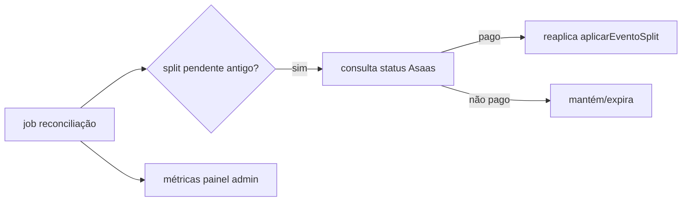

# Jornada — Reconciliação & Rollout do Split

> Status: concluída | Prioridade: média | Wave: 10
> Última atualização: 2026-07-22
>
> Observação: jornada de **hardening/operação** — fecha o ciclo do marketplace com
> reconciliação, métricas e ativação gradual em produção. Depende de J47/J48.
>
> **CONCLUÍDA (2026-07-22):** `getPayment` (GET /payments/{id}) no asaas-client;
> `features/marketplace/reconciliacao-split-job.ts` (varre `pagamentos_split`
> `pendente` 15min–72h, consulta status Asaas, reaplica `aplicarEventoSplit`
> idempotente; no-op se flag off); `scripts/reconciliar-split.ts` (CLI/Replit
> Scheduled Deployment); `POST /api/admin/marketplace/reconciliar` (manual) e
> `GET /api/admin/marketplace/metricas` (`metricas-service.ts`); seção
> "Marketplace / Split" no painel admin financeiro. Doc de rollout em
> `docs/jornadas/_rollout-marketplace-split.md`. **Sem mocks de recebimento
> remanescentes** (auditado). Fecha o Bloco B (J42–J50).

## 1. Contexto & Objetivo
Com o split funcionando (J47/J48), falta a camada operacional: garantir que o estado local (`pagamentos_split`) não divirja do Asaas, dar visibilidade (métricas) e ativar em produção de forma segura e gradual. Reconciliação protege contra webhooks perdidos e estados presos em `pendente`.

## 2. Personas
- **Admin/Ops**: acompanha métricas de split e reconciliação.
- **Sistema**: job periódico que confere `pagamentos_split` contra o Asaas.

## 3. Fluxo ponta-a-ponta
1. Job de reconciliação varre `pagamentos_split` em `pendente` há > X → consulta status no Asaas (análogo a `checkPaymentStatus`).
2. Se pago no Asaas mas `pendente` local → reaplica `aplicarEventoSplit` (recupera webhook perdido).
3. Métricas de split expostas no painel admin.
4. Rollout: ativa `MARKETPLACE_SPLIT` para um subconjunto → geral.

## 4. Telas envolvidas
- Painel admin de financeiro/observabilidade — seção de métricas de split (reusar `app/admin/financeiro` / J18).

## 5. Componentes-chave
- `features/marketplace/reconciliacao-split-job.ts` — **a criar** (espelhar `grace-period-downgrade-job.ts` / `webhook-retry-job.ts` de planos).
- Reusar registro de jobs/bootstrap existente e o padrão de `checkPaymentStatus` de [features/planos/gateway/asaas-gateway.ts](../../features/planos/gateway/asaas-gateway.ts).
- Reusar `aplicarEventoSplit` (J48) para recuperação idempotente.

## 6. Schema (Drizzle)
Reusa `pagamentos_split`. Opcional: colunas de métrica/contadores (ex: `reconciliado_em`) se necessário. Sem tabela nova obrigatória.

## 7. Endpoints
- (Opcional) `POST /api/admin/marketplace/reconciliar` — disparo manual da reconciliação (espelha `POST /api/admin/webhooks/retry-pending`).
- `GET /api/admin/marketplace/metricas` — métricas de split para o painel.

## 8. Mocks a remover
- Auditar que nenhum resquício de mock/placeholder de recebimento sobrou nas telas (empreiteiro/contratante) após J45–J49. Documentar remoções aqui.

## 9. Checklist de implementação
- [ ] `features/marketplace/reconciliacao-split-job.ts` idempotente
- [ ] Recuperação de `pendente` antigo via status Asaas → reaplica `aplicarEventoSplit`
- [ ] Métricas de split no painel admin
- [ ] (Opcional) endpoints de reconciliação manual e métricas
- [ ] Documentar flags (`MARKETPLACE_SPLIT`, `PAYMENT_GATEWAY=asaas`) e IPs de webhook
- [ ] Plano de rollout gradual (subconjunto → geral) documentado
- [ ] Teste de integração: split preso em `pendente` com pagamento confirmado no Asaas → reconciliado

## 10. Critérios de aceite
1. Job identifica `pagamentos_split` pago no Asaas mas `pendente` local e corrige (idempotente).
2. Métricas de split visíveis no admin (total repassado, comissão, pendentes).
3. Rollout documentado; `MARKETPLACE_SPLIT` off restaura o comportamento manual.
4. Nenhum mock/placeholder de recebimento remanescente nas telas.

## 11. Riscos / Pontos de atenção
- Reconciliação deve ser **idempotente** — reaplicar não pode duplicar `financeiro` (garantido por `asaas_payment_id` unique + transição de status de J48).
- Rollout gradual: monitorar erros de split (J33) antes de abrir para todos.
- Estorno/chargeback: definir tratamento (marcar `estornado`, reverter caixa) — pode gerar sub-item futuro.
- Taxa do Asaas nas métricas: refletir o líquido corretamente.

## 12. Links cruzados
- Depende de: J47, J48 (fluxo de split existente).
- Relacionada: J18 (painel financeiro admin), J29 (KPIs históricos), J33 (observabilidade técnica).

## 13. Gaps descobertos durante execução
> Doc viva. Registrar aqui o que apareceu no caminho e não estava no roteiro original. Uma linha por item, com data.

- 2026-07-22: a reconciliação NÃO roda oportunisticamente a cada webhook (diferente do webhook-retry-job) — cada verificação consulta o Asaas por split, o que seria custoso a cada request. Fica só periódica (script) + manual (endpoint/botão). Janela: só splits com 15min+ (evita corrida com o webhook em tempo real) e < 72h.
- 2026-07-22: `getPayment` (GET /payments/{id}) foi o único método ASAAS que faltava — criado no client. Interpreta CONFIRMED/RECEIVED como pago (reaplica), REFUNDED/CHARGEBACK/DELETED como falha.
- 2026-07-22: reversão de caixa em estorno/chargeback fica como sub-item futuro — a reconciliação marca `falhou` mas NÃO reverte `financeiro`/`obras.valorPago` ainda (documentado em _rollout-marketplace-split.md "Pendências conhecidas").
- 2026-07-22: item 8 do checklist (mocks de recebimento) auditado — nada a limpar; telas de saldo/recebimento já usam dados reais desde J45/J49.
