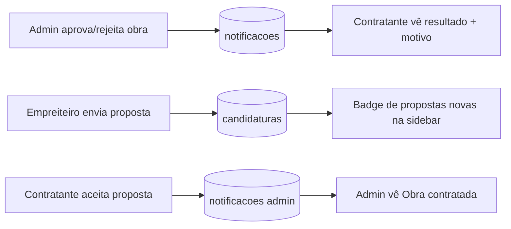

# Jornada — Notificações & Indicadores do Marketplace

> Status: pronto | Prioridade: alta | Wave: 12
> Última atualização: 2026-07-24

## 1. Contexto & Objetivo
O marketplace funcionava, mas em silêncio. O contratante publicava uma obra e não
sabia se tinha sido aprovada; recebia propostas sem nenhum sinal na interface; o admin
não via que uma obra havia sido contratada. Quem não estivesse com a tela aberta no
momento certo simplesmente não descobria.

Esta jornada fecha a percepção de "algo aconteceu" entre as visões: cada decisão que
uma persona toma e que afeta outra passa a gerar notificação, e os indicadores que
faltavam (propostas pendentes, saúde do portfólio) passam a existir de verdade.

## 2. Personas
- **Contratante**: recebe o resultado da moderação da própria obra (com o motivo, se
  rejeitada) e vê quantas propostas novas chegaram, sem abrir obra por obra.
- **Admin**: é avisado quando uma obra é contratada — o momento em que o marketplace
  gera negócio — e enxerga a saúde de todas as obras, não só o contratante da dele.
- **Empreiteiro**: indiretamente — o `candidaturasCount` alimenta a leitura de
  concorrência nas listagens.

## 3. Fluxo ponta-a-ponta

## 4. Telas envolvidas
- [app/admin/obras/page.tsx](../../app/admin/obras/page.tsx) — badge de saúde por linha e KPI de obras em atraso/risco.
- Sidebar do contratante — badge de propostas novas em "Minhas Obras".

## 5. Componentes-chave
- [features/notificacoes/moderacao-obra-dispatcher.ts](../../features/notificacoes/moderacao-obra-dispatcher.ts) — resolve o dono via `obras.clienteId → clientes.userId` e notifica `sucesso` (aprovada) ou `alerta` (rejeitada, com o motivo no corpo). Fire-and-forget: erros capturados internamente, disparado após o commit.
- [features/notificacoes/marketplace-admin-dispatcher.ts](../../features/notificacoes/marketplace-admin-dispatcher.ts) — "Obra contratada" para os admins no aceite.
- [features/contratante/components/ContratanteSidebar.tsx](../../features/contratante/components/ContratanteSidebar.tsx) + [use-propostas-novas-count.ts](../../features/contratante/minhas-obras/hooks/use-propostas-novas-count.ts) — badge.
- [features/contratante/minhas-obras/components/CandidaturasCard.tsx](../../features/contratante/minhas-obras/components/CandidaturasCard.tsx) — dados da empreiteira na proposta.

## 6. Schema (Drizzle)
Sem tabelas novas. Reusa `notificacoes` (J13) e a idempotência in-app do índice parcial
`uniq_notificacoes_user_href_unread` — uma notificação não-lida com o mesmo
`(user_id, href)` não é duplicada.

## 7. Endpoints
- `GET /api/contratante/candidaturas/novas-count` — total agregado de propostas **pendentes** nas obras do contratante. Espelha `/api/contratante/chat/unread-count`: guard padrão, resposta `{ total }`, contratante sem perfil de cliente devolve 0.
- `GET /api/admin/obras-health` — mapa `obraId → ObraHealth` de **todas** as obras. Espelha `/api/contratante/obras-health` sem o escopo por cliente; reusa `computeHealthMapForObras`.
- `GET /api/obras` — passa a trazer `candidaturasCount` (pendentes).
- `GET /api/contratante/obras/[id]/candidaturas` — traz cnpj/especialidades/registro da empreiteira; **não** traz `portfolioDocs` (documentos podem ser privados).
- Ganchos de disparo em `POST /api/admin/obras/[id]/{aprovar,rejeitar}` e `POST /api/contratante/candidaturas/[id]/aceitar`.

## 8. Mocks a remover
Nenhum. O `use-obras-health` do admin passou a apontar para dado real em vez de retorno vazio.

## 9. Checklist de implementação
- [x] Dispatcher de moderação (aprovada/rejeitada com motivo) → contratante dono.
- [x] Dispatcher de obra contratada → admins.
- [x] `novas-count` + hook + badge na sidebar do contratante.
- [x] `candidaturasCount` em `GET /api/obras`.
- [x] `GET /api/admin/obras-health` (admin-only).
- [x] Spec de integração [j57-notificacoes-marketplace](../../tests/e2e/integration/j57-notificacoes-marketplace.integration.spec.ts).

## 10. Critérios de aceite
1. Admin rejeita uma obra com motivo → o contratante dono recebe notificação `alerta` com o motivo no corpo, e o clique leva ao detalhe da obra.
2. Empreiteiro envia proposta → o badge da sidebar do contratante incrementa.
3. Contratante aceita → admins recebem "Obra contratada".
4. Não-admin em `GET /api/admin/obras-health` → 403.

## 11. Riscos / Pontos de atenção
- Notificações são fire-and-forget: a gravação pode chegar depois da resposta HTTP. Testes leem com poll (padrão do spec).
- O dedupe por `(user_id, href)` não-lido é desejável aqui (re-moderar a mesma obra não deve spammar), mas exige href discriminante quando o evento **não** é repetição — ver §13.

## 12. Links cruzados
- Consome a infra de notificação da [J13](13-chat-notificacoes.md).
- O aceite que dispara "Obra contratada" é o mesmo que abre o contrato da [J58](58-contrato-entre-as-partes.md).

## 13. Gaps descobertos durante execução
> Doc viva. Uma linha por item, com data.

- 2026-07-23: Nenhum dos dispatchers desta jornada envia **email** — a notificação existe só in-app, então só é vista por quem entra na plataforma. `features/notificacoes/emails/` tem 5 templates e nenhum cobre moderação de obra. Um contratante que teve a obra rejeitada e não abre o app não descobre.
- 2026-07-24: `GET /api/admin/obras-health` nasceu sem cobertura de integração e apareceu como gap novo no radar da [J36](36-testes-integracao.md) — coberto na sequência, no próprio spec da J57.
- 2026-07-24: O dedupe por href não-lido, herdado da J13, é seguro para moderação (mesmo href = mesma obra), mas quebra quando um href genérico é usado para eventos distintos. O caso concreto apareceu na J58 §13.
