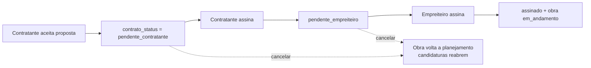

# Jornada — Contrato entre as Partes (contratante ↔ empreiteiro)

> Status: pronto | Prioridade: alta | Wave: 12
> Última atualização: 2026-07-24

## 1. Contexto & Objetivo
Até aqui, aceitar uma proposta era um clique só: a obra ia direto para `em_andamento`
e o vínculo estava feito. Não havia documento, não havia registro de que as duas partes
concordaram com valor, prazo e escopo — nem qualquer momento em que o empreiteiro
confirmasse que aceitava as condições. Na prática a plataforma intermediava um acordo
que não existia por escrito.

Esta jornada insere o **contrato** entre o aceite e a execução: um documento montado
a partir da proposta aceita e dos dados reais das partes, sobre um template versionado,
que **as duas** assinam eletronicamente antes de a obra começar.

**Mudança de comportamento central:** o aceite de candidatura **não** coloca mais a obra
em `em_andamento`. A obra passa por `contrato_status: pendente_contratante →
pendente_empreiteiro → assinado` e só então é promovida.

## 2. Personas
- **Contratante**: aceita a proposta, assina primeiro e pode cancelar enquanto o
  contrato não estiver totalmente assinado (reabre a obra e as candidaturas).
- **Empreiteiro**: assina em segundo. Sua assinatura é o que efetiva a obra.
- **Admin**: observa (lê o contrato e o estado), não assina nem cancela pela interface
  normal — mas é autorizado no endpoint de cancelamento como poder de exceção.

## 3. Fluxo ponta-a-ponta

## 4. Telas envolvidas
- [app/contratante/minhas-obras/[id]/page.tsx](../../app/contratante/minhas-obras/[id]/page.tsx) — card do contrato no detalhe da obra.
- [app/empreiteiro/minhas-obras/[id]/page.tsx](../../app/empreiteiro/minhas-obras/[id]/page.tsx) — idem, na visão do empreiteiro.

## 5. Componentes-chave
- [features/contratos/contrato-service.ts](../../features/contratos/contrato-service.ts) — `montarContrato`, `assinarContrato`, `cancelarContrato` e `renderContratoTemplate`.
- [features/contratos/components/ContratoCard.tsx](../../features/contratos/components/ContratoCard.tsx) — leitura, assinatura, download e deep link `?tab=contrato`.
- [features/contratos/utils/generate-contrato-pdf.ts](../../features/contratos/utils/generate-contrato-pdf.ts) — cópia em PDF, client-side.
- [features/notificacoes/contrato-dispatcher.ts](../../features/notificacoes/contrato-dispatcher.ts) — "Assine o contrato", "Contrato cancelado", contrato efetivado.
- [features/contratos/constants.ts](../../features/contratos/constants.ts) — `MOTIVO_REJEICAO_CASCATA`, a marca que distingue rejeição automática de manual.

## 6. Schema (Drizzle)
Criado por [server/bootstrap-contratos.ts](../../server/bootstrap-contratos.ts) (idempotente,
roda **antes** de `bootstrap-legal-documents` no [instrumentation.ts](../../instrumentation.ts)):

- Enums `obra_contrato_status` (`pendente_contratante | pendente_empreiteiro | assinado`) e `contrato_papel` (`contratante | empreiteiro`).
- Valores `contrato_obra` e `termo_anunciante` no enum `consent_document`.
- Coluna `obras.contrato_status` — **nullable de propósito**: `null` = obra sem fluxo de contrato (legada ou não contratada), então não há backfill nem rewrite da tabela.
- Tabela `contrato_assinaturas` (molde de `user_consents`: registro com IP/UA) + **unique `(obra_id, papel)`**, que não é decorativo: `assinarContrato` depende dele para o `onConflictDoNothing` que torna a assinatura idempotente.

Probes correspondentes em [server/lib/schema-health.ts](../../server/lib/schema-health.ts).

## 7. Endpoints
- `GET /api/obras/[id]/contrato` — contrato montado (markdown já mesclado), partes, estado e assinaturas.
- `POST /api/obras/[id]/contrato/assinar` — registra a assinatura da parte da vez.
- `POST /api/obras/[id]/contrato/cancelar` — contratante (ou admin) desfaz o aceite. **O empreiteiro não cancela.**

## 8. Mocks a remover
Nenhum. O conteúdo vem da proposta aceita + dados reais das partes sobre o template
versionado `contrato_obra` em `legal_documents` ([server/legal-seed/contrato-obra-v1.md](../../server/legal-seed/contrato-obra-v1.md)).

## 9. Checklist de implementação
- [x] Schema + bootstrap idempotente + probes de saúde.
- [x] Template `contrato_obra` v1 seedado e versionado.
- [x] `montarContrato` com merge de `{{vars}}` (placeholder não mapeado é removido, não vaza).
- [x] `assinarContrato` transacional com lock pessimista na obra e validação de "é a sua vez".
- [x] `cancelarContrato` reabrindo **apenas** o que o aceite decidiu.
- [x] Notificações: vez de assinar, contrato cancelado, contrato efetivado.
- [x] `ContratoCard` nas duas visões + PDF + deep link.
- [x] Spec de integração [j58-contrato-partes](../../tests/e2e/integration/j58-contrato-partes.integration.spec.ts) (3 testes).

## 10. Critérios de aceite
1. Aceitar uma proposta deixa a obra em `contrato_status = pendente_contratante` e **não** em `em_andamento`.
2. O empreiteiro tentar assinar antes do contratante → erro `NAO_E_SUA_VEZ`.
3. Depois das duas assinaturas: `contrato_status = assinado` e `obras.status = em_andamento`; `contrato_assinaturas` tem duas linhas com IP.
4. Cancelar antes da assinatura completa: obra volta a `planejamento`, a candidatura aceita volta a `pendente` e o empreiteiro é notificado.
5. `SELECT obra_id, papel, versao_template FROM contrato_assinaturas WHERE obra_id = '<id>'` retorna as partes que assinaram.

## 11. Riscos / Pontos de atenção
- O registro legal é o **aceite eletrônico** gravado com IP/UA, não o PDF — que é cópia de cortesia.
- `versao_template` é gravado por assinatura: se o template for republicado entre as duas assinaturas, cada parte fica com a versão que de fato leu.
- Cancelar é destrutivo do ponto de vista do empreiteiro (perde o vínculo). Por isso é restrito ao contratante dono e ao admin, e sempre notifica.

## 12. Links cruzados
- O aceite que abre este fluxo é o da [J05](05-candidatura-aceite.md); o disparo de "Obra contratada" para o admin é da [J57](57-notificacoes-indicadores-marketplace.md).
- Versionamento de template e registro de consentimento vêm da [J28](28-documentos-legais-versionados.md).
- Os aceites aparecem para o admin na [J60](60-contratos-admin.md).

## 13. Gaps descobertos durante execução
> Doc viva. Uma linha por item, com data.

- 2026-07-23: A jornada foi entregue **sem bootstrap de schema** — os objetos existiam só no banco de dev, aplicados à mão. Em ambiente novo o boot quebrava: `bootstrap-legal-documents` insere `legal_documents.tipo='termo_anunciante'` e o enum `consent_document` não tinha o valor. Resolvido com `server/bootstrap-contratos.ts`, ordenado antes daquele. `ALTER TYPE ... ADD VALUE` não roda em bloco transacional no Postgres, então cada valor vai em seu próprio `db.execute`.
- 2026-07-23: `cancelarContrato` reabria **todas** as candidaturas da obra (`UPDATE ... WHERE obra_id = ?` sem filtro). Uma proposta rejeitada **à mão** pelo contratante — ou cancelada pelo próprio empreiteiro — ressuscitava como `pendente`. Passou a reabrir só o que o aceite decidiu: a aceita e as rejeitadas em cascata, identificadas por `MOTIVO_REJEICAO_CASCATA`, com `canceladaPeloEmpreiteiro = false` como cinto de segurança. Alterar o texto da constante quebra a correlação para as linhas já gravadas — mudança exige migrar os dados.
- 2026-07-23: O empreiteiro perdia o vínculo em **silêncio** no cancelamento. Como o `UPDATE` zera `empreiteiraId` dentro da transação, depois do commit não há mais como descobrir quem foi afetado — por isso `cancelarContrato` passou a devolver `empreiteiroUserId`/`obraNome` para quem chama notificar.
- 2026-07-24: O href da notificação de cancelamento era fixo (`/empreiteiro/minhas-candidaturas`) e caía no índice único parcial da [J13](13-chat-notificacoes.md) (`user_id, href` WHERE `lida = false`). Consequência real: um empreiteiro que não tivesse lido o aviso de um cancelamento **nunca seria avisado do cancelamento de outra obra** — o dedupe de chat vazando para um evento que não é repetição. Corrigido com `?obra=<id>` no href. Confirma o item P1 já registrado no [backlog](_backlog-paralelo.md) sobre coalescing por href.
- 2026-07-24: A suíte de integração desta jornada **se auto-envenenava**. O limite de propostas/mês do plano (J11) conta candidaturas criadas no mês, independente do estado da obra: concluir a obra não devolve a cota do empreiteiro. Após ~2 execuções, a cota free (5/mês) da maria esgotava e todos os testes passavam a skipar em silêncio — falso verde. O endpoint test-only `cleanup-obras` passou a apagar também as candidaturas das obras E2E (`candidaturas.obra_id` é `NO ACTION`, não cascade), exposto pelo helper `limparObrasE2E`.
- 2026-07-24 (aberto): **Nenhum evento de contrato envia email.** A assinatura é o evento mais relevante juridicamente da plataforma e não gera trilha fora do app.
- 2026-07-24 (aberto): **Não há lembrete nem expiração de contrato parado.** Se o contratante assina e o empreiteiro nunca assina, a obra fica em `pendente_empreiteiro` indefinidamente.
- 2026-07-24 (aberto): O PDF é gerado via `html2canvas`, ou seja, **imagem** — não tem texto selecionável nem pesquisável.
