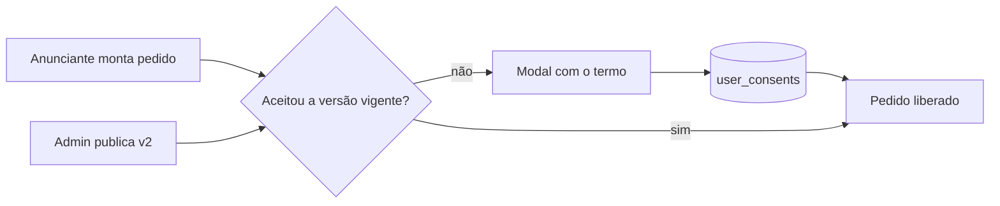

# Jornada — Termo de Aceite do Anunciante (gate de entrada)

> Status: pronto | Prioridade: média | Wave: 12
> Última atualização: 2026-07-24

## 1. Contexto & Objetivo
O anunciante montava um pedido de anúncio e publicava sem nunca ter concordado com
nada: não havia regra escrita sobre o que pode ser anunciado, prazo, moderação ou
reembolso. A plataforma vendia espaço publicitário sem termo.

Esta jornada coloca um **gate de entrada**: antes de enviar o primeiro pedido, o
anunciante lê e aceita o Termo do Anunciante na versão vigente. O aceite é registrado
com IP e user agent, e volta a ser exigido quando uma nova versão é publicada.

## 2. Personas
- **Anunciante**: lê o termo no modal e aceita uma única vez por versão vigente.
- **Admin/jurídico**: publica novas versões; a republicação reativa o gate para todos.

## 3. Fluxo ponta-a-ponta

## 4. Telas envolvidas
- [features/anuncios/self-service/components/MontadorPedido.tsx](../../features/anuncios/self-service/components/MontadorPedido.tsx) — ponto onde o gate é acionado.

## 5. Componentes-chave
- [features/anuncios/self-service/components/ContratoAnuncianteModal.tsx](../../features/anuncios/self-service/components/ContratoAnuncianteModal.tsx) — renderiza o documento vigente e coleta o aceite.
- [features/legal/legal-service.ts](../../features/legal/legal-service.ts) — `anuncianteAceitouContratoVigente`, `getVersaoVigente`, `registrarConsentimento`.
- [features/legal/components/LegalDocumentView.tsx](../../features/legal/components/LegalDocumentView.tsx) — leitura do markdown.

## 6. Schema (Drizzle)
Sem tabelas novas — reusa `legal_documents` e `user_consents` da [J28](28-documentos-legais-versionados.md).
O valor `termo_anunciante` do enum `consent_document` é criado pelo
[bootstrap-contratos](../../server/bootstrap-contratos.ts) (ver J58 §13: sem ele o boot
quebrava em ambiente novo, porque o seed insere a linha antes de o valor existir).
Seed v1 em [server/legal-seed/termo-anunciante-v1.md](../../server/legal-seed/termo-anunciante-v1.md).

## 7. Endpoints
- `GET /api/anunciante/contrato` — `{ aceitou, documento }` para o modal decidir se pede aceite.
- `POST /api/anunciante/contrato` — registra o aceite da versão vigente com IP/UA. Sem termo publicado responde 409 (o gate é **fail-open** nesse estado).
- `POST /api/anuncios/pedidos` — passa a **bloquear** quem não aceitou a versão vigente.

## 8. Mocks a remover
Nenhum.

## 9. Checklist de implementação
- [x] Seed do termo v1 + valor no enum `consent_document`.
- [x] `GET`/`POST /api/anunciante/contrato` com registro de IP/UA e trilha de auditoria (`anunciante.contrato.aceitar`).
- [x] Modal no fluxo do montador de pedido.
- [x] Bloqueio efetivo em `POST /api/anuncios/pedidos`.
- [x] Spec de integração [j59-contrato-anunciante](../../tests/e2e/integration/j59-contrato-anunciante.integration.spec.ts), incluindo o bump de versão.

## 10. Critérios de aceite
1. Anunciante que nunca aceitou tenta criar pedido → bloqueado; após aceitar, o mesmo pedido passa.
2. Admin publica v2 → o gate volta a bloquear quem só aceitou a v1 (provado no spec).
3. `SELECT documento, versao, ip FROM user_consents WHERE tipo = 'termo_anunciante'` mostra o aceite com IP.

## 11. Riscos / Pontos de atenção
- O gate é isolado do fluxo global de re-consentimento (não passa pelo `ReconsentGate`): republicar o termo do anunciante não bloqueia o login de ninguém, só o envio de novos pedidos.
- Fail-open sem termo publicado é intencional — um seed ausente não pode travar a receita de anúncios.

## 12. Links cruzados
- Reusa a infra versionada da [J28](28-documentos-legais-versionados.md).
- Vive dentro do self-service de anúncios da [J23](23-meus-anuncios-self-service.md) e do pagamento da [J31](31-pagamento-anuncios.md).
- Os aceites aparecem para o admin na [J60](60-contratos-admin.md).

## 13. Gaps descobertos durante execução
> Doc viva. Uma linha por item, com data.

- 2026-07-23: O valor `termo_anunciante` foi adicionado ao enum direto no schema Drizzle, sem bootstrap — o que quebrava o boot em ambiente novo. Corrigido junto com a J58 (ver [J58 §13](58-contrato-entre-as-partes.md)).
- 2026-07-24: Jornada sem pontas soltas próprias. O mecanismo de bump de versão testado aqui é o mesmo que a J28 precisa quando o jurídico publicar as versões reais.
