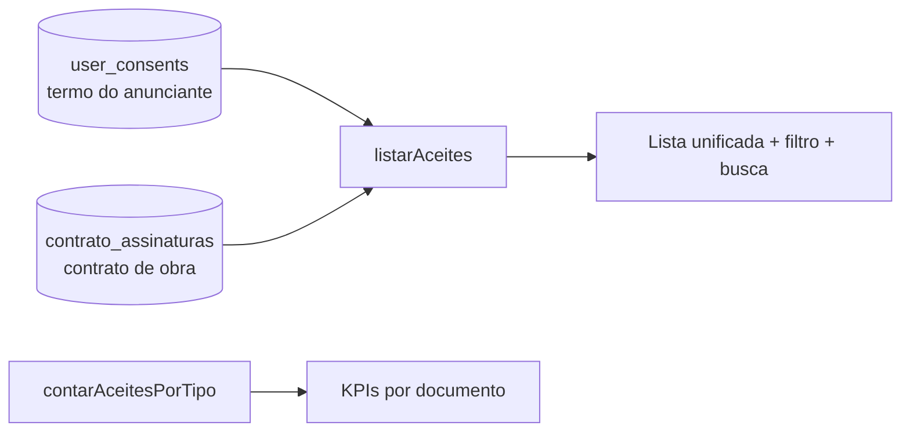

# Jornada — Área de Contratos no Admin

> Status: pronto | Prioridade: média | Wave: 12
> Última atualização: 2026-07-24

## 1. Contexto & Objetivo
As jornadas [J58](58-contrato-entre-as-partes.md) e [J59](59-termo-aceite-anunciante.md)
passaram a gravar aceites e assinaturas com valor jurídico — em duas tabelas diferentes,
sem nenhuma tela que os mostrasse. Para saber quem tinha aceitado o quê, era preciso
consultar o banco.

Esta jornada dá ao admin uma área única de **Contratos**: quem aceitou qual documento,
em que versão, quando e de qual IP — unificando as duas fontes numa lista só.

## 2. Personas
- **Admin**: audita aceites, confere adesão à versão vigente e localiza um usuário
  específico por nome ou email.

## 3. Fluxo ponta-a-ponta

## 4. Telas envolvidas
- [app/admin/contratos/page.tsx](../../app/admin/contratos/page.tsx) — KPIs por documento, filtro por tipo, busca por nome/email. Item na sidebar admin.

## 5. Componentes-chave
- [features/admin/contratos/api/contratos-service.ts](../../features/admin/contratos/api/contratos-service.ts) — `listarAceites` (unifica as duas fontes) e `contarAceitesPorTipo`.
- [features/admin/contratos/constants.ts](../../features/admin/contratos/constants.ts) — rótulos PT-BR e os tipos exibidos.
- [features/admin/contratos/hooks/use-contratos.ts](../../features/admin/contratos/hooks/use-contratos.ts).

## 6. Schema (Drizzle)
Nenhuma tabela nova. Lê `user_consents` (J59/J28) e `contrato_assinaturas` (J58),
com `leftJoin` em `users` para nome/email.

## 7. Endpoints
- `GET /api/admin/contratos` — lista unificada, com `documento` e `q` como filtros.
- `GET /api/admin/contratos/kpi` — por documento: versão vigente, total de aceites e aceites **na versão vigente** (a diferença entre os dois é a medida de adesão pendente).

## 8. Mocks a remover
Nenhum — as duas fontes são reais desde o primeiro dia.

## 9. Checklist de implementação
- [x] `listarAceites` unificando `user_consents` + `contrato_assinaturas`.
- [x] KPIs por tipo de documento.
- [x] Tela com filtro por tipo e busca por nome/email.
- [x] Guards admin-only nas duas rotas.
- [x] Spec de integração [j60-contratos-admin](../../tests/e2e/integration/j60-contratos-admin.integration.spec.ts) (authz + listagem/KPI/filtro).

## 10. Critérios de aceite
1. Não-admin em `GET /api/admin/contratos` → 403.
2. Um aceite de termo do anunciante e uma assinatura de contrato de obra aparecem na mesma lista, com o rótulo correto.
3. Filtrar por `documento=contrato_obra` devolve só assinaturas de obra, e o `role` reflete o papel assinante (contratante/empreiteiro).

## 11. Riscos / Pontos de atenção
- IP é exposto na listagem (dado pessoal, tela gated por admin); user agent fica de fora de propósito.
- Usuário removido aparece como "Usuário removido" — o aceite sobrevive à conta, que é o comportamento desejado para registro jurídico.

## 12. Links cruzados
- Consome os registros da [J58](58-contrato-entre-as-partes.md) e da [J59](59-termo-aceite-anunciante.md); a versão vigente vem da [J28](28-documentos-legais-versionados.md).

## 13. Gaps descobertos durante execução
> Doc viva. Uma linha por item, com data.

- 2026-07-24 (aberto): **Sem paginação.** `LISTA_LIMIT = 500` em [contratos-service.ts](../../features/admin/contratos/api/contratos-service.ts) trunca em silêncio — a tela não informa que há mais. Mesmo padrão de dívida já registrado para o chat no [backlog](_backlog-paralelo.md).
- 2026-07-24 (aberto): **Sem visão de detalhe.** O admin vê "fulano aceitou contrato_obra v1" mas não consegue abrir o que foi assinado — o conteúdo mesclado do contrato daquela obra.
- 2026-07-24 (aberto): **Sem exportação** (CSV/PDF). Para uso jurídico real o admin vai precisar extrair a lista.
