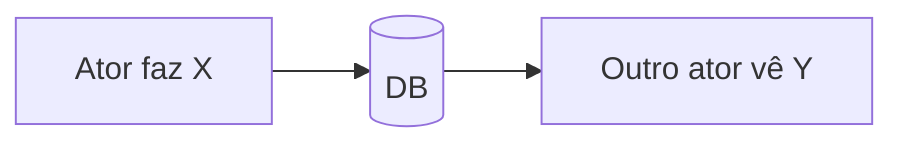

# Jornada — {Nome}

> Status: {mock | parcial | revisão | pronto} | Prioridade: {alta | média | baixa} | Wave: {1 | 2 | 3}
> Última atualização: AAAA-MM-DD

## 1. Contexto & Objetivo
{2–4 linhas: o que essa jornada entrega ao produto e por quê.}

## 2. Personas
- **{persona}**: o que faz nessa jornada.

## 3. Fluxo ponta-a-ponta
{Numerado ou diagrama mermaid simples.}

## 4. Telas envolvidas
- [app/.../page.tsx](../../app/.../page.tsx) — {o que faz}

## 5. Componentes-chave
- [features/.../components/...](../../features/.../components/...) — {papel}

## 6. Schema (Drizzle)
- Tabelas existentes em [shared/db/schema.ts](../../shared/db/schema.ts): `tabela_x`, `tabela_y`
- Tabelas a criar/alterar: …
- Migration: `drizzle/000X_xxx.sql`

## 7. Endpoints
- `GET /api/...`
- `POST /api/...`

## 8. Mocks a remover
- [features/.../mocks/...](../../features/.../mocks/...)
- Flag: `NEXT_PUBLIC_ENABLE_EMPREITEIRO_MOCK` (apesar do nome, é a flag genérica de mock)

## 9. Checklist de implementação
- [ ] Item concreto com caminho de arquivo
- [ ] ...

## 10. Critérios de aceite
1. Passo manual no browser.
2. Query SQL de verificação: `SELECT ... FROM ...`.

## 11. Riscos / Pontos de atenção
- ...

## 12. Links cruzados
- Depende de: J0X
- Bloqueia: J0Y

## 13. Gaps descobertos durante execução
> Doc viva. Registrar aqui o que apareceu no caminho e não estava no roteiro original. Uma linha por item, com data.

- AAAA-MM-DD: {descrição curta do gap + como foi resolvido / link pro PR ou issue}
